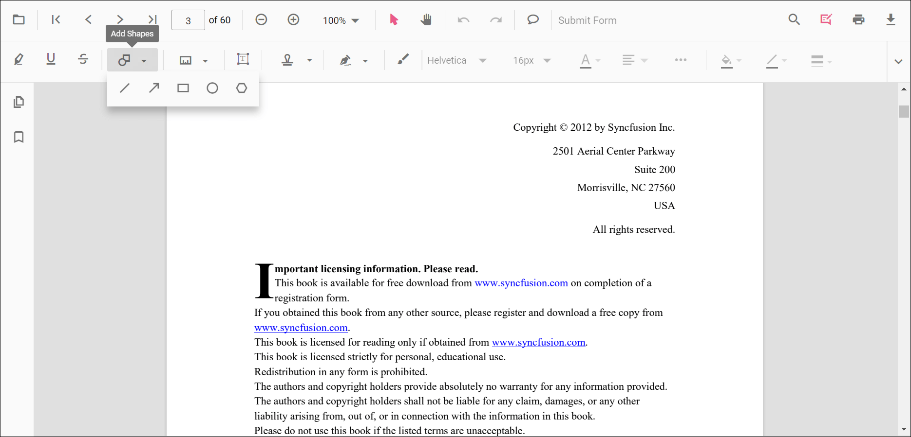
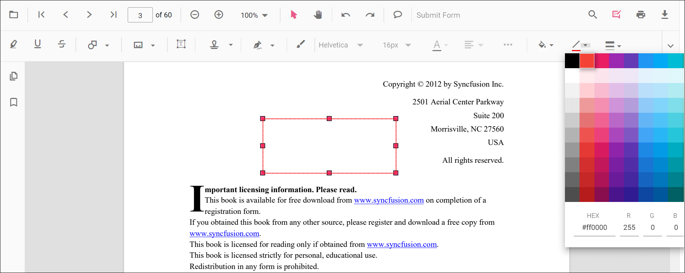
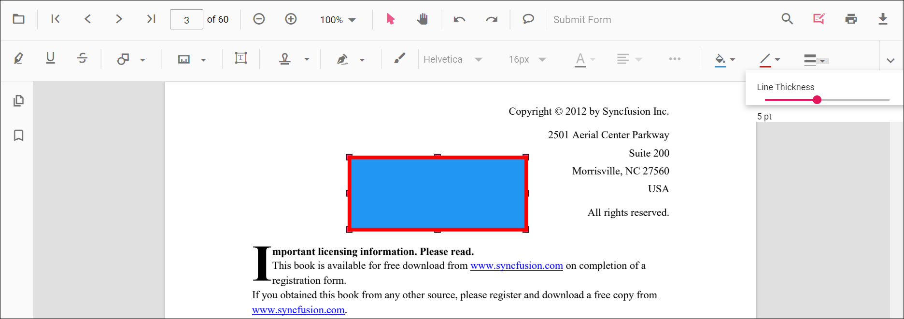
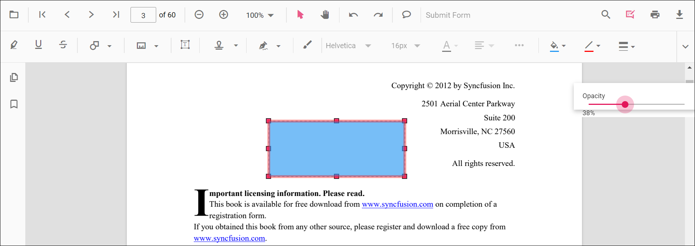

# Create and Modify Annotations in ASP.NET MVC PDF Viewer

The PDF Viewer annotation tools add, edit, and manage markups across documents. This page provides an overview with quick navigation to each annotation type and common creation and modification workflows.

## Quick navigation to annotation types

Jump directly to a specific annotation type for detailed usage and examples:

TextMarkup annotations:
- Highlight: [Highlight annotation](./annotation-types/highlight-annotation)
- Strikethrough: [Strikethrough annotation](./annotation-types/strikethrough-annotation)
- Underline: [Underline annotation](./annotation-types/underline-annotation)
- Squiggly: [Squiggly annotation](./annotation-types/squiggly-annotation)

Shape annotations:
- Line: [Line annotation](./annotation-types/line-annotation)
- Arrow: [Arrow annotation](./annotation-types/arrow-annotation)
- Rectangle: [Rectangle annotation](./annotation-types/rectangle-annotation)
- Circle: [Circle annotation](./annotation-types/circle-annotation)
- Polygon: [Polygon annotation](./annotation-types/polygon-annotation)

Measurement annotations:
- Distance: [Distance annotation](./annotation-types/distance-annotation)
- Perimeter: [Perimeter annotation](./annotation-types/perimeter-annotation)
- Area: [Area annotation](./annotation-types/area-annotation)
- Radius: [Radius annotation](./annotation-types/radius-annotation)
- Volume: [Volume annotation](./annotation-types/volume-annotation)

Other annotations:
- Redaction: [Redaction annotation](./annotation-types/redaction-annotation)
- Free Text: [Free text annotation](./annotation-types/free-text-annotation)
- Ink (Freehand): [Ink annotation](./annotation-types/ink-annotation)
- Stamp: [Stamp annotation](./annotation-types/stamp-annotation)
- Sticky Notes: [Sticky notes annotation](./annotation-types/sticky-notes-annotation)
- Link: [Link annotation](./annotation-types/link-annotation)

N> Each annotation type page includes both UI steps and programmatic examples specific to that type.

## Create annotations

### Create via UI

- Open the annotation toolbar in the PDF Viewer.
- Choose the required tool (for example, Shape, Free text, Ink, Stamp, Redaction).
- Click or drag on the page to place the annotation.

N>
- When pan mode is active and a shape or stamp tool is selected, the viewer switches to text select mode automatically.
- Property pickers in the annotation toolbar let users choose color, stroke color, thickness, and opacity while drawing.

### Create programmatically

Creation patterns vary by type. Refer to the individual annotation pages for tailored code. Example: creating a Redaction annotation using **addAnnotation**.




<button id="addRedactionAnnotation" onclick="addRedactionAnnotation()">Add Redaction Annotation</button>

    @Html.EJS().PdfViewer("pdfviewer").DocumentPath("https://cdn.syncfusion.com/content/pdf/pdf-succinctly.pdf").Render()




<button id="addRedactionAnnotation" onclick="addRedactionAnnotation()">Add Redaction Annotation</button>

    @Html.EJS().PdfViewer("pdfviewer").ServiceUrl(VirtualPathUtility.ToAbsolute("~/PdfViewer/")).DocumentPath("https://cdn.syncfusion.com/content/pdf/pdf-succinctly.pdf").Render()




Refer to the individual annotation pages for enabling draw modes from UI buttons and other type-specific creation samples.

## Modify annotations

### Modify via UI

Use the annotation toolbar after selecting an annotation:
- **Edit color**: change the fill or text color (when applicable)  

- **Edit stroke color**: change the border or line color (shape and line types)  

- **Edit thickness**: adjust the border or line thickness  

- **Edit opacity**: change transparency  

Additional options such as **Line Properties** (for line/arrow) are available from the context menu (**right-click > Properties**) where supported.

### Modify programmatically

Use **editAnnotation** to apply changes to an existing annotation. Common flow:
- Locate the target annotation from `annotationCollection`.
- Update the desired properties.
- Call `editAnnotation` with the modified object.




<button id="bulkEditAnnotations" onclick="bulkEditAnnotations()">Bulk Edit Annotations</button>

    @Html.EJS().PdfViewer("pdfviewer").DocumentPath("https://cdn.syncfusion.com/content/pdf/pdf-succinctly.pdf").Render()




<button id="bulkEditAnnotations" onclick="bulkEditAnnotations()">Bulk Edit Annotations</button>

    @Html.EJS().PdfViewer("pdfviewer").ServiceUrl(VirtualPathUtility.ToAbsolute("~/PdfViewer/")).DocumentPath("https://cdn.syncfusion.com/content/pdf/pdf-succinctly.pdf").Render()




N> For type-specific edit examples (for example, editing line endings, moving stamps, or updating sticky note bounds), see the corresponding annotation type page linked above.

## See also

- [Annotation Overview](./overview)
- [Annotation Types](./annotation-types/area-annotation)
- [Annotation Toolbar](../toolbar-customization/annotation-toolbar)
- [Customize Annotation](./customize-annotation)
- [Remove Annotation](./delete-annotation)
- [Handwritten Signature](./signature-annotation)
- [Export and Import Annotation](./export-import/export-annotation)
- [Annotation Permission](./annotation-permission)
- [Annotation in Mobile View](./annotations-in-mobile-view)
- [Annotation Events](./annotation-event)
- [Annotation API](./annotations-api)
