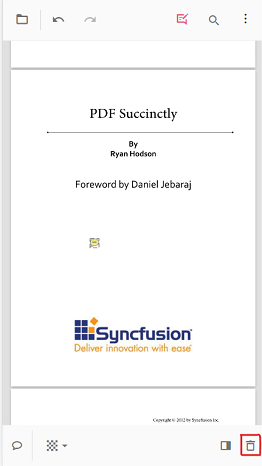
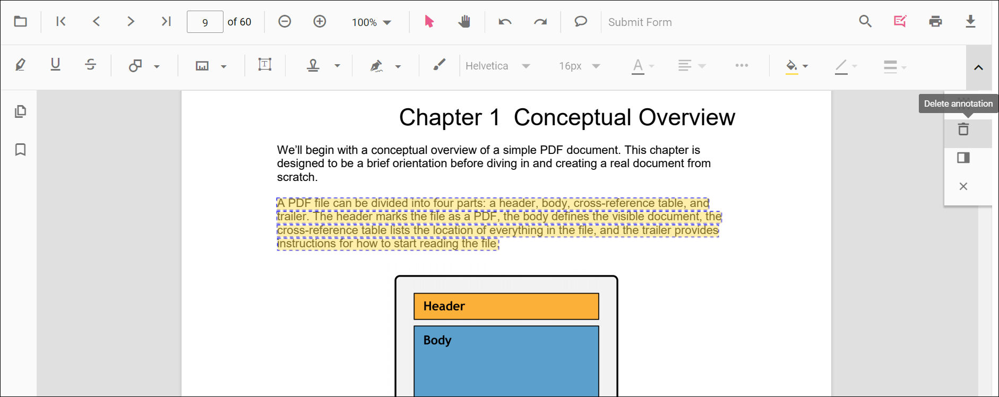

# Remove Annotations in ASP.NET MVC PDF Viewer

Annotations can be removed using the built-in UI or programmatically. This page shows common methods to delete annotations in the viewer.

## Delete via UI

A selected annotation can be deleted in three ways:

- **Context menu**: right-click the annotation and choose Delete.  

- **Annotation toolbar**: select the annotation and click the Delete button on the annotation toolbar.  

- **Keyboard**: select the annotation and press the `Delete` key.

## Delete programmatically

Annotations can be deleted programmatically either by removing the currently selected annotation or by specifying an annotation id.




<button id="deleteAnnotation" onclick="deleteAnnotation()">Delete Annotation</button>
<button id="deleteAnnotationById" onclick="deleteAnnotationById()">Delete Annotation By ID</button>

    @Html.EJS().PdfViewer("pdfviewer").DocumentPath("https://cdn.syncfusion.com/content/pdf/pdf-succinctly.pdf").Render()




<button id="deleteAnnotation" onclick="deleteAnnotation()">Delete Annotation</button>
<button id="deleteAnnotationById" onclick="deleteAnnotationById()">Delete Annotation By ID</button>

    @Html.EJS().PdfViewer("pdfviewer").ServiceUrl(VirtualPathUtility.ToAbsolute("~/PdfViewer/")).DocumentPath("https://cdn.syncfusion.com/content/pdf/pdf-succinctly.pdf").Render()




N> Deleting via the API requires the annotation to exist in the current document. Ensure an annotation is selected when using `deleteAnnotation()`, or pass a valid id to `deleteAnnotationById()`.

## See also

- [Annotation Overview](./overview)
- [Annotation Types](./annotation-types/area-annotation)
- [Annotation Toolbar](../toolbar-customization/annotation-toolbar)
- [Create and Modify Annotation](./create-modify-annotation)
- [Customize Annotation](./customize-annotation)
- [Handwritten Signature](./signature-annotation)
- [Export and Import Annotation](./export-import/export-annotation)
- [Annotation Permission](./annotation-permission)
- [Annotation in Mobile View](./annotations-in-mobile-view)
- [Annotation Events](./annotation-event)
- [Annotation API](./annotations-api)
