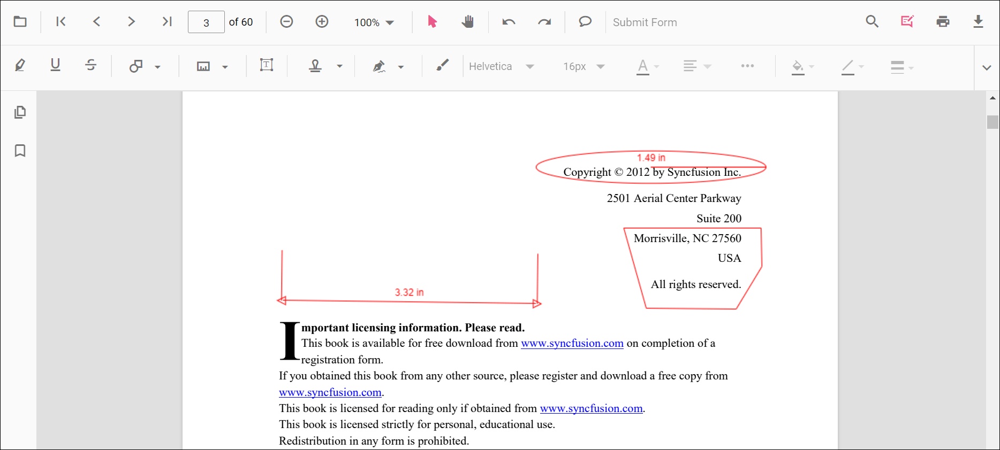
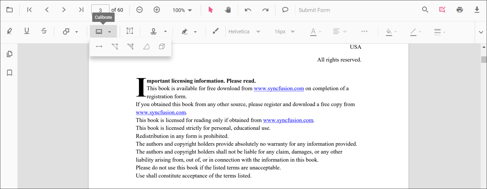
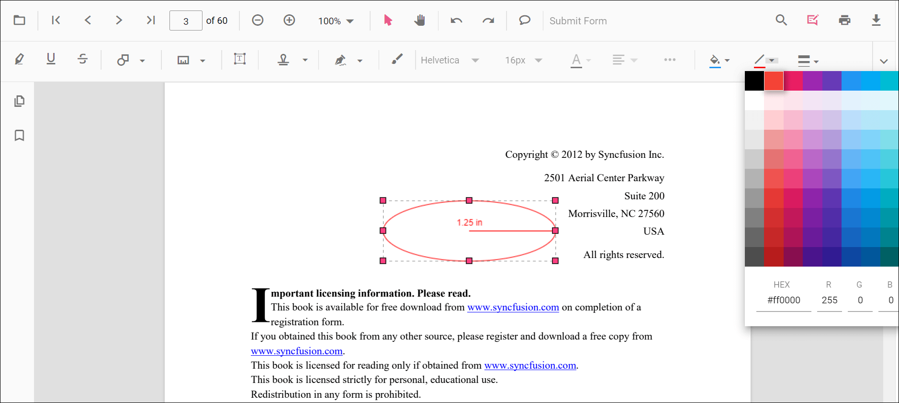
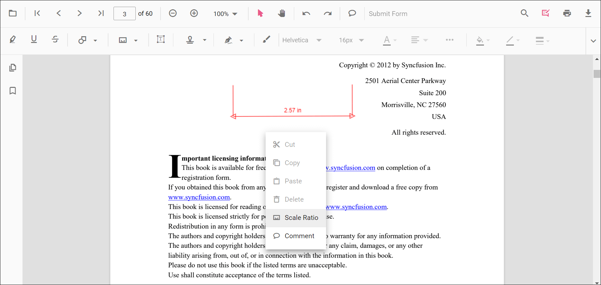

# Measurement annotation in ASP.NET MVC PDF Viewer control

The PDF Viewer provides options to add measurement annotations. The supported measurement annotations are:

* Distance
* Perimeter
* Area
* Radius
* Volume

## Adding measurement annotations to the PDF document

The measurement annotations can be added to the PDF document using the annotation toolbar.

* Click the **Edit Annotation** button in the PDF Viewer toolbar. A toolbar appears below it.
* Click the **Measurement Annotation** drop-down button. The pop-up lists available measurement annotation types.
* Select a measurement type to enable its annotation mode.
* Measure and add annotations on the pages of the PDF document.

When in pan mode, selecting a measurement annotation switches the PDF Viewer to text select mode.

The following example switches to distance annotation mode.




<!--Element to set measurement annotation mode-->
<button id="set" onclick="addAnnot()">Distance</button>

    @Html.EJS().PdfViewer("pdfviewer").DocumentPath("https://cdn.syncfusion.com/content/pdf/pdf-succinctly.pdf").Render()




<!--Element to set measurement annotation mode-->
<button id="set" onclick="addAnnot()">Distance</button>

    @Html.EJS().PdfViewer("pdfviewer").ServiceUrl(VirtualPathUtility.ToAbsolute("~/PdfViewer/")).DocumentPath("https://cdn.syncfusion.com/content/pdf/pdf-succinctly.pdf").Render()




## Add a measurement annotation to the PDF document programmatically

The PDF Viewer library allows adding measurement annotations programmatically using the **addAnnotation()** method.

Here is an example showing how to add measurement annotations programmatically using **addAnnotation()**:




<button onclick="addDistanceAnnotation()">Add Distance Annotation programatically</button>
<button onclick="addPerimeterAnnotation()">Add Perimeter Annotation programatically</button>
<button onclick="addAreaAnnotation()">Add Area Annotation programatically</button>
<button onclick="addRadiusAnnotation()">Add Radius Annotation programatically</button>
<button onclick="addVolumeAnnotation()">Add Volume Annotation programatically</button>

    @Html.EJS().PdfViewer("pdfviewer").DocumentPath("https://cdn.syncfusion.com/content/pdf/pdf-succinctly.pdf").Render()




<button onclick="addDistanceAnnotation()">Add Distance Annotation programatically</button>
<button onclick="addPerimeterAnnotation()">Add Perimeter Annotation programatically</button>
<button onclick="addAreaAnnotation()">Add Area Annotation programatically</button>
<button onclick="addRadiusAnnotation()">Add Radius Annotation programatically</button>
<button onclick="addVolumeAnnotation()">Add Volume Annotation programatically</button>

    @Html.EJS().PdfViewer("pdfviewer").ServiceUrl(VirtualPathUtility.ToAbsolute("~/PdfViewer/")).DocumentPath("https://cdn.syncfusion.com/content/pdf/pdf-succinctly.pdf").Render()




## Edit an existing measurement annotation programmatically

To modify an existing measurement annotation programmatically, use the **editAnnotation()** method.

Here is an example of using **editAnnotation()**:




<button onclick="editDistanceAnnotation()">edit Distance Annotation programatically</button>
<button onclick="editPerimeterAnnotation()">edit Perimeter Annotation programatically</button>
<button onclick="editAreaAnnotation()">edit Area Annotation programatically</button>
<button onclick="editRadiusAnnotation()">edit Radius Annotation programatically</button>
<button onclick="editVolumeAnnotation()">edit Volume Annotation programatically</button>

    @Html.EJS().PdfViewer("pdfviewer").DocumentPath("https://cdn.syncfusion.com/content/pdf/pdf-succinctly.pdf").Render()




<button onclick="editDistanceAnnotation()">edit Distance Annotation programatically</button>
<button onclick="editPerimeterAnnotation()">edit Perimeter Annotation programatically</button>
<button onclick="editAreaAnnotation()">edit Area Annotation programatically</button>
<button onclick="editRadiusAnnotation()">edit Radius Annotation programatically</button>
<button onclick="editVolumeAnnotation()">edit Volume Annotation programatically</button>

    @Html.EJS().PdfViewer("pdfviewer").ServiceUrl(VirtualPathUtility.ToAbsolute("~/PdfViewer/")).DocumentPath("https://cdn.syncfusion.com/content/pdf/pdf-succinctly.pdf").Render()




## Edit the properties of measurement annotations

The fill color, stroke color, thickness, and opacity can be edited using the Edit Color, Edit Stroke Color, Edit Thickness, and Edit Opacity tools in the annotation toolbar.

### Edit fill color

The fill color of the annotation can be edited using the color palette provided in the Edit Color tool.

### Edit stroke color

The stroke color of the annotation can be edited using the color palette provided in the Edit Stroke Color tool.

### Edit thickness

Edit border thickness using the range slider provided in the Edit Thickness tool.

### Edit opacity

The opacity of the annotation can be edited using the range slider provided in the Edit Opacity tool.

### Edit the line properties

Line-based measurement annotations (distance and perimeter) have additional options in the Line Properties window. Open it by right-clicking the annotation and selecting Properties from the context menu.

## Set default properties during control initialization

Default properties for measurement annotations can be set before creating the control using DistanceSettings, PerimeterSettings, AreaSettings, RadiusSettings, and VolumeSettings.

Refer to the following code sample to set the default annotation settings.




    @Html.EJS().PdfViewer("pdfviewer").DocumentPath("https://cdn.syncfusion.com/content/pdf/pdf-succinctly.pdf").DistanceSettings(new Syncfusion.EJ2.PdfViewer.PdfViewerDistanceSettings { FillColor = "blue", Opacity = 0.6, StrokeColor = "green" }).PerimeterSettings(new Syncfusion.EJ2.PdfViewer.PdfViewerPerimeterSettings { FillColor = "green", Opacity = 0.6, StrokeColor = "blue" }).AreaSettings(new Syncfusion.EJ2.PdfViewer.PdfViewerAreaSettings { FillColor = "yellow", Opacity = 0.6, StrokeColor = "orange" }).RadiusSettings(new Syncfusion.EJ2.PdfViewer.PdfViewerRadiusSettings { FillColor = "orange", Opacity = 0.6, StrokeColor = "pink" }).VolumeSettings(new Syncfusion.EJ2.PdfViewer.PdfViewerVolumeSettings { FillColor = "pink", Opacity = 0.6, StrokeColor = "yellow" }).Render()




    @Html.EJS().PdfViewer("pdfviewer").ServiceUrl(VirtualPathUtility.ToAbsolute("~/PdfViewer/")).DocumentPath("https://cdn.syncfusion.com/content/pdf/pdf-succinctly.pdf").DistanceSettings(new Syncfusion.EJ2.PdfViewer.PdfViewerDistanceSettings { FillColor = "blue", Opacity = 0.6, StrokeColor = "green" }).PerimeterSettings(new Syncfusion.EJ2.PdfViewer.PdfViewerPerimeterSettings { FillColor = "green", Opacity = 0.6, StrokeColor = "blue" }).AreaSettings(new Syncfusion.EJ2.PdfViewer.PdfViewerAreaSettings { FillColor = "yellow", Opacity = 0.6, StrokeColor = "orange" }).RadiusSettings(new Syncfusion.EJ2.PdfViewer.PdfViewerRadiusSettings { FillColor = "orange", Opacity = 0.6, StrokeColor = "pink" }).VolumeSettings(new Syncfusion.EJ2.PdfViewer.PdfViewerVolumeSettings { FillColor = "pink", Opacity = 0.6, StrokeColor = "yellow" }).Render()




## Edit scale ratio and unit of the measurement annotation

The scale ratio and unit of measurement can be modified using the scale ratio option provided in the context menu of the PDF Viewer control.

The Units of measurements support for the measurement annotations in the PDF Viewer are

* Inch
* Millimeter
* Centimeter
* Point
* Pica
* Feet

## Set default scale ratio settings during control initialization

The properties of scale ratio for measurement annotation can be set before creating the control using the ScaleRatioSettings as shown in the following code sample.




    @Html.EJS().PdfViewer("pdfviewer").DocumentPath("https://cdn.syncfusion.com/content/pdf/pdf-succinctly.pdf").MeasurementSettings(new Syncfusion.EJ2.PdfViewer.PdfViewerMeasurementSettings { ScaleRatio = 2, ConversionUnit = Syncfusion.EJ2.PdfViewer.CalibrationUnit.Cm }).Render()




     @Html.EJS().PdfViewer("pdfviewer").ServiceUrl(VirtualPathUtility.ToAbsolute("~/PdfViewer/")).DocumentPath("https://cdn.syncfusion.com/content/pdf/pdf-succinctly.pdf").MeasurementSettings(new Syncfusion.EJ2.PdfViewer.PdfViewerMeasurementSettings { ScaleRatio = 2, ConversionUnit = Syncfusion.EJ2.PdfViewer.CalibrationUnit.Cm }).Render()



