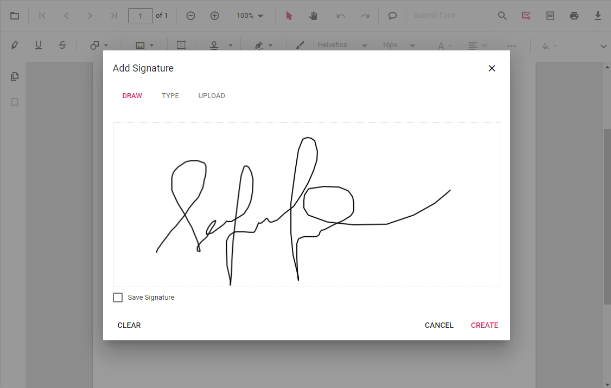

# Add Digital Signature in ASP.NET MVC PDF Viewer

Learn how to **add signature fields** with the Syncfusion **ASP.NET MVC PDF Viewer** and how to apply **digital (PKI) signatures** with the **.NET PDF Library**.


N> As instructed by team leads — use the **ASP.NET MVC PDF Viewer only to add & place signature fields**. Use the **.NET PDF Library** to apply the *actual cryptographic digital signature*.

## Overview

A **digital signature** provides:
- **Authenticity** – confirms the signer’s identity.
- **Integrity** – detects modification after signing.
- **Non‑repudiation** – signer cannot deny signing.

Syncfusion supports a hybrid workflow:
- Viewer → **[Design signature fields](../forms/manage-form-fields/create-form-fields#signature-field)**, capture Draw/Type/Upload electronic signature.
- PDF Library → **[Apply PKCS#7/CMS digital signature](https://help.syncfusion.com/document-processing/pdf/pdf-library/net/working-with-digitalsignature)** using a certificate (PFX/P12).

## Add a Signature Field (How-to)

### Using the UI
1. Open **Form Designer**.
2. Select **Signature Field**.
3. Click on the document to place the field.
4. Configure **Name**, **Tooltip**, and **Required** as needed.



### Using the API




    <div style="width:100%;height:600px">
        @Html.EJS().PdfViewer("pdfviewer").DocumentPath("https://cdn.syncfusion.com/content/pdf/form-filling-document.pdf").Render()
    </div>

    <script>
        document.addEventListener("DOMContentLoaded", function () {
            var pdfviewer = document.getElementById('pdfviewer').ej2_instances[0];
            pdfviewer.documentLoad = function () {
                pdfviewer.formDesignerModule.addFormField('SignatureField', {
                    name: 'ApproverSignature',
                    pageNumber: 1,
                    bounds: { X: 72, Y: 640, Width: 220, Height: 48 },
                    isRequired: true,
                    tooltip: 'Sign here'
                });
            };
        });
    </script>




    <div style="width:100%;height:600px">
        @Html.EJS().PdfViewer("pdfviewer").ServiceUrl(VirtualPathUtility.ToAbsolute("~/api/PdfViewer/")).DocumentPath("https://cdn.syncfusion.com/content/pdf/form-filling-document.pdf").Render()
    </div>

    <script>
        document.addEventListener("DOMContentLoaded", function () {
            var pdfviewer = document.getElementById('pdfviewer').ej2_instances[0];
            pdfviewer.documentLoad = function () {
                pdfviewer.formDesignerModule.addFormField('SignatureField', {
                    name: 'ApproverSignature',
                    pageNumber: 1,
                    bounds: { X: 72, Y: 640, Width: 220, Height: 48 },
                    isRequired: true,
                    tooltip: 'Sign here'
                });
            };
        });
    </script>




## Capture Electronic Signature (Draw / Type / Upload)
When the user clicks the field, a dialog appears where they can **Draw**, **Type**, or **Upload** a handwritten signature. The result is a *visual* signature only — it is not cryptographically secure. For a cryptographically secure signature, use the .NET PDF Library as described in the next section.

## Apply PKI Digital Signature (.NET PDF Library)

Digital signature must be applied using the **Syncfusion .NET PDF Library** ([PdfLoadedDocument](https://help.syncfusion.com/cr/file-formats/Syncfusion.Pdf.PdfLoadedDocument.html) / [PdfSignature](https://help.syncfusion.com/cr/file-formats/Syncfusion.Pdf.Security.PdfSignature.html)).

```csharp
// Load the existing PDF that contains the signature field designed by the Viewer
using (PdfLoadedDocument document = new PdfLoadedDocument(pdfBytes))
{
    // Get the first page
    PdfLoadedPage page = document.Pages[0] as PdfLoadedPage;

    // Create a visible signature field at the required bounds (if not already present)
    PdfSignatureField signatureField = new PdfSignatureField(page, "ApproverSignature",
        new RectangleF(72, 640, 220, 48));

    // Add the signature field to the document form
    document.Form.Fields.Add(signatureField);

    // Create the cryptographic signature using a PFX (certificate + private key)
    PdfCertificate certificate = new PdfCertificate(pfxPath, password);
    PdfSignature signature = new PdfSignature(document, page, certificate, "ApproverSignature", signatureField);

    // Set signing options (CMS / SHA-256)
    signature.Settings.CryptographicStandard = CryptographicStandard.CMS;
    signature.Settings.DigestAlgorithm = DigestAlgorithm.SHA256;

    // Save the signed document
    using (FileStream output = new FileStream("signed.pdf", FileMode.Create))
    {
        document.Save(output);
    }
    document.Close(true);
}
```

N> See the PDF Library [Digital signature](https://help.syncfusion.com/document-processing/pdf/pdf-library/net/working-with-digitalsignature) to know more about Digital Signature in PDF Documents.

## Important Notes
- **Complete all form edits before signing.** Any PDF modification after signing invalidates the signature.
- A self‑signed PFX certificate displays as **Unknown / Untrusted** until it is added to the consumer's **Trusted Certificates**.

## Best Practices
- Place signature fields with the Viewer for accurate layout.
- Apply the PKI signature with the PDF Library only.
- Use **CMS** with **SHA‑256** for broad compatibility.
- Avoid flattening the form after signing.

## See Also
- [Validate Digital Signatures](./validate-digital-signatures-mvc) — verify an existing digital signature and inspect signer details.
- [Custom fonts for Signature fields](../../how-to/custom-font-signature-field) — configure custom fonts for the signature field appearance.
- [Signature workflows](./signature-workflow-mvc) — end-to-end signing and approval workflows.
