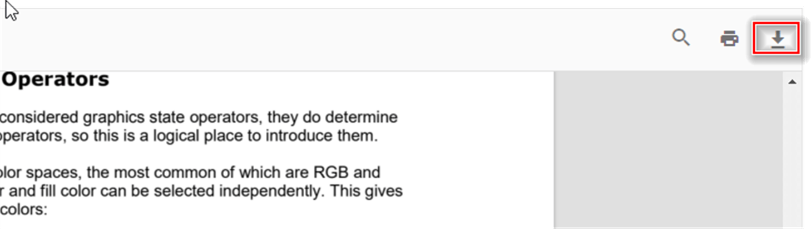

# Download PDF document in PDF Viewer component

The PDF Viewer supports downloading the loaded PDF file. You can enable or disable the download using the following example.




<div id="e-pv-e-sign-pdfViewer-div">
    @Html.EJS().PdfViewer("pdfviewer").ResourceUrl("https://cdn.syncfusion.com/ej2/31.2.2/dist/ej2-pdfviewer-lib").DocumentPath("https://cdn.syncfusion.com/content/pdf/pdf-succinctly.pdf").EnableDownload(true).Render()
</div>




<div id="e-pv-e-sign-pdfViewer-div">
    @Html.EJS().PdfViewer("pdfviewer").ServiceUrl(VirtualPathUtility.ToAbsolute("~/PdfViewer/")).DocumentPath("https://cdn.syncfusion.com/content/pdf/pdf-succinctly.pdf").EnableDownload(true).Render()
</div>






You can also programmatically invoke the download action using the `download()` method, as shown below:



```html
<div style="width:100%;height:600px">
    @Html.EJS().PdfViewer("pdfviewer").DocumentLoad("download").EnableDownload(true).DocumentPath("https://cdn.syncfusion.com/content/pdf/hive-succinctly.pdf").Render()
</div>

<script>
    function download() {
        var pdfViewer = document.getElementById('pdfviewer').ej2_instances[0];
        pdfViewer.download();
    }
</script>
```


```html
<div style="width:100%;height:600px">
    @Html.EJS().PdfViewer("pdfviewer").DocumentLoad("download")..ServiceUrl(VirtualPathUtility.ToAbsolute("~/api/PdfViewer/")).EnableDownload(true).DocumentPath("https://cdn.syncfusion.com/content/pdf/hive-succinctly.pdf").Render()
</div>

<script>
    function download() {
        var pdfViewer = document.getElementById('pdfviewer').ej2_instances[0];
        pdfViewer.download();
    }
</script>
```



## Get the base64 string while downloading the PDF document

You can use the [downloadEnd](https://help.syncfusion.com/cr/aspnetmvc-js2/syncfusion.ej2.pdfviewer.pdfviewer.html#Syncfusion_EJ2_PdfViewer_PdfViewer_DownloadEnd) event of the PDF Viewer to retrieve the downloaded document as a base64 string.

## See also

* [Toolbar items](./toolbar)
* [Feature Modules](./feature-module)