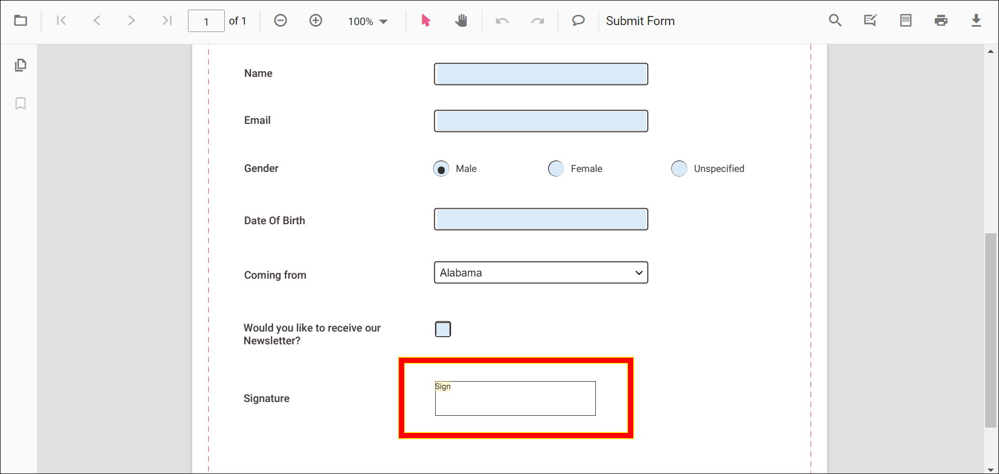
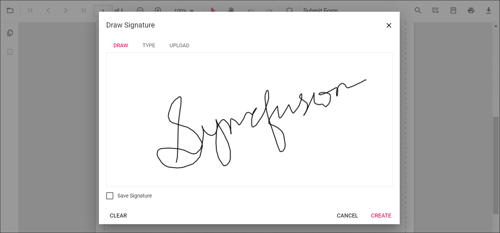
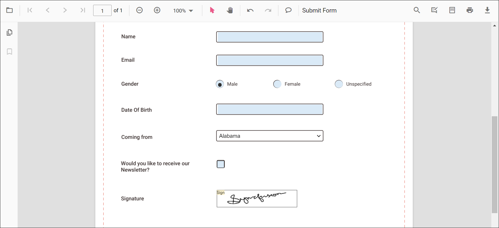
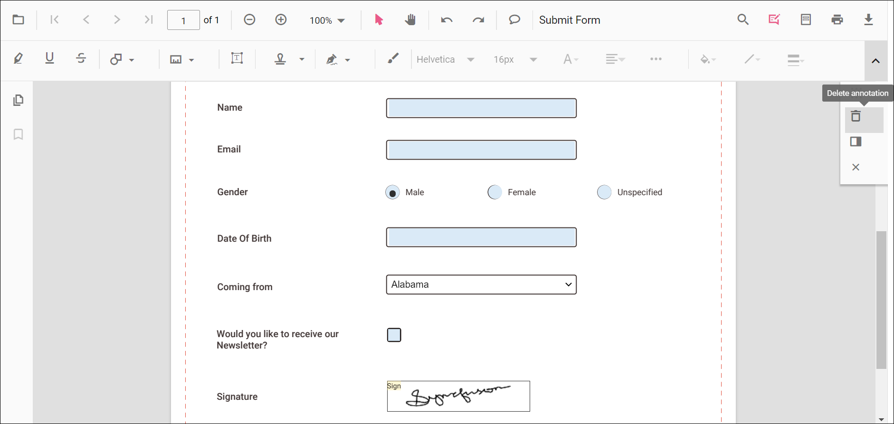

# Form filling in ASP.NET MVC PDF Viewer Component

The PDF Viewer component displays existing form fields in a PDF document and enables filling and downloading filled data.

The form fields displayed in the Pdf Viewer are:

* TextBox
* Password
* CheckBox
* RadioButton
* ListBox
* DropDown
* SignatureField
* InitialField


## Disabling form fields

The PDF Viewer control provides an option to disable interaction with form fields. Use the following configuration to disable form fields in the viewer.



```html
<div style="width:100%;height:600px">
    @Html.EJS().PdfViewer("pdfviewer").EnableFormFields(false).DocumentPath("https://cdn.syncfusion.com/content/pdf/form-filling-document.pdf").Render()
</div>
```


```html
<div style="width:100%;height:600px">
    @Html.EJS().PdfViewer("pdfviewer").ServiceUrl(VirtualPathUtility.ToAbsolute("~/PdfViewer/")).EnableFormFields(false).DocumentPath("https://cdn.syncfusion.com/content/pdf/form-filling-document.pdf").Render()
</div>
```



## How to draw handwritten signature in the signature field

Add a handwritten signature to a Signature field by following these steps:

* Click the signature field in the PDF document to open the signature panel.



* Draw the signature in the signature panel.



* Click the **CREATE** button. The drawn signature is added to the signature field.



## Delete the signature inside the signature field

Delete a signature placed in a signature field by using the Delete option in the annotation toolbar.



## Export and import form fields

The PDF Viewer control provides the support to export and import the form field data in the following formats using the `importFormFields`, `exportFormFields`, and `exportFormFieldsAsObject` methods.

* FDF
* XFDF
* JSON

## Importing form fields using PDF Viewer API

You can import the form fields using JSON file or JSON object in code behind like the below code sample.

```html
<button id="viewer" onclick="OnImportFormFieldsClick()">Import FormFields</button>
<div style="width:100%;height:600px">
    @Html.EJS().PdfViewer("pdfviewer").ServiceUrl(VirtualPathUtility.ToAbsolute("~/PdfViewer/")).DocumentPath("https://cdn.syncfusion.com/content/pdf/form-filling-document.pdf").Render()
</div>
<script>
    function OnImportFormFieldsClick() {
        var pdfViewer = document.getElementById('pdfviewer').ej2_instances[0];
        //The json file has been placed inside the App_Data folder.);
        pdfViewer.importFormFields("D:/PDFViewer/Examples/mvcsample/App_Data/ImportFormFields.json");
    }
</script>
```

N>The JSON file for importing the form fields should be placed in the desired location and the path should be provided correctly.

## Exporting form fields from the PDF document using PDF Viewer API

You can export the form fields as JSON file in code behind as the following code sample.



```html
<button id="viewer" onclick="OnExportFormFieldsClick()">Export FormFields</button>
<div style="width:100%;height:600px">
    @Html.EJS().PdfViewer("pdfviewer").DocumentPath("https://cdn.syncfusion.com/content/pdf/form-filling-document.pdf").Render()
</div>
<script>
    function OnExportFormFieldsClick() {
        var pdfViewer = document.getElementById('pdfviewer').ej2_instances[0];
         pdfViewer.exportFormFields(null,'Json');
    }
</script>
```


```html
<button id="viewer" onclick="OnExportFormFieldsClick()">Export FormFields</button>
<div style="width:100%;height:600px">
    @Html.EJS().PdfViewer("pdfviewer").ServiceUrl(VirtualPathUtility.ToAbsolute("~/PdfViewer/")).DocumentPath("https://cdn.syncfusion.com/content/pdf/form-filling-document.pdf").Render()
</div>
<script>
    function OnExportFormFieldsClick() {
        var pdfViewer = document.getElementById('pdfviewer').ej2_instances[0];
         pdfViewer.exportFormFields(null,'Json');
    }
</script>
```



## See also

* [Handwritten Signature in ASP.NET MVC PDF Viewer Component](./annotation/signature-annotation)
* [Form Designer](./form-designer/form-field-events)