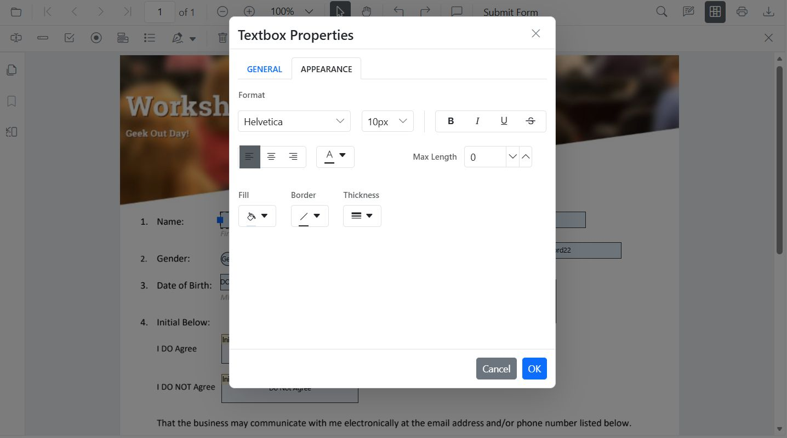

# Customize Form Field Appearance in ASP.NET MVC PDF Viewer

**Styling** customizes appearance only (font, color, alignment, border, background, indicator text).

## Customize Appearance of Form Fields Using the UI
Use the **Properties** panel to adjust:
- Font family/size, text color, alignment
- Border color/thickness
- Background color

## Customize Form Fields Programmatically
Use [updateFormField()](https://help.syncfusion.com/cr/aspnetmvc-js2/syncfusion.ej2.pdfviewer.pdfviewer.html#updateFormField) to apply styles:




    

        <button id="CustomizeTextboxStyle">Update Textbox Style</button>
    

    

        @Html.EJS().PdfViewer("pdfviewer").DocumentPath("https://cdn.syncfusion.com/content/pdf/form-filling-document.pdf").Render()
    

    




## Set Default Styles for New Form Fields
Define defaults so fields added from the toolbar inherit styles.




    

        @Html.EJS().PdfViewer("pdfviewer").DocumentPath("https://cdn.syncfusion.com/content/pdf/form-filling-document.pdf").Render()
    

    




[View Sample on GitHub](https://github.com/SyncfusionExamples/mvc-pdf-viewer-examples)

## See also

- [Form Designer overview](../overview)
- [Form Designer Toolbar](../../toolbar-customization/form-designer-toolbar)
- [Create form fields](./create-form-fields)
- [Modify form fields](./modify-form-fields)
- [Remove form fields](./remove-form-fields)
- [Group form fields](../group-form-fields)
- [Form validation](../form-validation)
- [Add custom data to form fields](../custom-data)
- [Form fields API](../form-fields-api)
