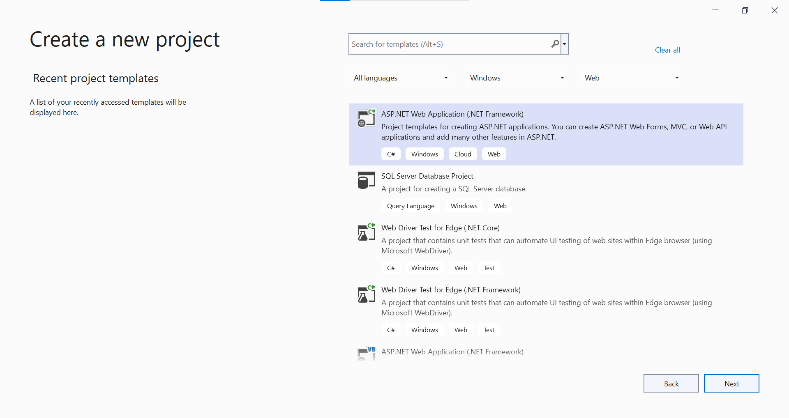
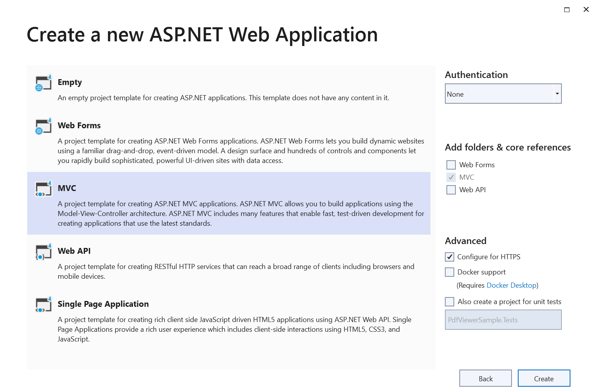

# Getting started with the ASP.NET MVC PDF Viewer control

The [ASP.NET MVC PDF Viewer](https://www.syncfusion.com/pdf-viewer-sdk) enables viewing and printing PDF files in web applications. It offers core interactions such as zooming, scrolling, text search, text selection, and copy. Thumbnails, bookmarks, hyperlinks, and a table of contents simplify navigation within and across PDF files.

This guide shows how to integrate the ASP.NET MVC PDF Viewer into an ASP.NET MVC application using Visual Studio.

## Prerequisites

[System requirements for ASP.NET MVC controls](https://help.syncfusion.com/document-processing/system-requirements)

Before running the application, register a Syncfusion license key as described in the licensing documentation: https://help.syncfusion.com/common/essential-studio/licensing/license-key

## Integrate the PDF Viewer into an ASP.NET MVC application

1. Start Visual Studio and select **Create a new project**.
2. Create a new ASP.NET MVC Web Application project.

3. Choose the target framework and project name.

4. Select the Web Application (MVC) pattern and choose **Create**.


## Install NuGet packages

Install the following NuGet packages to add the PDF Viewer to the ASP.NET MVC application.

* [Syncfusion.EJ2.PdfViewer.AspNet.Mvc5](https://www.nuget.org/packages/Syncfusion.EJ2.PdfViewer.AspNet.Mvc5/)
* [Syncfusion.EJ2.MVC5](https://www.nuget.org/packages/Syncfusion.EJ2.MVC5)

## Add namespace

Add **Syncfusion.EJ2** namespace reference in `Web.config` under `Views` folder.

```
<namespaces>
    <add namespace="Syncfusion.EJ2"/>
</namespaces>
```

## Add the style sheet

Reference a theme from the CDN inside the `<head>` of `~/Views/Shared/_Layout.cshtml` as follows:




<head>
    ...
    <!-- Syncfusion ASP.NET MVC controls styles -->
    <link rel="stylesheet" href="https://cdn.syncfusion.com/ej2/{{ site.ej2version }}/fluent.css" />
</head>




N> Check out the [Themes topic](https://ej2.syncfusion.com/aspnetmvc/documentation/appearance/theme) to learn different ways (CDN, NPM package, and [CRG](https://ej2.syncfusion.com/aspnetmvc/documentation/common/custom-resource-generator)) to reference styles in an ASP.NET MVC application and ensure consistent appearance for Syncfusion<sup style="font-size:70%">&reg;</sup> ASP.NET MVC controls.

## Add the script reference

Add the required scripts from the CDN inside the `<head>` of `~/Views/Shared/_Layout.cshtml` as follows:




<head>
    ...
    <!-- Syncfusion ASP.NET MVC controls scripts -->
    <script src="https://cdn.syncfusion.com/ej2/{{ site.ej2version }}/dist/ej2.min.js"></script>
</head>




## Register the Syncfusion<sup style="font-size:70%">&reg;</sup> script manager

Open `~/Views/Shared/_Layout.cshtml` and register the script manager in the ASP.NET MVC application as follows:




<body>
...
    <!-- Syncfusion ASP.NET MVC Script Manager -->
    @Html.EJS().ScriptManager()
</body>




N> Add the script manager `EJS().ScriptManager()` at the **end of `<body>`**.

## Add the ASP.NET MVC PDF Viewer control

Add the Syncfusion<sup style="font-size:70%">&reg;</sup> ASP.NET MVC PDF Viewer control in `~/Views/Home/Index.cshtml`. Load a PDF by setting the `DocumentPath` property to a file name or URL, as shown below.




@{
    ViewBag.Title = "Home Page";
}

<div>
    <div style="height:500px;width:100%;">
        @Html.EJS().PdfViewer("pdfviewer").ServiceUrl(VirtualPathUtility.ToAbsolute("~/Home/")).DocumentPath("https://cdn.syncfusion.com/content/pdf/pdf-succinctly.pdf").Render()
    </div>
</div>




Add the below code in the `HomeController.cs` file which is placed inside `Controllers` folder.




using Newtonsoft.Json;
using Syncfusion.EJ2.PdfViewer;
using System;
using System.Collections.Generic;
using System.IO;
using System.Linq;
using System.Net;
using System.Net.Http;
using System.Reflection;
using System.Web;
using System.Web.Mvc;

namespace GettingStartedMVC.Controllers
{
    public class HomeController : Controller
    {
        [System.Web.Mvc.HttpPost]
        public ActionResult Load(jsonObjects jsonObject)
        {
            PdfRenderer pdfviewer = new PdfRenderer();
            MemoryStream stream = new MemoryStream();
            var jsonData = JsonConverter(jsonObject);
            object jsonResult = new object();
            if (jsonObject != null && jsonData.ContainsKey("document"))
            {
                if (bool.Parse(jsonData["isFileName"]))
                {
                    string documentPath = GetDocumentPath(jsonData["document"]);

                    if (!string.IsNullOrEmpty(documentPath))
                    {
                        byte[] bytes = System.IO.File.ReadAllBytes(documentPath);
                        stream = new MemoryStream(bytes);
                    }
                    else
                    {
                        string fileName = jsonData["document"].Split(new string[] { "://" }, StringSplitOptions.None)[0];
                        if (fileName == "http" || fileName == "https")
                        {
                            var WebClient = new WebClient();
                            byte[] pdfDoc = WebClient.DownloadData(jsonData["document"]);
                            stream = new MemoryStream(pdfDoc);
                        }
                        else
                        {
                            return this.Content(jsonData["document"] + " is not found");
                        }
                    }
                }
                else
                {
                    byte[] bytes = Convert.FromBase64String(jsonData["document"]);
                    stream = new MemoryStream(bytes);

                }
            }
            jsonResult = pdfviewer.Load(stream, jsonData);
            return Content(JsonConvert.SerializeObject(jsonResult));
        }

        public Dictionary<string, string> JsonConverter(jsonObjects results)
        {
            Dictionary<string, object> resultObjects = new Dictionary<string, object>();
            resultObjects = results.GetType().GetProperties(BindingFlags.Instance | BindingFlags.Public)
                .ToDictionary(prop => prop.Name, prop => prop.GetValue(results, null));
            var emptyObjects = (from kv in resultObjects
                                where kv.Value != null
                                select kv).ToDictionary(kv => kv.Key, kv => kv.Value);
            Dictionary<string, string> jsonResult = emptyObjects.ToDictionary(k => k.Key, k => k.Value.ToString());
            return jsonResult;
        }

        [System.Web.Mvc.HttpPost]
        public ActionResult ExportAnnotations(jsonObjects jsonObject)
        {
            PdfRenderer pdfviewer = new PdfRenderer();
            var jsonData = JsonConverter(jsonObject);
            string jsonResult = pdfviewer.ExportAnnotation(jsonData);
            return Content((jsonResult));
        }

        [System.Web.Mvc.HttpPost]
        public ActionResult ImportAnnotations(jsonObjects jsonObject)
        {
            PdfRenderer pdfviewer = new PdfRenderer();
            string jsonResult = string.Empty;
            var jsonData = JsonConverter(jsonObject);
            if (jsonObject != null && jsonData.ContainsKey("fileName"))
            {
                string documentPath = GetDocumentPath(jsonData["fileName"]);
                if (!string.IsNullOrEmpty(documentPath))
                {
                    jsonResult = System.IO.File.ReadAllText(documentPath);
                }
                else
                {
                    return this.Content(jsonData["document"] + " is not found");
                }
            }
            return Content(JsonConvert.SerializeObject(jsonResult));
        }

        [System.Web.Mvc.HttpPost]
        public ActionResult ImportFormFields(jsonObjects jsonObject)
        {
            PdfRenderer pdfviewer = new PdfRenderer();
            var jsonData = JsonConverter(jsonObject);
            object jsonResult = pdfviewer.ImportFormFields(jsonData);
            return Content(JsonConvert.SerializeObject(jsonResult));
        }

        [System.Web.Mvc.HttpPost]
        public ActionResult ExportFormFields(jsonObjects jsonObject)
        {
            PdfRenderer pdfviewer = new PdfRenderer();
            var jsonData = JsonConverter(jsonObject);
            string jsonResult = pdfviewer.ExportFormFields(jsonData);
            return Content(jsonResult);
        }

        [System.Web.Mvc.HttpPost]
        public ActionResult RenderPdfPages(jsonObjects jsonObject)
        {
            PdfRenderer pdfviewer = new PdfRenderer();
            var jsonData = JsonConverter(jsonObject);
            object jsonResult = pdfviewer.GetPage(jsonData);
            return Content(JsonConvert.SerializeObject(jsonResult));
        }

        [System.Web.Mvc.HttpPost]
        public ActionResult Unload(jsonObjects jsonObject)
        {
            PdfRenderer pdfviewer = new PdfRenderer();
            var jsonData = JsonConverter(jsonObject);
            pdfviewer.ClearCache(jsonData);
            return this.Content("Document cache is cleared");
        }

        [System.Web.Mvc.HttpPost]
        public ActionResult RenderThumbnailImages(jsonObjects jsonObject)
        {
            PdfRenderer pdfviewer = new PdfRenderer();
            var jsonData = JsonConverter(jsonObject);
            object result = pdfviewer.GetThumbnailImages(jsonData);
            return Content(JsonConvert.SerializeObject(result));
        }

        [System.Web.Mvc.HttpPost]
        public ActionResult Bookmarks(jsonObjects jsonObject)
        {
            PdfRenderer pdfviewer = new PdfRenderer();
            var jsonData = JsonConverter(jsonObject);
            object jsonResult = pdfviewer.GetBookmarks(jsonData);
            return Content(JsonConvert.SerializeObject(jsonResult));
        }

        [System.Web.Mvc.HttpPost]
        public ActionResult RenderAnnotationComments(jsonObjects jsonObject)
        {
            PdfRenderer pdfviewer = new PdfRenderer();
            var jsonData = JsonConverter(jsonObject);
            object jsonResult = pdfviewer.GetAnnotationComments(jsonData);
            return Content(JsonConvert.SerializeObject(jsonResult));
        }

        [System.Web.Mvc.HttpPost]
        public ActionResult Download(jsonObjects jsonObject)
        {
            PdfRenderer pdfviewer = new PdfRenderer();
            var jsonData = JsonConverter(jsonObject);
            string documentBase = pdfviewer.GetDocumentAsBase64(jsonData);
            return Content(documentBase);
        }

        [System.Web.Mvc.HttpPost]
        public ActionResult PrintImages(jsonObjects jsonObject)
        {
            PdfRenderer pdfviewer = new PdfRenderer();
            var jsonData = JsonConverter(jsonObject);
            object pageImage = pdfviewer.GetPrintImage(jsonData);
            return Content(JsonConvert.SerializeObject(pageImage));
        }

        private HttpResponseMessage GetPlainText(string pageImage)
        {
            var responseText = new HttpResponseMessage(HttpStatusCode.OK);
            responseText.Content = new StringContent(pageImage, System.Text.Encoding.UTF8, "text/plain");
            return responseText;
        }

        private string GetDocumentPath(string document)
        {
            string documentPath = string.Empty;
            if (!System.IO.File.Exists(document))
            {
                var path = HttpContext.Request.PhysicalApplicationPath;
                if (System.IO.File.Exists(path + "App_Data\\" + document))
                    documentPath = path + "App_Data\\" + document;
            }
            else
            {
                documentPath = document;
            }
            return documentPath;
        }

        public ActionResult Index()
        {
            return View();
        }

        public ActionResult About()
        {
            ViewBag.Message = "Your application description page.";
            return View();
        }

        public ActionResult Contact()
        {
            ViewBag.Message = "Your contact page.";
            return View();
        }
    }

    public class jsonObjects
    {
        public string document { get; set; }
        public string password { get; set; }
        public bool isClientsideLoading { get; set; }
        public string organizePages { get; set; }
        public string zoomFactor { get; set; }
        public string isFileName { get; set; }
        public string xCoordinate { get; set; }
        public string yCoordinate { get; set; }
        public string pageNumber { get; set; }
        public string documentId { get; set; }
        public string hashId { get; set; }
        public string sizeX { get; set; }
        public string sizeY { get; set; }
        public string startPage { get; set; }
        public string endPage { get; set; }
        public string stampAnnotations { get; set; }
        public string textMarkupAnnotations { get; set; }
        public string stickyNotesAnnotation { get; set; }
        public string shapeAnnotations { get; set; }
        public string measureShapeAnnotations { get; set; }
        public string action { get; set; }
        public string pageStartIndex { get; set; }
        public string pageEndIndex { get; set; }
        public string fileName { get; set; }
        public string elementId { get; set; }
        public string pdfAnnotation { get; set; }
        public string importPageList { get; set; }
        public string uniqueId { get; set; }
        public string data { get; set; }
        public string viewPortWidth { get; set; }
        public string viewportHeight { get; set; }
        public string tilecount { get; set; }
        public bool isCompletePageSizeNotReceived { get; set; }
        public string freeTextAnnotation { get; set; }
        public string signatureData { get; set; }
        public string fieldsData { get; set; }
        public string formDesigner { get; set; }
        public bool isSignatureEdited { get; set; }
        public string inkSignatureData { get; set; }
        public bool hideEmptyDigitalSignatureFields { get; set; }
        public bool showDigitalSignatureAppearance { get; set; }
        public bool digitalSignaturePresent { get; set; }
        public string tileXCount { get; set; }
        public string tileYCount { get; set; }
        public string digitalSignaturePageList { get; set; }
        public string annotationCollection { get; set; }
        public string annotationsPageList { get; set; }
        public string formFieldsPageList { get; set; }
        public bool isAnnotationsExist { get; set; }
        public bool isFormFieldAnnotationsExist { get; set; }
        public string documentLiveCount { get; set; }
        public string annotationDataFormat { get; set; }
    }
}




[ServiceUrl](https://help.syncfusion.com/cr/aspnetmvc-js2/Syncfusion.EJ2.PdfViewer.PdfViewer.html#Syncfusion_EJ2_PdfViewer_PdfViewer_ServiceUrl) specifies the controller endpoint that the viewer uses to communicate with the server. In this example, `PdfViewer` is the controller name.

[DocumentPath](https://help.syncfusion.com/cr/aspnetmvc-js2/Syncfusion.EJ2.PdfViewer.PdfViewer.html#Syncfusion_EJ2_PdfViewer_PdfViewer_DocumentPath) specifies the PDF file to load in the viewer (a local file name or an external URL).

Press <kbd>Ctrl</kbd>+<kbd>F5</kbd> (Windows) or <kbd>⌘</kbd>+<kbd>F5</kbd> (macOS) to run the app. The Syncfusion<sup style="font-size:70%">&reg;</sup> ASP.NET MVC PDF Viewer will render in the default web browser.


N> The viewer supports changing the `serviceURL` at runtime. After updating `serviceURL`, call `pdfViewer.dataBind()` to apply the change immediately (available from version 23.1.36).
    string serviceUrl = VirtualPathUtility.ToAbsolute("~/Home/");
    function load() {
        var pdfViewer = document.getElementById('pdfviewer').ej2_instances[0];
        pdfViewer.serviceUrl = '@serviceUrl'
        pdfViewer.documentPath = "https://cdn.syncfusion.com/content/pdf/pdf-succinctly.pdf";
        pdfViewer.dataBind();
        pdfViewer.load(pdfViewer.documentPath, null);
    }

N> [View Sample in GitHub](https://github.com/SyncfusionExamples/ASP-NET-MVC-Getting-Started-Examples/tree/main/PDFViewer/ASP.NET%20MVC%20Razor%20Examples).

N> Refer to the [ASP.NET MVC PDF Viewer](https://www.syncfusion.com/pdf-viewer-sdk) feature tour and explore the [ASP.NET MVC PDF Viewer example](https://document.syncfusion.com/demos/pdf-viewer/asp-net-mvc/pdfviewer/default#/tailwind3) to learn more about core features.

N> When configuring the server-backed PDF viewer, it's essential to understand that there is no need to include the pdfium.js and pdfium.wasm files. Unlike the standalone PDF viewer, which relies on these files for local rendering, the server-backed PDF viewer fetches and renders PDFs directly from the server. Consequently, you can exclude the copy command for deployment process, as they are not required to load and display PDFs in this context.

N> For hosting the web service on the Linux platform, ensure to include the [SkiaSharp.NativeAssets.Linux](https://nuget.org/packages/SkiaSharp.NativeAssets.Linux/3.116.1). Additionally, for AWS environments, utilize the following packages:

| **Amazon Web Services (AWS)** |**NuGet package name** |
| --- | --- |
| AWS Lambda|[SkiaSharp.NativeAssets.Linux](https://nuget.org/packages/SkiaSharp.NativeAssets.Linux/3.116.1)|
| AWS Elastic Beanstalk |[SkiaSharp.NativeAssets.Linux.NoDependencies v3.116.1](https://www.nuget.org/packages/SkiaSharp.NativeAssets.Linux.NoDependencies/3.116.1)|