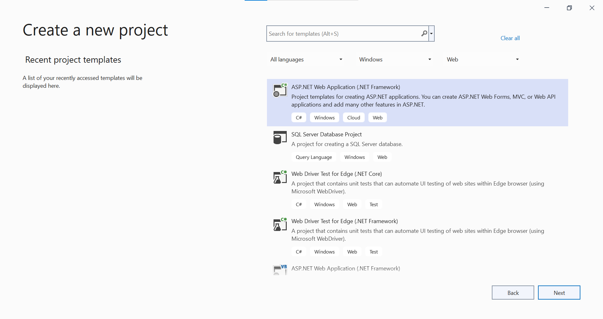
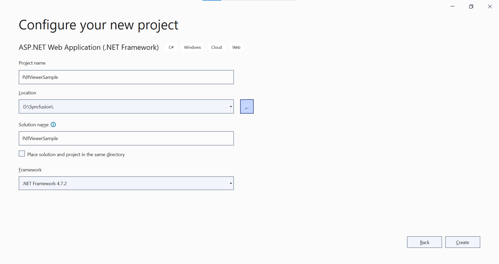
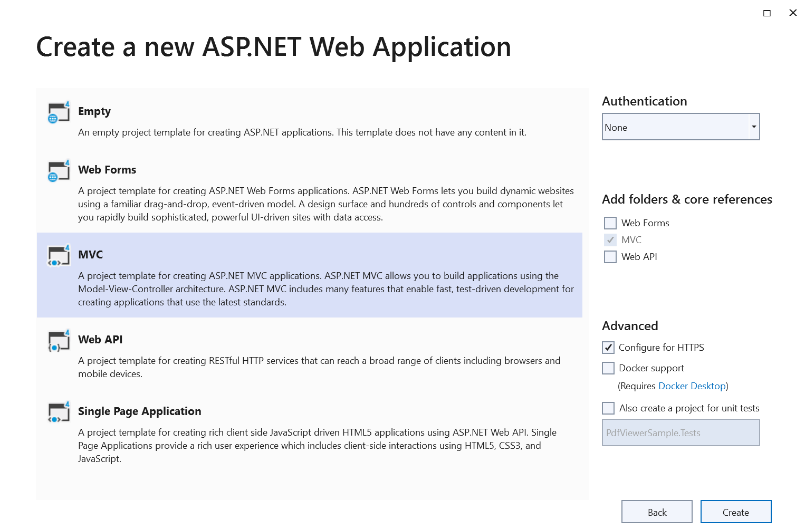

# Getting Started with ASP.NET MVC Standalone PDF Viewer Control

The [ASP.NET MVC PDF Viewer](https://www.syncfusion.com/pdf-viewer-sdk) enables viewing and printing PDF files in web applications. It offers core interactions such as zooming, scrolling, text search, text selection, and copy. Thumbnails, bookmarks, hyperlinks, and a table of contents simplify navigation within and across PDF files.

This guide explains how to integrate the ASP.NET MVC PDF Viewer into an ASP.NET MVC application using Visual Studio.

## Prerequisites

[System requirements for ASP.NET MVC controls](https://help.syncfusion.com/document-processing/system-requirements)

Before running the application, register a Syncfusion license key as described in the licensing documentation: https://help.syncfusion.com/common/essential-studio/licensing/license-key

## Integrate PDF Viewer into an ASP.NET MVC application

1. Start Visual Studio and select **Create a new project**.
2. Create a new ASP.NET MVC Web Application project.

3. Choose the target framework.

4. Select Web Application pattern (MVC) for the project and then select **Create** button.


## ASP.NET MVC PDF Viewer NuGet packages installation

To add .NET PDF Viewer control, the following NuGet packages need to be installed in your ASP.NET MVC application.

* [Syncfusion.EJ2.MVC5](https://www.nuget.org/packages/Syncfusion.EJ2.MVC5)

## Add namespace

Add **Syncfusion.EJ2** namespace reference in `Web.config` under `Views` folder.

```
<namespaces>
    <add namespace="Syncfusion.EJ2"/>
</namespaces>
```

## Add style sheet

The theme is referenced by using a CDN inside the `<head>` of `~/Views/Shared/_Layout.cshtml` as follows:




<head>
    ...
    <!-- Syncfusion ASP.NET MVC controls styles -->
    <link rel="stylesheet" href="https://cdn.syncfusion.com/ej2/{{ site.ej2version }}/fluent.css" />
</head>




N> Check out the [Themes topic](https://ej2.syncfusion.com/aspnetmvc/documentation/appearance/theme) to learn different ways (CDN, NPM package, and [CRG](https://ej2.syncfusion.com/aspnetmvc/documentation/common/custom-resource-generator)) to reference styles in an ASP.NET MVC application and ensure the expected appearance for Syncfusion<sup style="font-size:70%">&reg;</sup> ASP.NET MVC controls.

## Add script reference

Add the required scripts from the CDN inside the `<head>` of `~/Views/Shared/_Layout.cshtml` as follows:




<head>
    ...
    <!-- Syncfusion ASP.NET MVC controls scripts -->
    <script src="https://cdn.syncfusion.com/ej2/{{ site.ej2version }}/dist/ej2.min.js"></script>
</head>




### Steps to load the PDF Viewer with local script and style

To use local resources with the PDF Viewer, follow these steps:

**Step 1:** Place the `ej2.min.js` script and its related styles in an `ej2` directory under the `Content` folder of the ASP.NET MVC application.

**Step 2:** Add the local script and style references in the `<head>` section of `_Layout.cshtml`. Ensure these references point to the local files instead of the CDN links.

The following example shows how to reference local resources:




<head>
    ...
    <!-- Syncfusion ASP.NET MVC controls styles -->
    <link rel="stylesheet" href="~/Content/ej2/material.min.css" />
    ...
    <!-- Syncfusion ASP.NET MVC controls scripts -->
    <script src="~/Content/ej2/ej2.min.js"></script>
</head>




## Register Syncfusion<sup style="font-size:70%">&reg;</sup> Script Manager

Open `~/Views/Shared/_Layout.cshtml` page and register the script manager in the ASP.NET MVC application as follows.




<body>
...
    <!-- Syncfusion ASP.NET MVC Script Manager -->
    @Html.EJS().ScriptManager()
</body>




N> Add the script manager `EJS().ScriptManager()` at the **end of `<body>`**.

## Add ASP.NET MVC PDF Viewer control

Add the Syncfusion<sup style="font-size:70%">&reg;</sup> ASP.NET MVC PDF Viewer control in `~/Views/Home/Index.cshtml`. Load a PDF by setting the `DocumentPath` property to a file name or URL, as shown below.




@{
    ViewBag.Title = "Home Page";
}

<div>
    <div style="height:500px;width:100%;">
        @Html.EJS().PdfViewer("pdfviewer").DocumentPath("https://cdn.syncfusion.com/content/pdf/pdf-succinctly.pdf").Render()
    </div>
</div>




[DocumentPath](https://help.syncfusion.com/cr/aspnetmvc-js2/Syncfusion.EJ2.PdfViewer.PdfViewer.html#Syncfusion_EJ2_PdfViewer_PdfViewer_DocumentPath) is the property needed to load a PDF file in the PDF Viewer.

### How to configure the PDF Viewer to use local resources

To load resources locally, configure the `resourceUrl` and `documentPath` properties as follows:

**Step 1:** Ensure that the application includes the `ej2-pdfviewer-lib` folder under `Content`. This folder must contain `pdfium.js`, `pdfium.wasm`, and the PDF file to display.

**Step 2:** Assign local paths to the `documentPath` and `resourceUrl` properties in the PDF Viewer setup. The `documentPath` points to the PDF file, and the `resourceUrl` points to the folder that contains the supporting resources.

The following example shows how to reference local resources:




@{
    ViewBag.Title = "Home Page";
    var originUrl = $"{Request.Url.Scheme}://{Request.Url.Authority}";
    var document = originUrl + "/Content/pdfsuccinctly.pdf";
    var resourceUrl = originUrl + "/Content/ej2-pdfviewer-lib";
}

<div style="height: 900px;width:100%;">
    @Html.EJS().PdfViewer("pdfviewer").ResourceUrl(@resourceUrl).DocumentPath(@document).Render()
</div>




View the sample in GitHub to [load PDF Viewer with local resources](https://github.com/SyncfusionExamples/mvc-pdf-viewer-examples/tree/master/How%20to/Refer%20resource%20url%20locally/PdfViewer_MVC)

Press <kbd>Ctrl</kbd>+<kbd>F5</kbd> (Windows) or <kbd>⌘</kbd>+<kbd>F5</kbd> (macOS) to run the app. The Syncfusion<sup style="font-size:70%">&reg;</sup> ASP.NET MVC PDF Viewer will render in the default web browser.


N> [View Sample in GitHub](https://github.com/SyncfusionExamples/ASP-NET-MVC-Getting-Started-Examples/tree/main/PDFViewer/ASP.NET%20MVC%20Razor%20Examples).

N> Refer to the [ASP.NET MVC PDF Viewer](https://www.syncfusion.com/pdf-viewer-sdk) feature tour and explore the [ASP.NET MVC PDF Viewer example](https://document.syncfusion.com/demos/pdf-viewer/asp-net-mvc/pdfviewer/default#/tailwind3) to learn more about core features.
