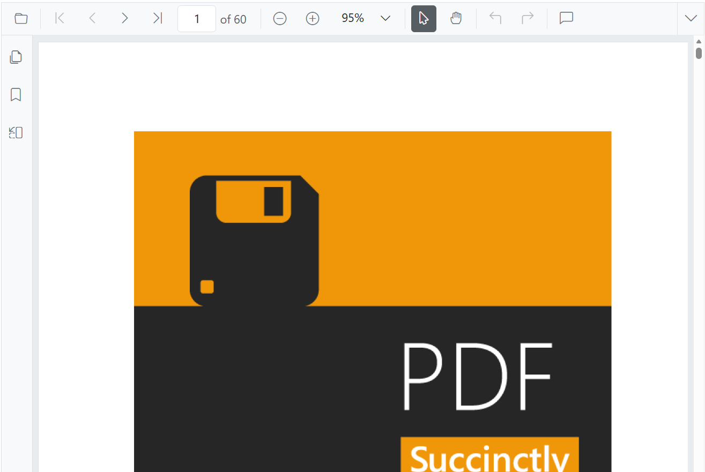

# Getting Started with ASP.NET MVC Standalone PDF Viewer Control

This guide explains how to integrate the [ASP.NET MVC PDF Viewer](https://www.syncfusion.com/pdf-viewer-sdk) into an ASP.NET MVC application using Visual Studio. A fully functional example project is available in the [GitHub repository](https://github.com/SyncfusionExamples/ASP-NET-MVC-Getting-Started-Examples/tree/main/PDFViewer/ASP.NET%20MVC%20Razor%20Examples).

## Prerequisites

- [System requirements for ASP.NET MVC controls](https://help.syncfusion.com/document-processing/system-requirements)

- [Licensing](https://help.syncfusion.com/common/essential-studio/licensing/license-key)

## Create a new ASP.NET MVC App in Visual Studio

- [Create a Project using Microsoft Templates](https://learn.microsoft.com/en-us/aspnet/mvc/overview/getting-started/introduction/getting-started)

## ASP.NET MVC PDF Viewer NuGet packages installation

To add .NET PDF Viewer control, the following NuGet packages need to be installed in your ASP.NET MVC application.

* [Syncfusion.EJ2.MVC5](https://www.nuget.org/packages/Syncfusion.EJ2.MVC5)

## Add namespace

Add **Syncfusion.EJ2** namespace reference in `Web.config` under `Views` folder.

```
<namespaces>
    <add namespace="Syncfusion.EJ2"/>
</namespaces>
```

## Add style sheet

The theme is referenced by using a CDN inside the `<head>` of `~/Views/Shared/_Layout.cshtml` as follows:




<head>
    ...
    <!-- Syncfusion ASP.NET MVC controls styles -->
    <link rel="stylesheet" href="https://cdn.syncfusion.com/ej2/{{ site.ej2version }}/fluent.css" />
</head>




N> Check out the [Themes topic](https://ej2.syncfusion.com/aspnetmvc/documentation/appearance/theme) to learn different ways (CDN, NPM package, and [CRG](https://ej2.syncfusion.com/aspnetmvc/documentation/common/custom-resource-generator)) to reference styles in an ASP.NET MVC application and ensure the expected appearance for Syncfusion<sup style="font-size:70%">&reg;</sup> ASP.NET MVC controls.

## Add script reference

Add the required scripts from the CDN inside the `<head>` of `~/Views/Shared/_Layout.cshtml` as follows:




<head>
    ...
    <!-- Syncfusion ASP.NET MVC controls scripts -->
    <script src="https://cdn.syncfusion.com/ej2/{{ site.ej2version }}/dist/ej2.min.js"></script>
</head>




To configure PDF Viewer with locally available script and style resources, follow these [instructions](./how-to/local-resources#configuring-pdf-viewer-with-local-styles-and-scripts).

## Register Syncfusion<sup style="font-size:70%">&reg;</sup> Script Manager

Open `~/Views/Shared/_Layout.cshtml` page and register the script manager in the ASP.NET MVC application as follows.




<body>
...
    <!-- Syncfusion ASP.NET MVC Script Manager -->
    @Html.EJS().ScriptManager()
</body>




N> Add the script manager `EJS().ScriptManager()` at the **end of `<body>`**.

## Add ASP.NET MVC PDF Viewer control

Add the Syncfusion<sup style="font-size:70%">&reg;</sup> ASP.NET MVC PDF Viewer control in `~/Views/Home/Index.cshtml`. Load a PDF by setting the `DocumentPath` property to a file name or URL, as shown below.




@{
    ViewBag.Title = "Home Page";
}

<div>
    <div style="height:500px;width:100%;">
        <!-- DocumentPath specifies the PDF document to load -->
        @Html.EJS().PdfViewer("pdfviewer").DocumentPath("https://cdn.syncfusion.com/content/pdf/pdf-succinctly.pdf").Render()
    </div>
</div>




To configure [`ResourceUrl`](https://help.syncfusion.com/cr/aspnetmvc-js2/syncfusion.ej2.pdfviewer.pdfviewer.html#Syncfusion_EJ2_PdfViewer_PdfViewer_ResourceUrl) and [`DocumentPath`](https://help.syncfusion.com/cr/aspnetmvc-js2/syncfusion.ej2.pdfviewer.pdfviewer.html#Syncfusion_EJ2_PdfViewer_PdfViewer_DocumentPath) with locally available resources, follow these [instructions](./how-to/local-resources#configuring-pdf-viewer-for-locally-available-pdf-documents-and-local-resources).

## Run the application

Press <kbd>Ctrl</kbd>+<kbd>F5</kbd> (Windows) or <kbd>⌘</kbd>+<kbd>F5</kbd> (macOS) to run the app. The Syncfusion<sup style="font-size:70%">&reg;</sup> ASP.NET MVC PDF Viewer will render in the default web browser.



## See also

- [Getting started with Server-Backed ASP.NET MVC PDF Viewer](./getting-started-with-server-backed)
- [PDF Viewer Form Designer](./forms/overview#form-designer)
- [Organize PDF pages](./organize-pages/overview)