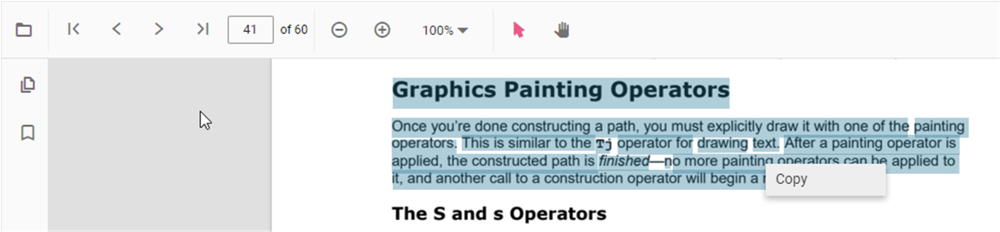

# Interaction mode in PDF Viewer

The PDF Viewer provides two interaction modes to work with the loaded PDF document: selection mode and panning mode.

## Selection mode

In this mode, users can select and copy text in the loaded PDF document. Panning and touch-based scrolling are disabled. This is useful for copying and sharing text content. Enable or disable text selection as shown in the following example.



```html
<div style="width:100%;height:600px">
    @Html.EJS().PdfViewer("pdfviewer").EnableTextSelection(true).DocumentPath("https://cdn.syncfusion.com/content/pdf/hive-succinctly.pdf").Render()
</div>
```


```html
<div style="width:100%;height:600px">
    @Html.EJS().PdfViewer("pdfviewer").ServiceUrl(VirtualPathUtility.ToAbsolute("~/api/PdfViewer/")).EnableTextSelection(true).DocumentPath("https://cdn.syncfusion.com/content/pdf/hive-succinctly.pdf").Render()
</div>
```





## Panning mode

In this mode, panning and touch-based scrolling are enabled, while text selection is disabled.


Switch the interaction mode of the PDF Viewer using the following example:




```html
<div style="width:100%;height:600px">
    @Html.EJS().PdfViewer("pdfviewer").InteractionMode(Syncfusion.EJ2.PdfViewer.InteractionMode.Pan).DocumentPath("https://cdn.syncfusion.com/content/pdf/hive-succinctly.pdf").Render()
</div>
```



```html
<div style="width:100%;height:600px">
    @Html.EJS().PdfViewer("pdfviewer").ServiceUrl(VirtualPathUtility.ToAbsolute("~/api/PdfViewer/")).InteractionMode(Syncfusion.EJ2.PdfViewer.InteractionMode.Pan).DocumentPath("https://cdn.syncfusion.com/content/pdf/hive-succinctly.pdf").Render()
</div>
```



## See also

* [Toolbar items](./toolbar)
* [Feature Modules](./feature-module)