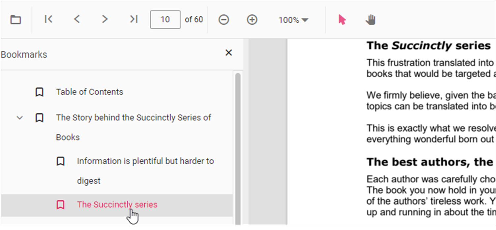

# Bookmark Navigation in ASP.NET MVC PDF Viewer

The Bookmarks saved in PDF files are loaded and made ready for easy navigation.
You can enable/disable bookmark navigation by using the following code snippet:



```html
<div style="width:100%;height:600px">
    @Html.EJS().PdfViewer("pdfviewer").EnableBookmark(true).DocumentPath("https://cdn.syncfusion.com/content/pdf/hive-succinctly.pdf").Render()
</div>
```


```html
<div style="width:100%;height:600px">
    @Html.EJS().PdfViewer("pdfviewer").ServiceUrl(VirtualPathUtility.ToAbsolute("~/api/PdfViewer/")).EnableBookmark(true).DocumentPath("https://cdn.syncfusion.com/content/pdf/hive-succinctly.pdf").Render()
</div>
```





To perform bookmark navigation, you can use the **goToBookmark** method. It's important to note that the **goToBookmark** method will throw an error if the specified bookmark does not exist in the PDF document.

Here is an example of how to use the **goToBookmark** method:




<button id="gotobookmark" onclick="gotobookmark()">Specific Page</button>

<div style="width:100%;height:600px">
    @Html.EJS().PdfViewer("pdfviewer").DocumentPath("https://cdn.syncfusion.com/content/pdf/hive-succinctly.pdf").Render()
</div>

<script>
    function gotobookmark() {
        var pdfViewer = document.getElementById('pdfviewer').ej2_instances[0];
        pdfViewer.bookmark.goToBookmark(3, 2);
    }
</script>




<button id="gotobookmark" onclick="gotobookmark()">Specific Page</button>

<div style="width:100%;height:600px">
    @Html.EJS().PdfViewer("pdfviewer").ServiceUrl(VirtualPathUtility.ToAbsolute("~/api/PdfViewer/")).DocumentPath("https://cdn.syncfusion.com/content/pdf/hive-succinctly.pdf").Render()
</div>

<script>
    function gotobookmark() {
        var pdfViewer = document.getElementById('pdfviewer').ej2_instances[0];
        pdfViewer.bookmark.goToBookmark(3, 2);
    }
</script>




x - Specifies the page index to navigate to.

y - Specifies the Y coordinate value of the page.

Also, you can use the **getBookmarks** method to retrieve a list of all the bookmarks in a PDF document. This method returns a List of Bookmark objects, which contain information about each bookmark.

Here is an example of how to use the getBookmarks method:




<button id="getBookmarks" onclick="getBookmarks()">Retrieve Bookmark</button>

<div style="width:100%;height:600px">
    @Html.EJS().PdfViewer("pdfviewer").DocumentPath("https://cdn.syncfusion.com/content/pdf/hive-succinctly.pdf").Render()
</div>

<script>
    function getBookmarks() {
        var pdfViewer = document.getElementById('pdfviewer').ej2_instances[0];
        var getBookmarks = pdfViewer.bookmark.getBookmarks();
        console.log(getBookmarks);
    }
</script>




<button id="getBookmarks" onclick="getBookmarks()">Retrieve Bookmark</button>

<div style="width:100%;height:600px">
    @Html.EJS().PdfViewer("pdfviewer").ServiceUrl(VirtualPathUtility.ToAbsolute("~/api/PdfViewer/")).DocumentPath("https://cdn.syncfusion.com/content/pdf/hive-succinctly.pdf").Render()
</div>

<script>
    function getBookmarks() {
        var pdfViewer = document.getElementById('pdfviewer').ej2_instances[0];
        var getBookmarks = pdfViewer.bookmark.getBookmarks();
        console.log(getBookmarks);
    }
</script>




## See also

* [Toolbar items](../toolbar-customization)
* [Feature Modules](../feature-module)