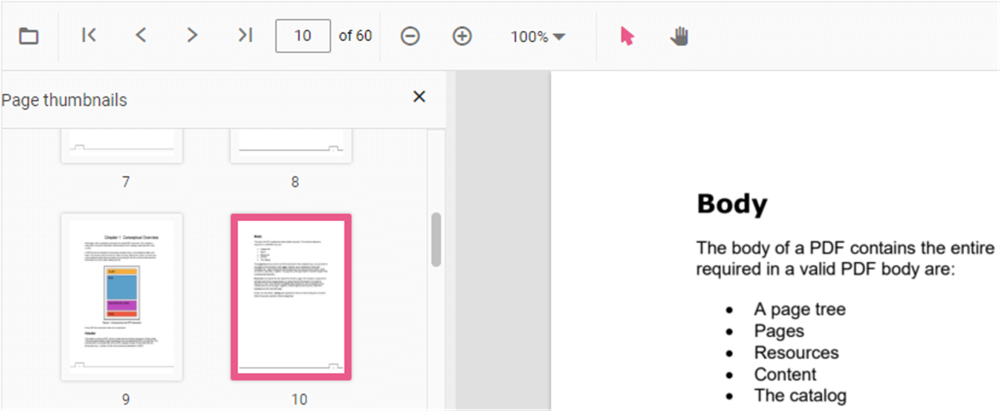

# Page Thumbnail navigation

Thumbnails is the miniature representation of actual pages in PDF files. This feature displays thumbnails of the pages and allows navigation.
You can enable/disable thumbnail navigation by using the following code snippet.,



```html
<div style="width:100%;height:600px">
    @Html.EJS().PdfViewer("pdfviewer").EnableThumbnail(true).DocumentPath("https://cdn.syncfusion.com/content/pdf/hive-succinctly.pdf").Render()
</div>
```


```html
<div style="width:100%;height:600px">
    @Html.EJS().PdfViewer("pdfviewer").ServiceUrl(VirtualPathUtility.ToAbsolute("~/api/PdfViewer/")).EnableThumbnail(true).DocumentPath("https://cdn.syncfusion.com/content/pdf/hive-succinctly.pdf").Render()
</div>
```





## See also

* [Toolbar items](../toolbar-customization)
* [Feature Modules](../feature-module)