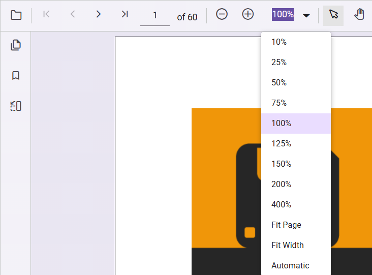

# Magnification in ASP.NET MVC PDF Viewer

Magnification enables users to control how PDF content is displayed in the viewport. The PDF Viewer provides two primary approaches to magnification: **zoom** for precise scaling control and **fit modes** for viewport-optimized display.



## Overview

The magnification feature allows you to enhance the reading experience by scaling PDF pages to fit different viewing preferences. Whether you need precise zoom levels for detailed inspection or automatic fit modes for optimal viewport usage, the PDF Viewer provides comprehensive magnification capabilities.

### Key Features

- **Flexible Zoom Control** — Zoom in and out with manual or programmatic control
- **Fit Modes** — Automatically scale pages to fit the entire viewport or width
- **Default Zoom Modes** — Set initial zoom behavior on document load
- **Responsive Scaling** — Adapt to container and window resize events
- **Zoom Range** — Supported zoom range from 10% to 400%
- **Toolbar Integration** — Built-in toolbar controls for common magnification actions

## Magnification Controls

The following magnification controls are available in the default toolbar:

- **Zoom In** — Increase the zoom level of the PDF pages incrementally.
- **Zoom Out** — Decrease the zoom level of the PDF pages incrementally.
- **Zoom To** — Set a specific zoom percentage for the PDF pages.
- **Fit to Page** — Scale the entire page to fit within the available viewport.
- **Fit to Width** — Scale the page width to match the viewport width.

## Enable Magnification

To enable magnification features in the PDF Viewer, set the `EnableMagnification` property to `true`.



```html
<div style="width:100%;height:600px">
    @Html.EJS().PdfViewer("pdfviewer")
        .EnableMagnification(true)
        .DocumentPath("https://cdn.syncfusion.com/content/pdf/pdf-succinctly.pdf")
        .Render()
</div>
```


```html
<div style="width:100%;height:600px">
    @Html.EJS().PdfViewer("pdfviewer")
        .ServiceUrl(VirtualPathUtility.ToAbsolute("~/api/PdfViewer/"))
        .EnableMagnification(true)
        .DocumentPath("https://cdn.syncfusion.com/content/pdf/pdf-succinctly.pdf")
        .Render()
</div>
```



## Magnification Types

### Zoom

The zoom feature provides precise control over the display scale. Users can:
- Zoom in to view details more clearly
- Zoom out to see more of the page at once
- Set specific zoom percentages programmatically
- Initialize with a default zoom level

Learn more: [Zoom How-to Guide](./magnification/zoom)

### Fit Modes

Fit modes automatically scale pages to optimize the viewing experience. Users can:
- Fit entire pages to the viewport
- Fit page width to the viewport for horizontal scrolling
- Set initial fit mode on document load
- Toggle between different fit modes dynamically

Learn more: [Fit Modes How-to Guide](./magnification/fitmode)

## Zoom Range and Limits

The PDF Viewer supports zoom values from **10% to 400%** by default. All zoom operations are automatically clamped to this range:
- Values below 10% are adjusted to 10%
- Values above 400% are adjusted to 400%
- Both UI and programmatic zoom changes respect these limits

You can override the defaults using the `MinZoom` and `MaxZoom` properties (defaults: `minZoom = 10`, `maxZoom = 400`).

Learn more: [Zoom Range and Limits Guide](./magnification/zoom#zoom-range-and-limits)

## Common Use Cases

| Use Case | Solution |
|----------|----------|
| Set initial document zoom on load | Use the `ZoomMode` property with "FitToWidth" or "FitToPage" |
| Allow users to zoom with buttons | Implement custom buttons with `zoomIn()`, `zoomOut()`, `zoomTo()` methods |
| Maintain zoom during page navigation | Zoom state is automatically preserved when navigating between pages |
| Respond to zoom level changes | Listen to the `ZoomChanged` event and update custom UI |
| Fit page to container resize | Implement resize handler to reapply fit mode |

## See also

* [Toolbar items](./toolbar)
* [Feature Modules](./feature-module)
* [Zoom How-to Guide](./magnification/zoom)
* [Fit Modes How-to Guide](./magnification/fitmode)