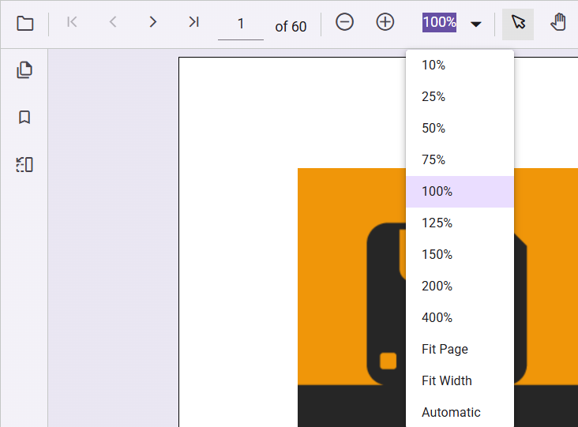

# Magnification

The PDF Viewer includes magnification tools on the default toolbar: Zoom In, Zoom Out, Zoom, Fit Page, and Fit Width. The toolbar can also be configured to show or hide magnification tools as needed.

The following example shows how to enable magnification in the PDF Viewer.



```html
    <div style="width:100%;height:600px">
        @Html.EJS().PdfViewer("pdfviewer").EnableMagnification(true).DocumentPath("https://cdn.syncfusion.com/content/pdf/hive-succinctly.pdf").Render()
    </div>
```


```html
    <div style="width:100%;height:600px">
        @Html.EJS().PdfViewer("pdfviewer").ServiceUrl(VirtualPathUtility.ToAbsolute("~/api/PdfViewer/")).EnableMagnification(true).DocumentPath("https://cdn.syncfusion.com/content/pdf/hive-succinctly.pdf").Render()
    </div>
```



The following magnification options are available in the default toolbar of the PDF Viewer:

* **ZoomIn**:- Zoom in from the current zoom value.
* **ZoomOut**:- Zoom out from the current zoom value.
* **Zoom**:- Zoom to a specific percentage.
* **FitPage**:- Fit the entire page within the available viewport.
* **FitWidth**:- Fit the page width to the viewport.
* **Auto**:- Fits the page content with-in the viewport on resizing action.



N> The PDF Viewer supports zoom values from 10% to 400%.

## See also

* [Toolbar items](./toolbar)
* [Feature Modules](./feature-module)