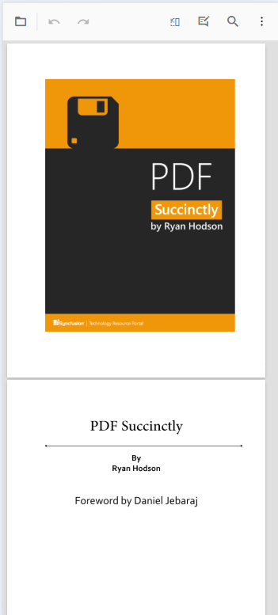
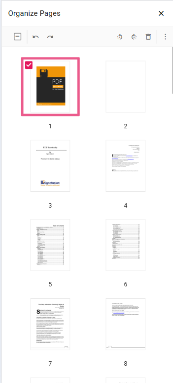
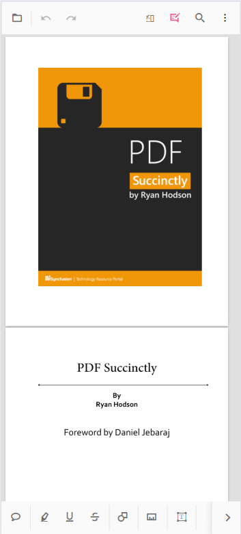
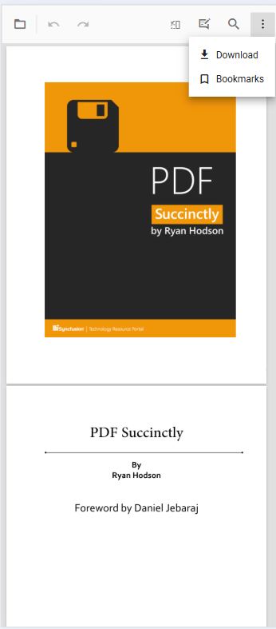

# Mobile toolbar interface in ASP.NET MVC PDF Viewer

The Mobile PDF Viewer offers a variety of features for viewing, searching, annotating, and managing PDF documents on mobile devices. It includes essential tools like search, download, bookmarking, annotation, and page organization. Users also have the option to enable desktop toolbar features in mobile mode, providing a more extensive set of actions.

## Mobile mode toolbar configuration
In mobile mode, the toolbar is optimized for small screens and presents the most common actions for working with a PDF document. The key features available in mobile mode include:

### Main toolbar options

**OpenOption:** Tap to load a PDF document.

**SearchOption:** Access the search bar to find text within the document.

**UndoRedoTool:** Quickly undo or redo any annotations made.

**OrganizePagesTool:** Enable or disable page organization features to modify document pages.

**AnnotationEditTool:** Activate or deactivate annotation editing to add or modify annotations.

N> In mobile mode, the annotation toolbar is conveniently displayed at the bottom of the viewer.

### More options menu

The More options menu provides additional actions such as:

**DownloadOption:** Tap to download the currently opened PDF document.

**BookmarkOption:** Allows you to view bookmarks within the document.

## Enable desktop mode on mobile

Enable the desktop toolbar on mobile devices using the `enableDesktopMode` API. This brings desktop-like features to the mobile PDF Viewer, providing access to additional toolbar actions typically available on desktop platforms.

### Steps to enable desktop mode

- Set `enableDesktopMode` to true in the configuration.
- The desktop toolbar layout replaces the mobile toolbar, allowing access to more actions and controls.




    

        @Html.EJS().PdfViewer("pdfviewer").EnableDesktopMode(true).DocumentPath("https://cdn.syncfusion.com/content/pdf/pdf-succinctly.pdf").Render()
    




    

        @Html.EJS().PdfViewer("pdfviewer").ServiceUrl(VirtualPathUtility.ToAbsolute("~/PdfViewer/")).EnableDesktopMode(true).DocumentPath("https://cdn.syncfusion.com/content/pdf/pdf-succinctly.pdf").Render()
    




## Enable scrolling in desktop mode with touch gestures

To ensure smooth scrolling of PDF documents on a mobile device in desktop mode, enable touch-gesture scrolling by setting `enableTextSelection` to **false**.




    

        @Html.EJS().PdfViewer("pdfviewer").EnableDesktopMode(true).EnableTextSelection(false).DocumentPath("https://cdn.syncfusion.com/content/pdf/pdf-succinctly.pdf").Render()
    




    

        @Html.EJS().PdfViewer("pdfviewer").ServiceUrl(VirtualPathUtility.ToAbsolute("~/PdfViewer/")).EnableDesktopMode(true).EnableTextSelection(false).DocumentPath("https://cdn.syncfusion.com/content/pdf/pdf-succinctly.pdf").Render()
    




## Print option availability

The Print option is not available in mobile mode by default. To use print on mobile devices, enable the desktop toolbar using the `enableDesktopMode` API.

### How to use print on mobile

- Enable desktop mode: Set `enableDesktopMode` to true to load the desktop toolbar on a mobile device.
- **Print option**: Once desktop mode is enabled, the print option becomes available to print the document.

N> In mobile mode, print is unavailable unless desktop mode is enabled.
