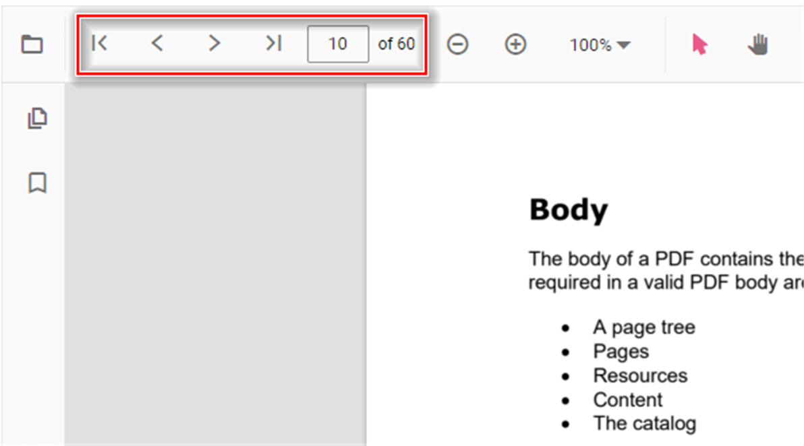
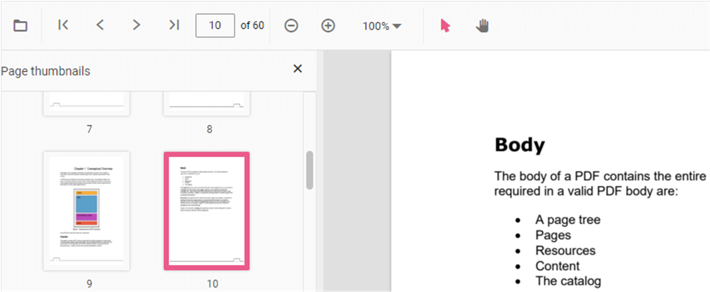
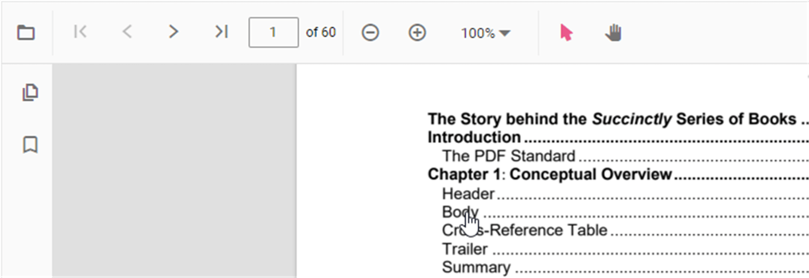

# Navigation

The ASP.NET MVC PDF Viewer supports internal and external navigation options.

## Toolbar page navigation options

The default PDF Viewer toolbar contains the following navigation options:

* **Go to page** – Navigate to a specific page in the PDF document.
* **Show next page** – Navigate to the next page.
* **Show previous page** – Navigate to the previous page.
* **Show first page** – Navigate to the first page.
* **Show last page** – Navigate to the last page.

Enable or disable page navigation using the following example:



```html
<div style="width:100%;height:600px">
    @Html.EJS().PdfViewer("pdfviewer").EnableNavigation(true).DocumentPath("https://cdn.syncfusion.com/content/pdf/hive-succinctly.pdf").Render()
</div>
```


```html
<div style="width:100%;height:600px">
    @Html.EJS().PdfViewer("pdfviewer").ServiceUrl(VirtualPathUtility.ToAbsolute("~/api/PdfViewer/")).EnableNavigation(true).DocumentPath("https://cdn.syncfusion.com/content/pdf/hive-succinctly.pdf").Render()
</div>
```






## Bookmark navigation

Bookmarks saved in PDF files are loaded and made available for easy navigation.
Enable or disable bookmark navigation using the following example:



```html
<div style="width:100%;height:600px">
    @Html.EJS().PdfViewer("pdfviewer").EnableBookmark(true).DocumentPath("https://cdn.syncfusion.com/content/pdf/hive-succinctly.pdf").Render()
</div>
```


```html
<div style="width:100%;height:600px">
    @Html.EJS().PdfViewer("pdfviewer").ServiceUrl(VirtualPathUtility.ToAbsolute("~/api/PdfViewer/")).EnableBookmark(true).DocumentPath("https://cdn.syncfusion.com/content/pdf/hive-succinctly.pdf").Render()
</div>
```




## Thumbnail navigation

Thumbnails are miniature representations of pages in a PDF file. This feature displays thumbnails of pages and allows quick navigation.
Enable or disable thumbnail navigation using the following example:



```html
<div style="width:100%;height:600px">
    @Html.EJS().PdfViewer("pdfviewer").EnableThumbnail(true).DocumentPath("https://cdn.syncfusion.com/content/pdf/hive-succinctly.pdf").Render()
</div>
```


```html
<div style="width:100%;height:600px">
    @Html.EJS().PdfViewer("pdfviewer").ServiceUrl(VirtualPathUtility.ToAbsolute("~/api/PdfViewer/")).EnableThumbnail(true).DocumentPath("https://cdn.syncfusion.com/content/pdf/hive-succinctly.pdf").Render()
</div>
```





## Hyperlink navigation

Hyperlink navigation enables navigation to URLs (website links) within a PDF file.


## Table of contents navigation

Table of contents navigation allows users to navigate to different parts of a PDF that are listed in the document’s table of contents.

Enable or disable hyperlink navigation using the following example:



```html
<div style="width:100%;height:600px">
    @Html.EJS().PdfViewer("pdfviewer").EnableHyperlink(true).DocumentPath("https://cdn.syncfusion.com/content/pdf/hive-succinctly.pdf").Render()
</div>
```


```html
<div style="width:100%;height:600px">
    @Html.EJS().PdfViewer("pdfviewer").ServiceUrl(VirtualPathUtility.ToAbsolute("~/api/PdfViewer/")).EnableHyperlink(true).DocumentPath("https://cdn.syncfusion.com/content/pdf/hive-succinctly.pdf").Render()
</div>
```



Change the hyperlink open state using the following example:



```html
<div style="width:100%;height:600px">
    @Html.EJS().PdfViewer("pdfviewer").HyperlinkOpenState(Syncfusion.EJ2.PdfViewer.LinkTarget.NewTab).DocumentPath("https://cdn.syncfusion.com/content/pdf/hive-succinctly.pdf").Render()
</div>
```


```html
<div style="width:100%;height:600px">
    @Html.EJS().PdfViewer("pdfviewer").ServiceUrl(VirtualPathUtility.ToAbsolute("~/api/PdfViewer/")).HyperlinkOpenState(Syncfusion.EJ2.PdfViewer.LinkTarget.NewTab).DocumentPath("https://cdn.syncfusion.com/content/pdf/hive-succinctly.pdf").Render()
</div>
```





## See also

* [Toolbar items](./toolbar)
* [Feature Modules](./feature-module)