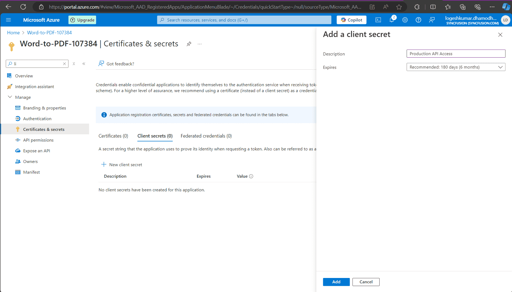
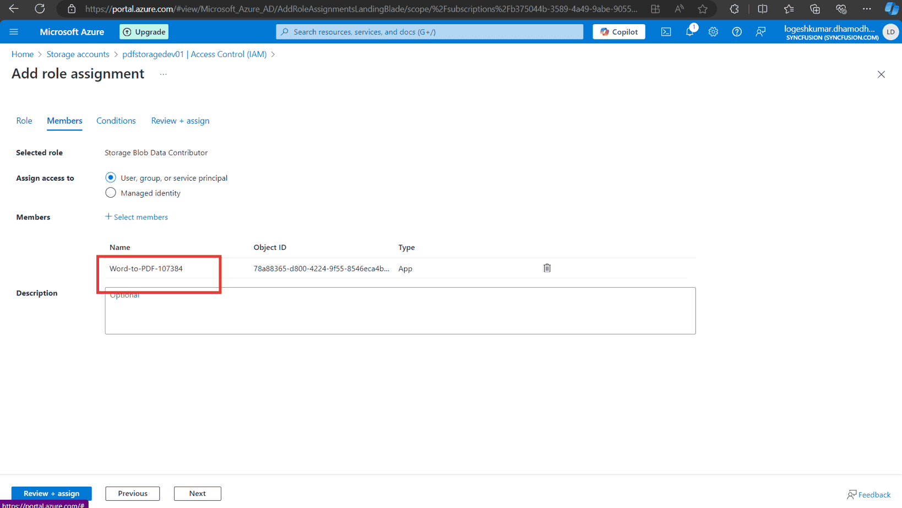

# Open PDF From Azure Active Directory in Viewer

### **Overview**

The Syncfusion PDF Viewer allows you to load and save PDF files directly from Azure Active Directory (AAD). Below are the steps to securely load and store PDF documents from and to AAD using the PDF Viewer.

### **Steps to Open the PDF File from Azure Active Directory**

---

### **Step 1: Register an Application in Azure Active Directory (AAD)**

1. **Go to the Azure Portal**:
   - Navigate to [Azure Portal](https://portal.azure.com).

2. **Register your Application**:
   - In the Azure portal, go to **Azure Active Directory** > **App registrations** > **New registration**.
   - Register your application and note down the **Application (client) ID** and **Directory (tenant) ID**.

   

3. **Create a Client Secret**:
   - In the registered application, go to **Certificates & secrets**.
   - Click **New client secret**.
   - Provide a description and set an expiration period.
   - Click **Add**.
   - Copy the client secret value immediately, as it will be hidden later. Store it securely.

   

---

### **Step 2: Create the Azure Storage Account**

1. **Create a Storage Account**:
   - In the Azure portal, use the search bar to search for **Storage accounts**.
   - Create a new storage account by filling in the required details (e.g., name, location, resource group, etc.).

    

---

### **Step 3: Assign Role to the Application**

1. **Go to your Storage Account**:
   - Navigate to **Access control (IAM)** > **Add role assignment** in your Azure Storage Account.

2. **Assign Role**:
   - Assign the **Storage Blob Data Contributor** role to your registered application.
   - In the **Assign access to** dropdown, select **User, group, or service principal**.
   - Click on **Select members** and search for your registered application by name or client ID.
   - Select your application and click **Select**.
   - Click **Review + assign** to finalize the role assignment.

    
---

### **Step 4: Upload the PDF Document to the Azure Storage Account**

1. **Navigate to Data Storage**:
   - In the Azure portal, go to **Data storage** > **Containers**.

2. **Upload the PDF File**:
   - Create a new container and upload the PDF document you want to access in the PDF Viewer.

    
---

### **Step 5: ASP.NET MVC PDF Viewer Control Configuration**
1. Follow the steps provided in the [link](https://ej2.syncfusion.com/aspnetmvc/documentation/pdfviewer/getting-started-with-server-backed) to create a simple PDF Viewer sample.

2. Add the following code snippet in `HomeController.cs`.




using Azure.Identity;
using Azure.Storage.Blobs;

string tenantId = "YOUR_TENANT_ID";
string clientId = "YOUR_CLIENT_ID";
string clientSecret = "YOUR_CLIENT_SECRET";
string blobServiceEndpoint = "https://your-storage-account.blob.core.windows.net";
string containerName = "your-container-name";

public async Task<ActionResult> LoadFromAAD(string fileName)
{
    var clientSecretCredential = new ClientSecretCredential(tenantId, clientId, clientSecret);
    var blobServiceClient = new BlobServiceClient(new Uri(blobServiceEndpoint), clientSecretCredential);
    var containerClient = blobServiceClient.GetBlobContainerClient(containerName);
    var blobClient = containerClient.GetBlobClient(fileName);

    // Download the PDF file to a local stream
    MemoryStream pdfStream = new MemoryStream();
    await blobClient.DownloadToAsync(pdfStream);
    var base64 = Convert.ToBase64String(pdfStream.ToArray());
    return Content("data:application/pdf;base64," + base64);
}

public async Task<ActionResult> SaveToAAD(jsonObjects responseData)
{
    var jsonObject = JsonConverterstring(responseData);
    PdfRenderer pdfviewer = new PdfRenderer();
    var fileName = jsonObject.ContainsKey("documentId") ? jsonObject["documentId"] : "Test.pdf";
    string documentBase = pdfviewer.GetDocumentAsBase64(jsonObject);
    string convertedBase = documentBase.Substring(documentBase.LastIndexOf(',') + 1);
    // Decode the Base64 string to a byte array
    byte[] byteArray = Convert.FromBase64String(convertedBase);
    // Create a MemoryStream from the byte array
    MemoryStream stream = new MemoryStream(byteArray);
    // Create a new BlobServiceClient using the DefaultAzureCredential
    var clientSecretCredential = new ClientSecretCredential(tenantId, clientId, clientSecret);
    var blobServiceClient = new BlobServiceClient(new Uri(blobServiceEndpoint), clientSecretCredential);
    // Get a reference to the container
    var containerClient = blobServiceClient.GetBlobContainerClient(containerName);
    // Get a reference to the blob
    var blobClient = containerClient.GetBlobClient(fileName);
    //FileStream uploadFileStream = new FileStream();
    await blobClient.UploadAsync(stream, true);
    stream.Close();
    return Content(string.Empty);
}




3. Configure Server-Side Code:
   - Open the server-side application (e.g., ASP.NET Core) and configure the following details in the `PdfViewerController` file:
     - `tenantId` (your Azure AD tenant ID),
     - `clientId` (your registered application client ID),
     - `clientSecret` (your registered application client secret),
     - `blobServiceEndpoint` (your storage account blob service URL),
     - `containerName` (your container name in Azure Blob Storage).

4. Add the following code snippet in `Index.cshtml`.




@{
    ViewBag.Title = "Home Page";
}

    <!-- Custom buttons for Load and Save -->
    

        <button id="loadFromAADButton" class="e-btn" style="margin-right: 10px;">Load From AAD</button>
        <button id="saveToAADButton" class="e-btn">Save To AAD</button>
    

    

        @Html.EJS().PdfViewer("pdfviewer").ServiceUrl(VirtualPathUtility.ToAbsolute("~/Home/")).DocumentPath("https://cdn.syncfusion.com/content/pdf/pdf-succinctly.pdf").Render()
    




5. Run the Application
    - Build and run your MVC application. The PDF Viewer will be displayed with Load from AAD and Save to AAD buttons.

6. Load PDF from AAD
    - Click the Load from AAD button.
    - The server fetches the PDF from Azure Blob Storage and loads it into the Syncfusion PDF Viewer.

7. Save PDF to AAD
    - Click the Save to AAD button.
    - The server uploads the modified PDF back to Azure Blob Storage.

[View sample in GitHub](https://github.com/SyncfusionExamples/open-save-pdf-documents-in-aad).