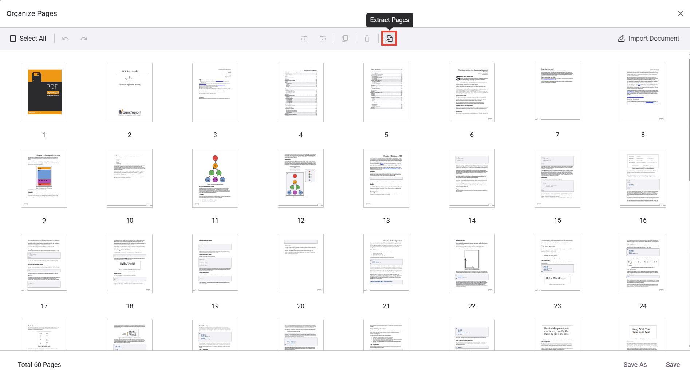
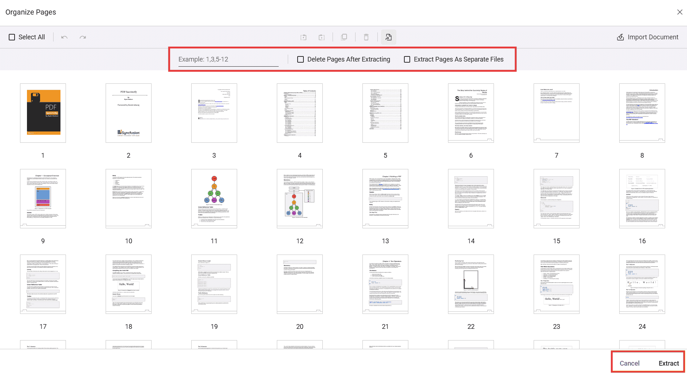
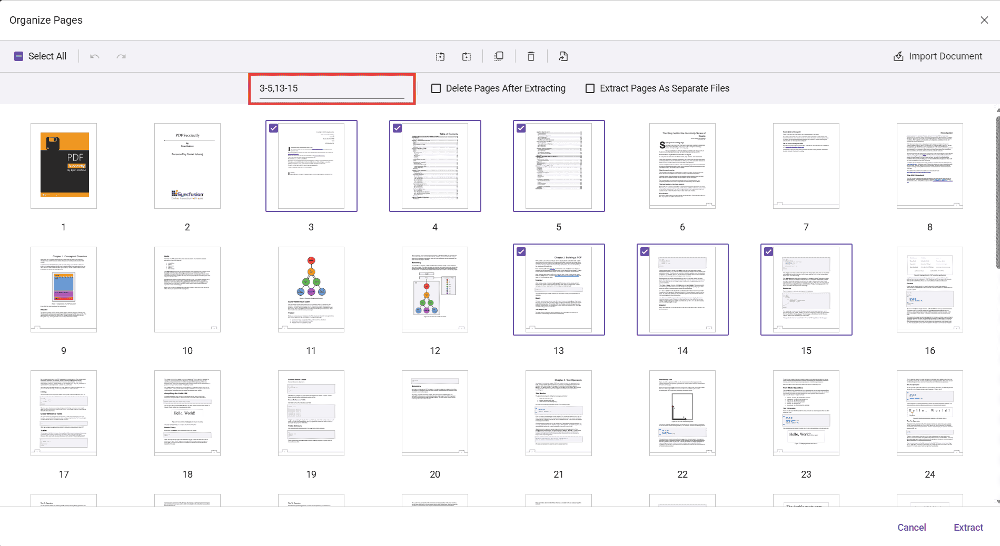
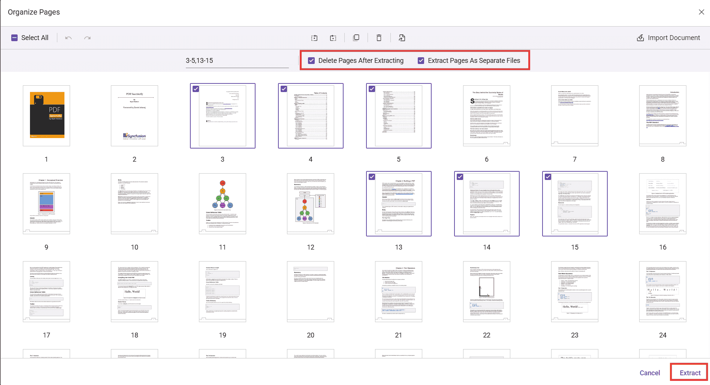

# Extract Pages in ASP.NET MVC PDF Viewer

The PDF Viewer component provides an Extract Pages tool in the Organize Pages UI to export selected pages as a new PDF file. The Extract Pages tool is enabled by default.

## Extract Pages in Organize Pages

- Open the Organize Pages panel in the PDF Viewer toolbar.
- Locate and click the Extract Pages option.

When selected, a secondary toolbar dedicated to extraction is displayed.

## Extract pages using the UI

Extract pages by typing page numbers/ranges or by selecting thumbnails.

1. Click Extract Pages in the Organize Pages panel.
2. In the input box, enter pages to extract. Supported formats:
  - Single pages: 1,3,5
  - Ranges: 2-6
  - Combinations: 1,4,7-9
3. Alternatively, select the page thumbnails to extract instead of typing values.
4. Click Extract to download the selected pages as a new PDF; click Cancel to close the tool.

Note: Page numbers are 1-based (the first page is 1). Invalid or out-of-range entries are ignored; only valid pages are processed. Consider validating input before extraction to ensure expected results.

## Extraction options (checkboxes)

The secondary toolbar provides two options:

- **Delete Pages After Extracting** — When enabled, the selected pages are removed from the currently loaded document after extraction; the extracted pages are still downloaded as a separate PDF.

- **Extract Pages As Separate Files** — When enabled, each selected page is exported as an individual PDF (for example, selecting pages 3, 5, and 6 downloads 3.pdf, 5.pdf, and 6.pdf).

## Programmatic options and APIs

You can control the Extract Pages experience via settings and invoke extraction through code.

### Enable/disable Extract Pages

Use the `CanExtractPages` API to enable or disable the Extract Pages option. When set to `false`, the Extract Pages tool is disabled in the toolbar. The default value is `true`.

Use the following code snippet to enable the Extract Pages option:




@{
    ViewBag.Title = "PDF Viewer";
}

    @Html.EJS().PdfViewer("pdfviewer")
        .DocumentPath("https://cdn.syncfusion.com/content/pdf/pdf-succinctly.pdf")
        .ServiceUrl(ViewBag.ServiceUrl)
        .PageOrganizerSettings(settings => settings.CanExtractPages(true))
        .Render()




Use the `ShowExtractPagesOption` API to show or hide the Extract Pages option. When set to `false`, the Extract Pages tool is removed from the toolbar. The default value is `true`.

Use the following code snippet to remove the Extract Pages option:




@{
    ViewBag.Title = "PDF Viewer";
}

    @Html.EJS().PdfViewer("pdfviewer")
        .DocumentPath("https://cdn.syncfusion.com/content/pdf/pdf-succinctly.pdf")
        .ServiceUrl(ViewBag.ServiceUrl)
        .PageOrganizerSettings(settings => settings.ShowExtractPagesOption(false))
        .Render()




### Extract pages and load the result programmatically

You can extract pages programmatically using the `extractPages` method.
The following example extracts pages 1 and 2, then immediately loads the extracted pages back into the viewer. The returned value is a byte array representing the PDF file contents.




@{
    ViewBag.Title = "PDF Viewer";
}

    <button onclick="extractPage()">Extract Page</button>
    @Html.EJS().PdfViewer("pdfviewer")
        .DocumentPath("https://cdn.syncfusion.com/content/pdf/pdf-succinctly.pdf")
        .ServiceUrl(ViewBag.ServiceUrl)
        .PageOrganizerSettings(settings => settings.CanExtractPages(true))
        .Render()




## See also

- [Overview](../overview)
- [UI interactions](../ui-interactions)
- [Programmatic support](../programmatic-support)
- [Toolbar](../toolbar)
- [Events](../events)
- [Mobile view](../mobile-view)

## Programmatic options and APIs

You can control the Extract Pages experience via settings and invoke extraction through code.

### Enable/disable Extract Pages

Use the `canExtractPages` API to enable or disable the Extract Pages option. When set to `false`, the Extract Pages tool is disabled in the toolbar. The default value is `true`.

Use the following code snippet to enable or disable the Extract Pages option:




@Html.EJS().PdfViewer("pdfviewer").ResourceUrl("https://cdn.syncfusion.com/ej2/31.1.23/dist/ej2-pdfviewer-lib").DocumentPath("https://cdn.syncfusion.com/content/pdf/pdf-succinctly.pdf").PageOrganizerSettings(new {canExtractPages = false}).Render()




Use the `showExtractPagesOption` API to show or hide the Extract Pages option. When set to `false`, the Extract Pages tool is removed from the toolbar. The default value is `true`.

Use the following code snippet to remove the Extract Pages option:




@Html.EJS().PdfViewer("pdfviewer").ResourceUrl("https://cdn.syncfusion.com/ej2/31.1.23/dist/ej2-pdfviewer-lib").DocumentPath("https://cdn.syncfusion.com/content/pdf/pdf-succinctly.pdf").PageOrganizerSettings(new {showExtractPagesOption = false}).Render()




### Extract pages and load the result programmatically

You can extract pages programmatically using the `extractPages` method.
The following example extracts pages 1 and 2, then immediately loads the extracted pages back into the viewer. The returned value is a byte array (e.g., Uint8Array) representing the PDF file contents.



<button id="viewer" onclick="extractPage()">Extract Page</button>

@Html.EJS().PdfViewer("pdfviewer").ResourceUrl("https://cdn.syncfusion.com/ej2/31.1.23/dist/ej2-pdfviewer-lib").DocumentPath("https://cdn.syncfusion.com/content/pdf/pdf-succinctly.pdf").PageOrganizerSettings(new {CanExtractPages = true}).Render()




[View sample in GitHub](https://github.com/SyncfusionExamples/mvc-pdf-viewer-examples/tree/master/How%20to)

## See also

- [Overview](../overview)
- [UI interactions](../ui-interactions)
- [Programmatic support](../programmatic-support)
- [Toolbar](../toolbar)
- [Events](../events)
- [Mobile view](../mobile-view)
