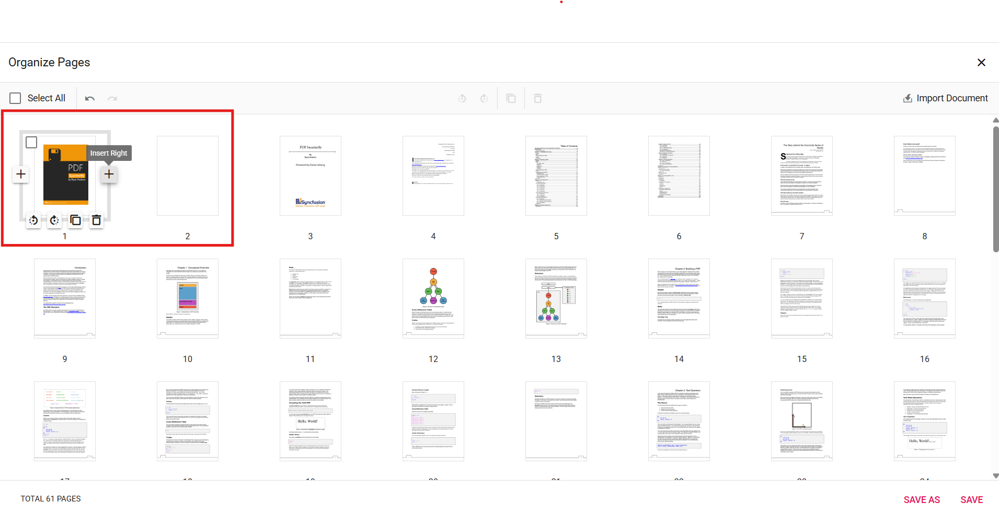

# Insert Blank Pages in ASP.NET MVC PDF Viewer

## Overview

This guide describes inserting new blank pages into a PDF using the **Organize Pages** UI in the EJ2 ASP.NET MVC PDF Viewer.

**Outcome**: A blank page is added at the chosen position and will appear in thumbnails and exports.

## Prerequisites

- EJ2 ASP.NET MVC PDF Viewer installed
- `PageOrganizer` service enabled in the PDF Viewer
- `ServiceUrl` configured for server-backed operations

## Steps

1. Open the Organize Pages view

	- Click the **Organize Pages** button in the viewer navigation toolbar to open the panel.

2. Select insertion point

	- Hover over the thumbnail before or after which you want the blank page added.

3. Insert a blank page

	- Click the **Insert Left** / **Insert Right** option and choose the position (Before / After). A new blank thumbnail appears in the sequence.

    

4. Adjust and confirm

	- Reposition or remove the inserted blank page if needed using drag-and-drop or delete options.

5. Persist the change

	- Click **Save** or **Save As** to include the blank page in the exported PDF.

## Expected result

- A blank page thumbnail appears at the chosen position and is present in any saved or downloaded PDF.

## Enable or disable Insert Pages button

To enable or disable the **Insert Pages** button in the page thumbnails, update the `PageOrganizerSettings`. See [Organize pages toolbar customization](./toolbar#enable-or-disable-the-insert-option) for the guidelines

## Troubleshooting

- **Organize Pages button missing**: Verify `PageOrganizer` is enabled and `Toolbar` is visible.
- **Inserted page not saved**: Confirm `ServiceUrl` is configured for your server-backed setup.
- **Insert options disabled**: Ensure `PageOrganizerSettings.CanInsert` is set to `true` to enable insert option.

## Related topics

- [Organize pages toolbar customization](./toolbar)
- [Organize pages event reference](./events)
- [Remove pages in Organize Pages](./remove-pages)
- [Reorder pages in Organize Pages](./reorder-pages)
