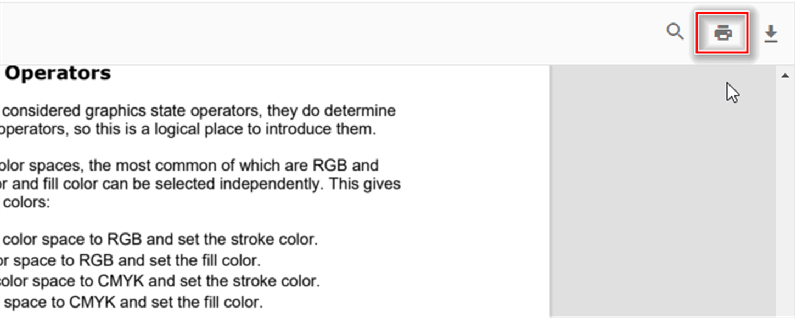

# Print

The PDF Viewer supports printing the loaded PDF file. Enable or disable printing using the following example.



```html
<div style="width:100%;height:600px">
    @Html.EJS().PdfViewer("pdfviewer").EnablePrint(true).DocumentLoad("print").DocumentPath("https://cdn.syncfusion.com/content/pdf/hive-succinctly.pdf").Render()
</div>
```


```html
<div style="width:100%;height:600px">
    @Html.EJS().PdfViewer("pdfviewer").ServiceUrl(VirtualPathUtility.ToAbsolute("~/api/PdfViewer/")).EnablePrint(true).DocumentPath("https://cdn.syncfusion.com/content/pdf/hive-succinctly.pdf").Render()
</div>
```





You can also invoke the print action programmatically using the following example:



```html
<div style="width:100%;height:600px">
    @Html.EJS().PdfViewer("pdfviewer").EnablePrint(true).DocumentLoad("print").DocumentPath("https://cdn.syncfusion.com/content/pdf/hive-succinctly.pdf").Render()
</div>

<script>
    function print() {
        var pdfViewer = document.getElementById('pdfviewer').ej2_instances[0];
        pdfViewer.print.print();
    }
</script>
```


```html
<div style="width:100%;height:600px">
    @Html.EJS().PdfViewer("pdfviewer").ServiceUrl(VirtualPathUtility.ToAbsolute("~/api/PdfViewer/")).EnablePrint(true).DocumentPath("https://cdn.syncfusion.com/content/pdf/hive-succinctly.pdf").Render()
</div>

<script>
    function print() {
        var pdfViewer = document.getElementById('pdfviewer').ej2_instances[0];
        pdfViewer.print.print();
    }
</script>
```



## Customize print quality using printScaleFactor

Adjust print quality using the [PrintScaleFactor](https://help.syncfusion.com/cr/aspnetmvc-js2/syncfusion.ej2.pdfviewer.pdfviewer.html#PrintScaleFactor) API (default: 1). The effective range is 0.5–5. Values below 0.5 and above 5 fall back to standard quality. Higher values within the range improve quality but may increase print time.

The following example demonstrates how to customize print quality using the PrintScaleFactor API:



```html

<div style="width:100%;height:600px">
    @Html.EJS().PdfViewer("pdfviewer").EnablePrint(true).DocumentLoad("print").DocumentPath("https://cdn.syncfusion.com/content/pdf/hive-succinctly.pdf").Render().PrintScaleFactor(0.5)
</div>

<script>
    function print() {
        var pdfViewer = document.getElementById('pdfviewer').ej2_instances[0];
        pdfViewer.print.print();
    }
</script>

```


```html

<div style="width:100%;height:600px">
    @Html.EJS().PdfViewer("pdfviewer").ServiceUrl(VirtualPathUtility.ToAbsolute("~/api/PdfViewer/")).EnablePrint(true).DocumentPath("https://cdn.syncfusion.com/content/pdf/hive-succinctly.pdf").Render().PrintScaleFactor(0.5)
</div>

<script>
    function print() {
        var pdfViewer = document.getElementById('pdfviewer').ej2_instances[0];
        pdfViewer.print.print();
    }
</script>

```



## Additional print options

## EnablePrintRotation in the PDF Viewer

The `EnablePrintRotation` property controls whether landscape pages are auto-rotated to best fit when printing. The default value is `true`. Set to `false` to preserve the original page orientation and suppress automatic rotation during print.



```html

<div style="width:100%;height:600px">
    @Html.EJS().PdfViewer("pdfviewer").EnablePrintRotation(true).DocumentLoad("print").DocumentPath("https://cdn.syncfusion.com/content/pdf/hive-succinctly.pdf").Render()
</div>

```


```html

<div style="width:100%;height:600px">
    @Html.EJS().PdfViewer("pdfviewer").ServiceUrl(VirtualPathUtility.ToAbsolute("~/api/PdfViewer/")).EnablePrintRotation(true).DocumentPath("https://cdn.syncfusion.com/content/pdf/hive-succinctly.pdf").Render()
</div>

```



## Print modes in the PDF Viewer

The `printMode` property allows you to specify how the document is printed.

The supported values are:
*   `Default`: Prints the document from the same window.
*   `NewWindow`: Prints the document from a new window/tab, which can be useful depending on browser popup policies.



```html

<div style="width:100%;height:600px">
    @Html.EJS().PdfViewer("pdfviewer").EnablePrintRotation(true).DocumentLoad("print").PrintMode(Syncfusion.EJ2.PdfViewer.PrintMode.Default).DocumentPath("https://cdn.syncfusion.com/content/pdf/hive-succinctly.pdf").Render()
</div>

```


```html

<div style="width:100%;height:600px">
    @Html.EJS().PdfViewer("pdfviewer").ServiceUrl(VirtualPathUtility.ToAbsolute("~/api/PdfViewer/")).EnablePrintRotation(true).PrintMode(Syncfusion.EJ2.PdfViewer.PrintMode.Default).DocumentPath("https://cdn.syncfusion.com/content/pdf/hive-succinctly.pdf").Render()
</div>

```



## Print Events

The following events are available in the PDF Viewer component.

| Name         | Description                            |
|--------------|----------------------------------------|
| `printStart` | Triggers when a print action starts.   |
| `printEnd`   | Triggers when a print action is completed. |

### printStart Event
The [`printStart`](https://help.syncfusion.com/cr/aspnetmvc-js2/syncfusion.ej2.pdfviewer.pdfviewer.html#Syncfusion_EJ2_PdfViewer_PdfViewer_PrintStart) event triggers when the print action is started.

#### Event Arguments
See `PrintStartEventArgs` for details such as `fileName` and the `cancel` option.

The following example illustrates how to handle the `printStart` event.




<div id="e-pv-e-sign-pdfViewer-div">
    @Html.EJS().PdfViewer("pdfviewer").ResourceUrl("https://cdn.syncfusion.com/ej2/31.2.2/dist/ej2-pdfviewer-lib").DocumentPath("https://cdn.syncfusion.com/content/pdf/pdf-succinctly.pdf").EnablePrint(true).PrintStart("printStarted").Render()
</div>

<script>
    function printStarted(args) {
        console.log('Print action has started for file: ' + args.fileName);
        // To cancel the print action
        // args.cancel = true;
    }
</script>




<div id="e-pv-e-sign-pdfViewer-div">
    @Html.EJS().PdfViewer("pdfviewer").ServiceUrl(VirtualPathUtility.ToAbsolute("~/api/PdfViewer/")).DocumentPath("https://cdn.syncfusion.com/content/pdf/pdf-succinctly.pdf").EnablePrint(true).PrintStart("printStarted").Render()
</div>

<script>
    function printStarted(args) {
        console.log('Print action has started for file: ' + args.fileName);
        // To cancel the print action
        // args.cancel = true;
    }
</script>




### printEnd Event
The [`printEnd`](https://help.syncfusion.com/cr/aspnetmvc-js2/syncfusion.ej2.pdfviewer.pdfviewer.html#Syncfusion_EJ2_PdfViewer_PdfViewer_PrintEnd) event triggers when a print action is completed.

#### Event Arguments
See `PrintEndEventArgs` for details such as `fileName`.

The following example illustrates how to handle the `printEnd` event.




<div id="e-pv-e-sign-pdfViewer-div">
    @Html.EJS().PdfViewer("pdfviewer").ResourceUrl("https://cdn.syncfusion.com/ej2/31.2.2/dist/ej2-pdfviewer-lib").DocumentPath("https://cdn.syncfusion.com/content/pdf/pdf-succinctly.pdf").EnablePrint(true).PrintEnd("printEnded").Render()
</div>

<script>
    function printEnded(args) {
        console.log('Printed File Name: ' + args.fileName);
    }
</script>




<div id="e-pv-e-sign-pdfViewer-div">
    @Html.EJS().PdfViewer("pdfviewer").ServiceUrl(VirtualPathUtility.ToAbsolute("~/api/PdfViewer/")).DocumentPath("https://cdn.syncfusion.com/content/pdf/pdf-succinctly.pdf").EnablePrint(true).PrintEnd("printEnded").Render()
</div>

<script>
    function printEnded(args) {
        console.log('Printed File Name: ' + args.fileName);
    }
</script>




## See also

* [Toolbar items](./toolbar)
* [Feature Modules](./feature-module)