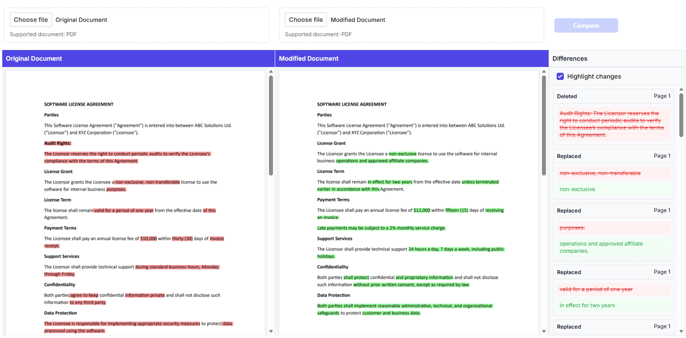

# Highlight Differences in UI

The semantic text comparison feature highlights differences between two PDF documents with customizable colors and opacity, making it easy to identify changes at a glance.

## Overview

When you compare two PDF documents using the semantic text comparison feature, differences are highlighted with:

- **Deleted text** - Highlighted in one color (default: red)
- **Added text** - Highlighted in another color (default: green)
- **Synchronized viewers** - Both documents remain aligned during comparison

## Prerequisites

- An MVC application with HTML views
- CDN ej2.min.js library loaded
- Two PDF documents ready for comparison

## Steps

### Step 1: Create the MVC view

Create an MVC view (e.g., `SemanticComparison.cshtml`) and load the Syncfusion library from CDN:




<link href="https://cdn.syncfusion.com/ej2/35.1.37/tailwind3.css" rel="stylesheet" />

    





### Step 2: Initialize the PDF Comparer with default highlighting

Create `comparer.js` with basic default highlighting:




var pdfComparer = new ej.pdfviewer.PdfComparer({
    originalDocumentPath: 'https://cdn.syncfusion.com/content/pdf/original-document.pdf',
    modifiedDocumentPath: 'https://cdn.syncfusion.com/content/pdf/modified-document.pdf',
    resourceUrl: 'https://cdn.syncfusion.com/ej2/34.1.29/dist/ej2-pdfviewer-lib'
});

pdfComparer.appendTo('#PdfComparer');




### Step 3: Configure highlight colors and options

Customize highlighting by setting comparison options:




var comparisonOptions = {
    beforeColor: '#FF0000',
    afterColor: '#00FF00',
    beforeColorOpacity: 0.4,
    afterColorOpacity: 0.4,
    enableHighlights: true
};

var pdfComparer = new ej.pdfviewer.PdfComparer({
    originalDocumentPath: 'https://cdn.syncfusion.com/content/pdf/original-document.pdf',
    modifiedDocumentPath: 'https://cdn.syncfusion.com/content/pdf/modified-document.pdf',
    resourceUrl: 'https://cdn.syncfusion.com/ej2/34.1.29/dist/ej2-pdfviewer-lib',
    comparisonOptions: comparisonOptions
});

pdfComparer.appendTo('#PdfComparer');




## Highlight customization

### Comparison options

The highlight appearance is controlled by these options in the `comparisonOptions` object:

| Option | Type | Description | Default |
|--------|------|-------------|---------|
| `beforeColor` | string | Color for deleted text (hex format) | `#FF0000` |
| `afterColor` | string | Color for added text (hex format) | `#00FF00` |
| `beforeColorOpacity` | number | Transparency for deleted (0-1) | `0.4` |
| `afterColorOpacity` | number | Transparency for added (0-1) | `0.4` |
| `enableHighlights` | boolean | Enable/disable visual highlighting | `true` |

### Viewer behavior properties

Control the viewer behavior with these properties:

| Property | Type | Description | Default |
|----------|------|-------------|---------|
| `enableDifferencePanel` | boolean | Show/hide sidebar panel displaying detected differences | `true` |
| `enableSyncScrolling` | boolean | Enable synchronized scrolling, navigation, and magnification between viewers | `true` |

### Control the difference panel

Use the `enableDifferencePanel` property to show or hide the sidebar panel that displays all detected differences:




var pdfComparer = new ej.pdfviewer.PdfComparer({
    originalDocumentPath: 'https://cdn.syncfusion.com/content/pdf/original-document.pdf',
    modifiedDocumentPath: 'https://cdn.syncfusion.com/content/pdf/modified-document.pdf',
    resourceUrl: 'https://cdn.syncfusion.com/ej2/34.1.29/dist/ej2-pdfviewer-lib',
    enableDifferencePanel: false
});

pdfComparer.appendTo('#PdfComparer');




### Control synchronized scrolling and navigation

Use the `enableSyncScrolling` property to control whether the viewers stay synchronized during scrolling, page navigation, and magnification (zoom):




var pdfComparer = new ej.pdfviewer.PdfComparer({
    originalDocumentPath: 'https://cdn.syncfusion.com/content/pdf/original-document.pdf',
    modifiedDocumentPath: 'https://cdn.syncfusion.com/content/pdf/modified-document.pdf',
    resourceUrl: 'https://cdn.syncfusion.com/ej2/34.1.29/dist/ej2-pdfviewer-lib',
    enableSyncScrolling: false
});

pdfComparer.appendTo('#PdfComparer');




## Features

- **Side-by-side viewers** - Compare original and modified documents simultaneously
- **Synchronized navigation** - Zoom, scroll, and page navigation synchronized between viewers
- **Color-coded highlighting** - Visual differentiation of added and deleted text (red for deleted, green for added)
- **Differences panel** - Consolidated list on the right showing all detected differences categorized by type
- **File upload support** - Upload custom PDFs for comparison

N> [View Sample in GitHub](https://github.com/SyncfusionExamples/mvc-pdf-viewer-examples/tree/master/Semantic%20Text%20Comparison/Highlight%20differences%20in%20UI/Highlight%20differences%20in%20UI).

## Related topics

- [Overview of semantic text comparison](./overview)
- [Programmatically get differences](./programmatically-get-differences)