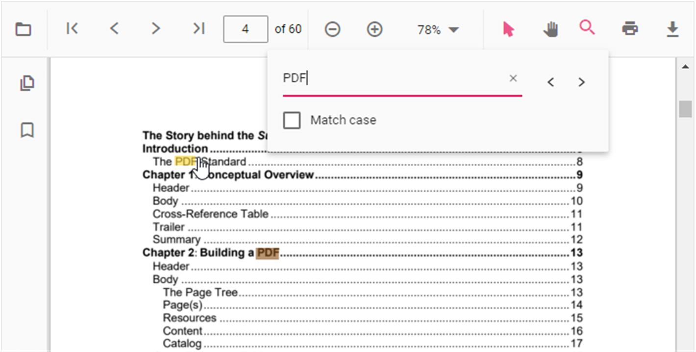
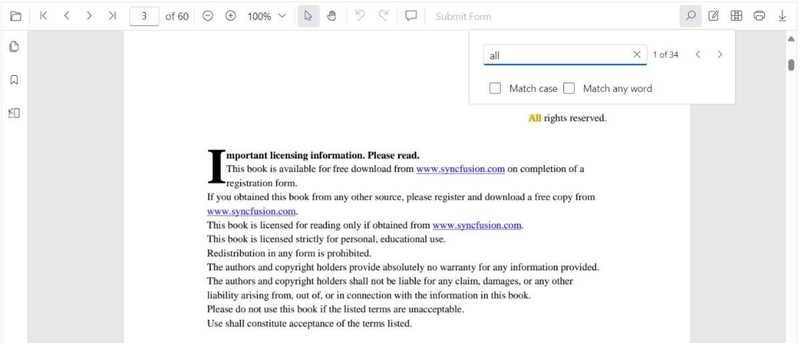
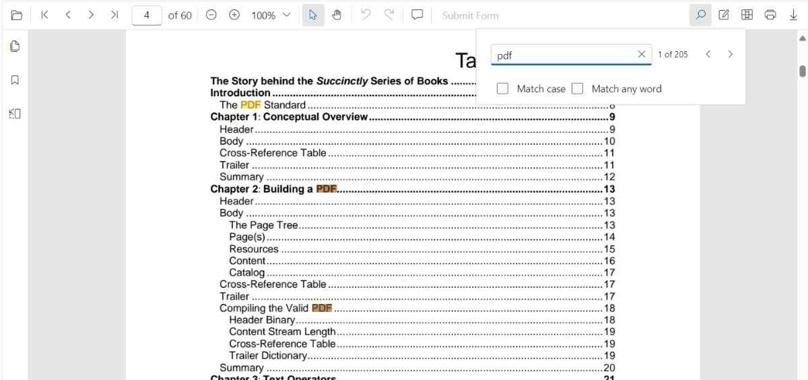

# Text search in ASP.NET MVC PDF Viewer

The Text Search option in PDF Viewer is used to find and highlight the text content from the document. You can enable/disable the text search using the following code snippet.




    <div style="width:100%;height:600px">
        @Html.EJS().PdfViewer("pdfviewer").EnableTextSearch(true).DocumentPath("https://cdn.syncfusion.com/content/pdf/hive-succinctly.pdf").Render()
    </div>



    <div style="width:100%;height:600px">
        @Html.EJS().PdfViewer("pdfviewer").ServiceUrl(VirtualPathUtility.ToAbsolute("~/api/PdfViewer/")).EnableTextSearch(true).DocumentPath("https://cdn.syncfusion.com/content/pdf/hive-succinctly.pdf").Render()
    </div>





## Text search features

### Real time search suggestion while typing
Entering text into the search input dynamically displays search suggestions based on the provided input. The suggestions are updated in real-time as text is typed, offering relevant matches from the available content. This feature enhances the search experience by allowing quick access to potential results while typing.


### Selecting Search Suggestions from the Popup
Entering text into the search input triggers a popup displaying relevant suggestions based on the input. Selecting a suggestion from the popup enables direct navigation to its occurrences in the document.



### Search Text with enabling 'Match Case' checkbox
By enabling the 'Match Case' option and entering text into the search input, only the exact case-sensitive matches in the document are highlighted. This feature allows navigation through each occurrence of the exact text match within the document.


### Search Text without enabling 'Match Case' checkbox
When text is entered into the search input without enabling the 'Match Case' option, all instances of the text, regardless of case, are highlighted in the document. This allows easy navigation through every occurrence of the search term.



### Search list of text by enabling 'Match Any Word' checkbox
When the 'Match Any Word' option is enabled, the entered text in the search input is split into individual words based on spaces. As the text is typed, the popup dynamically displays search suggestions for each word in real time, highlighting potential matches within the document.


### Programmatic Search with Settings

While the PDF Viewer's toolbar provides a user-friendly way to search, you can also trigger and customize searches programmatically using the `searchText` method and its options.

#### Using `searchText`

The `searchText` method allows you to initiate a search with specific criteria.

```typescript
// searchText(text: string, isMatchCase?: boolean, isMatchWholeWord?: boolean)
pdfviewer.textSearch.searchText('search text', false, false);
```

#### Match Case

To perform a case-sensitive search, set the `isMatchCase` parameter to `true`. This corresponds to the 'Match Case' checkbox in the search panel.




<button type="button" onclick="searchText()">Search Text</button>
<div style="width:100%;height:600px">
    @Html.EJS().PdfViewer("pdfviewer").EnableTextSearch(true).DocumentPath("https://cdn.syncfusion.com/content/pdf/hive-succinctly.pdf").Render()
</div>

<script>
    function searchText() {
        var pdfViewer = document.getElementById('pdfviewer').ej2_instances[0];
        pdfViewer.textSearch.searchText('PDF', true);
    }
</script>




<button type="button" onclick="searchText()">Search Text</button>
<div style="width:100%;height:600px">
    @Html.EJS().PdfViewer("pdfviewer").ServiceUrl(VirtualPathUtility.ToAbsolute("~/api/PdfViewer/")).EnableTextSearch(true).DocumentPath("https://cdn.syncfusion.com/content/pdf/hive-succinctly.pdf").Render()
</div>

<script>
    function searchText() {
        var pdfViewer = document.getElementById('pdfviewer').ej2_instances[0];
        pdfViewer.textSearch.searchText('PDF', true);
    }
</script>




#### Match Whole Word

You can search for whole words by setting the `isMatchWholeWord` parameter to `true`. When this is enabled, the search will only match occurrences where the search term is not part of a larger word. For example, a search for "view" will not match "viewer".




<button type="button" onclick="searchText()">Search Text</button>
<div style="width:100%;height:600px">
    @Html.EJS().PdfViewer("pdfviewer").EnableTextSearch(true).DocumentPath("https://cdn.syncfusion.com/content/pdf/hive-succinctly.pdf").Render()
</div>

<script>
    function searchText() {
        var pdfViewer = document.getElementById('pdfviewer').ej2_instances[0];
        pdfViewer.textSearch.searchText('pdf', false, true);
    }
</script>




<button type="button" onclick="searchText()">Search Text</button>
<div style="width:100%;height:600px">
    @Html.EJS().PdfViewer("pdfviewer").ServiceUrl(VirtualPathUtility.ToAbsolute("~/api/PdfViewer/")).EnableTextSearch(true).DocumentPath("https://cdn.syncfusion.com/content/pdf/hive-succinctly.pdf").Render()
</div>

<script>
    function searchText() {
        var pdfViewer = document.getElementById('pdfviewer').ej2_instances[0];
        pdfViewer.textSearch.searchText('pdf', false, true);
    }
</script>




**Note on 'Match Any Word':** The 'Match Any Word' checkbox in the UI is a feature that splits the input string into multiple words and performs a search for each of them. This is different from the `isMatchWholeWord` parameter of the `searchText` method, which enforces a whole-word match for the entire search string provided.

The following text search methods are available in the PDF Viewer,

* **Search text** - Searches the target text in the PDF document and highlights the occurrences in the pages.
* **Search next** - Searches the next occurrence of the searched text from the current occurrence of the PdfViewer.
* **Search previous** - Searches the previous occurrence of the searched text from the current occurrence of the PdfViewer.
* **Cancel text search** - The text search can be canceled and the highlighted occurrences from the PDF Viewer can be removed .


## Find text method
Searches for the specified text or an array of strings within the document and returns the bounding rectangles for each occurrence. The search can be case-sensitive based on the provided parameters. If a specific page index is provided, it returns the bounding rectangles for these search strings on that page; otherwise, it returns the bounding rectangles for all pages in the document where the strings were found.

### Find and get the bounds of a text
Searches for the specified text within the document and returns the bounding rectangles of the matched text. The search can be case-sensitive based on the provided parameter. It returns the bounding rectangles for all pages in the document where the text was found. The below code snippet shows how to get the bounds of the given text:




<button type="button" onclick="findTextBounds()">FindTextBounds</button>
<div style="width:100%;height:600px">
    @Html.EJS().PdfViewer("pdfviewer").DocumentPath("https://cdn.syncfusion.com/content/pdf/hive-succinctly.pdf").Render()
</div>

<script>
    function findTextBounds() {
        var pdfViewer = document.getElementById('pdfviewer').ej2_instances[0];
        console.log(viewer.textSearch.findText('pdf', false));
    }
</script>




<button type="button" onclick="findTextBounds()">FindTextBounds</button>
<div style="width:100%;height:600px">
    @Html.EJS().PdfViewer("pdfviewer").ServiceUrl(VirtualPathUtility.ToAbsolute("~/api/PdfViewer/")).DocumentPath("https://cdn.syncfusion.com/content/pdf/hive-succinctly.pdf").Render()
</div>

<script>
    function findTextBounds() {
        var pdfViewer = document.getElementById('pdfviewer').ej2_instances[0];
        console.log(viewer.textSearch.findText('pdf', false));
    }
</script>




### Find and get the bounds of a text on the desired page
Searches for the specified text within the document and returns the bounding rectangles of the matched text. The search can be case-sensitive based on the provided parameter. It returns the bounding rectangles for that page in the document where the text was found. The below code snippet shows how to get the bounds of the given text from the desired page:




<button type="button" onclick="findTextBounds()">FindTextBounds</button>
<div style="width:100%;height:600px">
    @Html.EJS().PdfViewer("pdfviewer").DocumentPath("https://cdn.syncfusion.com/content/pdf/hive-succinctly.pdf").Render()
</div>

<script>
    function findTextBounds() {
        var pdfViewer = document.getElementById('pdfviewer').ej2_instances[0];
        console.log(viewer.textSearch.findText('pdf', false, 7));
    }
</script>




<button type="button" onclick="findTextBounds()">FindTextBounds</button>
<div style="width:100%;height:600px">
    @Html.EJS().PdfViewer("pdfviewer").ServiceUrl(VirtualPathUtility.ToAbsolute("~/api/PdfViewer/")).DocumentPath("https://cdn.syncfusion.com/content/pdf/hive-succinctly.pdf").Render()
</div>

<script>
    function findTextBounds() {
        var pdfViewer = document.getElementById('pdfviewer').ej2_instances[0];
        console.log(viewer.textSearch.findText('pdf', false, 7));
    }
</script>




### Find and get the bounds of the list of text
Searches for an array of strings within the document and returns the bounding rectangles for each occurrence. The search can be case-sensitive based on the provided parameters. It returns the bounding rectangles for all pages in the document where the strings were found.




<button type="button" onclick="findTextBounds()">FindTextBounds</button>
<div style="width:100%;height:600px">
    @Html.EJS().PdfViewer("pdfviewer").DocumentPath("https://cdn.syncfusion.com/content/pdf/hive-succinctly.pdf").Render()
</div>

<script>
    function findTextBounds() {
        var pdfViewer = document.getElementById('pdfviewer').ej2_instances[0];
        console.log(viewer.textSearch.findText(['pdf', 'adobe'], false));
    }
</script>




<button type="button" onclick="findTextBounds()">FindTextBounds</button>
<div style="width:100%;height:600px">
    @Html.EJS().PdfViewer("pdfviewer").ServiceUrl(VirtualPathUtility.ToAbsolute("~/api/PdfViewer/")).DocumentPath("https://cdn.syncfusion.com/content/pdf/hive-succinctly.pdf").Render()
</div>

<script>
    function findTextBounds() {
        var pdfViewer = document.getElementById('pdfviewer').ej2_instances[0];
        console.log(viewer.textSearch.findText(['pdf', 'adobe'], false));
    }
</script>




### Find and get the bounds of the list of text on desired page
Searches for an array of strings within the document and returns the bounding rectangles for each occurrence. The search can be case-sensitive based on the provided parameters. It returns the bounding rectangles for these search strings on that particular page where the strings were found.




<button type="button" onclick="findTextBounds()">FindTextBounds</button>
<div style="width:100%;height:600px">
    @Html.EJS().PdfViewer("pdfviewer").DocumentPath("https://cdn.syncfusion.com/content/pdf/hive-succinctly.pdf").Render()
</div>

<script>
    function findTextBounds() {
        var pdfViewer = document.getElementById('pdfviewer').ej2_instances[0];
        console.log(viewer.textSearch.findText(['pdf', 'adobe'], false, 7));
    }
</script>




<button type="button" onclick="findTextBounds()">FindTextBounds</button>
<div style="width:100%;height:600px">
    @Html.EJS().PdfViewer("pdfviewer").ServiceUrl(VirtualPathUtility.ToAbsolute("~/api/PdfViewer/")).DocumentPath("https://cdn.syncfusion.com/content/pdf/hive-succinctly.pdf").Render()
</div>

<script>
    function findTextBounds() {
        var pdfViewer = document.getElementById('pdfviewer').ej2_instances[0];
        console.log(viewer.textSearch.findText(['pdf', 'adobe'], false, 7));
    }
</script>




## Text Search Events

The PDF Viewer triggers events during text search operations, allowing you to customize behavior and respond to different stages of the search process.

### textSearchStart

The [textSearchStart](https://help.syncfusion.com/cr/aspnetmvc-js2/syncfusion.ej2.pdfviewer.pdfviewer.html#Syncfusion_EJ2_PdfViewer_PdfViewer_TextSearchStart) event is raised the moment a search is initiated from the toolbar UI or by calling `textSearch.searchText(...)` programmatically.

- Triggers when: the user submits a term in the search box or when code calls the search API.

- Event arguments include `TextSearchStartEventArgs`:
  - `searchText`: string — the term to search.
  - `matchCase`: boolean — whether case-sensitive search is enabled.
  - `isMatchWholeWord`: boolean — whether whole-word matching is enabled.
  - `name`: string — event name.
  - `cancel`: boolean — set to true to cancel the default search.




<div id="e-pv-e-sign-pdfViewer-div">
    @Html.EJS().PdfViewer("pdfviewer").DocumentPath("https://cdn.syncfusion.com/content/pdf/pdf-succinctly.pdf").TextSearchStart("textSearchStarted").Render()
</div>

<script>
    function textSearchStarted(args) {
        // args.searchText contains the term being searched
        // args.cancel can be set to true to stop the default search
        console.log(`Text search started for: "${args.searchText}"`);
    }
</script>




<div id="e-pv-e-sign-pdfViewer-div">
    @Html.EJS().PdfViewer("pdfviewer").ServiceUrl(VirtualPathUtility.ToAbsolute("~/PdfViewer/")).DocumentPath("https://cdn.syncfusion.com/content/pdf/pdf-succinctly.pdf").TextSearchStart("textSearchStarted").Render()
</div>

<script>
    function textSearchStarted(args) {
        // args.searchText contains the term being searched
        // args.cancel can be set to true to stop the default search
        console.log(`Text search started for: "${args.searchText}"`);
    }
</script>




### textSearchHighlight

The [textSearchHighlight](https://help.syncfusion.com/cr/aspnetmvc-js2/syncfusion.ej2.pdfviewer.pdfviewer.html#Syncfusion_EJ2_PdfViewer_PdfViewer_TextSearchHighlight) event fires whenever an occurrence is highlighted during search or when navigating to next/previous results.

- Triggers when: a match is brought into view and highlighted (including navigation between matches).
- Event arguments include `TextSearchHighlightEventArgs`:
  - `bounds`: RectangleBoundsModel | RectangleBoundsModel[] — rectangles of the highlighted match.
  - `pageNumber`: number — page index where the match is highlighted.
  - `searchText`: string — the searched term.
  - `matchCase`: boolean — whether case-sensitive search was used.
  - `name`: string — event name.




<div id="e-pv-e-sign-pdfViewer-div">
    @Html.EJS().PdfViewer("pdfviewer").DocumentPath("https://cdn.syncfusion.com/content/pdf/pdf-succinctly.pdf").TextSearchHighlight("textSearchHighlighted").Render()
</div>

<script>
    function textSearchHighlighted(args) {
        // args.bounds provides the rectangle(s) of the current match
        console.log('Highlighted match bounds:', args.bounds);
    }
</script>




<div id="e-pv-e-sign-pdfViewer-div">
    @Html.EJS().PdfViewer("pdfviewer").ServiceUrl(VirtualPathUtility.ToAbsolute("~/PdfViewer/")).DocumentPath("https://cdn.syncfusion.com/content/pdf/pdf-succinctly.pdf").TextSearchHighlight("textSearchHighlighted").Render()
</div>

<script>
    function textSearchHighlighted(args) {
        // args.bounds provides the rectangle(s) of the current match
        console.log('Highlighted match bounds:', args.bounds);
    }
</script>




### textSearchComplete

The [textSearchComplete](https://help.syncfusion.com/cr/aspnetmvc-js2/syncfusion.ej2.pdfviewer.pdfviewer.html#Syncfusion_EJ2_PdfViewer_PdfViewer_TextSearchComplete) event is raised after the search engine finishes scanning and resolving all matches for the current query.

- Triggers when: the search for the submitted term has completed across the document.
- Typical uses:
  - Update UI with the total number of matches and enable navigation controls.
  - Hide loading indicators or show a "no results" message if none were found.
  - Record analytics for search effectiveness.
- Event arguments include `TextSearchCompleteEventArgs`:
  - `totalMatches`: number — total number of occurrences found.
  - `isMatchFound`: boolean — indicates whether at least one match was found.
  - `searchText`: string — the searched term.
  - `matchCase`: boolean — whether case-sensitive search was used.
  - `name`: string — event name.




<div id="e-pv-e-sign-pdfViewer-div">
    @Html.EJS().PdfViewer("pdfviewer").DocumentPath("https://cdn.syncfusion.com/content/pdf/pdf-succinctly.pdf").TextSearchComplete("textSearchCompleted").Render()
</div>

<script>
    function textSearchCompleted(args) {
        // args.totalMatches may indicate how many results were found (when available)
        console.log('Text search completed.', args);
    }
</script>




<div id="e-pv-e-sign-pdfViewer-div">
    @Html.EJS().PdfViewer("pdfviewer").ServiceUrl(VirtualPathUtility.ToAbsolute("~/PdfViewer/")).DocumentPath("https://cdn.syncfusion.com/content/pdf/pdf-succinctly.pdf").TextSearchComplete("textSearchCompleted").Render()
</div>

<script>
    function textSearchCompleted(args) {
        // args.totalMatches may indicate how many results were found (when available)
        console.log('Text search completed.', args);
    }
</script>




## See also

* [Toolbar items](./toolbar)
* [Feature Modules](./feature-module)