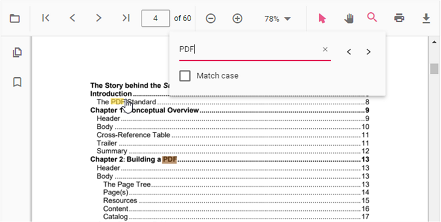
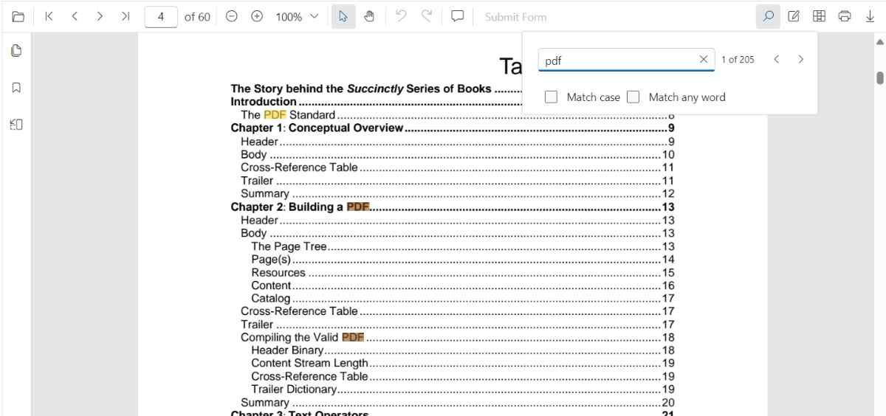

# Text Search in ASP.NET MVC PDF Viewer

The text search feature in the ASP.NET MVC PDF Viewer locates and highlights matching content within a document. Toggle the feature using the [`enableTextSearch`](https://help.syncfusion.com/cr/aspnetmvc-js2/syncfusion.ej2.pdfviewer.pdfviewer.html#Syncfusion_EJ2_PdfViewer_PdfViewer_EnableTextSearch) property (default: `true`), as shown in the snippet below.



## Text search features in UI

### Real-time search suggestions while typing

Typing in the search box immediately surfaces suggestions that match the entered text. The list refreshes on every keystroke so users can quickly jump to likely results without completing the entire term.


### Select search suggestions from the popup

After typing in the search box, the popup lists relevant matches. Selecting an item jumps directly to the corresponding occurrence in the PDF.


### Search text with the Match Case option

Enable the Match Case checkbox to limit results to case-sensitive matches. Navigation commands then step through each exact match in sequence.


### Search text without Match Case

Leave the Match Case option cleared to highlight every occurrence of the query, regardless of capitalization, and navigate through each result.



### Search a list of words with Match Any Word

Enable Match Any Word to split the query into separate words. The popup proposes matches for each word and highlights them throughout the document.


## Programmatic text search

The ASP.NET MVC PDF Viewer provides options to toggle the text search feature and APIs to customize the text search behavior programmatically.

### Enable or disable text search

Use the following snippet to enable or disable the text search feature.




<div style="width:100%;height:600px">
    @Html.EJS().PdfViewer("pdfviewer").EnableTextSearch(true).DocumentPath("https://cdn.syncfusion.com/content/pdf/pdf-succinctly.pdf").Render()
</div>




<div style="width:100%;height:600px">
    @Html.EJS().PdfViewer("pdfviewer").ServiceUrl(VirtualPathUtility.ToAbsolute("~/api/PdfViewer/")).EnableTextSearch(true).DocumentPath("https://cdn.syncfusion.com/content/pdf/pdf-succinctly.pdf").Render()
</div>




### Programmatic text search

While the PDF Viewer toolbar offers an interactive search experience, you can also trigger and customize searches programmatically by calling the following APIs on the `textSearch` module.

#### `searchText`

Use the [`searchText`](https://help.syncfusion.com/cr/aspnetmvc-js2/syncfusion.ej2.pdfviewer.pdfviewer.html#Syncfusion_EJ2_PdfViewer_PdfViewer_SearchText) method to start a search. The method highlights every match in the document and brings the first match into view.

```typescript
// searchText(text: string, isMatchCase?: boolean, isMatchWholeWord?: boolean)
pdfviewer.textSearch.searchText('search text', false, false);
```

**Parameters**

- `text` (string) — The text to search for in the document.
- `isMatchCase` (boolean, optional) — When `true`, performs a case-sensitive search that mirrors the **Match Case** option in the search panel. Defaults to `false`.
- `isMatchWholeWord` (boolean, optional) — When `true`, only matches occurrences where the search term is a complete word, not part of a larger word.

```typescript
// This will only find instances of "PDF" in uppercase.
pdfviewer.textSearch.searchText('PDF', true);
```

**Note on 'Match Any Word':** The **Match Any Word** checkbox in the UI is a feature that splits the input string into multiple words and performs a search for each of them. This is different from the `isMatchWholeWord` parameter of the `searchText` method, which enforces a whole-word match for the entire search string provided.

#### `searchNext`

The [`searchNext`](https://help.syncfusion.com/cr/aspnetmvc-js2/syncfusion.ej2.pdfviewer.pdfviewer.html#Syncfusion_EJ2_PdfViewer_PdfViewer_SearchNext) method searches for the next occurrence of the current query from the active match.

```typescript
pdfviewer.textSearch.searchNext();
```

#### `searchPrevious`

The [`searchPrevious`](https://help.syncfusion.com/cr/aspnetmvc-js2/syncfusion.ej2.pdfviewer.pdfviewer.html#Syncfusion_EJ2_PdfViewer_PdfViewer_SearchPrevious) API searches for the previous occurrence of the current query from the active match.

```typescript
pdfviewer.textSearch.searchPrevious();
```

#### `cancelTextSearch`

The [`cancelTextSearch`](https://help.syncfusion.com/cr/aspnetmvc-js2/syncfusion.ej2.pdfviewer.pdfviewer.html#Syncfusion_EJ2_PdfViewer_PdfViewer_CancelTextSearch) method cancels the current text search and removes the highlighted occurrences from the PDF Viewer.

```typescript
pdfviewer.textSearch.cancelTextSearch();
```

#### Complete example

Use the following code snippet to implement text search using the `searchText` API.




<button type="button" onclick="searchText()">Search Text</button>
<button type="button" onclick="previousSearch()">Previous Search</button>
<button type="button" onclick="nextSearch()">Next Search</button>
<button type="button" onclick="cancelSearch()">Cancel Search</button>

<div style="width:100%;height:600px">
    @Html.EJS().PdfViewer("pdfviewer").EnableTextSearch(true).DocumentPath("https://cdn.syncfusion.com/content/pdf/pdf-succinctly.pdf").Render()
</div>

<script>
    var pdfViewer = document.getElementById('pdfviewer').ej2_instances[0];
    function searchText() {
        pdfViewer.textSearch.searchText('pdf', false);
    }
    function previousSearch() {
        pdfViewer.textSearch.searchPrevious();
    }
    function nextSearch() {
        pdfViewer.textSearch.searchNext();
    }
    function cancelSearch() {
        pdfViewer.textSearch.cancelTextSearch();
    }
</script>




<button type="button" onclick="searchText()">Search Text</button>
<button type="button" onclick="previousSearch()">Previous Search</button>
<button type="button" onclick="nextSearch()">Next Search</button>
<button type="button" onclick="cancelSearch()">Cancel Search</button>

<div style="width:100%;height:600px">
    @Html.EJS().PdfViewer("pdfviewer").ServiceUrl(VirtualPathUtility.ToAbsolute("~/api/PdfViewer/")).EnableTextSearch(true).DocumentPath("https://cdn.syncfusion.com/content/pdf/pdf-succinctly.pdf").Render()
</div>

<script>
    var pdfViewer = document.getElementById('pdfviewer').ej2_instances[0];
    function searchText() {
        pdfViewer.textSearch.searchText('pdf', false);
    }
    function previousSearch() {
        pdfViewer.textSearch.searchPrevious();
    }
    function nextSearch() {
        pdfViewer.textSearch.searchNext();
    }
    function cancelSearch() {
        pdfViewer.textSearch.cancelTextSearch();
    }
</script>




**Expected result:** the viewer highlights occurrences of `pdf` (case-insensitive, because the second argument is `false`) and navigation commands jump between matches.

[View sample in GitHub](https://github.com/SyncfusionExamples/mvc-pdf-viewer-examples)

## See also

- [Find Text](./find-text)
- [Text Search Events](./text-search-events)
- [Extract Text](../how-to/extract-text)
- [Extract Text Options](../how-to/extract-text-option)
- [Extract Text Completed](../how-to/extract-text-completed)
