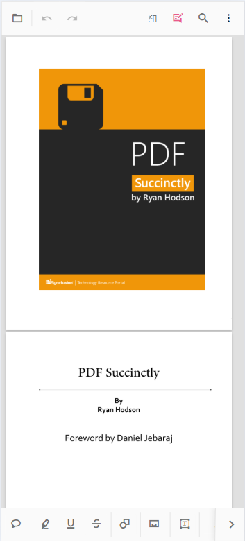

# Customize the Mobile Toolbar in ASP.NET MVC PDF Viewer

The Mobile PDF Viewer supports viewing, searching, annotating, and managing PDF documents on mobile devices. It includes essential tools like search, download, bookmarking, annotation, and page organization. Users can also enable the desktop toolbar features in mobile mode for an extended set of actions.

## Mobile mode toolbar configuration

In mobile mode, the toolbar is optimized for ease of use on small screens, presenting the most common actions for interacting with a PDF document. The key features available in mobile mode are listed below:


### Main Toolbar Options:

**OpenOption:** Tap to load a PDF document.

**SearchOption:** Access the search bar to find text within the document.


**UndoRedoTool:** Quickly undo or redo any annotations made.

**OrganizePagesTool:** Enable or disable page organization features to modify document pages.


**AnnotationEditTool:** Activate or deactivate annotation editing to add or modify annotations.




N> In mobile mode, the annotation toolbar is conveniently displayed at the bottom of the viewer.

### More Options Menu:
When you open the "more options" menu, you will see additional actions such as:

**DownloadOption:** Tap to download the currently opened PDF document.

**BookmarkOption:** Allows you to view bookmarks within the document.


## Enabling Desktop Mode in Mobile

The desktop version of the toolbar can be enabled on mobile devices by using the [`EnableDesktopMode`](https://help.syncfusion.com/cr/aspnetmvc-js2/Syncfusion.EJ2.PdfViewer.PdfViewer.html#Syncfusion_EJ2_PdfViewer_PdfViewer_EnableDesktopMode) API. This API allows you to bring desktop-like features to the mobile PDF viewer, providing access to additional toolbar actions that are typically available on desktop platforms.

### Steps to Enable Desktop Mode:

**Step 1:** Set `EnableDesktopMode` to true in the API configuration.

**Step 2:** This will replace the mobile toolbar with the desktop toolbar layout, allowing access to more actions and controls.



```html
<div style="width:100%;height:600px">
     @Html.EJS().PdfViewer("pdfviewer").EnableDesktopMode(true).DocumentPath("https://cdn.syncfusion.com/content/pdf/hive-succinctly.pdf").Render()
</div>
```


```html
    <div style="width:100%;height:600px">
         @Html.EJS().PdfViewer("pdfviewer").ServiceUrl(VirtualPathUtility.ToAbsolute("~/api/PdfViewer/")).EnableDesktopMode(true).DocumentPath("https://cdn.syncfusion.com/content/pdf/hive-succinctly.pdf").Render()
    </div>
```



## Enable Scrolling in Desktop Mode with Touch Gestures

To ensure smooth scrolling of PDF documents on a mobile device in desktop mode, it is important to enable touch gesture scrolling. You can achieve this by setting the `EnableTextSelection` option to **false**.



```html
<div style="width:100%;height:600px">
     @Html.EJS().PdfViewer("pdfviewer").EnableTextSelection(false).DocumentPath("https://cdn.syncfusion.com/content/pdf/hive-succinctly.pdf").Render()
</div>
```


```html
    <div style="width:100%;height:600px">
         @Html.EJS().PdfViewer("pdfviewer").ServiceUrl(VirtualPathUtility.ToAbsolute("~/api/PdfViewer/")).EnableTextSelection(false).DocumentPath("https://cdn.syncfusion.com/content/pdf/hive-succinctly.pdf").Render()
    </div>
```



## Print Option Not Available

The Print option is not available in mobile mode by default. However, if you need to use the print functionality on mobile devices, we recommend enabling the desktop toolbar on mobile using the `EnableDesktopMode` API.

### How to Use Print on Mobile:

**Enable Desktop Mode:** Set `EnableDesktopMode` to true to load the desktop version of the toolbar on your mobile device.

**Print Option:** Once desktop mode is enabled, the print option will be available, allowing you to print the document directly from your mobile device.

N> In mobile mode, the print functionality will not be available unless desktop mode is enabled.