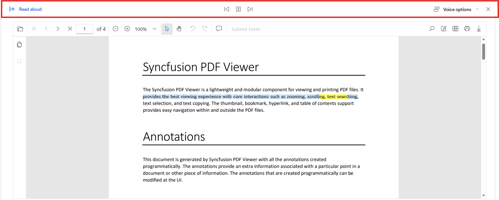
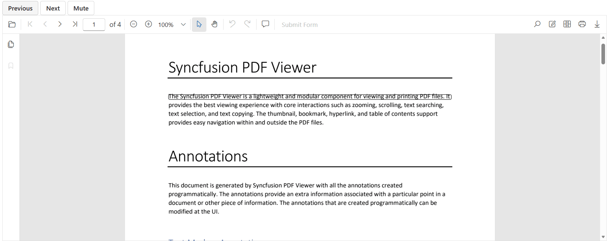

# Accessible PDF Reading in Blazor PDF Viewer

Accessible PDF reading lets users listen to PDF content using speech output. It improves usability for people who prefer audio interaction, need hands‑free review, or rely on screen readers.

This accessible PDF reading feature supports two approaches:
1. Microsoft Edge’s Screen Reader
2. Windows Speech Synthesis API

The following demo illustrates both supported approaches:
- [Blazor PDF Viewer example -Accessible PDF Reading](https://document.syncfusion.com/demos/pdf-viewer/blazor-server/pdf-viewer/accessible-pdf-reading)

## Microsoft Edge’s Screen Reader

Use Microsoft Edge’s built-in Read Aloud to listen to the PDF content.

- Open the sample document in Microsoft Edge.
- Click the **Read Aloud** icon in the Edge toolbar or press **Ctrl + Shift + U** to start reading the document aloud.
- To start from a specific page, navigate to that page and click anywhere; reading begins from the first readable text at that location.
- To read only selected text, select the sentence or portion of text you want, then use Read Aloud to read just that selection.

**Step 1:** Create and add a JavaScript file to the app and reference it in the head element.

```cshtml

<head>
    <script src="accessibility.js" type="text/javascript"></script>
</head>

```

**Step 2:** Add the following code to the JavaScript `accessibility.js` file.




// Initialize PDF accessibility features and observe page changes
function initPdfAccessibility() {
    const viewerInfo = getViewerInfo();
    if (!viewerInfo) return;
    viewerInfo.container.querySelectorAll('.e-pv-page-div').forEach(wirePage);
    const mutationObserver = new MutationObserver(mutations => {
        mutations.forEach(mutation => {
            mutation.addedNodes.forEach(node => {
                if (node.nodeType !== 1) return;
                if (node.matches && node.matches('.e-pv-page-div')) {
                    wirePage(node);
                } else if (node.querySelectorAll) {
                    node.querySelectorAll('.e-pv-page-div').forEach(wirePage);
                }
            });
        });
    });
    mutationObserver.observe(viewerInfo.container, { childList: true, subtree: true });
}

// Get viewer container and ID
function getViewerInfo() {
    const container = document.querySelector('.e-pv-viewer-container');
    if (!container) return null;
    return { container, viewerId: container.id.replace('_viewerContainer', '') };
}
// Insert hidden SR node for screen reader - Microsoft Reader
function insertSrNode(div) {
    const pageNumber = (div.id.match(/pageDiv_(\d+)/)[1]);
    const srId = `pdf_page_${pageNumber}_sr`;
    let sr = document.getElementById(srId);
    if (!sr) {
        sr = Object.assign(document.createElement('div'), { id: srId, className: 'e-pv-radio-btn', tabIndex: -1 });
        div.appendChild(sr);
    }
    return sr;
}
// Select SR text for screen reader - Mircosoft Reader
function selectSrText(div) {
    const sr = insertSrNode(div);
    const selection = window.getSelection();
    const range = document.createRange();
    range.selectNodeContents(sr);
    selection.removeAllRanges();
    selection.addRange(range);
}
// Move caret to first visible text node - Mircosoft Reader
function collapseCaretToVisibleText(div) {
    const textLayer = div.querySelector('.e-pv-text-layer');
    if (textLayer) {
        const selection = window.getSelection();
        const range = document.createRange();
        range.setStart(textLayer.firstChild, 0);
        range.collapse(true);
        selection.removeAllRanges();
        selection.addRange(range);
    }
}
// Focus page for accessibility - Mircosoft Reader
function focusPageDiv(div) {
    if (!div) return;
    const textLayer = div.querySelector('.e-pv-text-layer');
    if (!textLayer || !textLayer.textContent.trim()) {
        requestAnimationFrame(() => focusPageDiv(div));
        return;
    }
    const sr = insertSrNode(div);
    sr.textContent = textLayer.textContent;
    selectSrText(div);
    collapseCaretToVisibleText(div);
}
// Wire accessibility handlers to page div - Mircosoft Reader
function wirePage(div) {
    if (!div || div.hasAttribute('data-a11y-init')) return;
    div.addEventListener('mousedown', () => focusPageDiv(div));
    div.addEventListener('click', () => focusPageDiv(div));
    div.setAttribute('data-a11y-init', 'true');
}

// Reader the selected text aloud - Mircosoft Reader
 function readAloudText(text) {
    window.speechSynthesis.cancel();
    const utterance = new SpeechSynthesisUtterance(text);
    window.speechSynthesis.speak(utterance);
}

// Cancel speech and remove highlights - Mircosoft Reader
 function cancelReading() {
    if (window.speechSynthesis?.speaking) {
        window.speechSynthesis.cancel();
    }
}




**Step 3:** Add the following code to the `Home.razor`



@page "/"
@inject IJSRuntime JSRuntime

<!-- PDF Viewer component with reference and document path -->
<SfPdfViewer2 @ref="PdfViewer" DocumentPath="@DocumentPath" Height="100%" Width="100%">
    <!-- Event bindings for document load/unload and text selection -->
    <PdfViewerEvents DocumentLoaded="OnDocumentLoaded" DocumentUnloaded="OnDocumentUnloaded"
                     OnTextSelectionEnd="HandleTextSelectionEnd" />
</SfPdfViewer2>

@code
{
    // Reference to the PDF Viewer component
    private SfPdfViewer2? PdfViewer;

    // Path to the PDF document to be loaded in the viewer
    private string DocumentPath = "https://cdn.syncfusion.com/content/pdf/programmatical-annotations.pdf";

    // Triggered when the document is unloaded from the viewer
    private async Task OnDocumentUnloaded()
    {
        // Calls a JavaScript function to cancel any ongoing reading process
        await JSRuntime.InvokeVoidAsync("cancelReading");
    }

    // Triggered when the document is loaded in the viewer
    private async Task OnDocumentLoaded()
    {
        // Calls a JavaScript function to initialize PDF accessibility features
        await JSRuntime.InvokeVoidAsync("initPdfAccessibility");
    }

    // Triggered when text selection ends in the PDF Viewer
    private async Task HandleTextSelectionEnd(TextSelectionEndEventArgs args)
    {
        if (!string.IsNullOrEmpty(args.TextContent))
        {
            await JSRuntime.InvokeVoidAsync("readAloudText", args.TextContent);
        }
    }
}





## Windows Speech Synthesis API

Use the browser’s Windows Speech Synthesis API (speechSynthesis) to implement in-app Read Aloud functionality with custom controls. This approach:
- Provides playback controls, including Play and Pause/Resume.
- Reads content line by line and can continue across multiple pages.
- Reads only the selected text when a selection is made.
- Works on modern browsers and platforms that support the Speech Synthesis API.

**Step 1:** Create and add a JavaScript file to the app and reference it in the head element.

```cshtml

<head>
    <script src="accessibility.js" type="text/javascript"></script>
</head>

```

**Step 2:** Add the following code to the JavaScript `accessibility.js` file.



// Register .NET object for interop
 function registerDotNetObject(dotNetObj) {
    window.myDotNetObj = dotNetObj;
}
// Read selected text and highlight
function readSelectedText(args, zoomLevel, muteVoice) {
    const viewerInfo = getViewerInfo();
    window.speechSynthesis.cancel();
    clearAllHighlights();
    const text = args.textContent;
    const bounds = args.textBounds;
    bounds.forEach(bound => {
        const pageDiv = document.getElementById(`${viewerInfo.viewerId}_pageDiv_${bound.pageIndex - 1}`);
        if (pageDiv) createHighlightBox(bound, pageDiv, zoomLevel);
    });
    if (muteVoice) return;
    requestAnimationFrame(() => {
        speakText(text, clearAllHighlights);
    });
}
// Read a line from page and notify .NET
function readLineFromPage(pageIndex, lineIndex, isPrev, muteVoice) {
    window.speechSynthesis.cancel();
    clearAllHighlights();
    const viewerInfo = getViewerInfo();
    if (!viewerInfo) return;
    const pageDiv = document.getElementById(`${viewerInfo.viewerId}_pageDiv_${pageIndex}`);
    if (!pageDiv) return;
    function processLines() {
        const linesArray = getLinesFromPage(pageIndex);
        if (!linesArray || linesArray.length === 0) return;
        let currentLineSpans;
        if (lineIndex >= linesArray.length && linesArray.length > 0) {
            window.myDotNetObj.invokeMethodAsync('GoNextPage');
            return;
        }
        if (lineIndex === -1) {
            window.myDotNetObj.invokeMethodAsync('GoPreviousPage');
            return;
        }
        if (isPrev) {
            currentLineSpans = linesArray[linesArray.length - 1];
        } else {
            currentLineSpans = linesArray[lineIndex];
        }
        addHighlightBox(currentLineSpans);
        if (currentLineSpans && !muteVoice) {
            const lineText = currentLineSpans.map(s => s.textContent).join(' ');
            requestAnimationFrame(() => {
                speakText(lineText, clearAllHighlights);
            });
        }
    }
    // If spans already exist, process immediately
    if (pageDiv.querySelector('.e-pv-text-layer span')) {
        processLines();
    } else {
        // Observe DOM changes until spans are added
        const observer = new MutationObserver(() => {
            if (pageDiv.querySelector('.e-pv-text-layer span')) {
                observer.disconnect();
                processLines();
            }
        });
        observer.observe(pageDiv, { childList: true, subtree: true });
    }
}
// Update the current line index value
 function updateLineIndex(pageIndex) {
    return new Promise(resolve => {
        const viewerInfo = getViewerInfo();
        if (!viewerInfo) return resolve(0);
        const pageDiv = document.getElementById(`${viewerInfo.viewerId}_pageDiv_${pageIndex}`);
        if (!pageDiv) return resolve(0);
        function checkSpanElement() {
            const textLayer = pageDiv.querySelector('.e-pv-text-layer');
            if (textLayer && textLayer.querySelector('span')) {
                const linesArray = getLinesFromPage(pageIndex);
                resolve(linesArray.length);
                return true;
            }
            return false;
        }
        if (!checkSpanElement()) {
            const observer = new MutationObserver(() => {
                if (checkSpanElement()) observer.disconnect();
            });
            observer.observe(pageDiv, { childList: true, subtree: true });
        }
    });
}
// Group spans into lines
function getLinesFromPage(pageIndex) {
    const viewerInfo = getViewerInfo();
    if (!viewerInfo) return [];
    const pageDiv = document.getElementById(`${viewerInfo.viewerId}_pageDiv_${pageIndex}`);
    if (!pageDiv) return [];
    const textLayer = pageDiv.querySelector('.e-pv-text-layer');
    if (!textLayer) return [];
    const spans = Array.from(textLayer.querySelectorAll('span'));
    if (spans.length === 0) return [];
    const rotationStyle = getComputedStyle(spans[0]).transform;
    let rotationAngle = 0;
    if (rotationStyle && rotationStyle !== 'none') {
        const [a, b] = rotationStyle.split('(')[1].split(')')[0].split(',');
        rotationAngle = Math.round(Math.atan2(b, a) * (180 / Math.PI));
        if (rotationAngle < 0) rotationAngle += 360;
    }
    const linesMap = new Map();
    spans.forEach(span => {
        const rect = span.getBoundingClientRect();
        const key = (rotationAngle === 90 || rotationAngle === 270) ? Math.round(rect.left) : Math.round(rect.top);
        if (!linesMap.has(key)) linesMap.set(key, []);
        linesMap.get(key).push(span);
    });
    return Array.from(linesMap.values()).map(lineSpans =>
        lineSpans.sort((a, b) => {
            const rectA = a.getBoundingClientRect();
            const rectB = b.getBoundingClientRect();
            return (rotationAngle === 90 || rotationAngle === 270) ? rectA.top - rectB.top : rectA.left - rectB.left;
        })
    );
}

// Speak text with optional target voiceUri; on end, invoke callbacks and reset UI
function speakText(text, onEnd) {
    if (!text || !text.trim()) text = "Warning. No readable text found.";
    const utterance = new SpeechSynthesisUtterance(text);
    utterance.onend = onEnd;
    speechSynthesis.speak(utterance);
}
// Create highlight box for given bounds
function createHighlightBox(bound, pageDiv, zoomLevel) {
    const box = document.createElement('div');
    Object.assign(box.style, {
        position: 'absolute',
        left: `${bound.left * zoomLevel}px`,
        top: `${bound.top * zoomLevel}px`,
        width: `${bound.width * zoomLevel}px`,
        height: `${bound.height * zoomLevel}px`,
        border: '2px solid rgba(0, 0, 0, 0.6)',
        borderRadius: '4px',
        pointerEvents: 'none'
    });
    box.className = 'highlight-box-selected';
    // Store original bounds in data attributes
    box.dataset.left = bound.left;
    box.dataset.top = bound.top;
    box.dataset.width = bound.width;
    box.dataset.height = bound.height;
    pageDiv.appendChild(box);
}
// Highlight spans for a line
function addHighlightBox(currentLineSpans) {
    if (!currentLineSpans || currentLineSpans.length === 0) return;
    scrollIntoViewIfNeeded(currentLineSpans[0]);
    const rects = currentLineSpans.map(s => s.getBoundingClientRect());
    const minLeft = Math.min(...rects.map(r => r.left));
    const maxRight = Math.max(...rects.map(r => r.right));
    const minTop = Math.min(...rects.map(r => r.top));
    const maxBottom = Math.max(...rects.map(r => r.bottom));
    const pageDiv = currentLineSpans[0].closest('.e-pv-page-div');
    const pageRect = pageDiv.getBoundingClientRect();
    const highlightBox = document.createElement('div');
    Object.assign(highlightBox.style, {
        position: 'absolute',
        left: `${minLeft - pageRect.left}px`,
        top: `${minTop - pageRect.top}px`,
        width: `${maxRight - minLeft}px`,
        height: `${maxBottom - minTop}px`,
        border: '2px solid rgba(0, 0, 0, 0.6)',
        borderRadius: '4px',
        pointerEvents: 'none'
    });
    highlightBox.className = 'highlight-box';
    pageDiv.appendChild(highlightBox);
}
// Update highlight dynamically while reading
 function updateHighlightBox(pageIndex, lineIndex, zoomLevel) {
    if (!window.speechSynthesis?.speaking) return;
    // Check if line highlight exists
    const lineHighlights = document.querySelectorAll('.highlight-box');
    const selectedHighlights = document.querySelectorAll('.highlight-box-selected');
    if (lineHighlights.length > 0) {
        // Update line highlight without removing
        clearLineHighlight();
        function tryUpdate() {
            const linesArray = getLinesFromPage(pageIndex);
            if (!linesArray || !linesArray[lineIndex]) {
                setTimeout(tryUpdate, 0);
                return;
            }
            addHighlightBox(linesArray[lineIndex]);
        }
        tryUpdate();
    } else if (selectedHighlights.length > 0) {
        // Update selected-text highlights based on zoom
        selectedHighlights.forEach(box => {
            const left = parseFloat(box.dataset.left);
            const top = parseFloat(box.dataset.top);
            const width = parseFloat(box.dataset.width);
            const height = parseFloat(box.dataset.height);
            Object.assign(box.style, {
                left: `${left * zoomLevel}px`,
                top: `${top * zoomLevel}px`,
                width: `${width * zoomLevel}px`,
                height: `${height * zoomLevel}px`
            });
        });
    }
}
// Get viewer container and ID
function getViewerInfo() {
    const container = document.querySelector('.e-pv-viewer-container');
    if (!container) return null;
    return { container, viewerId: container.id.replace('_viewerContainer', '') };
}
// Scroll to the element
function scrollIntoViewIfNeeded(element) {
    if (!element) return;
    const viewerInfo = getViewerInfo();
    if (!viewerInfo) return;
    const container = viewerInfo.container;
    const containerRect = container.getBoundingClientRect();
    const elementRect = element.getBoundingClientRect();
    const isVisible = elementRect.top >= containerRect.top && elementRect.bottom <= containerRect.bottom;
    if (!isVisible) {
        element.scrollIntoView({ behavior: 'smooth', block: 'center' });
    }
}
// For line level highlights
function clearLineHighlight() {
    document.querySelectorAll('.highlight-box').forEach(box => box.remove());
}
// For selected-text highlights
function clearSelectedHighlights() {
    document.querySelectorAll('.highlight-box-selected').forEach(box => box.remove());
}
// For clear all highlights
function clearAllHighlights() {
    clearLineHighlight();
    clearSelectedHighlights();
}

// Pause or resume speech synthesis
 function readAloudMute(isPaused) {
    const speechSynth = window.speechSynthesis;
    isPaused ? speechSynth.resume() : speechSynth.pause();
}
// Cancel speech and remove highlights - Mircosoft Reader
 function cancelReading() {
    if (window.speechSynthesis?.speaking) {
        window.speechSynthesis.cancel();
        clearAllHighlights();
    }
}




**Step 3:** Add the following code to the `Home.razor`



@page "/"
@using Syncfusion.Blazor.Buttons
@inject IJSRuntime JSRuntime

<SfButton Disabled="@IsPrevious" OnClick="@(async () => await PreviousLine())">Previous</SfButton>
<SfButton Disabled="@IsNext" OnClick="@(async () => await NextLine())">Next</SfButton>
<SfButton OnClick="Mute">Mute</SfButton>

<SfPdfViewer2 @ref="PdfViewer" DocumentPath="@DocumentPath" Height="100%" Width="100%">
    <PdfViewerEvents DocumentUnloaded="OnDocumentUnloaded" DocumentLoaded="OnDocumentLoaded"
                     ZoomChanged="UpdateElement" PageChanged="OnPageChanged" OnTextSelectionEnd="OnTextSelectionEnd" />
</SfPdfViewer2>


@code {
    private DotNetObjectReference<Home>? objRef;
    private SfPdfViewer2? PdfViewer;
    private string DocumentPath = "https://cdn.syncfusion.com/content/pdf/programmatical-annotations.pdf";
    private bool muteVoice;
    private int currentLineIndex = 0;
    private bool IsPrevious = true;
    private bool IsNext = true;
    private bool ReadNextPage;
    private bool ReadPreviousPage;
    private int CurrentPage = 1;

    protected override void OnInitialized()
    {
        objRef = DotNetObjectReference.Create(this);
    }
  
    // Called when PDF document is loaded
    private async Task OnDocumentLoaded()
    {
        IsNext = false;
    }

    // Register .NET object for JS interop after first render
    protected override async Task OnAfterRenderAsync(bool firstRender)
    {
        if (firstRender)
        {
            await JSRuntime.InvokeVoidAsync("registerDotNetObject", objRef);
        }
    }

    // Called when PDF document is unloaded
    private async Task OnDocumentUnloaded()
    {
        await JSRuntime.InvokeVoidAsync("cancelReading");
        CurrentPage = 1;
        currentLineIndex = 0;
        IsPrevious = true;
    }

    // Handles page change events
    private async Task OnPageChanged()
    {
        if (ReadNextPage)
        {
            currentLineIndex = 0;
            await NextLine();
            ReadNextPage = false;
        }
        else if (ReadPreviousPage)
        {
            await PreviousLine(true);
            ReadPreviousPage = false;
        }
    }

    // Updates highlight box based on zoom and current line
    private async Task UpdateElement()
    {
        double? ZoomValue = PdfViewer?.ZoomValue / 100.0;
        await JSRuntime.InvokeVoidAsync("updateHighlightBox", PdfViewer?.CurrentPageNumber - 1, currentLineIndex - 1, ZoomValue);
    }

    // Toggles mute/unmute for reading aloud
    private async Task Mute()
    {
        await JSRuntime.InvokeVoidAsync("readAloudMute", muteVoice);
        muteVoice = !muteVoice;
    }

    // Reads the previous line or navigates to the previous page
    private async Task PreviousLine(bool isPreviousPage = false)
    {
        if (PdfViewer != null && currentLineIndex > 0 || isPreviousPage)
        {
            if (CurrentPage != PdfViewer!.CurrentPageNumber && !ReadPreviousPage)
            {
                await PdfViewer.GoToPageAsync(CurrentPage);
            }
            else
            {
                CurrentPage = PdfViewer.CurrentPageNumber;
            }
            currentLineIndex--;
            await JSRuntime.InvokeVoidAsync("readLineFromPage", CurrentPage - 1, currentLineIndex - 1, isPreviousPage, muteVoice);
            if (isPreviousPage)
                currentLineIndex = await JSRuntime.InvokeAsync<int>("updateLineIndex", CurrentPage - 1);
            IsPrevious = currentLineIndex < 1 && isPreviousPage;
            IsNext = false;
        }
    }
    // Reads the next line in the PDF
    private async Task NextLine()
    {
        if (CurrentPage != PdfViewer!.CurrentPageNumber && !ReadNextPage)
        {
            await PdfViewer.GoToPageAsync(CurrentPage);
        }
        else
        {
            CurrentPage = PdfViewer.CurrentPageNumber;
        }
        currentLineIndex++;
        await JSRuntime.InvokeVoidAsync("readLineFromPage", CurrentPage - 1, currentLineIndex - 1, false, muteVoice);
        IsPrevious = currentLineIndex < 1;
        IsNext = false;
    }

    // Reads selected text aloud
    private async Task OnTextSelectionEnd(TextSelectionEndEventArgs args)
    {
        double? ZoomValue = PdfViewer?.ZoomValue / 100.0;
        await JSRuntime.InvokeVoidAsync("readSelectedText", args, ZoomValue, muteVoice);
    }

    // Navigates to the next page
    [JSInvokable]
    public async Task GoNextPage()
    {
        if (PdfViewer!.CurrentPageNumber == PdfViewer.PageCount)
        {
            await PdfViewer.GoToFirstPageAsync();
        }
        else
        {
            await PdfViewer.GoToNextPageAsync();
        }
        ReadNextPage = true;
    }
    // Navigates to the previous page
    [JSInvokable]
    public async Task GoPreviousPage()
    {
        if (PdfViewer!.CurrentPageNumber == 1)
        {
            await PdfViewer.GoToLastPageAsync();
        }
        else
        {
            await PdfViewer!.GoToPreviousPageAsync();
        }
        ReadPreviousPage = true;
    }
  
}





## See also

- [Blazor PDF Viewer example -Accessible PDF Reading](https://document.syncfusion.com/demos/pdf-viewer/blazor-server/pdf-viewer/accessible-pdf-reading)
