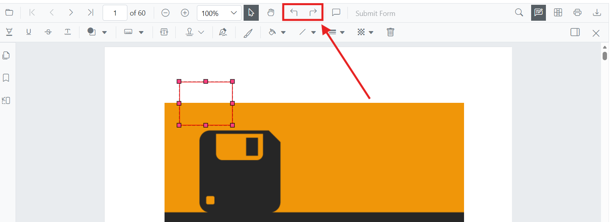

# Undo and Redo Annotations in Blazor SfPdfViewer Component

The Blazor SfPdfViewer component supports undo and redo for annotations. Each annotation change is added to an internal history stack, and you can step backward and forward through that history using the keyboard, the built-in toolbar, or the component API. This feature is applies to all built-in annotations and form fields.



Undo and redo actions can be performed by using either of the following methods:

1. **Using keyboard shortcuts (desktop):** After performing an annotation action and ensuring the viewer has focus, press `Ctrl+Z` to undo and `Ctrl+Y` to redo on Windows and Linux. On macOS, use `Command+Z` to undo and `Command+Shift+Z` to redo.
2. **Using the toolbar:** Use the **Undo** and **Redo** tools in the toolbar.
3. **Programmatically:** Call the [UndoAsync](https://help.syncfusion.com/cr/blazor/Syncfusion.Blazor.SfPdfViewer.PdfViewerBase.html#Syncfusion_Blazor_SfPdfViewer_PdfViewerBase_UndoAsync) and [RedoAsync](https://help.syncfusion.com/cr/blazor/Syncfusion.Blazor.SfPdfViewer.PdfViewerBase.html#Syncfusion_Blazor_SfPdfViewer_PdfViewerBase_RedoAsync) methods from your Blazor component code.

## Keyboard Shortcut

The keyboard shortcuts are enabled by default and require no additional configuration. The viewer must have focus to receive the shortcut — click inside the page area before pressing the shortcut.

| Action | Windows / Linux | macOS |
| --- | --- | --- |
| Undo | `Ctrl+Z` | `Command+Z` |
| Redo | `Ctrl+Y` | `Command+Shift+Z` |

## Toolbar

The **Undo** and **Redo** tools appear in the annotation toolbar (see the screenshot at the top of this page). The buttons are enabled only when the corresponding history stack is non-empty. If the buttons appear disabled, perform an annotation action first.

## Programmatic Undo and Redo

Refer to the following code snippet to call undo and redo actions programmatically.

```cshtml
@using Syncfusion.Blazor.Buttons
@using Syncfusion.Blazor.SfPdfViewer

<div style="margin-bottom: 8px;">
    <SfButton OnClick="UndoAnnotation">Undo</SfButton>
    <SfButton OnClick="RedoAnnotation">Redo</SfButton>
</div>

<SfPdfViewer2 @ref="viewer"
              DocumentPath="https://cdn.syncfusion.com/content/pdf/pdf-succinctly.pdf"
              Height="650px"
              Width="100%">
</SfPdfViewer2>

@code {
    private SfPdfViewer2 viewer;

    private async Task UndoAnnotation(MouseEventArgs args)
    {
        await viewer.UndoAsync();
    }

    private async Task RedoAnnotation(MouseEventArgs args)
    {
        await viewer.RedoAsync();
    }
}
```

## See also

- [Annotation Overview](./overview)
- [Text Markup Annotation](./text-markup/highlight-annotation)
- [Shape Annotation](./shape/line-annotation)
- [Measurement Annotation](./measurement/distance-annotation)
- [Free Text Annotation](./free-text-annotation)
- [Ink Annotation](./ink-annotation)
- [Stamp Annotation](./stamp-annotation)
- [Comments](./comments)
- [Delete Annotation](./delete-annotation)
- [Export and Import Annotation](./export-annotation)
- [SfPdfViewer Getting Started](./../getting-started/web-app)
