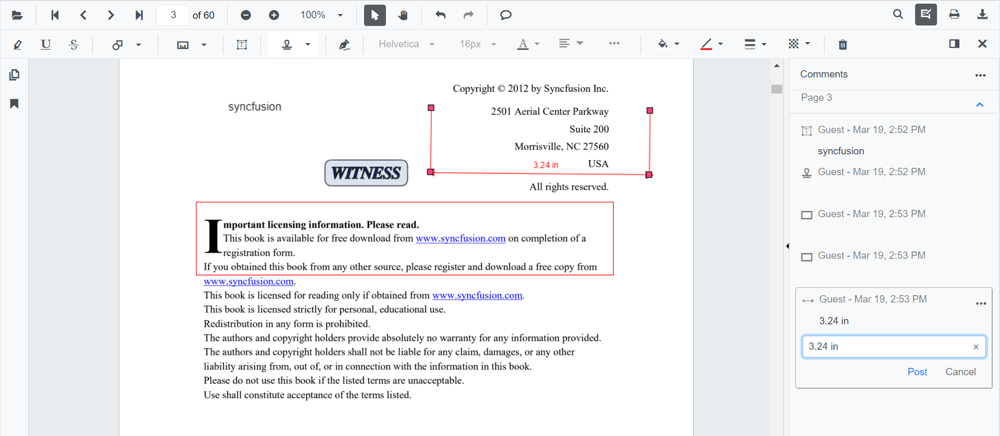
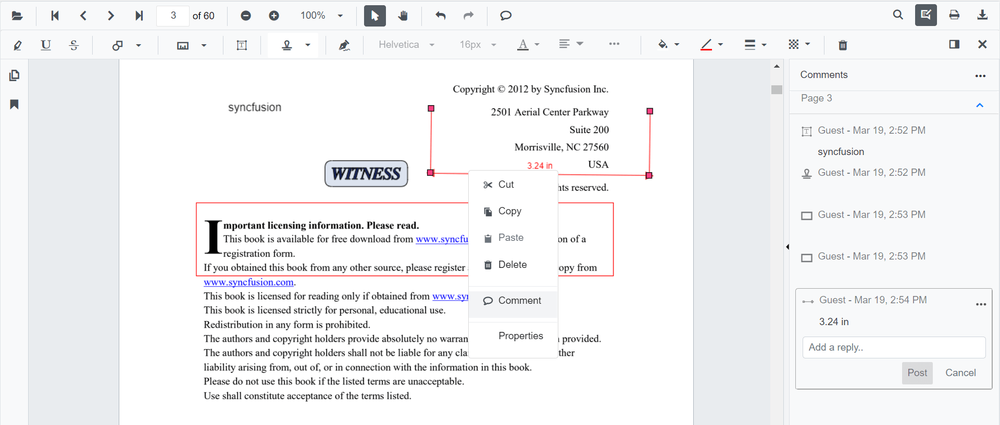
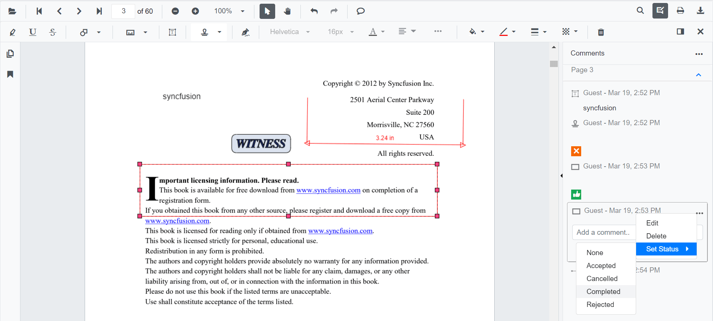
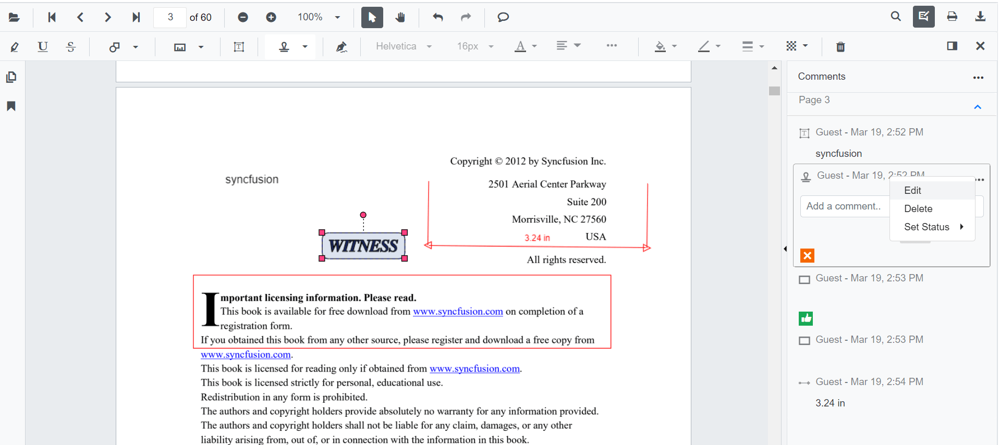
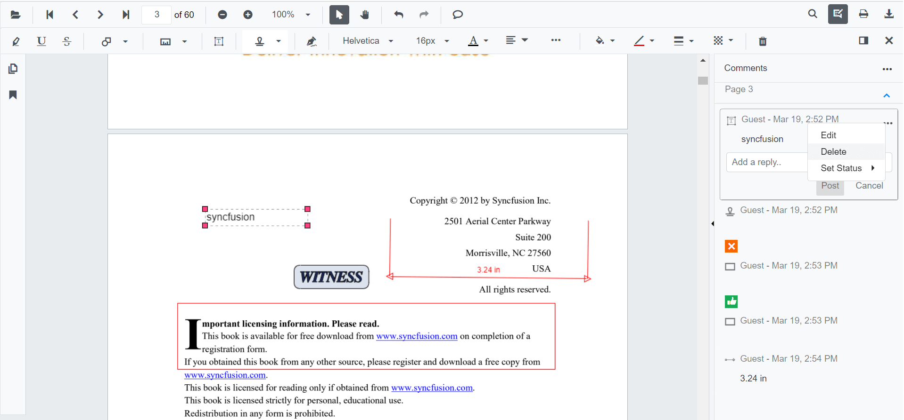
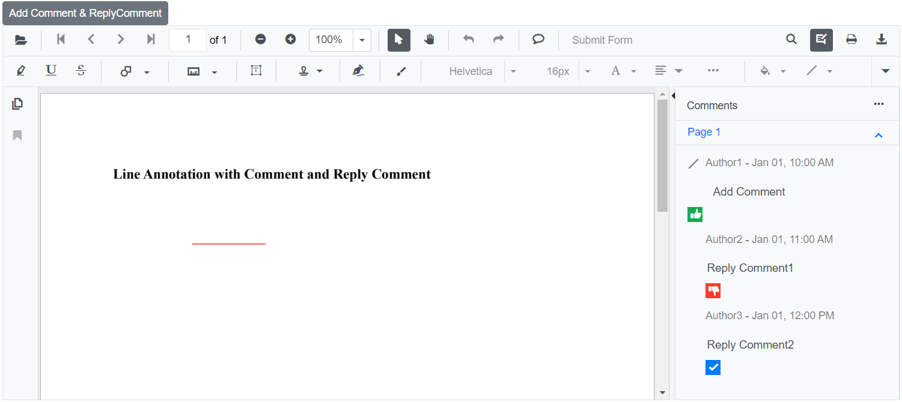
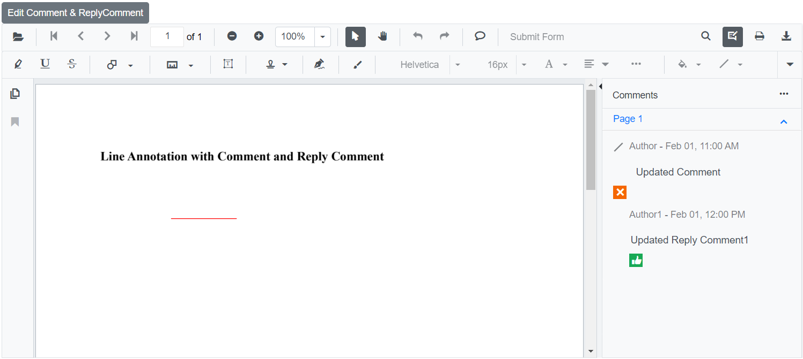
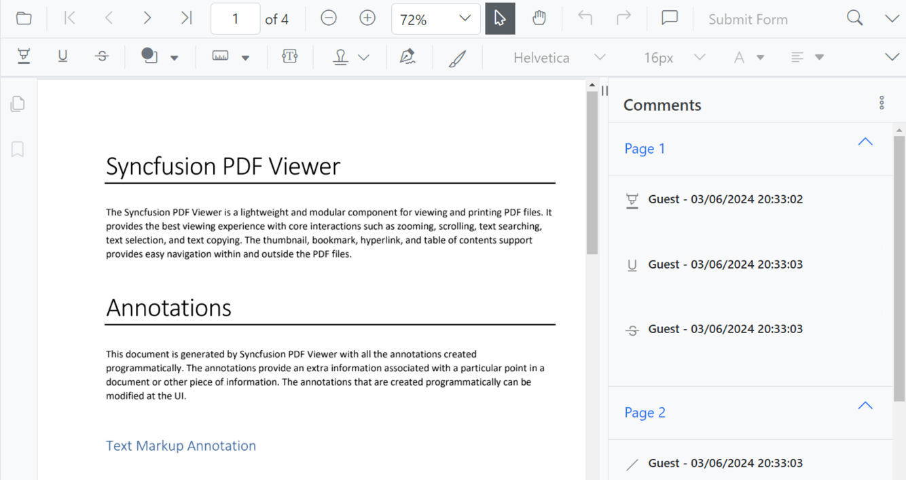
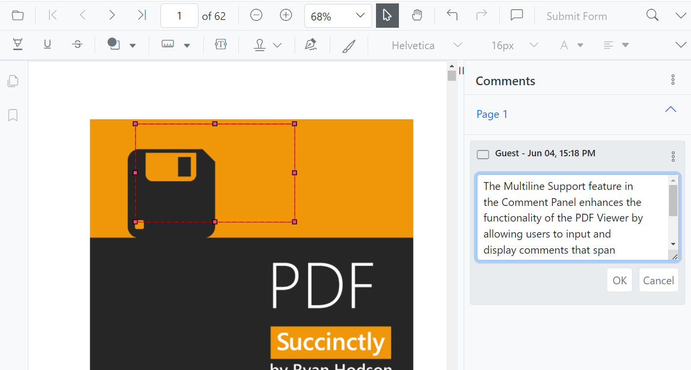

# Comments in Blazor SfPdfViewer Component

The `SfPdfViewer` component provides options to add, edit, and delete comments for the following annotation types in PDF documents:

* Shape annotation
* Stamp annotation
* Sticky note annotation
* Measurement annotation
* Text markup annotation
* Free text annotation


## Add a comment to an annotation

Comments, replies, and status can be added to a PDF document using the comment panel.

### Comment panel

The comment panel is located on the right side of the `SfPdfViewer`. It is hidden by default. Annotation comments can be added using the comment panel. Open the comment panel in any of the following ways:

1. From the annotation menu

    * Click the Edit Annotation button in the `SfPdfViewer` toolbar. A toolbar appears below it.
    * Click the Comment panel button. The comment panel opens.

2. From the context menu

    * Select an annotation in the PDF document and right-click it.
    * Select the Comment option in the context menu.

3. Using double-click

    * Select an annotation in the PDF document and double-click it to open the comment panel.

Once the comment panel is open, select an annotation to add a comment.

### Adding comments

To comment on an annotation, first add the annotation to the PDF document (for example, a shape, sticky note, or text markup) using the annotation toolbar, then proceed as follows:

* Select an annotation in the PDF document and click it to select it.
* The selected annotation’s comment container is highlighted in the comment panel.
* Type your comment in the comment panel's input area and press Enter to save.
* Add any required replies using the same panel.



### Adding comment replies

* The `SfPdfViewer` supports adding multiple replies to a single comment.
* After adding an annotation comment, click the reply icon in the comment container to add one or more replies as needed.

### Adding comment or reply status

* Select the annotation comment in the comment panel.
* Click the More options button in the comment or reply container.
* Select Set status in the context menu.
* Choose the required status for the annotation comment.

The following statuses are supported:

| Status | Description |
|---|---|
| `None` | Removes the status indicator (default). |
| `Accepted` | Marks the comment or reply as accepted. |
| `Rejected` | Marks the comment or reply as rejected. |
| `Completed` | Marks the comment or reply as completed. |
| `Cancelled` | Marks the comment or reply as cancelled. |



### Edit comments and replies

You can edit a comment, its replies, and the status of an annotation using the comment panel.

### Editing comments or replies

Edit comments and replies in the following ways:

1. From the context menu

    * Select the annotation comment in the comment panel.
    * Click the More options button in the comment or reply container.
    * Select Edit in the context menu.
    * An editable text box appears to change the content of the comment or reply.

2. Using double-click

    * Select the annotation comment in the comment panel.
    * Double-click the comment or reply content.
    * An editable text box appears to change the content of the comment or reply.

### Editing comment or reply status

* Select the annotation comment in the comment panel.
* Click the More options button in the comment or reply container.
* Select Set status in the context menu.
* Choose the required status for the annotation comment.
* Status `None` is the default. Choosing `None` removes the status indicator from the comment or reply.



### Delete a comment or reply

You can delete a comment or reply using the following method:

* Select the annotation comment in the comment panel.
* Click the More options button in the comment or reply container.
* Select Delete in the context menu.



N> Deleting the root comment from the comment panel also deletes the associated annotation. Deleting a reply does not delete the parent comment or annotation.

### Show or hide the Comment panel

The `SfPdfViewer` component provides an option to show or hide the comment panel by using the [CommentPanelVisible](https://help.syncfusion.com/cr/blazor/Syncfusion.Blazor.SfPdfViewer.PdfViewerBase.html#Syncfusion_Blazor_SfPdfViewer_PdfViewerBase_CommentPanelVisible) property. The default value is `false` (panel hidden). You can also toggle the panel from the UI at runtime, and the change is automatically reflected back through two-way binding.

The following code snippet demonstrates how to show or hide the comment panel declaratively and via a button click.

```cshtml

@using Syncfusion.Blazor.Buttons
@using Syncfusion.Blazor.SfPdfViewer

<SfButton OnClick="@OnClick">ShowOrHideCommentPanel</SfButton>
<SfPdfViewer2 @ref="Viewer"
              @bind-CommentPanelVisible="@isOpen"
              DocumentPath="@DocumentPath"
              Height="100%"
              Width="100%">
</SfPdfViewer2>

@code
{
    private SfPdfViewer2 viewer;

    // Sets the PDF document path for initial loading.
    private string DocumentPath { get; set; } = "wwwroot/Data/PDF_Succinctly.pdf";

    // Set to true to display the comment panel by default.
    private bool isOpen = true;

    // Toggles the visibility of the comment panel.
    private void OnClick()
    {
        isOpen = !isOpen;
    }
}
```
[View sample in GitHub](https://github.com/SyncfusionExamples/blazor-pdf-viewer-examples/tree/master/Annotations/Comment%20Panel/Show%20or%20hide%20comment%20panel).

## Add comments and replies programmatically

The `SfPdfViewer` supports programmatically adding a line annotation with a comment and replies using the [AddAnnotationAsync](https://help.syncfusion.com/cr/blazor/Syncfusion.Blazor.SfPdfViewer.PdfViewerBase.html#Syncfusion_Blazor_SfPdfViewer_PdfViewerBase_AddAnnotationAsync_Syncfusion_Blazor_SfPdfViewer_PdfAnnotation_) method.

The following example demonstrates how to add a line annotation with a comment and replies to a PDF document:

```cshtml

@using System
@using System.Collections.Generic
@using Syncfusion.Blazor.Buttons
@using Syncfusion.Blazor.SfPdfViewer

<SfButton OnClick="@AddCommentandReplyCommentAsync">Add Comment & ReplyComment</SfButton>
<SfPdfViewer2 Width="100%" Height="100%" DocumentPath="@DocumentPath" @ref="@Viewer" />

@code {
    private SfPdfViewer2 viewer;
    private string DocumentPath { get; set; } = "wwwroot/Data/Comment_and_Reply_Comment.pdf";

    private async void AddCommentandReplyCommentAsync(MouseEventArgs args)
    {
        PdfAnnotation annotation = new PdfAnnotation();
        // Set the annotation type to Line
        annotation.Type = AnnotationType.Line;
        // PageNumber is 1-based; 1 represents the first page.
        annotation.PageNumber = 1;

        // Vertex points of the Line annotation
        List<VertexPoint> vertexPoints = new List<VertexPoint>();
        VertexPoint vertexPoint = new VertexPoint();
        vertexPoint.X = 200;
        vertexPoint.Y = 200;
        vertexPoints.Add(vertexPoint);
        vertexPoint = new VertexPoint();
        vertexPoint.X = 300;
        vertexPoint.Y = 200;
        vertexPoints.Add(vertexPoint);
        // Set the VertexPoints of the Line annotation
        annotation.VertexPoints = vertexPoints;

        // Add comment text
        annotation.Note = "Add Comment";

        // Add comment status
        annotation.Review = new Review();
        annotation.Review.State = "Accepted";

        // Add comment author name
        annotation.Author = "Author1";

        // Add comment modified date
        annotation.ModifiedDate = new DateTime(2024, 1, 1, 10, 0, 0);

        // Add reply comments
        List<Comment> comments = new List<Comment>();
        Comment comment = new Comment();

        // First reply comment
        comment.Note = "Reply Comment1";
        comment.Author = "Author2";
        comment.ModifiedDate = new DateTime(2024, 1, 1, 11, 0, 0);
        comment.State = "Rejected";
        comments.Add(comment);

        // Second reply comment
        comment = new Comment();
        comment.Note = "Reply Comment2";
        comment.Author = "Author3";
        comment.ModifiedDate = new DateTime(2024, 1, 1, 12, 0, 0);
        comment.State = "Completed";
        comments.Add(comment);

        annotation.Comments = comments;

        // Add the Line annotation with the comment and reply comments
        await Viewer.AddAnnotationAsync(annotation);
    }
}

```

This code adds a line annotation with a comment and replies to the first page of the PDF document.



[View sample in GitHub](https://github.com/SyncfusionExamples/blazor-pdf-viewer-examples/tree/master/Annotations/Programmatic%20Support/Comment/Add).

## Edit comments and replies programmatically

The `SfPdfViewer` supports programmatically editing the comment and replies of an annotation using the [EditAnnotationAsync](https://help.syncfusion.com/cr/blazor/Syncfusion.Blazor.SfPdfViewer.PdfViewerBase.html#Syncfusion_Blazor_SfPdfViewer_PdfViewerBase_EditAnnotationAsync_Syncfusion_Blazor_SfPdfViewer_PdfAnnotation_) method.

The following example demonstrates how to edit the comment and replies programmatically:

```cshtml

@using System
@using System.Collections.Generic
@using Syncfusion.Blazor.Buttons
@using Syncfusion.Blazor.SfPdfViewer

<SfButton OnClick="@EditCommentandReplyCommentAsync">Edit Comment & ReplyComment</SfButton>
<SfPdfViewer2 Width="100%" Height="100%" DocumentPath="@DocumentPath" @ref="@Viewer" />

@code {
    private SfPdfViewer2 viewer;
    private string DocumentPath { get; set; } = "wwwroot/Data/Comment_and_Reply_Comment.pdf";

    private async void EditCommentandReplyCommentAsync(MouseEventArgs args)
    {
        // Get the annotation collection
        List<PdfAnnotation> annotationCollection = await Viewer.GetAnnotationsAsync();
        // Select the annotation to edit
        PdfAnnotation annotation = annotationCollection[0];
        // Edit the comment text
        annotation.Note = "Updated Comment";
        // Edit the comment status
        annotation.Review.State = "Cancelled";
        // Edit the comment author
        annotation.Author = "Author";
        // Edit the comment modified date
        annotation.ModifiedDate = new DateTime(2024, 2, 1, 11, 0, 0);
        // Edit the first reply comment
        annotation.Comments[0].Note = "Updated Reply Comment1";
        // Edit the first reply comment status
        annotation.Comments[0].State = "Accepted";
        // Edit the first reply comment author
        annotation.Comments[0].Author = "Author1";
        // Edit the first reply comment modified date
        annotation.Comments[0].ModifiedDate = new DateTime(2024, 2, 1, 12, 0, 0);
        // Remove the second reply comment
        annotation.Comments.RemoveAt(1);
        // Apply the edits to the Line annotation
        await Viewer.EditAnnotationAsync(annotation);
    }
}

```

This code edits the comment and replies programmatically and updates the annotation within the `SfPdfViewer` control.



[View sample in GitHub](https://github.com/SyncfusionExamples/blazor-pdf-viewer-examples/tree/master/Annotations/Programmatic%20Support/Comment/Edit).

## Customizing date and time format

The `SfPdfViewer` supports customizing the date and time format displayed in the comment panel using the [PdfViewerCommentPanelSettings](https://help.syncfusion.com/cr/blazor/Syncfusion.Blazor.SfPdfViewer.PdfViewerCommentPanelSettings.html). This feature tailors the appearance of date and time according to preferences or regional standards. The format applies to all comments and replies displayed in the comment panel. The viewer does not need to be reloaded; existing comments are re-rendered using the new format as soon as the setting changes.

The [DateTimeFormat](https://help.syncfusion.com/cr/blazor/Syncfusion.Blazor.SfPdfViewer.PdfViewerCommentPanelSettings.html#Syncfusion_Blazor_SfPdfViewer_PdfViewerCommentPanelSettings_DateTimeFormat) API in [PdfViewerCommentPanelSettings](https://help.syncfusion.com/cr/blazor/Syncfusion.Blazor.SfPdfViewer.PdfViewerCommentPanelSettings.html) changes the format of the date and time displayed in the comment panel.

The following table describes various supported patterns. The "Result" column shows the output for `29 May 2015 05:50:06` in the `en-US` culture (except where the pattern includes a time-zone specifier, in which case the offset reflects `UTC-04:00`).

| Pattern | Result |
|---|---|
| `MM/dd/yyyy` | 05/29/2015 |
| `dddd, dd MMMM yyyy` | Friday, 29 May 2015 |
| `dddd, dd MMMM yyyy HH:mm` | Friday, 29 May 2015 05:50 |
| `dddd, dd MMMM yyyy HH:mm tt` | Friday, 29 May 2015 05:50 AM |
| `dddd, dd MMMM yyyy H:mm` | Friday, 29 May 2015 5:50 |
| `dddd, dd MMMM yyyy H:mm tt` | Friday, 29 May 2015 5:50 AM |
| `dddd, dd MMMM yyyy HH:mm:ss` | Friday, 29 May 2015 05:50:06 |
| `MM/dd/yyyy HH:mm` | 05/29/2015 05:50 |
| `MM/dd/yyyy hh:mm tt` | 05/29/2015 05:50 AM |
| `MM/dd/yyyy H:mm` | 05/29/2015 5:50 |
| `MM/dd/yyyy h:mm tt` | 05/29/2015 5:50 AM |
| `MM/dd/yyyy HH:mm:ss` | 05/29/2015 05:50:06 |
| `MMMM dd` | May 29 |
| `ddd, dd MMM yyyy HH':'mm':'ss 'GMT'` | Fri, 16 May 2015 05:50:06 GMT |
| `yyyy'-'MM'-'dd'T'HH':'mm':'ss` | 2015-05-16T05:50:06 |
| `HH:mm` | 05:50 |
| `hh:mm tt` | 05:50 AM |
| `H:mm` | 5:50 |
| `h:mm tt` | 5:50 AM |
| `HH:mm:ss` | 05:50:06 |
| `yyyy MMMM` | 2015 May |

Here is a sample code snippet demonstrating how to apply this setting.

```cshtml

@using Syncfusion.Blazor.SfPdfViewer

<SfPdfViewer2 DocumentPath="@DocumentPath" Height="100%" Width="100%" CommentPanelVisible="true">
    <PdfViewerCommentPanelSettings DateTimeFormat="@dateFormat"></PdfViewerCommentPanelSettings>
</SfPdfViewer2>

@code {
    // Valid C# date and time format string
    private string dateFormat = "dd/MM/yyyy HH:mm:ss";
    private string DocumentPath { get; set; } = "wwwroot/Data/Comment_and_Reply_Comment.pdf";
}

```
This code implements date and time formatting for the comment panel of the PDF Viewer.



[View sample in GitHub](https://github.com/SyncfusionExamples/blazor-pdf-viewer-examples/tree/master/Annotations/Comment%20Panel/Customize%20DateTimeFormat).

## Enabling multiline support

Multiline support in the comment panel allows users to input and display comments that span multiple lines. By default, multiline support is disabled. Enable multiline support using the [PdfViewerCommentPanelSettings](https://help.syncfusion.com/cr/blazor/Syncfusion.Blazor.SfPdfViewer.PdfViewerCommentPanelSettings.html).

The [Multiline](https://help.syncfusion.com/cr/blazor/Syncfusion.Blazor.SfPdfViewer.PdfViewerCommentPanelSettings.html#Syncfusion_Blazor_SfPdfViewer_PdfViewerCommentPanelSettings_Multiline) API in [PdfViewerCommentPanelSettings](https://help.syncfusion.com/cr/blazor/Syncfusion.Blazor.SfPdfViewer.PdfViewerCommentPanelSettings.html) enables or disables multiline support in the comment panel. There is no hard limit on the number of lines or characters; however, very long comments may affect panel performance and readability.

Here is a sample code snippet demonstrating how to apply this setting.

```cshtml

@using Syncfusion.Blazor.SfPdfViewer

<SfPdfViewer2 DocumentPath="@DocumentPath" Height="100%" Width="100%" CommentPanelVisible="true">
    <PdfViewerCommentPanelSettings Multiline="@multiline"></PdfViewerCommentPanelSettings>
</SfPdfViewer2>

@code {
    // Enables or disables multiline support in the comment panel (default: false)
    private bool multiline = true;
    private string DocumentPath { get; set; } = "wwwroot/Data/Comment_and_Reply_Comment.pdf";
}

```

This code enables multiline support in the comment panel of the PDF Viewer.



[View sample in GitHub](https://github.com/SyncfusionExamples/blazor-pdf-viewer-examples/tree/master/Annotations/Comment%20Panel/Enable%20Multiline%20Support).

## See also

* [How to delete the annotation programmatically](./text-markup-annotation#delete-annotation-programmatically)