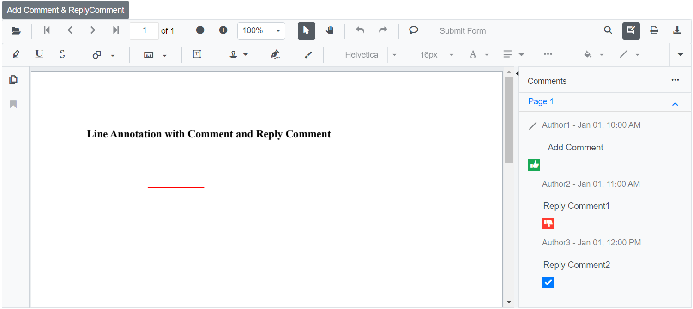
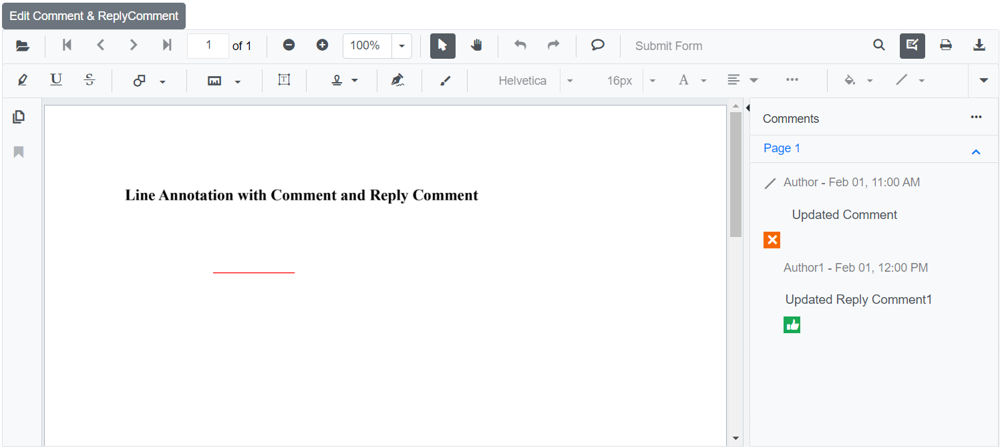
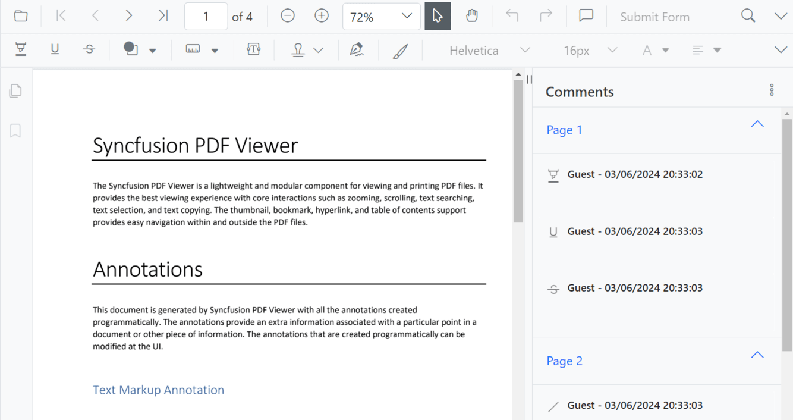
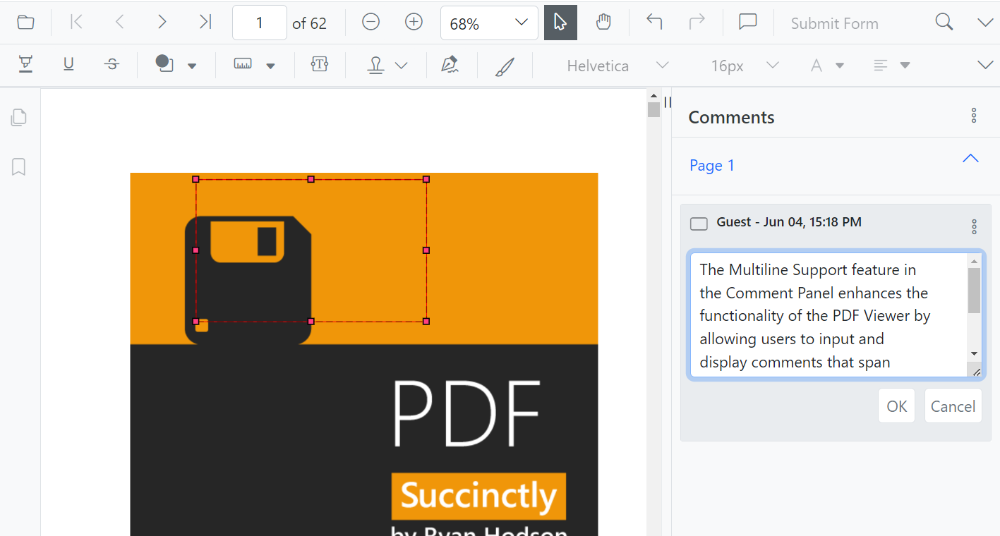

# Comments in Blazor SfPdfViewer Component

The SfPdfViewer component provides options to add, edit, and delete comments for the following annotation types in PDF documents:

* Shape annotation
* Stamp annotation
* Sticky note annotation
* Measurement annotation
* Text markup annotation
* Free text annotation


## Adding a comment to the annotation

Comments, replies, and status can be added to a PDF document using the comment panel.

### Comment panel

Annotation comments can be added using the comment panel. Open the comment panel in any of the following ways:

1. Using the annotation menu.

    * Click the Edit Annotation button in the SfPdfViewer toolbar. A toolbar appears below it.
    * Click the Comment panel button. The comment panel opens.

2. Using the context menu.

    * Select an annotation in the PDF document and right-click it.
    * Select the Comment option in the context menu.

3. Using mouse click.

    * Select an annotation in the PDF document and double-click it to open the comment panel.

If the comment panel is already open, select an annotation and add a comment using the panel.

### Adding comments

* Select an annotation in the PDF document and click it.
* The selected annotation’s comment container is highlighted in the comment panel.
* Add a comment and any required replies using the comment panel.


### Adding Comment Replies

* The SfPdfViewer supports adding multiple replies to a comment.
* After adding an annotation comment, add one or more replies as needed.

### Adding Comment or Reply Status

* Select the annotation comment in the comment panel.
* Click the More options button in the comment or reply container.
* Select Set status in the context menu.
* Choose the required status for the annotation comment.


### Editing the comments and comments replies of the annotations

Edit the comment, its replies, and the status of an annotation using the comment panel.

### Editing Comment or Comment Replies

Edit comments and replies in the following ways:

1. Using the context menu.

    * Select the annotation comment in the comment panel.
    * Click the More options button in the comment or reply container.
    * Select Edit in the context menu.
    * An editable text box appears to change the content of the comment or reply.

2. Using mouse click.

    * Select the annotation comment in the comment panel.
    * Double-click the comment or reply content.
    * An editable text box appears to change the content of the comment or reply.

### Editing Comment or Reply Status

* Select the annotation comment in the comment panel.
* Click the More options button in the comment or reply container.
* Select Set status in the context menu.
* Choose the required status for the annotation comment.
* Status 'None' is the default. Choosing 'None' removes the status indicator from the comment or reply.


### Delete Comment or Comment Replies

* Select the annotation comment in the comment panel.
* Click the More options button in the comment or reply container.
* Select Delete in the context menu.


N> Deleting the root comment from the comment panel also deletes the associated annotation.

### Show or hide the Comment panel

The SfPdfViewer component provides an option to show or hide the comment panel by using the [CommentPanelVisible](https://help.syncfusion.com/cr/blazor/Syncfusion.Blazor.SfPdfViewer.PdfViewerBase.html#Syncfusion_Blazor_SfPdfViewer_PdfViewerBase_CommentPanelVisible) property.

The following code snippet explains how to show the comment panel.

```cshtml

@using Syncfusion.Blazor.Buttons
@using Syncfusion.Blazor.SfPdfViewer

<SfButton OnClick="@OnClick">ShowOrHideCommentPanel</SfButton>
<SfPdfViewer2 @ref="Viewer"
              @bind-CommentPanelVisible="@isOpen"
              DocumentPath=@DocumentPath
              Height="100%"
              Width="100%">
</SfPdfViewer2>

@code
{
    SfPdfViewer2 Viewer;
    //Sets the PDF document path for initial loading.
    private string DocumentPath { get; set; } = "wwwroot/Data/PDF_Succinctly.pdf";

    private bool isOpen = true;
    //Method to update the visibility of the comment panel.

    public void OnClick()
    {
        if(isOpen)
        {
            isOpen = false;
        }
        else
        {
            isOpen = true;
        }
    }
}
```
[View sample in GitHub](https://github.com/SyncfusionExamples/blazor-pdf-viewer-examples/tree/master/Annotations/Comment%20Panel/Show%20or%20hide%20comment%20panel).

## Add Comments and Reply Comments Programmatically

The Blazor SfPdfViewer supports programmatically adding a line annotation with a comment and reply comments using the [AddAnnotationAsync](https://help.syncfusion.com/cr/blazor/Syncfusion.Blazor.SfPdfViewer.PdfViewerBase.html#Syncfusion_Blazor_SfPdfViewer_PdfViewerBase_AddAnnotationAsync_Syncfusion_Blazor_SfPdfViewer_PdfAnnotation_) method.

The following example demonstrates how to add a line annotation with a comment and reply comments to a PDF document:

```cshtml

@using Syncfusion.Blazor.Buttons
@using Syncfusion.Blazor.SfPdfViewer

<SfButton OnClick="@AddCommentandReplyCommentAsync">Add Comment & ReplyComment</SfButton>
<SfPdfViewer2 Width="100%" Height="100%" DocumentPath="@DocumentPath" @ref="@Viewer" />

@code {
    SfPdfViewer2 Viewer;
    public string DocumentPath { get; set; } = "wwwroot/Data/Comment_and_Reply_Comment.pdf";

    public async void AddCommentandReplyCommentAsync(MouseEventArgs args)
    {
        PdfAnnotation annotation = new PdfAnnotation();
        // Set the annotation type of Line
        annotation.Type = AnnotationType.Line;
        // Set the PageNumber starts from 0. So, if set 0 it repersent the page 1.
        annotation.PageNumber = 0;

        // Vertex Points of the Line Annotation
        List<VertexPoint> vertexPoints = new List<VertexPoint>();
        VertexPoint vertexPoint = new VertexPoint();
        vertexPoint.X = 200;
        vertexPoint.Y = 200;
        vertexPoints.Add(vertexPoint);
        vertexPoint = new VertexPoint();
        vertexPoint.X = 300;
        vertexPoint.Y = 200;
        vertexPoints.Add(vertexPoint);
        // Set the VertexPoints of Line annotation
        annotation.VertexPoints = vertexPoints;

        // Add Comment
        annotation.Note = "Add Comment";

        // Add Comment Status
        annotation.Review = new Review();
        annotation.Review.State = "Accepted";

        // Add Comment Author name
        annotation.Author = "Author1";

        // Add Comment Modified Date
        annotation.ModifiedDate = "1/1/2024 10:00:00 AM";

        // Add Reply Comment
        List<Comment> comments = new List<Comment>();
        Comment comment = new Comment();

        // Add First Reply Comment
        comment.Note = "Reply Comment1";
        // Add First Reply Comment Author name
        comment.Author = "Author2";

        // Add First Reply Comment Modified Date
        comment.ModifiedDate = "1/1/2024 11:00:00 AM";

        // Add First Reply Comment Status
        comment.State = "Rejected";
        comments.Add(comment);

        comment = new Comment();
        // Add Second Reply Comment
        comment.Note = "Reply Comment2";

        // Add Second Reply Comment Author name
        comment.Author = "Author3";

        // Add Second Reply Comment Modified Date
        comment.ModifiedDate = "1/1/2024 12:00:00 PM";

        // Add Second Reply Comment Status
        comment.State = "Completed";
        comments.Add(comment);

        // Add Reply Comment
        annotation.Comments = comments;

        // Add Line annotation with Comments and Reply Comments
        await Viewer.AddAnnotationAsync(annotation);
    }
}

```

This code adds a line annotation with a comment and reply comments to the first page of the PDF document.



[View sample in GitHub](https://github.com/SyncfusionExamples/blazor-pdf-viewer-examples/tree/master/Annotations/Programmatic%20Support/Comment/Add).

## Edit Comments and Reply Comments Programmatically

The Blazor SfPdfViewer supports programmatically editing the comment and reply comments of an annotation using the [EditAnnotationAsync](https://help.syncfusion.com/cr/blazor/Syncfusion.Blazor.SfPdfViewer.PdfViewerBase.html#Syncfusion_Blazor_SfPdfViewer_PdfViewerBase_EditAnnotationAsync_Syncfusion_Blazor_SfPdfViewer_PdfAnnotation_) method.

The following example demonstrates how to edit the comment and reply comments programmatically:

```cshtml

@using Syncfusion.Blazor.Buttons
@using Syncfusion.Blazor.SfPdfViewer

<SfButton OnClick="@EditCommentandReplyCommentAsync">Edit Comment & ReplyComment</SfButton>
<SfPdfViewer2 Width="100%" Height="100%" DocumentPath="@DocumentPath" @ref="@Viewer" />

@code {
    SfPdfViewer2 Viewer;
    public string DocumentPath { get; set; } = "wwwroot/Data/Comment_and_Reply_Comment.pdf";

    public async void EditCommentandReplyCommentAsync(MouseEventArgs args)
    {
        // Get annotation collection
        List<PdfAnnotation> annotationCollection = await Viewer.GetAnnotationsAsync();
        // Select the annotation want to edit
        PdfAnnotation annotation = annotationCollection[0];
        // Edit the Comment of Annotation
        annotation.Note = "Updated Comment";
        // Edit the Comment Status of Annotation
        annotation.Review.State = "Cancelled";
        // Edit the Comment Author of Annotation
        annotation.Author = "Author";
        // Edit the Comment ModifiedDate of Annotation
        annotation.ModifiedDate = "2/1/2024 11:00:00 AM";
        // Edit the Reply Comment of Annotation
        annotation.Comments[0].Note = "Updated Reply Comment1";
        // Edit the Reply Comment Status of Annotation
        annotation.Comments[0].State = "Accepted";
        // Edit the Reply Comment Author of Annotation
        annotation.Comments[0].Author = "Author1";
        // Edit the Reply Comment ModifiedDate of Annotation
        annotation.Comments[0].ModifiedDate = "2/1/2024 12:00:00 PM";
        // Delete or Remove Second Reply Comment
        annotation.Comments.RemoveAt(1);
        // Edit the Line Annotation Comments and Reply Comments
        await Viewer.EditAnnotationAsync(annotation);
    }
}

```
This code edits the comment and reply comments programmatically within the SfPdfViewer control.



[View sample in GitHub](https://github.com/SyncfusionExamples/blazor-pdf-viewer-examples/tree/master/Annotations/Programmatic%20Support/Comment/Edit).

## Customizing DateTime Format

The PDF Viewer supports customizing the date and time format displayed in the comment panel using the [PdfViewerCommentPanelSettings](https://help.syncfusion.com/cr/blazor/Syncfusion.Blazor.SfPdfViewer.PdfViewerCommentPanelSettings.html). This feature tailors the appearance of date and time according to preferences or regional standards.

The [DateTimeFormat](https://help.syncfusion.com/cr/blazor/Syncfusion.Blazor.SfPdfViewer.PdfViewerCommentPanelSettings.html#Syncfusion_Blazor_SfPdfViewer_PdfViewerCommentPanelSettings_DateTimeFormat) API in [PdfViewerCommentPanelSettings](https://help.syncfusion.com/cr/blazor/Syncfusion.Blazor.SfPdfViewer.PdfViewerCommentPanelSettings.html) changes the format of the date and time displayed in the comment panel.

The following table describes various supported patterns.

| Format | Result |
|---|---|
| DateTime.Now.ToString("MM/dd/yyyy") | 05/29/2015 |
| DateTime.Now.ToString("dddd, dd MMMM yyyy") | Friday, 29 May 2015 |
| DateTime.Now.ToString("dddd, dd MMMM yyyy HH:mm") | Friday, 29 May 2015 05:50 |
| DateTime.Now.ToString("dddd, dd MMMM yyyy HH:mm tt") | Friday, 29 May 2015 05:50 AM |
| DateTime.Now.ToString("dddd, dd MMMM yyyy H:mm") | Friday, 29 May 2015 5:50 |
| DateTime.Now.ToString("dddd, dd MMMM yyyy H:mm tt") | Friday, 29 May 2015 5:50 AM |
| DateTime.Now.ToString("dddd, dd MMMM yyyy HH:mm:ss") | Friday, 29 May 2015 05:50:06 |
| DateTime.Now.ToString("MM/dd/yyyy HH:mm") | 05/29/2015 05:50 |
| DateTime.Now.ToString("MM/dd/yyyy hh:mm tt") | 05/29/2015 05:50 AM |
| DateTime.Now.ToString("MM/dd/yyyy H:mm") | 05/29/2015 5:50 |
| DateTime.Now.ToString("MM/dd/yyyy h:mm tt") | 05/29/2015 5:50 AM |
| DateTime.Now.ToString("MM/dd/yyyy HH:mm:ss") | 05/29/2015 05:50:06 |
| DateTime.Now.ToString("MMMM dd") | May 29 |
| DateTime.Now.ToString("yyyy'-'MM'-'dd'T'HH':'mm':'ss.fffffffK") | 2015-05-16T05:50:06.7199222-04:00 |
| DateTime.Now.ToString("ddd, dd MMM yyyy HH':'mm':'ss 'GMT'") | Fri, 16 May 2015 05:50:06 GMT |
| DateTime.Now.ToString("yyyy'-'MM'-'dd'T'HH':'mm':'ss") | 2015-05-16T05:50:06 |
| DateTime.Now.ToString("HH:mm") | 05:50 |
| DateTime.Now.ToString("hh:mm tt") | 05:50 AM |
| DateTime.Now.ToString("H:mm") | 5:50 |
| DateTime.Now.ToString("h:mm tt") | 5:50 AM |
| DateTime.Now.ToString("HH:mm:ss") | 05:50:06 |
| DateTime.Now.ToString("yyyy MMMM") | 2015 May |

Here is a sample code snippet demonstrating how to apply this setting.

```cshtml

@using Syncfusion.Blazor.SfPdfViewer; 

<SfPdfViewer2 DocumentPath="@DocumentPath" Height="100%" Width="100%" EnableAnnotationToolbar="true" CommentPanelVisible="true"> 
    <PdfViewerCommentPanelSettings DateTimeFormat=@dateFormat> </PdfViewerCommentPanelSettings>
</SfPdfViewer2> 

@code { 
    // This is a valid C# datetime format 
    private string dateFormat = "dd/MM/yyyy HH:mm:ss"; 
    private string DocumentPath { get; set; } = "wwwroot/Annotation.pdf"; 
} 

```
This code implements date and time formatting for the comment panel of the PDF Viewer.



[View sample in GitHub](https://github.com/SyncfusionExamples/blazor-pdf-viewer-examples/tree/master/Annotations/Comment%20Panel/Customize%20DateTimeFormat).

## Enabling Multiline Support 

Multiline support in the comment panel allows users to input and display comments that span multiple lines. Enable multiline support using the [PdfViewerCommentPanelSettings](https://help.syncfusion.com/cr/blazor/Syncfusion.Blazor.SfPdfViewer.PdfViewerCommentPanelSettings.html).

The [Multiline](https://help.syncfusion.com/cr/blazor/Syncfusion.Blazor.SfPdfViewer.PdfViewerCommentPanelSettings.html#Syncfusion_Blazor_SfPdfViewer_PdfViewerCommentPanelSettings_Multiline) API in [PdfViewerCommentPanelSettings](https://help.syncfusion.com/cr/blazor/Syncfusion.Blazor.SfPdfViewer.PdfViewerCommentPanelSettings.html) enables or disables multiline support in the comment panel.

Here is a sample code snippet demonstrating how to apply this setting.

```cshtml

@using Syncfusion.Blazor.SfPdfViewer; 

<SfPdfViewer2 DocumentPath="@DocumentPath" Height="100%" Width="100%" EnableAnnotationToolbar="true" CommentPanelVisible="true"> 
    <PdfViewerCommentPanelSettings Multiline=@multiline> </PdfViewerCommentPanelSettings> 
</SfPdfViewer2> 

@code {
    // This variable stores the user's choice for enabling or disabling multiline support 
    private bool multiline = true; 
    private string DocumentPath { get; set; } = "wwwroot/Annotation.pdf";
}

```

This code enables multiline support in the comment panel of the PDF Viewer.



[View sample in GitHub](https://github.com/SyncfusionExamples/blazor-pdf-viewer-examples/tree/master/Annotations/Comment%20Panel/Enable%20Multiline%20Support).

## See also

* [How to delete the annotation programmatically](./text-markup-annotation#delete-annotation-programmatically)