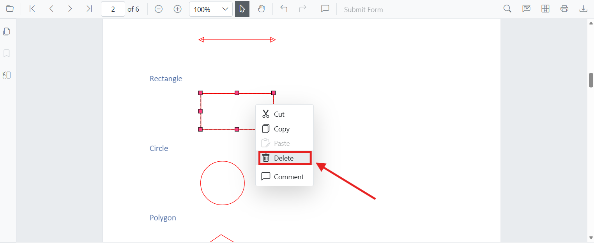

# Remove annotations in Blazor PDF Viewer

Annotations can be removed using the built-in UI or programmatically. This page shows common methods to delete annotations in the Blazor PDF Viewer.

## Delete via UI

A selected annotation can be deleted in the following ways:

- **Context menu**: Right-click the annotation and choose **Delete**.
  
- **Annotation toolbar**: Select the annotation and click the **Delete** button on the annotation toolbar.
  
- **Keyboard**: Select the annotation and press the `Delete` key.

## Delete programmatically

Annotations can be deleted programmatically in the Blazor PDF Viewer using the `DeleteAnnotationAsync` method. You can delete an annotation by passing the annotation object or its ID.

```cshtml
@using Syncfusion.Blazor.Buttons
@using Syncfusion.Blazor.SfPdfViewer

<SfButton OnClick="@DeleteAnnotation">Delete Annotation</SfButton>
<SfPdfViewer2 Width="100%" Height="100%" DocumentPath="@DocumentPath" @ref="Viewer" />

@code {
    SfPdfViewer2 Viewer;
    public string DocumentPath { get; set; } = "wwwroot/Data/Annotation.pdf";

    public async void DeleteAnnotation(MouseEventArgs args)
    {
        // Get the annotation collection
        List<PdfAnnotation> annotationCollection = await Viewer.GetAnnotationsAsync();
        // Select the annotation you want to delete
        PdfAnnotation annotation = annotationCollection[0];
        // Delete the specified PdfAnnotation
        await Viewer.DeleteAnnotationAsync(annotation);
        // Alternatively, you can also delete the specified PdfAnnotation based on AnnotationId
        // await Viewer.DeleteAnnotationAsync(annotation.Id);
    }
}
```

N> Deleting via the API requires the annotation to exist in the current document. You can delete by passing the annotation object or its ID to `DeleteAnnotationAsync`. Ensure the annotation exists before attempting to delete.

[View Sample on GitHub](https://github.com/SyncfusionExamples/blazor-pdf-viewer-examples/tree/master/Annotations/Programmatic%20Support/Delete%20Annotation)

## See also

- [Annotation Overview](../overview)
- [Annotation Types](../annotation/annotation-types/area-annotation)
- [Annotation Toolbar](../toolbar-customization/annotation-toolbar)
- [Create and Modify Annotation](../annotation/create-modify-annotation)
- [Customize Annotation](../annotation/customize-annotation)
- [Handwritten Signature](../annotation/signature-annotation)
- [Export and Import Annotation](../annotation/export-import/export-annotation)
- [Annotation Permission](../annotation/annotation-permission)
- [Annotation in Mobile View](../annotation/annotations-in-mobile-view)
- [Annotation Events](../annotation/annotation-event)
- [Annotation API](../annotation/annotations-api)
