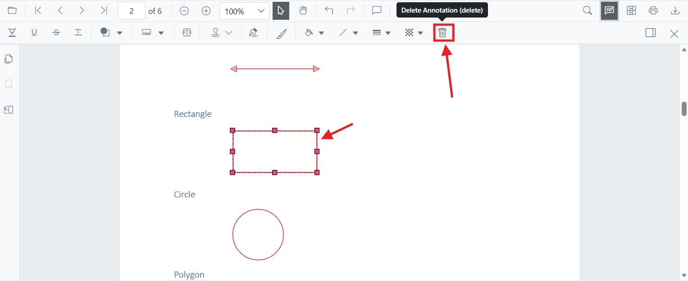

# Remove annotations in Blazor PDF Viewer Component

You can remove annotations using the built-in UI or programmatically through the SfPdfViewer component. This page describes both approaches and applies to Blazor Server and Blazor WebAssembly hosts running on .NET 6.0 or later. The `SfPdfViewer` component (introduced alongside `SfPdfViewer`) is used in the examples below.

## Delete via UI

A selected annotation can be deleted in any of the following ways:

- **Context menu**: Right-click the annotation and choose **Delete**.

    

- **Annotation toolbar**: Select the annotation and click the **Delete** button on the annotation toolbar.

    

- **Keyboard**: Select the annotation and press the `Delete` key. On macOS, the `Backspace` key performs the same action because the macOS `Delete` key maps to Backspace.

## Delete programmatically

You can delete annotations programmatically using the `DeleteAnnotationAsync` method on the `SfPdfViewer` instance. The component exposes two overloads:

- `DeleteAnnotationAsync(PdfAnnotation annotation)` — removes the supplied annotation object.
- `DeleteAnnotationAsync(string annotationId)` — removes the annotation whose `Id` matches the supplied value.

The `GetAnnotationsAsync()` method returns all annotations across the document as `List<PdfAnnotation>`. Use it to locate the annotation you want to remove. To target a single page, call the overload `GetAnnotationsOnPageAsync(pageNumber)` instead. Each `PdfAnnotation` exposes properties such as `Id` (string) and `AnnotationType`.

The following example deletes the first annotation in the loaded document. It uses a null/empty guard to avoid `IndexOutOfRangeException` on documents that have no annotations.

```cshtml
@page "/delete-annotation"
@using System.Collections.Generic
@using Microsoft.AspNetCore.Components.Web
@using Syncfusion.Blazor.Buttons
@using Syncfusion.Blazor.SfPdfViewer

<SfButton OnClick="DeleteAnnotation">Delete Annotation</SfButton>
<SfPdfViewer2 Width="100%" Height="100%" DocumentPath="@DocumentPath" @ref="Viewer" />

@code {
    private SfPdfViewer2 Viewer = default!;
    // Resolve the document path from the static web root so it works regardless of the app's base href.
    private string DocumentPath { get; set; } = "Data/Annotation.pdf";

    private async Task DeleteAnnotation(MouseEventArgs args)
    {
        try
        {
            // Get the annotation collection for the loaded document.
            List<PdfAnnotation> annotationCollection = await Viewer.GetAnnotationsAsync();
            if (annotationCollection is null || annotationCollection.Count == 0)
            {
                return;
            }

            // Select the annotation you want to delete.
            PdfAnnotation annotation = annotationCollection[0];

            // Delete the specified PdfAnnotation.
            await Viewer.DeleteAnnotationAsync(annotation);

            // Alternatively, delete by the annotation's Id.
            // await Viewer.DeleteAnnotationAsync(annotation.Id);
        }
        catch (Exception ex)
        {
            // Handle failure (for example, annotation not found, document not yet loaded, or invalid ID).
            Console.Error.WriteLine($"Failed to delete annotation: {ex.Message}");
        }
    }
}
```

N> Ensure the annotation exists in the currently loaded document before calling `DeleteAnnotationAsync`. Calling the API with an `annotationId` that is not present throws an exception, which the `try/catch` above demonstrates how to handle.

### Undo support

Deletions performed through `DeleteAnnotationAsync` are recorded in the viewer's undo/redo stack. The end user can press `Ctrl+Z` (Windows/Linux) or `Cmd+Z` (macOS), or call the [undo/redo APIs](https://help.syncfusion.com/cr/blazor/Syncfusion.Blazor.SfPdfViewer.PdfViewerBase.html), to restore a deleted annotation.

### Supported annotation types

The API removes any annotation type returned by `GetAnnotationsAsync()`, including text markup (highlight, strikethrough, underline, squiggly), shapes (line, arrow, rectangle, circle, polygon), measurement, free text, ink, stamp, sticky notes, and signature annotations.

[View Sample on GitHub](https://github.com/SyncfusionExamples/blazor-pdf-viewer-examples/tree/master/Annotations/Programmatic%20Support/Delete%20Annotation)

## See also

- [Annotation Overview](../overview)
- [Create and Modify Annotation](../annotation/create-modify-annotation)
- [Customize Annotation](../annotation/customize-annotation)
- [Export and Import Annotation](../annotation/import-export-annotation)
- [Annotation Permission](../annotation/annotation-permission)
- [Annotation in Mobile View](../annotation/annotations-in-mobile-view)
- [Annotation Events](../annotation/events)
