# Free text annotations in Blazor SfPdfViewer Component

The SfPdfViewer component provides options to add, edit, and delete free text annotations.

## Adding a free text annotation to the PDF document

Free text annotations can be added using the annotation toolbar.

* Click the **Edit Annotation** button in the SfPdfViewer toolbar. The annotation toolbar appears.
* Select the **Free Text Annotation** button to enable Free Text Annotation mode.
* Click anywhere on the page to add text to the PDF document.

When Free Text Annotation mode is enabled from Pan, the viewer automatically switches to Text Select mode.

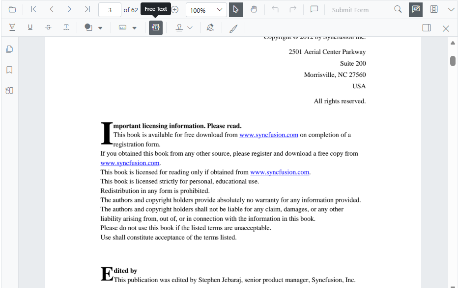

```cshtml

@using Syncfusion.Blazor.Buttons
@using Syncfusion.Blazor.SfPdfViewer

<SfButton OnClick="OnClick">Free Text</SfButton>
<SfPdfViewer2 @ref="viewer" DocumentPath=@DocumentPath Height="100%" Width="100%" ></SfPdfViewer2>

@code {
    SfPdfViewer2 viewer;
    private string DocumentPath { get; set; } = "wwwroot/Data/PDF_Succinctly.pdf";

    public async void OnClick(MouseEventArgs args)
    {
        await viewer.SetAnnotationModeAsync(AnnotationType.FreeText);
    }
}

```

## Editing the properties of free text annotation

The following properties of a free text annotation can be modified from the annotation toolbar: font family, font size, font style, font color, text alignment, fill color, border (stroke) color, border thickness, and opacity. Use the Font Family, Font Size, Font Color, Text Align, Font Style, Edit Color, Edit Stroke Color, Edit Thickness, and Edit Opacity tools to change these settings.

### Editing font family

Change the font family by selecting a font from the Font Family tool.

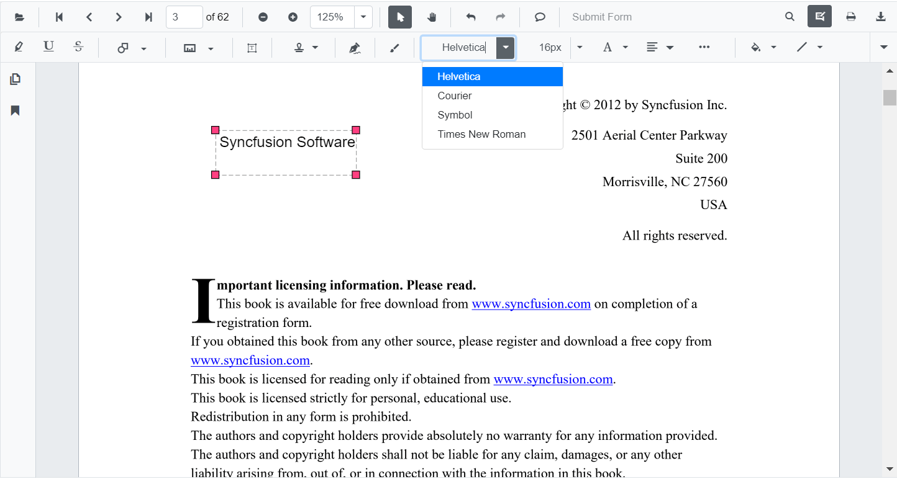

### Editing font size

Change the font size by selecting a value from the Font Size tool.

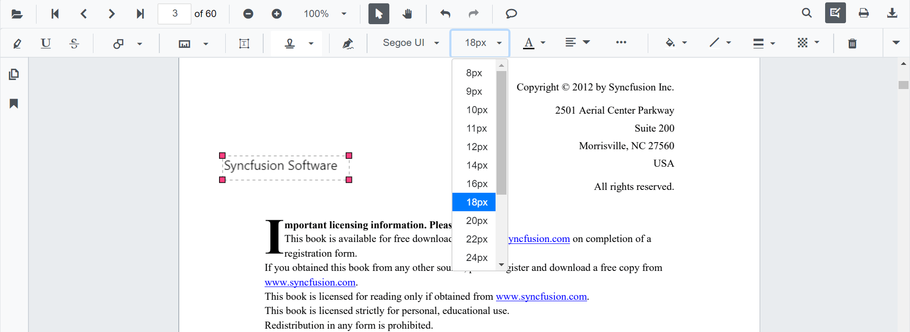

### Editing font color

Change the font color using the color palette in the Font Color tool.

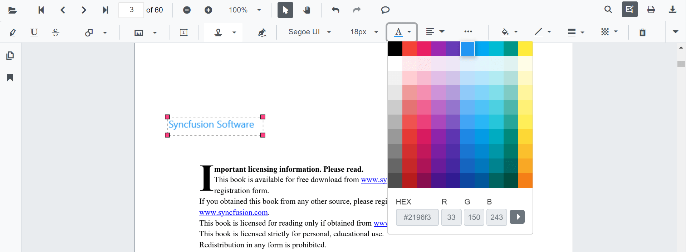

### Editing the text alignment

Align the text by choosing an option from the Text Align tool dropdown.

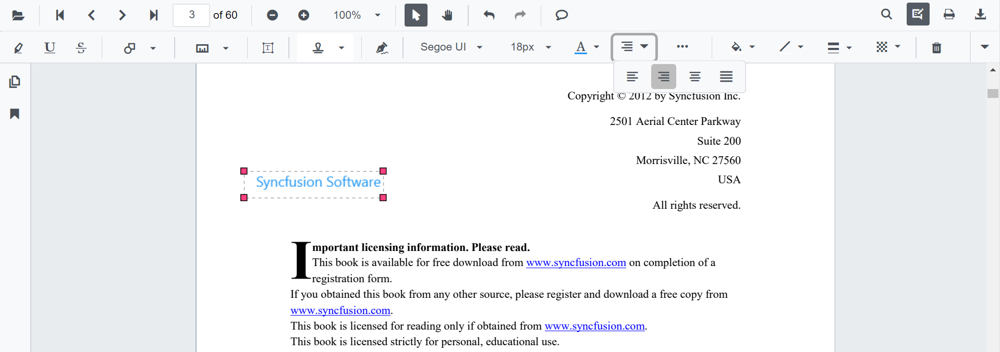

### Editing text styles

Apply bold, italic, underline, or strikethrough from the Font Style tool dropdown.

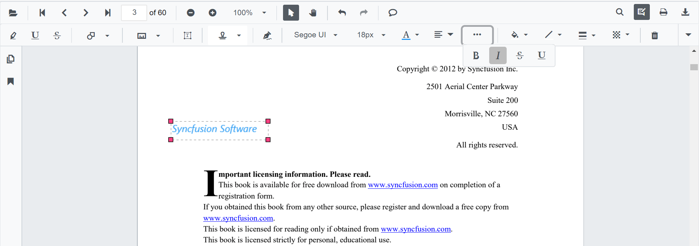

### Editing fill color

Change the fill color using the color palette in the Edit Color tool.

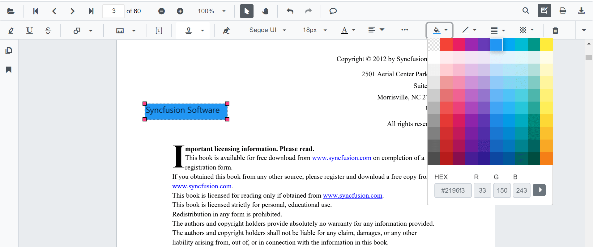

### Editing stroke color

Change the border (stroke) color using the color palette in the Edit Stroke Color tool.

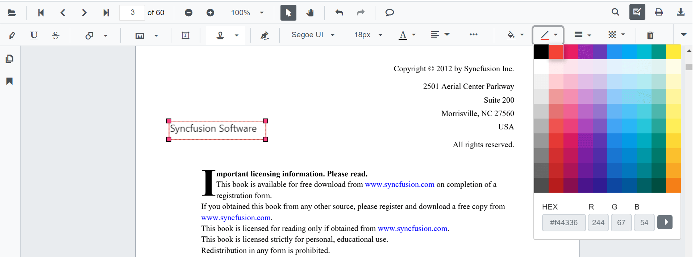

### Editing thickness

Adjust the border thickness using the range slider in the Edit Thickness tool.

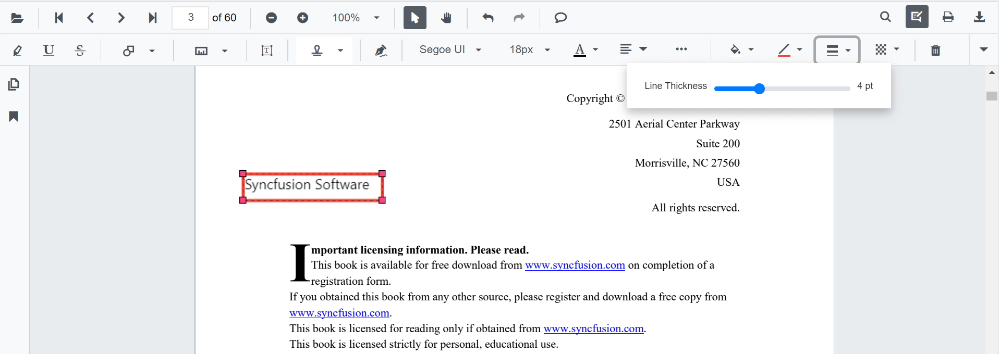

### Editing opacity

Adjust the annotation opacity using the range slider in the Edit Opacity tool.

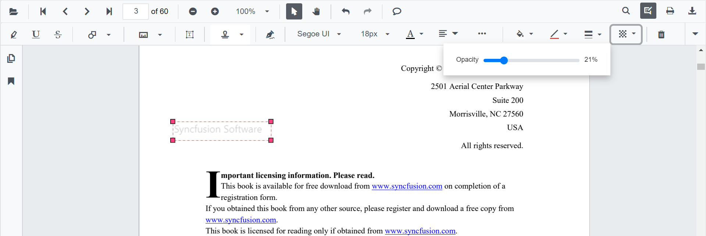

## Setting default properties during control initialization

Default properties for free text annotations can be set during component initialization using [FreeTextSettings](https://help.syncfusion.com/cr/blazor/Syncfusion.Blazor.SfPdfViewer.PdfViewerBase.html#Syncfusion_Blazor_SfPdfViewer_PdfViewerBase_FreeTextSettings). These values apply to newly created annotations. Any subsequent changes made from the annotation toolbar affect only annotations created afterward.

```cshtml

@using Syncfusion.Blazor.SfPdfViewer

<SfPdfViewer2 @ref="viewer" DocumentPath=@DocumentPath Height="100%" Width="100%" 
FreeTextSettings=@FreeTextSettings></SfPdfViewer2>

@code {
    SfPdfViewer2 viewer;
    private string DocumentPath { get; set; } = "wwwroot/Data/PDF_Succinctly.pdf";
    
    PdfViewerFreeTextSettings FreeTextSettings = new PdfViewerFreeTextSettings 
    { 
        FillColor = "green", 
        BorderColor = "blue", 
        FontColor = "yellow" 
    };
}

```

Autofit support for free text annotations can be enabled using the [AutoFit](https://help.syncfusion.com/cr/blazor/Syncfusion.Blazor.SfPdfViewer.PdfViewerFreeTextSettings.html#Syncfusion_Blazor_SfPdfViewer_PdfViewerFreeTextSettings_AutoFit) property in PdfViewerFreeTextSettings. When enabled, the width of the free text rectangle expands based on the entered text.

```cshtml

@using Syncfusion.Blazor.SfPdfViewer

<SfPdfViewer2 DocumentPath="@DocumentPath" @ref="@Viewer" Height="100%" Width="100%">
    <PdfViewerFreeTextSettings AutoFit="true"></PdfViewerFreeTextSettings>
</SfPdfViewer2>

@code {
    SfPdfViewer2? Viewer;
    public string DocumentPath { get; set; } = "https://cdn.syncfusion.com/content/pdf/pdf-succinctly.pdf";
}

```
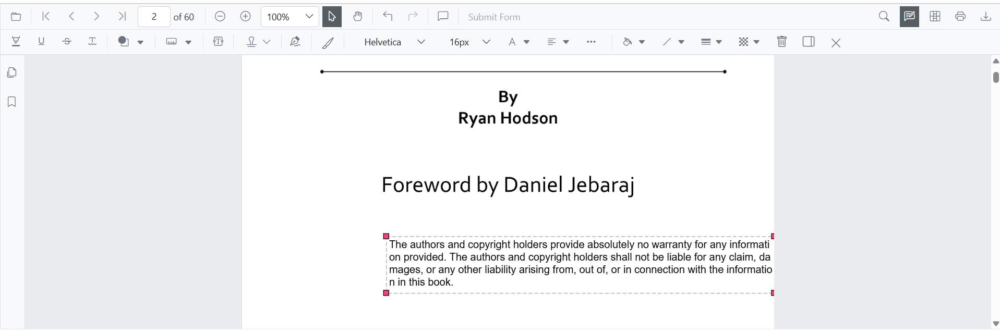
[View sample in GitHub](https://github.com/SyncfusionExamples/blazor-pdf-viewer-examples/tree/master/Annotations/FreeText/FreeText%20Annotation%20with%20enable%20AutoFit).

## Add free text annotation programmatically

Blazor SfPdfViewer supports programmatically adding free text annotations using the [AddAnnotationAsync](https://help.syncfusion.com/cr/blazor/Syncfusion.Blazor.SfPdfViewer.PdfViewerBase.html#Syncfusion_Blazor_SfPdfViewer_PdfViewerBase_AddAnnotationAsync_Syncfusion_Blazor_SfPdfViewer_PdfAnnotation_) method.

The following example demonstrates adding a free text annotation to a PDF document:

```cshtml

@using Syncfusion.Blazor.Buttons
@using Syncfusion.Blazor.SfPdfViewer

<SfButton OnClick="@AddFreeTextAnnotationAsync">Add FreeText Annotation</SfButton>
<SfPdfViewer2 Width="100%" Height="100%" DocumentPath="@DocumentPath" @ref="@Viewer" />

@code {
    SfPdfViewer2 Viewer;
    public string DocumentPath { get; set; } = "wwwroot/Data/Free_Text_Annotation.pdf";

    public async void AddFreeTextAnnotationAsync(MouseEventArgs args)
    {
        PdfAnnotation annotation = new PdfAnnotation();
        // Set the annotation type of free text
        annotation.Type = AnnotationType.FreeText;
        // Set the PageNumber starts from 0. So, if set 0 it repersent the page 1.
        annotation.PageNumber = 0;

        // Bound of the free text annotation
        annotation.Bound = new Bound();
        annotation.Bound.X = 200;
        annotation.Bound.Y = 150;
        annotation.Bound.Width = 150;
        annotation.Bound.Height = 30;
        // Add free text annotation
        await Viewer.AddAnnotationAsync(annotation);
    }
}

```

This example adds a free text annotation to the first page of the document.

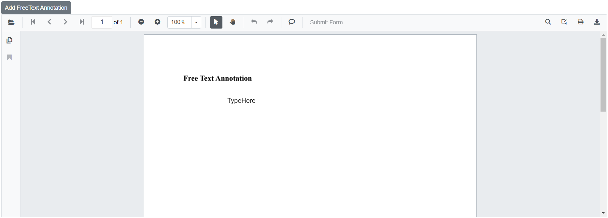

[View sample in GitHub](https://github.com/SyncfusionExamples/blazor-pdf-viewer-examples/tree/master/Annotations/Programmatic%20Support/Free%20Text/Add).

## Edit free text annotation programmatically

Blazor SfPdfViewer supports programmatically editing free text annotations using the [EditAnnotationAsync](https://help.syncfusion.com/cr/blazor/Syncfusion.Blazor.SfPdfViewer.PdfViewerBase.html#Syncfusion_Blazor_SfPdfViewer_PdfViewerBase_EditAnnotationAsync_Syncfusion_Blazor_SfPdfViewer_PdfAnnotation_) method.

The following example demonstrates editing a free text annotation programmatically:

```cshtml

@using Syncfusion.Blazor.Buttons
@using Syncfusion.Blazor.SfPdfViewer

<SfButton OnClick="@EditFreeTextAnnotationAsync">Edit FreeText Annotation</SfButton>
<SfPdfViewer2 Width="100%" Height="100%" DocumentPath="@DocumentPath" @ref="@Viewer" />

@code {
    SfPdfViewer2 Viewer;
    public string DocumentPath { get; set; } = "wwwroot/Data/Free_Text_Annotation.pdf";

    public async void EditFreeTextAnnotationAsync(MouseEventArgs args)
    {
        // Get annotation collection
        List<PdfAnnotation> annotationCollection = await Viewer.GetAnnotationsAsync();
        // Select the annotation want to edit
        PdfAnnotation annotation = annotationCollection[0];
        // Change the position of the free text annotation
        annotation.Bound.X = 125;
        annotation.Bound.Y = 125;
        // Change the width and height of the free text annotation
        annotation.Bound.Width = 250;
        annotation.Bound.Height = 40;
        // Change the font style of free text annotation like bold, italic, underline strikethrough
        annotation.FontStyle = FontStyle.Bold | FontStyle.Italic;
        // Change the font size of free text annotation
        annotation.FontSize = 20;
        // Change the font color of free text annotation
        annotation.FontColor = "#00008B";
        // Change the font family of free text annotation
        annotation.FontFamily = "Symbol";
        // Change the border width of free text annotation
        annotation.BorderWidth = 3;
        // Change the border color of free text annotation
        annotation.BorderColor = "#000000";
        // Change the text of free text annotation
        annotation.DynamicText = "Modified Free Text";
        // Change the text align of free text annotation
        annotation.TextAlignment = TextAlignment.Center;
        // Change the fill color of free text annotation
        annotation.FillColor = "#FFFF00";
        // Change the Opacity (0 to 1) of free text annotation
        annotation.Opacity = 0.5;
        // Edit the free text annotation
        await Viewer.EditAnnotationAsync(annotation);
    }
}

```

This example updates the position, size, appearance, and content of a free text annotation.

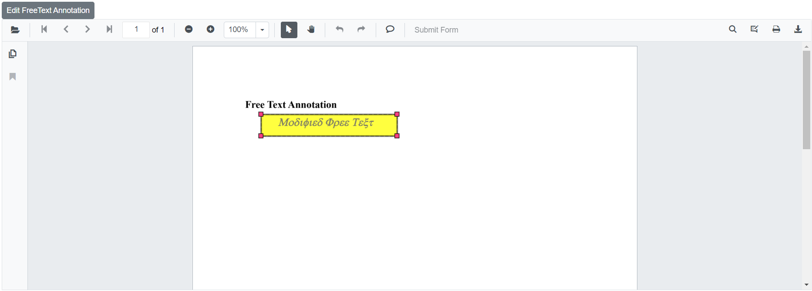

[View sample in GitHub](https://github.com/SyncfusionExamples/blazor-pdf-viewer-examples/tree/master/Annotations/Programmatic%20Support/Free%20Text/Edit).

## Custom Font Support for FreeText Annotation

The Blazor SfPdfViewer supports loading, editing, and saving custom fonts in FreeText annotations using the [FallbackFontCollection](https://help.syncfusion.com/cr/blazor/Syncfusion.Blazor.SfPdfViewer.PdfViewerBase.html#Syncfusion_Blazor_SfPdfViewer_PdfViewerBase_FallbackFontCollection) and [FontFamilies](https://help.syncfusion.com/cr/blazor/Syncfusion.Blazor.SfPdfViewer.PdfViewerBase.html#Syncfusion_Blazor_SfPdfViewer_PdfViewerBase_FontFamilies) properties.

### Loading Custom Font Collection in SfPdfViewer
If a custom font is not installed on the system, use FallbackFontCollection to ensure FreeText annotations are saved with the desired font. The following example loads Arial Black and Courier New as TTF files.

```cshtml
@using Syncfusion.Blazor;
@using Syncfusion.Blazor.SfPdfViewer;

<SfPdfViewer2 @ref="pdfViewer" Height="100%" Width="100%" DocumentPath="@DocumentPath">
    <PdfViewerEvents Created="@Created"></PdfViewerEvents>
</SfPdfViewer2>

@code {
    private SfPdfViewer2? pdfViewer;
    private string DocumentPath { get; set; } = "wwwroot/PDF/Arial Black.pdf";

    public void Created()
    {
        // Use FallbackFontCollection to save the custom font
        // Maps the font family name to its corresponding TTF file as a memory stream  
        pdfViewer.FallbackFontCollection.Add("Arial", new MemoryStream(System.IO.File.ReadAllBytes("wwwroot/Fonts/ARIAL.ttf")));
        pdfViewer.FallbackFontCollection.Add("Arial Black", new MemoryStream(System.IO.File.ReadAllBytes("wwwroot/Fonts/ARIBLK.ttf")));
        pdfViewer.FallbackFontCollection.Add("Courier New", new MemoryStream(System.IO.File.ReadAllBytes("wwwroot/Fonts/COUR.ttf")));
    }
}

```
### Adding Custom Font Families to the Annotation Toolbar Dropdown

Use the FontFamilies property to add custom font families to the Font Family dropdown in the annotation toolbar.

```cshtml
@using Syncfusion.Blazor;
@using Syncfusion.Blazor.SfPdfViewer;

<SfPdfViewer2 @ref="pdfViewer" Height="100%" Width="100%" DocumentPath="@DocumentPath" FontFamilies="@FontFamilies">
</SfPdfViewer2>

@code {
    private SfPdfViewer2? pdfViewer;
    
    // Use the FontFamilies property to add custom font families to the Font Family dropdown in the annotation toolbar
    internal string[] FontFamilies { get; set; } = { "Helvetica", "Courier", "Symbol", "Times New Roman", "Arial Black", "Courier New", "Arial" };
    private string DocumentPath { get; set; } = "wwwroot/PDF/Arial Black.pdf";
}
```

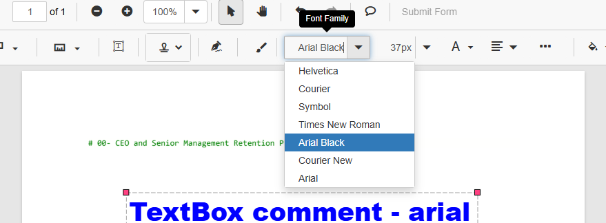


The following example demonstrates loading, editing, and saving custom fonts in FreeText annotations:

```cshtml
@using Syncfusion.Blazor;
@using Syncfusion.Blazor.SfPdfViewer;

<SfPdfViewer2 @ref="pdfViewer" Height="100%" Width="100%" DocumentPath="@DocumentPath" FontFamilies="@FontFamilies">
    <PdfViewerEvents Created="@Created"></PdfViewerEvents>
</SfPdfViewer2>

@code {
    private SfPdfViewer2? pdfViewer;

    // Use the FontFamilies property to add custom font families to the annotation toolbar dropdown
    internal string[] FontFamilies { get; set; } = { "Helvetica", "Courier", "Symbol", "Times New Roman", "Arial Black", "Courier New", "Arial" };

    private string DocumentPath { get; set; } = "wwwroot/PDF/Arial Black.pdf";

    public void Created()
    {
        // Use FallbackFontCollection to save the custom font
        // Maps the font family name to its corresponding TTF file as a memory stream  
        pdfViewer.FallbackFontCollection.Add("Arial", new MemoryStream(System.IO.File.ReadAllBytes("wwwroot/Fonts/ARIAL.ttf")));
        pdfViewer.FallbackFontCollection.Add("Arial Black", new MemoryStream(System.IO.File.ReadAllBytes("wwwroot/Fonts/ARIBLK.ttf")));
        pdfViewer.FallbackFontCollection.Add("Courier New", new MemoryStream(System.IO.File.ReadAllBytes("wwwroot/Fonts/COUR.ttf")));
    }
}
```

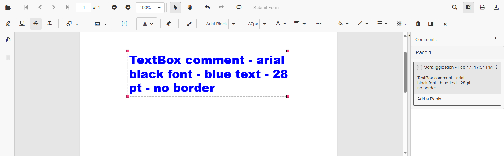

[View sample in GitHub](https://github.com/SyncfusionExamples/blazor-pdf-viewer-examples/tree/master/Annotations/FreeText/Custom%20Font%20Support%20For%20FreeText%20Annotation).

To ensure accurate rendering when using Google API fonts in the PDF Viewer component, load these fonts in the application as well. FreeText annotations render directly on the canvas, so the fonts must be available at runtime.

The following example illustrates loading custom fonts in FreeText annotations using fonts from Google Fonts or other external sources.

```cshtml
<script>
    window.addEventListener('DOMContentLoaded', () => {
        var fontFamily = ["Allura, Tangerine, Sacramento, Inspiration"];
        for (var fontIndex=0; fontIndex<fontFamily.length; fontIndex++)
        {
            document.fonts.load(`16px ${fontFamily[fontIndex]}`).then(() => {
                console.log(`Font "${fontFamily[fontIndex]}" loaded successfully.`);
            }).catch(err => {
                console.error(`Failed to load font "${font}":`, err);
            });
        }
    });
</script>
```

>**Note:** If external fonts are not properly loaded in the environment, slight inconsistencies may occur when importing and rendering free text annotations that use those fonts. This typically affects fonts referenced from web-based sources.

[View sample in GitHub](https://github.com/SyncfusionExamples/blazor-pdf-viewer-examples/tree/master/Annotations/FreeText/Load%20Custom%20Font%20From%20External%20Links).

## See also

* [How to delete the annotation programmatically](./text-markup-annotation#delete-annotation-programmatically)

* [How to Load the Font Collection in SfPdfViewer](../faqs/how-to-load-font-collection)