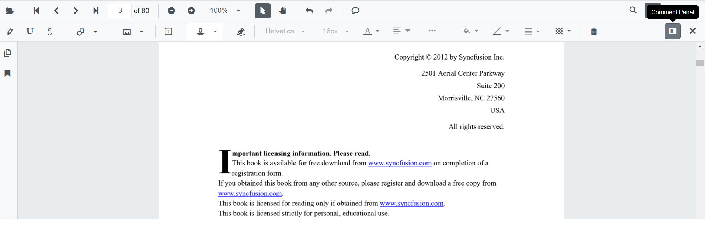
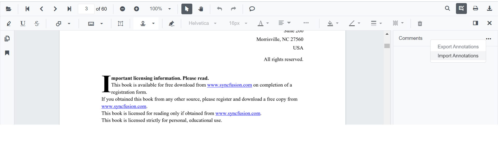
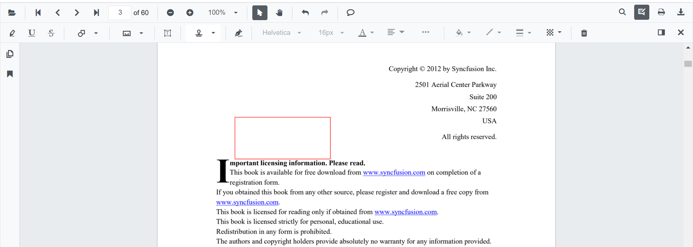
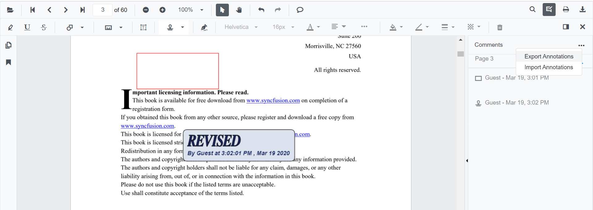

# Import and Export annotations in Blazor SfPdfViewer Component

The SfPdfViewer component supports importing and exporting annotations as a JSON object in the loaded PDF document. The following sections describe how to perform these actions through the built-in toolbar and programmatically using the API.

* Select Add or Edit annotation in the SfPdfViewer toolbar to enable the annotation tools.


* The annotation toolbar appears.
* Select Comment Panel in the annotation toolbar.



* The comment panel is displayed.
* Select **More Option** in the comment panel container.


## Importing annotation to the PDF document

* Select Add or Edit annotation in the SfPdfViewer toolbar.
* The annotation toolbar appears.
* Select Comment Panel in the annotation toolbar.
* The comment panel is displayed.
* Select **More Option** in the comment panel container.
* Choose Import Annotations.



* A file explorer dialog opens. Choose the JSON file to import into the loaded PDF document.



## Importing annotation using SfPdfViewer API

Annotations can also be imported from a JSON file or JSON object in code-behind, as shown in the following example. The sample uses the SfPdfViewer2 component and its ImportAnnotationAsync method.

```cshtml

@using Syncfusion.Blazor.Buttons
@using Syncfusion.Blazor.SfPdfViewer

<SfButton OnClick="@OnImportAnnotationsClick">Import Annotation</SfButton>
<SfPdfViewer2 Width="100%" Height="100%" DocumentPath="@DocumentPath" @ref="@Viewer" />

@code {
    SfPdfViewer2 Viewer;
    public string DocumentPath { get; set; } = "wwwroot/Data/PDF_Succinctly.pdf";

    public async void OnImportAnnotationsClick(MouseEventArgs args)
    {
        //The json file has been placed inside the data folder.
        byte[] bytes = System.IO.File.ReadAllBytes("wwwroot/Data/PDF_Succinctly.json");
        await Viewer.ImportAnnotationAsync(new MemoryStream(bytes));
    }
}

```

[View sample in GitHub](https://github.com/SyncfusionExamples/blazor-pdf-viewer-examples/tree/master/Annotations/Import-Export/Annotations%20as%20JSON%20object).

N> Ensure that the JSON file used for importing annotations is available at the specified path. Paths are case-sensitive in some hosting environments.

## Exporting annotation from the PDF document

The SfPdfViewer component supports exporting annotations as a JSON file or JSON object using the annotation toolbar.

* Select Add or Edit annotation in the SfPdfViewer toolbar.
* The annotation toolbar appears.
* Select Comment Panel in the annotation toolbar.
* The comments panel is displayed.
* Select **More Option** in the comments panel container.
* Choose Export Annotations.



N> The Export Annotations option is disabled when the loaded PDF document does not contain any annotations.

## Exporting annotation using SfPdfViewer API

Annotations can also be exported as a JSON file in code-behind using the ExportAnnotationAsync method, as shown in the following example.

```cshtml

@using Syncfusion.Blazor.SfPdfViewer
@using Syncfusion.Blazor.Buttons

<SfButton OnClick="@OnExportAnnotationsClick">Export Annotation</SfButton>
<SfPdfViewer2 Width="100%" Height="100%" DocumentPath="@DocumentPath" @ref="@Viewer" />

@code {
    SfPdfViewer2 Viewer;
    public string DocumentPath { get; set; } = "wwwroot/data/PDF_Succinctly.pdf";

    public async void OnExportAnnotationsClick(MouseEventArgs args)
    {
        await Viewer.ExportAnnotationAsync();
    }
}

```
[View sample in GitHub](https://github.com/SyncfusionExamples/blazor-pdf-viewer-examples/tree/master/Annotations/Import-Export/Annotations%20as%20JSON%20stream%20and%20file).

## See also

* [How to import annotations as objects](../how-to/import-annotations-as-objects)