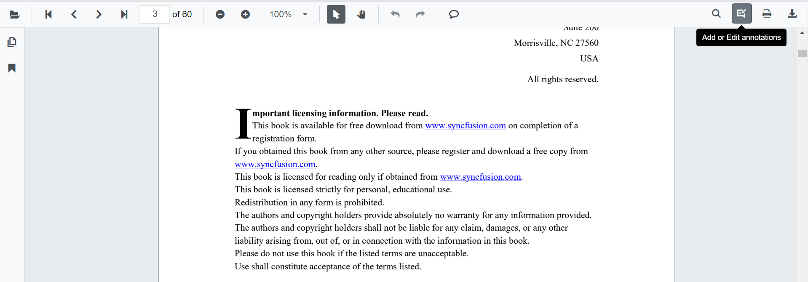
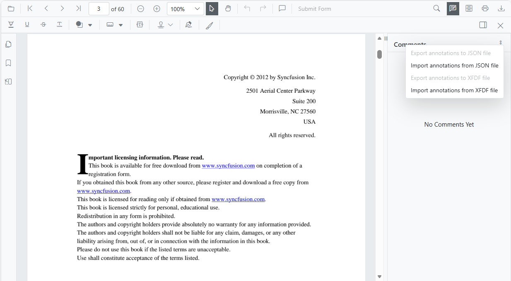
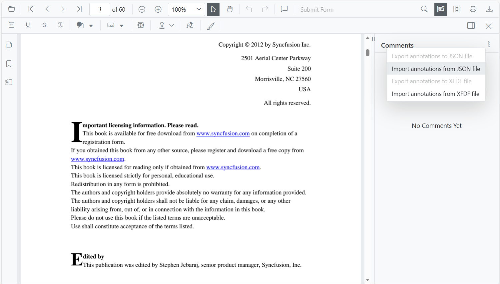
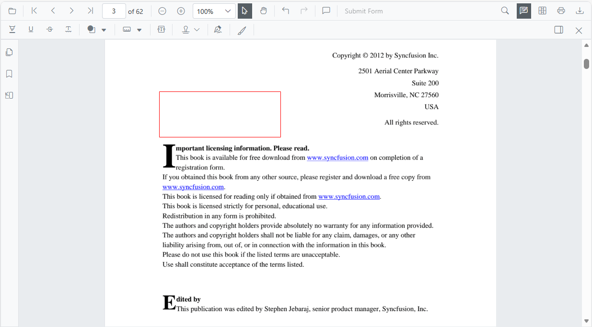
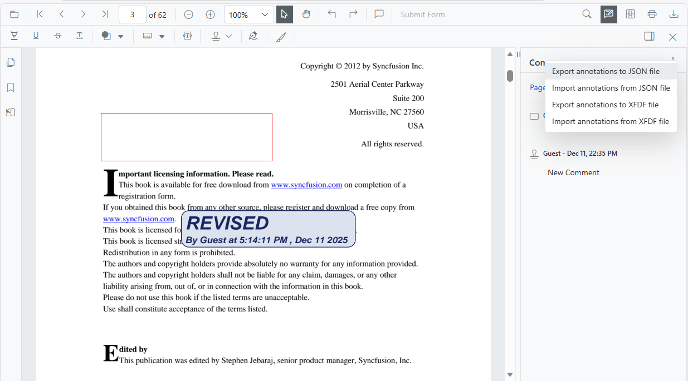

# Import and Export annotations in Blazor SfPdfViewer Component

The SfPdfViewer component supports importing and exporting annotations as a JSON object in the loaded PDF document. The following sections describe how to perform these actions through the built-in toolbar and programmatically using the API.

* Select Add or Edit annotation in the SfPdfViewer toolbar to enable the annotation tools.



* The annotation toolbar appears.
* Select Comment Panel in the annotation toolbar.


* The comment panel is displayed.
* Select **More Option** in the comment panel container.



## Importing annotation to the PDF document

* Select Add or Edit annotation in the SfPdfViewer toolbar.
* The annotation toolbar appears.
* Select Comment Panel in the annotation toolbar.
* The comment panel is displayed.
* Select **More Option** in the comment panel container.
* Choose Import Annotations.



* A file explorer dialog opens. Choose the JSON file to import into the loaded PDF document.



## Importing annotation using SfPdfViewer API

Annotations can also be imported from a JSON or XFDF file, or from an in-memory object, in code-behind using the [ImportAnnotationAsync](https://help.syncfusion.com/cr/blazor/Syncfusion.Blazor.SfPdfViewer.PdfViewerBase.html#Syncfusion_Blazor_SfPdfViewer_PdfViewerBase_ImportAnnotationAsync_System_IO_Stream_Syncfusion_Blazor_SfPdfViewer_AnnotationDataFormat_) method. The following example uses the SfPdfViewer2 component.

Supported formats:
- [JSON](https://help.syncfusion.com/cr/blazor/Syncfusion.Blazor.SfPdfViewer.AnnotationDataFormat.html#Syncfusion_Blazor_SfPdfViewer_AnnotationDataFormat_Json)
- [XFDF](https://help.syncfusion.com/cr/blazor/Syncfusion.Blazor.SfPdfViewer.AnnotationDataFormat.html#Syncfusion_Blazor_SfPdfViewer_AnnotationDataFormat_Xfdf)

```cshtml

@using Syncfusion.Blazor.Buttons
@using Syncfusion.Blazor.SfPdfViewer

<SfButton OnClick="@OnImportAnnotationsJson">Import Annotation JSON</SfButton>
<SfButton OnClick="@OnImportAnnotationsXfdf">Import Annotation XFDF</SfButton>
<SfPdfViewer2 Width="100%" Height="100%" DocumentPath="@DocumentPath" @ref="@Viewer" />

@code {
    SfPdfViewer2 Viewer;
    public string DocumentPath { get; set; } = "wwwroot/Data/PDF_Succinctly.pdf";

    public async void OnImportAnnotationsJson(MouseEventArgs args)
    {
        //The json file has been placed inside the data folder.
        byte[] bytes = System.IO.File.ReadAllBytes("wwwroot/Data/PDF_Succinctly.json");
        await Viewer.ImportAnnotationAsync(new MemoryStream(bytes), AnnotationDataFormat.Json);
    }

    public async void OnImportAnnotationsXfdf(MouseEventArgs args)
    {
        //The json file has been placed inside the data folder.
        byte[] bytes = System.IO.File.ReadAllBytes("wwwroot/Data/PDF_Succinctly.xfdf");
        await Viewer.ImportAnnotationAsync(new MemoryStream(bytes), AnnotationDataFormat.Xfdf);
    }
}

```

[View sample in GitHub](https://github.com/SyncfusionExamples/blazor-pdf-viewer-examples/tree/master/Annotations/Import-Export/Annotations%20as%20JSON%20object).

N> Ensure that the JSON file used for importing annotations is available at the specified path. Paths are case-sensitive in some hosting environments.

## Exporting annotation from the PDF document

The SfPdfViewer component supports exporting annotations as a JSON file or JSON object using the annotation toolbar.

* Select Add or Edit annotation in the SfPdfViewer toolbar.
* The annotation toolbar appears.
* Select Comment Panel in the annotation toolbar.
* The comments panel is displayed.
* Select **More Option** in the comments panel container.
* Choose Export Annotations.



N> The Export Annotations option is disabled when the loaded PDF document does not contain any annotations.

## Exporting annotation using SfPdfViewer API

Annotations can also be exported as a file or as a stream in code-behind using the [ExportAnnotationAsync](https://help.syncfusion.com/cr/blazor/Syncfusion.Blazor.SfPdfViewer.PdfViewerBase.html#Syncfusion_Blazor_SfPdfViewer_PdfViewerBase_ExportAnnotationAsync_Syncfusion_Blazor_SfPdfViewer_AnnotationDataFormat_) and [ExportAnnotationAsStreamAsync](https://help.syncfusion.com/cr/blazor/Syncfusion.Blazor.SfPdfViewer.PdfViewerBase.html#Syncfusion_Blazor_SfPdfViewer_PdfViewerBase_ExportAnnotationAsStreamAsync_Syncfusion_Blazor_SfPdfViewer_AnnotationDataFormat_) methods. Supported formats:

- [JSON](https://help.syncfusion.com/cr/blazor/Syncfusion.Blazor.SfPdfViewer.AnnotationDataFormat.html#Syncfusion_Blazor_SfPdfViewer_AnnotationDataFormat_Json)
- [XFDF](https://help.syncfusion.com/cr/blazor/Syncfusion.Blazor.SfPdfViewer.AnnotationDataFormat.html#Syncfusion_Blazor_SfPdfViewer_AnnotationDataFormat_Xfdf)

```cshtml

@using Syncfusion.Blazor.SfPdfViewer
@using Syncfusion.Blazor.Buttons

<SfButton OnClick="@OnExportAnnotationsJson">Export Annotation as Json</SfButton>
<SfButton OnClick="@OnExportAnnotationsXfdf">Export Annotation as Xfdf</SfButton>
<SfButton OnClick="@OnExportAsStreamJson">Export Stream as Json</SfButton>
<SfButton OnClick="@OnExportAsStreamXfdf">Export Stream as Xfdf</SfButton>
<SfButton OnClick="@OnImportStreamJson">Import Annotation JSON</SfButton>
<SfButton OnClick="@OnImportStreamXfdf">Import Annotation XFDF</SfButton>
<SfPdfViewer2 Width="100%" Height="100%" DocumentPath="@DocumentPath" @ref="@Viewer" />

@code {
    SfPdfViewer2 Viewer;
    public string DocumentPath { get; set; } = "wwwroot/data/PDF_Succinctly.pdf";
    private Stream? annotationStreamJson;
    private Stream? annotationStreamXfdf;
    public async void OnExportAnnotationsJson(MouseEventArgs args)
    {
        await Viewer.ExportAnnotationAsync(AnnotationDataFormat.Json);
    }
    public async void OnExportAnnotationsXfdf(MouseEventArgs args)
    {
        await Viewer.ExportAnnotationAsync(AnnotationDataFormat.Xfdf);
    }
    public async Task OnExportAsStreamJson(MouseEventArgs args)
    {
        annotationStreamJson = await Viewer.ExportAnnotationAsStreamAsync(AnnotationDataFormat.Json);
    }
    public async Task OnExportAsStreamXfdf(MouseEventArgs args)
    {
        annotationStreamXfdf = await Viewer.ExportAnnotationAsStreamAsync(AnnotationDataFormat.Xfdf);
    }
    public async void OnImportStreamJson(MouseEventArgs args)
    {
        await Viewer.ImportAnnotationAsync(annotationStreamJson, AnnotationDataFormat.Json);
    }
    public async void OnImportStreamXfdf(MouseEventArgs args)
    {
        await Viewer.ImportAnnotationAsync(annotationStreamXfdf, AnnotationDataFormat.Xfdf);
    }
}

```
[View sample in GitHub](https://github.com/SyncfusionExamples/blazor-pdf-viewer-examples/tree/master/Annotations/Import-Export/Annotations%20as%20JSON%20stream%20and%20file).

## See also

* [How to import annotations as objects](../faqs/how-to-import-annotations-as-objects)