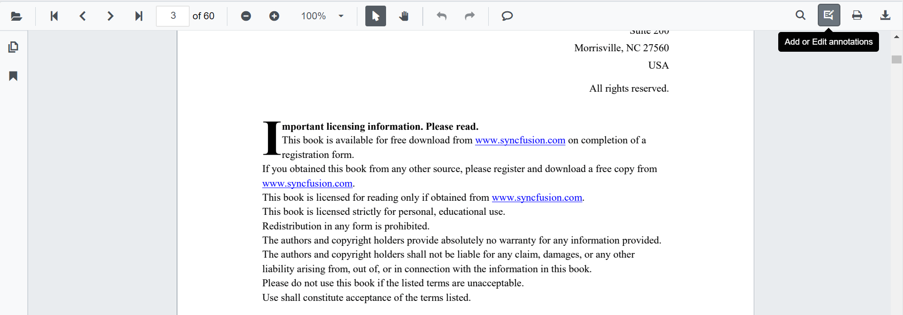
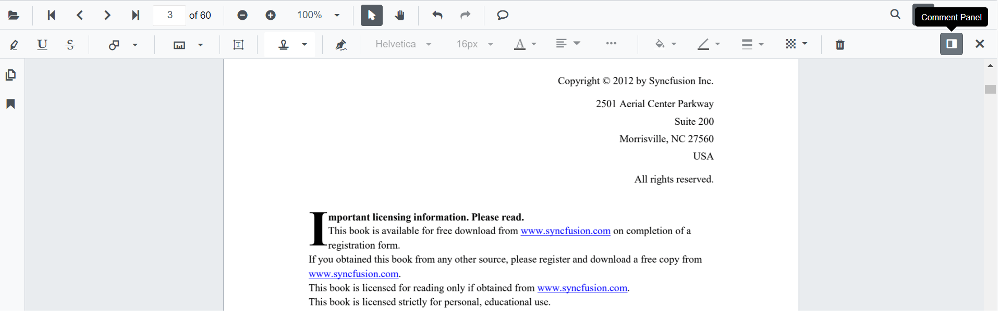
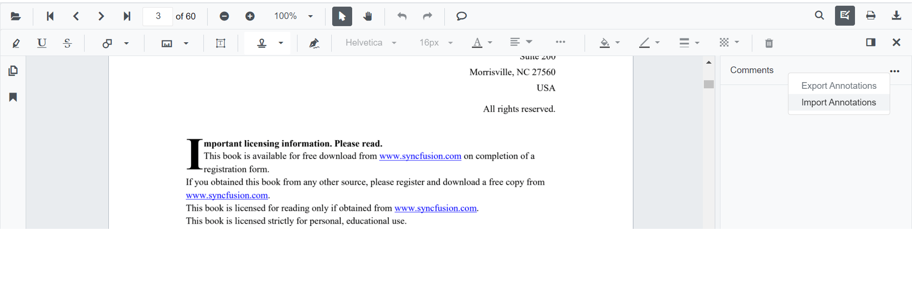
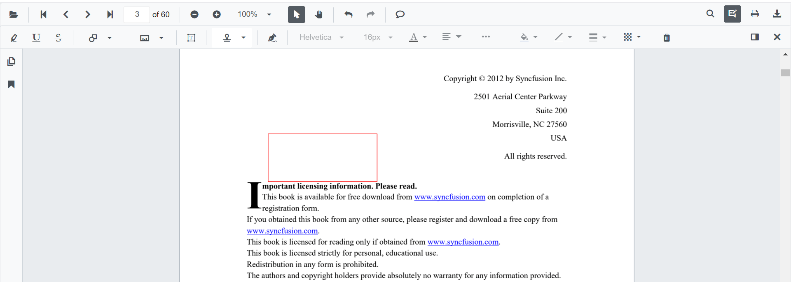
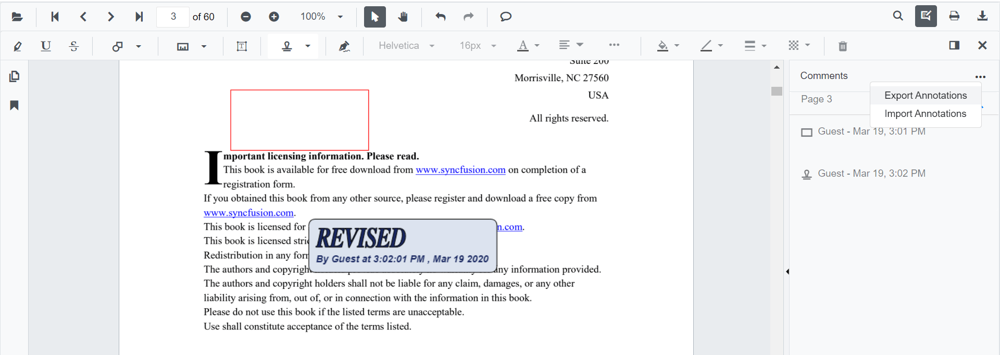

# Import and Export annotations in Blazor SfPdfViewer Component

The SfPdfViewer component supports importing and exporting annotations as a JSON or XFDF object in the loaded PDF document. The following sections describe how to perform these actions through the built-in toolbar and programmatically using the API.

## Displaying the comment panel

The import and export actions in the toolbar are reached through the comment panel. Use the following steps to display it before performing either action.

* Select **Edit Annotation** in the SfPdfViewer toolbar to enable the annotation tools.



* The annotation toolbar appears.
* Select **Comment Panel** in the annotation toolbar.



* The comment panel is displayed.
* Select **More Options** in the comment panel container.


## Importing annotations from the PDF document

Follow the steps below to import annotations into the loaded PDF document through the toolbar.

* Display the comment panel as described in [Displaying the comment panel](#displaying-the-comment-panel).
* Choose **Import Annotations**.



* A file explorer dialog opens. Choose the JSON or XFDF file to import into the loaded PDF document.



> The file you import must follow the Syncfusion annotation JSON schema. Use [Export Annotations](#exporting-annotations-from-the-pdf-document) to generate a reference file, or see the [sample on GitHub](https://github.com/SyncfusionExamples/blazor-pdf-viewer-examples/tree/master/Annotations/Import-Export/Annotations%20as%20JSON%20object).

## Importing annotations using SfPdfViewer API

Annotations can be imported from a JSON or XFDF file, or from an in-memory stream, in code-behind using the [ImportAnnotationAsync](https://help.syncfusion.com/cr/blazor/Syncfusion.Blazor.SfPdfViewer.PdfViewerBase.html#Syncfusion_Blazor_SfPdfViewer_PdfViewerBase_ImportAnnotationAsync_System_IO_Stream_Syncfusion_Blazor_SfPdfViewer_AnnotationDataFormat_) method. The following examples use the `SfPdfViewer` component.

The `AnnotationDataFormat` parameter accepts the following values:

- [Json](https://help.syncfusion.com/cr/blazor/Syncfusion.Blazor.SfPdfViewer.AnnotationDataFormat.html#Syncfusion_Blazor_SfPdfViewer_AnnotationDataFormat_Json) — annotations stored as a Syncfusion JSON document.
- [Xfdf](https://help.syncfusion.com/cr/blazor/Syncfusion.Blazor.SfPdfViewer.AnnotationDataFormat.html#Syncfusion_Blazor_SfPdfViewer_AnnotationDataFormat_Xfdf) — annotations stored in the XFDF (XML Forms Data Format) used by PDF readers.

### Importing from a file

```cshtml

@using Syncfusion.Blazor.Buttons
@using Syncfusion.Blazor.SfPdfViewer

<SfButton OnClick="@OnImportAnnotationsJson">Import Annotation JSON</SfButton>
<SfButton OnClick="@OnImportAnnotationsXfdf">Import Annotation XFDF</SfButton>
<SfPdfViewer2 Width="100%" Height="100%" DocumentPath="@DocumentPath" @ref="@Viewer" />

@code {
    private SfPdfViewer2 viewer;
    private string DocumentPath { get; set; } = "wwwroot/data/PDF_Succinctly.pdf";

    private async Task OnImportAnnotationsJson(MouseEventArgs args)
    {
        // The JSON file has been placed inside the data folder.
        byte[] bytes = System.IO.File.ReadAllBytes("wwwroot/data/PDF_Succinctly.json");
        await Viewer.ImportAnnotationAsync(new MemoryStream(bytes), AnnotationDataFormat.Json);
    }

    private async Task OnImportAnnotationsXfdf(MouseEventArgs args)
    {
        // The XFDF file has been placed inside the data folder.
        byte[] bytes = System.IO.File.ReadAllBytes("wwwroot/data/PDF_Succinctly.xfdf");
        await Viewer.ImportAnnotationAsync(new MemoryStream(bytes), AnnotationDataFormat.Xfdf);
    }
}

```

[View sample in GitHub](https://github.com/SyncfusionExamples/blazor-pdf-viewer-examples/tree/master/Annotations/Import-Export/Annotations%20as%20JSON%20object).

### Importing from an in-memory stream

```cshtml
<SfButton OnClick="@OnImportFromStream">Import Annotation from Stream</SfButton>

@code {
    private SfPdfViewer2 viewer;
    private Stream? annotationStream;

    private async Task OnImportFromStream(MouseEventArgs args)
    {
        if (annotationStream is null)
        {
            // The stream must be produced by ExportAnnotationAsStreamAsync first.
            return;
        }

        // Rewind the stream before passing it to the viewer.
        annotationStream.Position = 0;
        await Viewer.ImportAnnotationAsync(annotationStream, AnnotationDataFormat.Json);
    }
}
```

N> Ensure that the JSON or XFDF file used for importing annotations is available at the specified path. Paths can be case-sensitive in some hosting environments.

## Exporting annotations from the PDF document

The SfPdfViewer component supports exporting annotations as a JSON or XFDF file using the annotation toolbar.

* Display the comment panel as described in [Displaying the comment panel](#displaying-the-comment-panel).
* Choose **Export Annotations**.



* The browser saves the exported file using the default download behavior (a `<documentName>.json` or `<documentName>.xfdf` file).

N> The **Export Annotations** option is disabled when the loaded PDF document does not contain any annotations.

## Exporting annotations using SfPdfViewer API

Annotations can be exported as a file or as a stream in code-behind using the [ExportAnnotationAsync](https://help.syncfusion.com/cr/blazor/Syncfusion.Blazor.SfPdfViewer.PdfViewerBase.html#Syncfusion_Blazor_SfPdfViewer_PdfViewerBase_ExportAnnotationAsync_Syncfusion_Blazor_SfPdfViewer_AnnotationDataFormat_) and [ExportAnnotationAsStreamAsync](https://help.syncfusion.com/cr/blazor/Syncfusion.Blazor.SfPdfViewer.PdfViewerBase.html#Syncfusion_Blazor_SfPdfViewer_PdfViewerBase_ExportAnnotationAsStreamAsync_Syncfusion_Blazor_SfPdfViewer_AnnotationDataFormat_) methods. The supported `AnnotationDataFormat` values are [Json](https://help.syncfusion.com/cr/blazor/Syncfusion.Blazor.SfPdfViewer.AnnotationDataFormat.html#Syncfusion_Blazor_SfPdfViewer_AnnotationDataFormat_Json) and [Xfdf](https://help.syncfusion.com/cr/blazor/Syncfusion.Blazor.SfPdfViewer.AnnotationDataFormat.html#Syncfusion_Blazor_SfPdfViewer_AnnotationDataFormat_Xfdf).

### Exporting to a file

`ExportAnnotationAsync` triggers a browser download of the annotation file.

```cshtml
@using Syncfusion.Blazor.SfPdfViewer
@using Syncfusion.Blazor.Buttons

<SfButton OnClick="@OnExportAnnotationsJson">Export Annotation as JSON</SfButton>
<SfButton OnClick="@OnExportAnnotationsXfdf">Export Annotation as XFDF</SfButton>
<SfPdfViewer2 Width="100%" Height="100%" DocumentPath="@DocumentPath" @ref="@Viewer" />

@code {
    private SfPdfViewer2 viewer;
    private string DocumentPath { get; set; } = "wwwroot/data/PDF_Succinctly.pdf";

    private async Task OnExportAnnotationsJson(MouseEventArgs args)
    {
        await Viewer.ExportAnnotationAsync(AnnotationDataFormat.Json);
    }

    private async Task OnExportAnnotationsXfdf(MouseEventArgs args)
    {
        await Viewer.ExportAnnotationAsync(AnnotationDataFormat.Xfdf);
    }
}
```

### Exporting as a stream

`ExportAnnotationAsStreamAsync` returns a `Stream` that you can save, transmit, or re-import. The following example also shows how to consume the returned stream from Blazor using `JS` to trigger a download.

```cshtml
@using Syncfusion.Blazor.SfPdfViewer
@using Syncfusion.Blazor.Buttons
@inject IJSRuntime JS

<SfButton OnClick="@OnExportAsStreamJson">Export Stream as JSON</SfButton>
<SfButton OnClick="@OnExportAsStreamXfdf">Export Stream as XFDF</SfButton>
<SfPdfViewer2 Width="100%" Height="100%" DocumentPath="@DocumentPath" @ref="@Viewer" />

@code {
    private SfPdfViewer2 viewer;
    private string DocumentPath { get; set; } = "wwwroot/data/PDF_Succinctly.pdf";

    private async Task OnExportAsStreamJson(MouseEventArgs args)
    {
        using Stream stream = await Viewer.ExportAnnotationAsStreamAsync(AnnotationDataFormat.Json);
        using var streamRef = new DotNetStreamReference(stream);
        await JS.InvokeVoidAsync("saveAsFile", "annotations.json", streamRef);
    }

    private async Task OnExportAsStreamXfdf(MouseEventArgs args)
    {
        using Stream stream = await Viewer.ExportAnnotationAsStreamAsync(AnnotationDataFormat.Xfdf);
        using var streamRef = new DotNetStreamReference(stream);
        await JS.InvokeVoidAsync("saveAsFile", "annotations.xfdf", streamRef);
    }
}
```

[View sample in GitHub](https://github.com/SyncfusionExamples/blazor-pdf-viewer-examples/tree/master/Annotations/Import-Export/Annotations%20as%20JSON%20stream%20and%20file).

## See also

* [How to import annotations as objects](../faqs/how-to-import-annotations-as-objects)