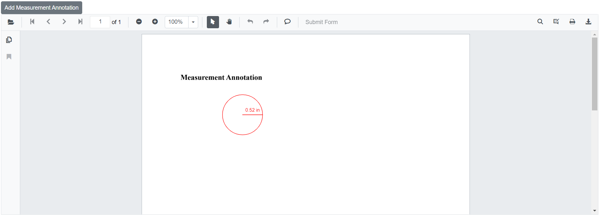
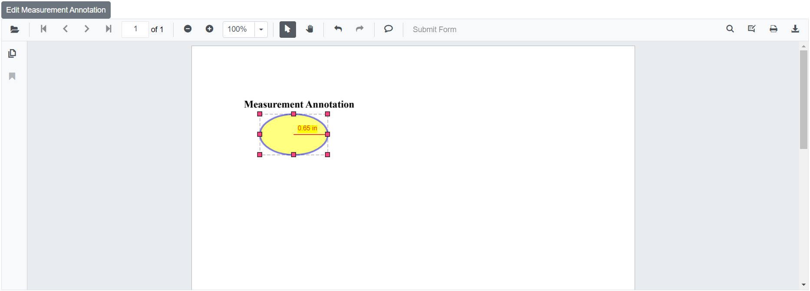

# Measurement annotations in Blazor SfPdfViewer Component

The SfPdfViewer provides options to add and work with measurement annotations. Use these annotations to measure content within a PDF page. The supported measurement annotations are:

* Distance
* Perimeter
* Area
* Radius
* Volume


## Adding measurement annotations to the PDF document

Measurement annotations can be added using the annotation toolbar.

* Click the **Edit Annotation** button in the SfPdfViewer toolbar. A toolbar appears below it.
* Click the **measurement Annotation** dropdown button. A dropdown pop-up appears with the available measurement annotation types.
* Select a measurement type to enable that annotation mode.
* Click on the page to add and measure using the selected annotation.

When a measurement mode is enabled while in Pan mode, the SfPdfViewer switches to Text Select mode.


```cshtml

@using Syncfusion.Blazor.SfPdfViewer
@using Syncfusion.Blazor.Buttons

<SfButton OnClick="OnClick">Measurement Annotation</SfButton>
<SfPdfViewer2 DocumentPath="@DocumentPath"
              @ref="viewer"
              Width="100%"
              Height="100%">
</SfPdfViewer2>

@code {
    SfPdfViewer2 viewer;

    public async void OnClick(MouseEventArgs args)
    {
        await viewer.SetAnnotationModeAsync(AnnotationType.Distance);
    }
    private string DocumentPath { get; set; } = "wwwroot/Data/PDF_Succinctly.pdf";
}

```

## Editing the properties of measurement annotation

The fill color, stroke color, thickness, and opacity of a measurement annotation can be edited using the Edit Color, Edit Stroke Color, Edit Thickness, and Edit Opacity tools in the annotation toolbar.

### Editing fill color

Edit the fill color of the annotation using the color palette in the Edit Color tool.


### Editing stroke color

Edit the stroke color of the annotation using the color palette in the Edit Stroke Color tool.


### Editing thickness

Edit the border thickness of the annotation using the range slider in the Edit Thickness tool.


### Editing opacity

Edit the opacity of the annotation using the range slider in the Edit Opacity tool.


### Editing the line properties

The properties of line-based annotations such as Distance and Perimeter can be edited using the Line Properties window. Open it by selecting the Properties option from the context menu when right-clicking a distance or perimeter annotation.


## Setting default properties during control initialization

Set default properties for measurement annotations before initializing the control using [DistanceSettings](https://help.syncfusion.com/cr/blazor/Syncfusion.Blazor.SfPdfViewer.PdfViewerBase.html#Syncfusion_Blazor_SfPdfViewer_PdfViewerBase_DistanceSettings), [PerimeterSettings](https://help.syncfusion.com/cr/blazor/Syncfusion.Blazor.SfPdfViewer.PdfViewerBase.html#Syncfusion_Blazor_SfPdfViewer_PdfViewerBase_PerimeterSettings), [AreaSettings](https://help.syncfusion.com/cr/blazor/Syncfusion.Blazor.SfPdfViewer.PdfViewerBase.html#Syncfusion_Blazor_SfPdfViewer_PdfViewerBase_AreaSettings), [RadiusSettings](https://help.syncfusion.com/cr/blazor/Syncfusion.Blazor.SfPdfViewer.PdfViewerBase.html#Syncfusion_Blazor_SfPdfViewer_PdfViewerBase_RadiusSettings), and [VolumeSettings](https://help.syncfusion.com/cr/blazor/Syncfusion.Blazor.SfPdfViewer.PdfViewerBase.html#Syncfusion_Blazor_SfPdfViewer_PdfViewerBase_VolumeSettings).

```cshtml

@using Syncfusion.Blazor.Buttons
@using Syncfusion.Blazor.SfPdfViewer

<SfPdfViewer2 @ref="@viewer"
              DocumentPath="@DocumentPath"
              Height="100%" Width="100%"
              DistanceSettings="@DistanceSettings"
              PerimeterSettings="@PerimeterSettings"
              AreaSettings="@AreaSettings"
              RadiusSettings="@RadiusSettings"
              VolumeSettings="@VolumeSettings">
</SfPdfViewer2>

@code {
    SfPdfViewer2 viewer;
    private string DocumentPath { get; set; } = "wwwroot/Data/PDF_Succinctly.pdf";
    
    PdfViewerDistanceSettings DistanceSettings = new PdfViewerDistanceSettings
        {
            FillColor = "blue",
            Opacity = 0.6,
            StrokeColor = "green",
            LineHeadEndStyle = LineHeadStyle.Closed,
            LineHeadStartStyle = LineHeadStyle.Round
        };
    PdfViewerPerimeterSettings PerimeterSettings = new PdfViewerPerimeterSettings
        {
            FillColor = "green",
            Opacity = 0.6,
            StrokeColor = "blue"
        };
    PdfViewerAreaSettings AreaSettings = new PdfViewerAreaSettings
        {
            FillColor = "yellow",
            Opacity = 0.6,
            StrokeColor = "orange"
        };
    PdfViewerVolumeSettings VolumeSettings = new PdfViewerVolumeSettings
        {
            FillColor = "orange",
            Opacity = 0.6,
            StrokeColor = "pink"
        };
    PdfViewerRadiusSettings RadiusSettings = new PdfViewerRadiusSettings
        {
            FillColor = "pink",
            Opacity = 0.6,
            StrokeColor = "yellow"
        };
}

```

## Editing scale ratio and unit of the measurement annotation

Modify the scale ratio and unit of measurement using the Scale Ratio option in the context menu of the SfPdfViewer.


The supported units of measurement for measurement annotations are:

* Inch
* Millimeter
* Centimeter
* Point
* Pica
* Feet


## Setting default scale ratio settings during control initialization

Set default scale ratio settings for measurement annotations before initializing the control using [ScaleRatioSettings](https://help.syncfusion.com/cr/blazor/Syncfusion.Blazor.SfPdfViewer.PdfViewerMeasurementSettings.html#Syncfusion_Blazor_SfPdfViewer_PdfViewerMeasurementSettings_ScaleRatio), as shown below.

```cshtml

@using Syncfusion.Blazor.SfPdfViewer

<SfPdfViewer2 @ref="@viewer"
              DocumentPath="@DocumentPath"
              MeasurementSettings="@MeasurementSettings"
              Height="100%"
              Width="100%">
</SfPdfViewer2>


@code {
    SfPdfViewer2 viewer;
    private string DocumentPath { get; set; } = "wwwroot/Data/PDF_Succinctly.pdf";

    PdfViewerMeasurementSettings MeasurementSettings = new PdfViewerMeasurementSettings 
    { 
        ScaleRatio = 2, 
        ConversionUnit = CalibrationUnit.Cm 
    };
}

```

## Add measurement annotation programmatically

The Blazor SfPdfViewer provides the capability to programmatically add measurement annotations using the [AddAnnotationAsync](https://help.syncfusion.com/cr/blazor/Syncfusion.Blazor.SfPdfViewer.PdfViewerBase.html#Syncfusion_Blazor_SfPdfViewer_PdfViewerBase_AddAnnotationAsync_Syncfusion_Blazor_SfPdfViewer_PdfAnnotation_) method.

The following example demonstrates adding a measurement annotation to a PDF document:

```cshtml

@using Syncfusion.Blazor.Buttons
@using Syncfusion.Blazor.SfPdfViewer

<SfButton OnClick="@AddMeasurementAnnotationAsync">Add Measurement Annotation</SfButton>
<SfPdfViewer2 Width="100%" Height="100%" DocumentPath="@DocumentPath" @ref="@Viewer" />

@code {
    SfPdfViewer2 Viewer;
    public string DocumentPath { get; set; } = "wwwroot/Data/Measurement_Annotation.pdf";

    public async void AddMeasurementAnnotationAsync(MouseEventArgs args)
    {
        PdfAnnotation annotation = new PdfAnnotation();
        // Set the annotation type of measurement annotation like radius, distance, perimeter, area, volume
        annotation.Type = AnnotationType.Radius;
        // Set the PageNumber starts from 0. So, if set 0 it represents the page 1.
        annotation.PageNumber = 0;

        // Bound of the radius annotation
        annotation.Bound = new Bound();
        annotation.Bound.X = 200;
        annotation.Bound.Y = 150;
        annotation.Bound.Width = 100;
        annotation.Bound.Height = 100;
        // Add radius measurement annotation
        await Viewer.AddAnnotationAsync(annotation);
    }
}

```

This adds a measurement annotation to the first page of the PDF document (page numbers are zero-based).



[View sample in GitHub](https://github.com/SyncfusionExamples/blazor-pdf-viewer-examples/tree/master/Annotations/Programmatic%20Support/Measurement/Add).

## Edit measurement annotation programmatically

The Blazor SfPdfViewer provides the capability to programmatically edit a measurement annotation using the [EditAnnotationAsync](https://help.syncfusion.com/cr/blazor/Syncfusion.Blazor.SfPdfViewer.PdfViewerBase.html#Syncfusion_Blazor_SfPdfViewer_PdfViewerBase_EditAnnotationAsync_Syncfusion_Blazor_SfPdfViewer_PdfAnnotation_) method.

The following example demonstrates editing a measurement annotation programmatically:

```cshtml

@using Syncfusion.Blazor.Buttons
@using Syncfusion.Blazor.SfPdfViewer

<SfButton OnClick="@EditMeasurementAnnotationAsync">Edit Measurement Annotation</SfButton>
<SfPdfViewer2 Width="100%" Height="100%" DocumentPath="@DocumentPath" @ref="@Viewer" />

@code {
    SfPdfViewer2 Viewer;
    public string DocumentPath { get; set; } = "wwwroot/Data/Measurement_Annotation.pdf";

    public async void EditMeasurementAnnotationAsync(MouseEventArgs args)
    {
        // Get annotation collection
        List<PdfAnnotation> annotationCollection = await Viewer.GetAnnotationsAsync();
        // Select the annotation want to edit
        PdfAnnotation annotation = annotationCollection[0];
        // Change the position of the radius annotation
        annotation.Bound.X = 125;
        annotation.Bound.Y = 125;
        // Change the width and height of the radius annotation
        annotation.Bound.Width = 125;
        annotation.Bound.Height = 75;
        // Change the fill color of radius annotation
        annotation.FillColor = "#FFFF00";
        // Change the stroke color of radius annotation
        annotation.StrokeColor = "#0000FF";
        // Change the thickness of radius annotation
        annotation.Thickness = 3;
        // Change the opacity (0 to 1) of radius annotation
        annotation.Opacity = 0.5;
        // Edit the radius measurement annotation
        await Viewer.EditAnnotationAsync(annotation);
    }
}

```

This edits a measurement annotation programmatically within the SfPdfViewer control.



[View sample in GitHub](https://github.com/SyncfusionExamples/blazor-pdf-viewer-examples/tree/master/Annotations/Programmatic%20Support/Measurement/Edit).

## See also

* [How to delete the annotation programmatically](./text-markup-annotation#delete-annotation-programmatically)