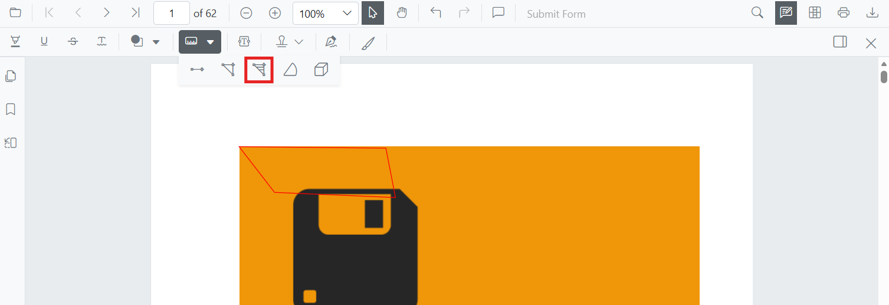

# Add Area Annotations in Blazor SfPdfViewer Component

Area is a measurement annotation used to calculate the surface of a closed region on a PDF page—ideal for engineering, construction, or design reviews.



## Enable Area Measurement

The SfPdfViewer component supports area measurement annotations by default. To enable the annotation toolbar and measurement functionality, simply add the SfPdfViewer component to your Blazor page:

```cshtml
@using Syncfusion.Blazor.SfPdfViewer

<SfPdfViewer2 DocumentPath="@DocumentPath"
              Width="100%"
              Height="100%">
</SfPdfViewer2>

@code {
    private string DocumentPath { get; set; } = "wwwroot/Data/PDF_Succinctly.pdf";
}
```

## Add Area Annotation

### Add Area Using the Toolbar

1. Click the **Edit Annotation** button in the SfPdfViewer toolbar. A secondary toolbar appears below it.
2. Click the **Measurement Annotation** dropdown. A list of measurement annotation types appears.
3. Select **Area** to enter Area measurement mode.
4. Click on the page to place each vertex of the polygon.
5. Double-click (or click the first vertex) to close and finalize the shape.


N> If Pan mode is active, choosing a measurement tool switches the viewer into the appropriate interaction mode for a smoother workflow.

### Enable Area Mode Programmatically

Switch the viewer into Area mode from code by calling [`SetAnnotationModeAsync`](https://help.syncfusion.com/cr/blazor/Syncfusion.Blazor.SfPdfViewer.PdfViewerBase.html#Syncfusion_Blazor_SfPdfViewer_PdfViewerBase_SetAnnotationModeAsync_Syncfusion_Blazor_SfPdfViewer_AnnotationType_). The viewer must finish loading a document before this call returns successfully. Invoking the method before the [`DocumentLoaded`](https://help.syncfusion.com/cr/blazor/Syncfusion.Blazor.SfPdfViewer.PdfViewerBase.html#Syncfusion_Blazor_SfPdfViewer_PdfViewerBase_DocumentLoaded) event can throw or be ignored.

```cshtml
@using Syncfusion.Blazor.SfPdfViewer
@using Syncfusion.Blazor.Buttons

<SfButton OnClick="OnClick">Area Measurement</SfButton>
<SfPdfViewer2 DocumentPath="@DocumentPath"
              @ref="viewer"
              Width="100%"
              Height="100%">
</SfPdfViewer2>

@code {
    private SfPdfViewer2 viewer;
    private string DocumentPath { get; set; } = "wwwroot/Data/PDF_Succinctly.pdf";

    private async Task OnClick(MouseEventArgs args)
    {
        await viewer.SetAnnotationModeAsync(AnnotationType.Area);
    }
}
```

#### Exit Area Mode

Switch back to the default mode by calling [`SetAnnotationModeAsync`](https://help.syncfusion.com/cr/blazor/Syncfusion.Blazor.SfPdfViewer.PdfViewerBase.html#Syncfusion_Blazor_SfPdfViewer_PdfViewerBase_SetAnnotationModeAsync_Syncfusion_Blazor_SfPdfViewer_AnnotationType_) with annotation type `None`.

```cshtml
@code {
    private async Task ExitAreaMode()
    {
        await viewer.SetAnnotationModeAsync(AnnotationType.None);
    }
}
```

### Add Area Annotation Programmatically

Use [`AddAnnotationAsync()`](https://help.syncfusion.com/cr/blazor/Syncfusion.Blazor.SfPdfViewer.PdfViewerBase.html#Syncfusion_Blazor_SfPdfViewer_PdfViewerBase_AddAnnotationAsync_Syncfusion_Blazor_SfPdfViewer_PdfAnnotation_) to add an Area measurement by providing **VertexPoints** for a closed region.

A closed polygon must contain **at least three distinct vertices**, and the first and last points must match to close the shape.

```cshtml
@using Syncfusion.Blazor.Buttons
@using Syncfusion.Blazor.SfPdfViewer

<SfButton OnClick="@AddArea">Add Area Annotation</SfButton>
<SfPdfViewer2 Width="100%" Height="100%" DocumentPath="@DocumentPath" @ref="@Viewer" />

@code {
    private SfPdfViewer2 Viewer;
    private string DocumentPath { get; set; } = "wwwroot/Data/PDF_Succinctly.pdf";

    private async Task AddArea(MouseEventArgs args)
    {
        PdfAnnotation annotation = new PdfAnnotation();
        annotation.Type = AnnotationType.Area;
        annotation.PageNumber = 0;
        List<VertexPoint> vertexPoints = new List<VertexPoint>
        {
            new VertexPoint() { X = 200, Y = 500 },
            new VertexPoint() { X = 288, Y = 500 },
            new VertexPoint() { X = 288, Y = 560 },
            new VertexPoint() { X = 200, Y = 560 },
            new VertexPoint() { X = 200, Y = 500 }
        };
        annotation.VertexPoints = vertexPoints;
        await Viewer.AddAnnotationAsync(annotation);
    }
}
```

## Customize Area Appearance

Configure the default Area style — **fill color**, **stroke color**, **thickness**, and **opacity** — using the [`AreaSettings`](https://help.syncfusion.com/cr/blazor/Syncfusion.Blazor.SfPdfViewer.PdfViewerBase.html#Syncfusion_Blazor_SfPdfViewer_PdfViewerBase_AreaSettings) property.

```cshtml
@using Syncfusion.Blazor.SfPdfViewer

<SfPdfViewer2 @ref="@viewer"
              DocumentPath="@DocumentPath"
              AreaSettings="@AreaSettings"
              Height="100%"
              Width="100%">
</SfPdfViewer2>

@code {
    private SfPdfViewer2 viewer;
    private string DocumentPath { get; set; } = "wwwroot/Data/PDF_Succinctly.pdf";

    private PdfViewerAreaSettings AreaSettings = new PdfViewerAreaSettings
    {
        FillColor = "yellow",
        StrokeColor = "orange",
        Thickness = 2,
        Opacity = 0.6
    };
}
```

## Manage Area Annotations

### Move

Drag inside the polygon to reposition the entire annotation on the page.

### Reshape

Drag any vertex handle to add, remove, or adjust the shape's points.

```cshtml
@code {
    // Move an existing area annotation by updating its vertex coordinates.
    private async Task MoveArea(PdfAnnotation annotation, int offsetX, int offsetY)
    {
        annotation.VertexPoints = annotation.VertexPoints
            .Select(v => new VertexPoint { X = v.X + offsetX, Y = v.Y + offsetY })
            .ToList();
        await Viewer.EditAnnotationAsync(annotation);
    }
}
```

### Edit Area

#### Edit Area Appearance (UI)

Select the Area annotation first — the annotation toolbar appears below the main toolbar. Use it to change:

- **Fill Color** — pick a new color with the Edit Color tool.
  
- **Stroke Color** — change the border color with the Edit Stroke Color tool.
  
- **Thickness** — adjust the border width with the Edit Thickness tool.
  
- **Opacity** — change transparency with the Edit Opacity tool.
  

#### Edit Area Programmatically

Modify an existing Area annotation programmatically using [`EditAnnotationAsync()`](https://help.syncfusion.com/cr/blazor/Syncfusion.Blazor.SfPdfViewer.PdfViewerBase.html#Syncfusion_Blazor_SfPdfViewer_PdfViewerBase_EditAnnotationAsync_Syncfusion_Blazor_SfPdfViewer_PdfAnnotation_). The example below expects `PDF_Succinctly.pdf` to already contain an Area annotation at index `0`; replace the document and index check with one that matches your data.

```cshtml
@using Syncfusion.Blazor.Buttons
@using Syncfusion.Blazor.SfPdfViewer

<SfButton OnClick="@EditArea">Edit Area Annotation</SfButton>
<SfPdfViewer2 Width="100%" Height="100%" DocumentPath="@DocumentPath" @ref="@Viewer" />

@code {
    private SfPdfViewer2 Viewer;
    private string DocumentPath { get; set; } = "wwwroot/Data/PDF_Succinctly.pdf";

    private async Task EditArea(MouseEventArgs args)
    {
        // Get the annotations on the current document
        List<PdfAnnotation> annotationCollection = await Viewer.GetAnnotationsAsync();

        // Guard against an empty collection
        if (annotationCollection == null || annotationCollection.Count == 0)
        {
            return;
        }

        // Select the first annotation (replace with your own selection logic)
        PdfAnnotation annotation = annotationCollection[0];

        // Update the style
        annotation.StrokeColor = "#0000FF";
        annotation.Thickness = 2;
        annotation.FillColor = "#FFFF00";
        annotation.Opacity = 0.5;

        // Apply the changes
        await Viewer.EditAnnotationAsync(annotation);
    }
}
```

N> For the full set of `PdfAnnotation` members, see the [PdfAnnotation API reference](https://help.syncfusion.com/cr/blazor/Syncfusion.Blazor.SfPdfViewer.PdfAnnotation.html).

### Add Area Annotation Programmatically with Custom Properties

Override the default style for a single Area annotation by setting properties directly on the [`PdfAnnotation`](https://help.syncfusion.com/cr/blazor/Syncfusion.Blazor.SfPdfViewer.PdfAnnotation.html) instance before adding it.

```cshtml
@using Syncfusion.Blazor.Buttons
@using Syncfusion.Blazor.SfPdfViewer

<SfButton OnClick="@AddStyledArea">Add Styled Area</SfButton>
<SfPdfViewer2 Width="100%" Height="100%" DocumentPath="@DocumentPath" @ref="@Viewer" />

@code {
    private SfPdfViewer2 Viewer;
    private string DocumentPath { get; set; } = "wwwroot/Data/PDF_Succinctly.pdf";

    private async Task AddStyledArea(MouseEventArgs args)
    {
        PdfAnnotation annotation = new PdfAnnotation();
        annotation.Type = AnnotationType.Area;
        annotation.PageNumber = 0;
        annotation.VertexPoints = new List<VertexPoint>
        {
            new VertexPoint() { X = 210, Y = 510 },
            new VertexPoint() { X = 300, Y = 510 },
            new VertexPoint() { X = 305, Y = 560 },
            new VertexPoint() { X = 210, Y = 560 },
            new VertexPoint() { X = 210, Y = 510 }
        };
        annotation.StrokeColor = "#EA580C";
        annotation.FillColor = "#FEF3C7";
        annotation.Thickness = 2;
        annotation.Opacity = 0.85;
        await Viewer.AddAnnotationAsync(annotation);
    }
}
```

## Scale Ratio and Units

The **Scale Ratio** controls how many page units equal one real-world unit. Open it from the **context menu** of any measurement annotation to recalibrate.

**Supported `CalibrationUnit` values**

| Value | Description |
|-------|-------------|
| `Inch` | Inches. |
| `Millimeter` | Millimeters. |
| `Centimeter` / `Cm` | Centimeters. |
| `Point` | PostScript points (1/72 inch). |
| `Pica` | Picas (1/6 inch). |
| `Feet` | Feet. |

### Set Default Scale Ratio During Initialization

Configure scale defaults using [`MeasurementSettings`](https://help.syncfusion.com/cr/blazor/Syncfusion.Blazor.SfPdfViewer.PdfViewerMeasurementSettings.html). The default `ScaleRatio` is `1` and the default `ConversionUnit` is `Point`; `ScaleRatio` values must be greater than `0`.

```cshtml
@using Syncfusion.Blazor.SfPdfViewer

<SfPdfViewer2 @ref="@viewer"
              DocumentPath="@DocumentPath"
              MeasurementSettings="@MeasurementSettings"
              Height="100%"
              Width="100%">
</SfPdfViewer2>

@code {
    private SfPdfViewer2 viewer;
    private string DocumentPath { get; set; } = "wwwroot/Data/PDF_Succinctly.pdf";

    private PdfViewerMeasurementSettings MeasurementSettings = new PdfViewerMeasurementSettings
    {
        ScaleRatio = 2,
        ConversionUnit = CalibrationUnit.Cm
    };
}
```

### Delete Area Annotation

Delete an Area annotation through the UI (right-click → **Delete**, click **Delete** on the annotation toolbar, or press the `Delete` key while the annotation is selected) or programmatically:

```cshtml
@code {
    private async Task DeleteFirstArea()
    {
        List<PdfAnnotation> annotations = await Viewer.GetAnnotationsAsync();
        PdfAnnotation target = annotations.FirstOrDefault(a => a.Type == AnnotationType.Area);
        if (target != null)
        {
            await Viewer.DeleteAnnotationAsync(target);
        }
    }
}
```

For more deletion patterns, see [**Delete Annotation**](../delete-annotation).

## Handle Area Events

Listen to the annotation life-cycle with the `Added`, `Modified`, `Selected`, and `Removed` events. The handler receives a `AnnotationEventArgs` payload that includes the affected `PdfAnnotation`, the page number, and the action that triggered the event.

```cshtml
<SfPdfViewer2 DocumentPath="@DocumentPath"
              @ref="@viewer"
              Added="@OnAdded"
              Removed="@OnRemoved"
              Width="100%"
              Height="100%" />

@code {
    private SfPdfViewer2 viewer;
    private string DocumentPath { get; set; } = "wwwroot/Data/PDF_Succinctly.pdf";

    private void OnAdded(AnnotationEventArgs args)
    {
        // args.Annotation contains the PdfAnnotation that was added
    }

    private void OnRemoved(AnnotationEventArgs args)
    {
        // args.Annotation contains the PdfAnnotation that was removed
    }
}
```

For the full list of events and their payloads, see [**Annotation Events**](../events).

## Export and Import

Area measurements are exported and imported with the rest of the annotations in **JSON** format. Use `ExportAnnotationsAsync()` to download a JSON blob, and `ImportAnnotationsAsync()` to load it back into the viewer.

```cshtml
@code {
    private async Task Export()
    {
        // Exports all annotations (including Area) as a JSON string
        string json = await Viewer.ExportAnnotationsAsync();
        // Persist `json` to a file, database, or service as needed
    }

    private async Task Import(string json)
    {
        await Viewer.ImportAnnotationsAsync(json);
    }
}
```

For the full export/import workflow and additional formats, see [**Export and Import Annotations**](../import-export-annotation).

## See Also

- [Annotation Events](../events)
- [Export and Import Annotations](../import-export-annotation)
- [Delete Annotations](../delete-annotation)
- [Measurement Annotations Overview](distance-annotation#measurement-annotations)
- [Add Distance Annotations](distance-annotation)
- [Add Perimeter Annotations](perimeter-annotation)
- [Add Radius Annotations](radius-annotation)
- [Add Volume Annotations](volume-annotation)
