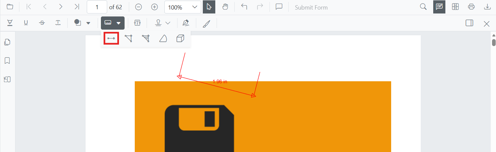
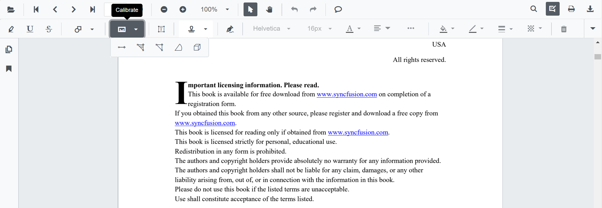
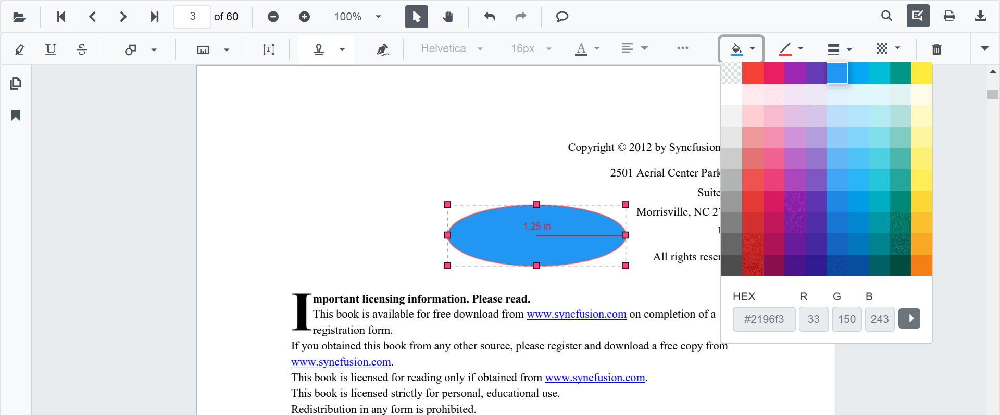
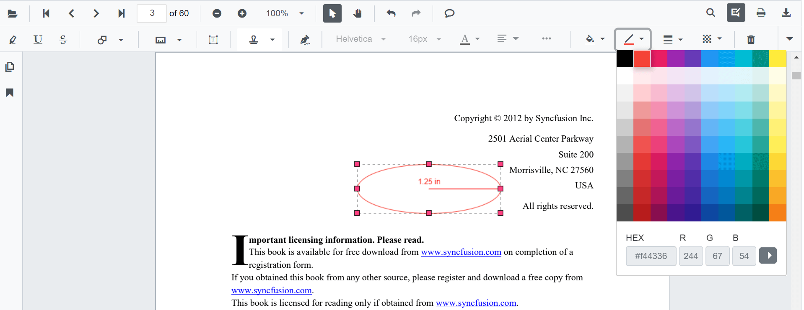
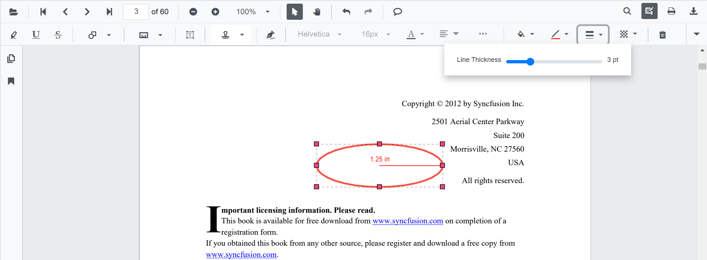
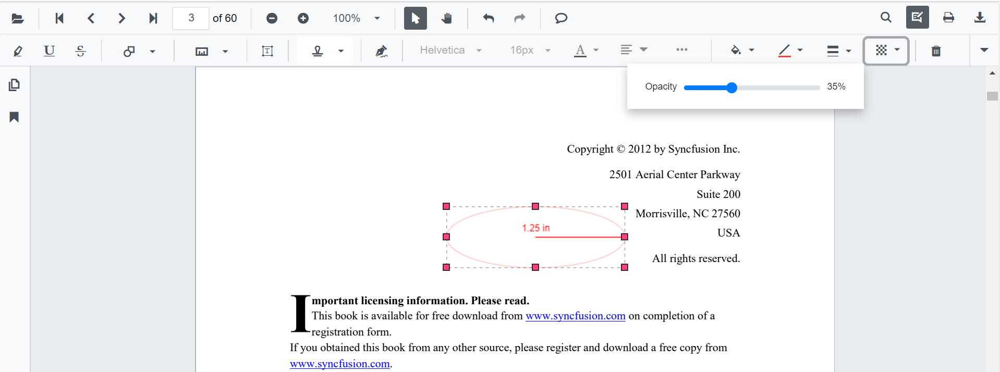
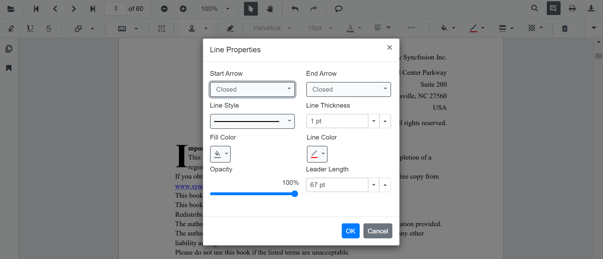

# Add Distance Annotations in Blazor SfPdfViewer Component

Distance is a measurement annotation used to measure the length between two points on a PDF page. Use it for precise reviews, markups, or engineering measurements.



## Enable Distance Annotation

The `SfPdfViewer` component supports Distance measurement annotations by **default**. To enable the annotation toolbar and measurement functionality, simply add the `SfPdfViewer` component to your Blazor page:

```cshtml
@using Syncfusion.Blazor.SfPdfViewer

<SfPdfViewer2 DocumentPath="@DocumentPath"
              Width="100%"
              Height="100%">
</SfPdfViewer2>

@code {
    private string DocumentPath { get; set; } = "wwwroot/Data/PDF_Succinctly.pdf";
}
```

## Add Distance Annotation

### Add Distance Annotation Using the Toolbar

1. Click the **Edit Annotation** button in the SfPdfViewer toolbar. A secondary toolbar appears below it.
2. Click the **Measurement Annotation** dropdown. A list of measurement annotation types appears.
3. Select **Distance** to enter Distance measurement mode.
4. Click on the page to set the start point, then click again to set the end point.



N> If Pan mode is active, choosing a measurement tool switches the viewer into the appropriate interaction mode for a smoother workflow.

### Enable Distance Annotation Mode Programmatically

Switch the viewer into Distance mode from code by calling [`SetAnnotationModeAsync`](https://help.syncfusion.com/cr/blazor/Syncfusion.Blazor.SfPdfViewer.PdfViewerBase.html#Syncfusion_Blazor_SfPdfViewer_PdfViewerBase_SetAnnotationModeAsync_Syncfusion_Blazor_SfPdfViewer_AnnotationType_).

```cshtml
@using Syncfusion.Blazor.SfPdfViewer
@using Syncfusion.Blazor.Buttons

<SfButton OnClick="OnClick">Distance Measurement</SfButton>
<SfPdfViewer2 DocumentPath="@DocumentPath"
              @ref="viewer"
              Width="100%"
              Height="100%">
</SfPdfViewer2>

@code {
    private SfPdfViewer2 viewer;
    private string DocumentPath { get; set; } = "wwwroot/Data/PDF_Succinctly.pdf";

    private async Task OnClick(MouseEventArgs args)
    {
        await viewer.SetAnnotationModeAsync(AnnotationType.Distance);
    }
}
```

#### Exit Distance Annotation Mode

Switch back to the default mode by calling [`SetAnnotationModeAsync`](https://help.syncfusion.com/cr/blazor/Syncfusion.Blazor.SfPdfViewer.PdfViewerBase.html#Syncfusion_Blazor_SfPdfViewer_PdfViewerBase_SetAnnotationModeAsync_Syncfusion_Blazor_SfPdfViewer_AnnotationType_) with annotation type `None`.

```cshtml
@code {
    private async Task ExitDistanceMode()
    {
        await viewer.SetAnnotationModeAsync(AnnotationType.None);
    }
}
```

### Add Distance Annotation Programmatically

Use [`AddAnnotationAsync()`](https://help.syncfusion.com/cr/blazor/Syncfusion.Blazor.SfPdfViewer.PdfViewerBase.html#Syncfusion_Blazor_SfPdfViewer_PdfViewerBase_AddAnnotationAsync_Syncfusion_Blazor_SfPdfViewer_PdfAnnotation_) to add a Distance measurement by providing exactly **two VertexPoints**.

A Distance annotation requires **exactly two vertices** — the first is the start, the second is the end. Supplying more or fewer produces undefined behavior.

```cshtml
@using Syncfusion.Blazor.Buttons
@using Syncfusion.Blazor.SfPdfViewer

<SfButton OnClick="@AddDistance">Add Distance Annotation</SfButton>
<SfPdfViewer2 Width="100%" Height="100%" DocumentPath="@DocumentPath" @ref="@Viewer" />

@code {
    private SfPdfViewer2 Viewer;
    private string DocumentPath { get; set; } = "wwwroot/Data/PDF_Succinctly.pdf";

    private async Task AddDistance(MouseEventArgs args)
    {
        PdfAnnotation annotation = new PdfAnnotation();
        annotation.Type = AnnotationType.Distance;
        annotation.PageNumber = 0;
        annotation.VertexPoints = new List<VertexPoint>
        {
            new VertexPoint() { X = 200, Y = 230 },
            new VertexPoint() { X = 350, Y = 230 }
        };
        await Viewer.AddAnnotationAsync(annotation);
    }
}
```

## Customize Distance Annotation Appearance

Configure the default Distance style — **fill color**, **stroke color**, **thickness**, and **opacity** — using the [`DistanceSettings`](https://help.syncfusion.com/cr/blazor/Syncfusion.Blazor.SfPdfViewer.PdfViewerBase.html#Syncfusion_Blazor_SfPdfViewer_PdfViewerBase_DistanceSettings) property.

```cshtml
@using Syncfusion.Blazor.SfPdfViewer

<SfPdfViewer2 @ref="@viewer"
              DocumentPath="@DocumentPath"
              DistanceSettings="@DistanceSettings"
              Height="100%"
              Width="100%">
</SfPdfViewer2>

@code {
    private SfPdfViewer2 viewer;
    private string DocumentPath { get; set; } = "wwwroot/Data/PDF_Succinctly.pdf";

    private PdfViewerDistanceSettings DistanceSettings = new PdfViewerDistanceSettings
    {
        FillColor = "blue",
        StrokeColor = "green",
        Thickness = 2,
        Opacity = 0.6
    };
}
```

## Manage Distance Annotation

### Move Distance Annotation

Drag the body of the measurement to reposition it on the page.

### Resize Distance Annotation

Drag the end handles to adjust the length, or change `VertexPoints` programmatically.

### Edit Distance Annotation

#### Edit Distance Annotation Appearance (UI)

Select the Distance annotation first — the annotation toolbar appears below the main toolbar. Use it to change:

- **Fill Color**: pick a new color with the Edit Color tool.
  
- **Stroke Color**: change the line color with the Edit Stroke Color tool.
  
- **Thickness**: adjust the line width with the Edit Thickness tool.
  
- **Opacity**: change transparency with the Edit Opacity tool.
  
- **Line properties**: change the leader style (line only, with arrows, or full dimension lines) with the Edit Property tool.
  

#### Edit Distance Annotation Programmatically

Modify an existing Distance annotation programmatically using [`EditAnnotationAsync()`](https://help.syncfusion.com/cr/blazor/Syncfusion.Blazor.SfPdfViewer.PdfViewerBase.html#Syncfusion_Blazor_SfPdfViewer_PdfViewerBase_EditAnnotationAsync_Syncfusion_Blazor_SfPdfViewer_PdfAnnotation_). The example below expects `PDF_Succinctly.pdf` to already contain a Distance annotation; replace the filter with one that matches your data.

```cshtml
@using Syncfusion.Blazor.Buttons
@using Syncfusion.Blazor.SfPdfViewer

<SfButton OnClick="@EditDistance">Edit Distance Annotation</SfButton>
<SfPdfViewer2 Width="100%" Height="100%" DocumentPath="@DocumentPath" @ref="@Viewer" />

@code {
    private SfPdfViewer2 Viewer;
    private string DocumentPath { get; set; } = "wwwroot/Data/PDF_Succinctly.pdf";

    private async Task EditDistance(MouseEventArgs args)
    {
        // Get the annotations on the current document
        List<PdfAnnotation> annotationCollection = await Viewer.GetAnnotationsAsync();

        // Guard against an empty collection
        if (annotationCollection == null || annotationCollection.Count == 0)
        {
            return;
        }

        // Pick the first Distance annotation (replace with your own selection logic)
        PdfAnnotation annotation = annotationCollection
            .FirstOrDefault(a => a.Type == AnnotationType.Distance);

        if (annotation == null)
        {
            return;
        }

        // Update the style
        annotation.StrokeColor = "#0000FF";
        annotation.Thickness = 2;
        annotation.FillColor = "#FFFF00";
        annotation.Opacity = 0.8;
        annotation.LeaderLength = 8;

        // Apply the changes
        await Viewer.EditAnnotationAsync(annotation);
    }
}
```

For the full set of `PdfAnnotation` members, see the [PdfAnnotation API reference](https://help.syncfusion.com/cr/blazor/Syncfusion.Blazor.SfPdfViewer.PdfAnnotation.html).

### Delete Distance Annotation

Delete a Distance annotation through the UI (right-click → **Delete**, click **Delete** on the annotation toolbar, or press the `Delete` key while the annotation is selected) or programmatically:

```cshtml
@code {
    private async Task DeleteFirstDistance()
    {
        List<PdfAnnotation> annotations = await Viewer.GetAnnotationsAsync();
        PdfAnnotation target = annotations.FirstOrDefault(a => a.Type == AnnotationType.Distance);
        if (target != null)
        {
            await Viewer.DeleteAnnotationAsync(target);
        }
    }
}
```

For more deletion patterns, see [**Delete Annotation**](../delete-annotation).

## Set Default Properties During Initialization

Apply defaults for Distance using the [`DistanceSettings`](https://help.syncfusion.com/cr/blazor/Syncfusion.Blazor.SfPdfViewer.PdfViewerBase.html#Syncfusion_Blazor_SfPdfViewer_PdfViewerBase_DistanceSettings) property.

```cshtml
@using Syncfusion.Blazor.SfPdfViewer

<SfPdfViewer2 @ref="@viewer"
              DocumentPath="@DocumentPath"
              DistanceSettings="@DistanceSettings"
              Height="100%"
              Width="100%">
</SfPdfViewer2>

@code {
    private SfPdfViewer2 viewer;
    private string DocumentPath { get; set; } = "wwwroot/Data/PDF_Succinctly.pdf";

    PdfViewerDistanceSettings DistanceSettings = new PdfViewerDistanceSettings
    {
        FillColor = "blue",
        StrokeColor = "green",
        Opacity = 0.6
    };
}
```

## Add Distance Annotation Programmatically with Custom Properties

Override the default style for a single Distance annotation by setting properties directly on the `PdfAnnotation` instance before adding it.

```cshtml
@using Syncfusion.Blazor.Buttons
@using Syncfusion.Blazor.SfPdfViewer

<SfButton OnClick="@AddStyledDistance">Add Styled Distance</SfButton>
<SfPdfViewer2 Width="100%" Height="100%" DocumentPath="@DocumentPath" @ref="@Viewer" />

@code {
    private SfPdfViewer2 Viewer;
    private string DocumentPath { get; set; } = "wwwroot/Data/PDF_Succinctly.pdf";

    private async Task AddStyledDistance(MouseEventArgs args)
    {
        PdfAnnotation annotation = new PdfAnnotation();
        annotation.Type = AnnotationType.Distance;
        annotation.PageNumber = 0;
        annotation.VertexPoints = new List<VertexPoint>
        {
            new VertexPoint() { X = 220, Y = 260 },
            new VertexPoint() { X = 360, Y = 260 }
        };
        annotation.StrokeColor = "#059669";
        annotation.Opacity = 0.9;
        annotation.FillColor = "#D1FAE5";
        annotation.Thickness = 2;
        await Viewer.AddAnnotationAsync(annotation);
    }
}
```

## Scale Ratio and Units

The **Scale Ratio** controls how many page units equal one real-world unit. Open it from the **context menu** of any measurement annotation to recalibrate.

### Set Default Scale Ratio During Initialization

Configure scale defaults using [`MeasurementSettings`](https://help.syncfusion.com/cr/blazor/Syncfusion.Blazor.SfPdfViewer.PdfViewerMeasurementSettings.html). The default `ScaleRatio` is `1`; values must be greater than `0`.

```cshtml
@using Syncfusion.Blazor.SfPdfViewer

<SfPdfViewer2 @ref="@viewer"
              DocumentPath="@DocumentPath"
              MeasurementSettings="@MeasurementSettings"
              Height="100%"
              Width="100%">
</SfPdfViewer2>

@code {
    private SfPdfViewer2 viewer;
    private string DocumentPath { get; set; } = "wwwroot/Data/PDF_Succinctly.pdf";

    private PdfViewerMeasurementSettings MeasurementSettings = new PdfViewerMeasurementSettings
    {
        ScaleRatio = 2,
        ConversionUnit = CalibrationUnit.Cm
    };
}
```

## Handle Distance Annotation Events

Listen to the annotation life-cycle with the `Added`, `Modified`, `Selected`, and `Removed` events. The handler receives an `AnnotationEventArgs` payload that includes the affected `PdfAnnotation`, the page number, and the action that triggered the event.

For the full list of events and their payloads, see [**Annotation Events**](../events).

## Export and Import

Distance measurements are exported and imported with the rest of the annotations in **JSON** or **XFDF** format. You can programmatically export and import these annotations using the [`ExportAnnotationAsync`](https://help.syncfusion.com/cr/blazor/Syncfusion.Blazor.SfPdfViewer.PdfViewerBase.html#Syncfusion_Blazor_SfPdfViewer_PdfViewerBase_ExportAnnotationAsync_Syncfusion_Blazor_SfPdfViewer_AnnotationDataFormat_) and [`ImportAnnotationAsync`](https://help.syncfusion.com/cr/blazor/Syncfusion.Blazor.SfPdfViewer.PdfViewerBase.html#Syncfusion_Blazor_SfPdfViewer_PdfViewerBase_ImportAnnotationAsync_System_IO_Stream_Syncfusion_Blazor_SfPdfViewer_AnnotationDataFormat_) methods.

For the full export/import workflow and additional formats, see [**Export and Import Annotations**](../import-export-annotation).

## See also

- [Annotation Events](../events)
- [Export and Import Annotations](../import-export-annotation)
- [Delete Annotations](../delete-annotation)
- [Measurement Annotations Overview](overview)
- [Add Area Annotations](area-annotation)
- [Add Perimeter Annotations](perimeter-annotation)
- [Add Radius Annotations](radius-annotation)
- [Add Volume Annotations](volume-annotation)
