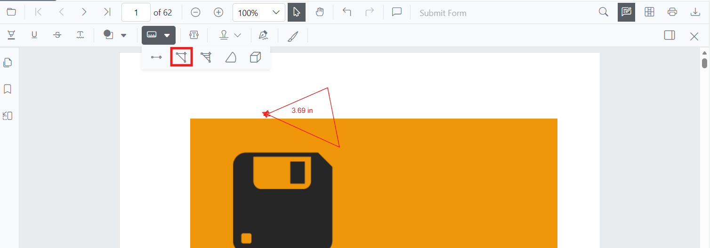

# Add Perimeter Annotations in Blazor SfPdfViewer Component
Perimeter is a measurement annotation used to calculate the length around a closed polyline on a PDF page—useful for technical markups and reviews. 



## Enable Perimeter Annotation

The `SfPdfViewer` component supports Perimeter measurement annotations by **default**. To enable the annotation toolbar and measurement functionality, simply add the `SfPdfViewer` component to your Blazor page:

```cshtml

@using Syncfusion.Blazor.SfPdfViewer

<SfPdfViewer2 DocumentPath="@DocumentPath" 
              Width="100%" 
              Height="100%">
</SfPdfViewer2>

@code {
    private string DocumentPath { get; set; } = "wwwroot/Data/PDF_Succinctly.pdf";
}

```

## Add Perimeter Annotation

### Add Perimeter Annotation Using the Toolbar

1. Click the **Edit Annotation** button in the SfPdfViewer toolbar. A secondary toolbar appears below it.
2. Click the **Measurement Annotation** dropdown. A list of measurement annotation types appears.
3. Select **Perimeter** to enter Perimeter measurement mode.
4. Click on the page to place each vertex of the polyline.
5. Double-click (or click the first vertex) to close and finalize the shape.


N> If Pan mode is active, choosing a measurement tool switches the viewer into the appropriate interaction mode for a smoother workflow.

### Enable Perimeter Annotation Mode
Switch the viewer into Perimeter mode from code by calling [`SetAnnotationModeAsync`](https://help.syncfusion.com/cr/blazor/Syncfusion.Blazor.SfPdfViewer.PdfViewerBase.html#Syncfusion_Blazor_SfPdfViewer_PdfViewerBase_SetAnnotationModeAsync_Syncfusion_Blazor_SfPdfViewer_AnnotationType_).

```cshtml
@using Syncfusion.Blazor.SfPdfViewer
@using Syncfusion.Blazor.Buttons

<SfButton OnClick="EnablePerimeterMode">Enable Perimeter Mode</SfButton>
<SfPdfViewer2 DocumentPath="@DocumentPath"
              @ref="viewer"
              Width="100%"
              Height="100%">
</SfPdfViewer2>

@code {
    private SfPdfViewer2 viewer;
    private string DocumentPath { get; set; } = "wwwroot/Data/PDF_Succinctly.pdf";

    private async Task EnablePerimeterMode(MouseEventArgs args)
    {
        await viewer.SetAnnotationModeAsync(AnnotationType.Perimeter);
    }
}

```

#### Exit Perimeter Annotation Mode

Switch back to the default mode by calling [`SetAnnotationModeAsync`](https://help.syncfusion.com/cr/blazor/Syncfusion.Blazor.SfPdfViewer.PdfViewerBase.html#Syncfusion_Blazor_SfPdfViewer_PdfViewerBase_SetAnnotationModeAsync_Syncfusion_Blazor_SfPdfViewer_AnnotationType_) with annotation type `None`.

```cshtml

@using Syncfusion.Blazor.SfPdfViewer
@using Syncfusion.Blazor.Buttons

<SfButton OnClick="ExitPerimeterMode">Exit Perimeter Mode</SfButton>
<SfPdfViewer2 DocumentPath="@DocumentPath" 
              @ref="viewer"
              Width="100%" 
              Height="100%">
</SfPdfViewer2>

@code {
    private SfPdfViewer2 viewer;
    private string DocumentPath { get; set; } = "wwwroot/Data/PDF_Succinctly.pdf";

    private async void ExitPerimeterMode(MouseEventArgs args)
    {
        await viewer.SetAnnotationModeAsync(AnnotationType.None);
    }
}
```

### Add Perimeter Annotation Programmatically

Use the [`AddAnnotationAsync`](https://help.syncfusion.com/cr/blazor/Syncfusion.Blazor.SfPdfViewer.PdfViewerBase.html#Syncfusion_Blazor_SfPdfViewer_PdfViewerBase_AddAnnotationAsync_Syncfusion_Blazor_SfPdfViewer_PdfAnnotation_) API to draw a perimeter by providing multiple **VertexPoints**.

```cshtml
@using Syncfusion.Blazor.SfPdfViewer
@using Syncfusion.Blazor.Buttons

<SfButton OnClick="AddPerimeter">Add Perimeter</SfButton>
<SfPdfViewer2 DocumentPath="@DocumentPath"
              @ref="viewer"
              Width="100%"
              Height="100%">
</SfPdfViewer2>

@code {
    private SfPdfViewer2 viewer;
    private string DocumentPath { get; set; } = "wwwroot/Data/PDF_Succinctly.pdf";

    private async Task AddPerimeter(MouseEventArgs args)
    {
        PdfAnnotation annotation = new PdfAnnotation();
        annotation.Type = AnnotationType.Perimeter;
        annotation.PageNumber = 0;
        annotation.VertexPoints = new List<VertexPoint>
        {
            new VertexPoint() { X = 200, Y = 350 },
            new VertexPoint() { X = 285, Y = 350 },
            new VertexPoint() { X = 286, Y = 412 },
            new VertexPoint() { X = 200, Y = 350 }
        };
        await viewer.AddAnnotationAsync(annotation);
    }
}
```

## Customize Perimeter Annotation Appearance

Configure the default Perimeter style — **fill color**, **stroke color**, **thickness**, and **opacity** — using the [`PerimeterSettings`](https://help.syncfusion.com/cr/blazor/Syncfusion.Blazor.SfPdfViewer.PdfViewerBase.html#Syncfusion_Blazor_SfPdfViewer_PdfViewerBase_PerimeterSettings) property.

```cshtml
@using Syncfusion.Blazor.SfPdfViewer

<SfPdfViewer2 DocumentPath="@DocumentPath"
              @ref="viewer"
              Width="100%"
              Height="100%"
              PerimeterSettings="@PerimeterSettings">
</SfPdfViewer2>

@code {
    private SfPdfViewer2 viewer;
    private string DocumentPath { get; set; } = "wwwroot/Data/PDF_Succinctly.pdf";

    private PdfViewerPerimeterSettings PerimeterSettings = new PdfViewerPerimeterSettings
    {
        FillColor = "blue",
        StrokeColor = "green",
        Thickness = 2,
        Opacity = 0.6
    };
}
```

## Manage Perimeter Annotation

### Move Perimeter Annotation

Drag inside the polyline to reposition the entire annotation on the page.

### Reshape Perimeter Annotation

Drag any vertex handle to adjust the shape's points.

### Edit Perimeter Annotation

#### Edit Perimeter Annotation Appearance (UI)

Select the Perimeter annotation first — the annotation toolbar appears below the main toolbar. Use it to change:

- **Fill Color**: pick a new color with the Edit Color tool.
  
- **Stroke Color**: change the line color with the Edit Stroke Color tool.
  
- **Thickness**: adjust the line width with the Edit Thickness tool.
  
- **Opacity**: change transparency with the Edit Opacity tool.
  
- **Line properties**: change the leader style (line only, with arrows, or full dimension lines) with the Edit Property tool.
  

#### Edit Perimeter Annotation Programmatically

Update the properties of an existing Perimeter annotation and call [`EditAnnotationAsync()`](https://help.syncfusion.com/cr/blazor/Syncfusion.Blazor.SfPdfViewer.PdfViewerBase.html#Syncfusion_Blazor_SfPdfViewer_PdfViewerBase_EditAnnotationAsync_Syncfusion_Blazor_SfPdfViewer_PdfAnnotation_). The example below expects `PDF_Succinctly.pdf` to already contain a Perimeter annotation; replace the filter with one that matches your data.

```cshtml
@using Syncfusion.Blazor.SfPdfViewer
@using Syncfusion.Blazor.Buttons

<SfButton OnClick="EditPerimeterProgrammatically">Edit Perimeter</SfButton>
<SfPdfViewer2 DocumentPath="@DocumentPath"
              @ref="viewer"
              Width="100%"
              Height="100%">
</SfPdfViewer2>

@code {
    private SfPdfViewer2 viewer;
    private string DocumentPath { get; set; } = "wwwroot/Data/PDF_Succinctly.pdf";

    private async Task EditPerimeterProgrammatically(MouseEventArgs args)
    {
        List<PdfAnnotation> annotationCollection = await viewer.GetAnnotationsAsync();

        // Guard against an empty collection
        if (annotationCollection == null || annotationCollection.Count == 0)
        {
            return;
        }

        PdfAnnotation target = annotationCollection
            .FirstOrDefault(a => a.Type == AnnotationType.Perimeter);

        if (target == null)
        {
            return;
        }

        // Update the style
        target.StrokeColor = "#0000FF";
        target.Thickness = 2;
        target.FillColor = "#FFFF00";
        target.Opacity = 0.8;

        // Apply the changes
        await viewer.EditAnnotationAsync(target);
    }
}
```

For the full set of `PdfAnnotation` members, see the [PdfAnnotation API reference](https://help.syncfusion.com/cr/blazor/Syncfusion.Blazor.SfPdfViewer.PdfAnnotation.html).

### Delete Perimeter Annotation

Delete a Perimeter annotation through the UI (right-click → **Delete**, click **Delete** on the annotation toolbar, or press the `Delete` key while the annotation is selected) or programmatically:

```cshtml
@code {
    private async Task DeleteFirstPerimeter()
    {
        List<PdfAnnotation> annotations = await viewer.GetAnnotationsAsync();
        PdfAnnotation target = annotations.FirstOrDefault(a => a.Type == AnnotationType.Perimeter);
        if (target != null)
        {
            await viewer.DeleteAnnotationAsync(target);
        }
    }
}
```

## Set Default Properties During Initialization
Apply defaults for Perimeter using the [`PerimeterSettings`](https://help.syncfusion.com/cr/blazor/Syncfusion.Blazor.SfPdfViewer.PdfViewerBase.html#Syncfusion_Blazor_SfPdfViewer_PdfViewerBase_PerimeterSettings) property.

```cshtml

@using Syncfusion.Blazor.SfPdfViewer

<SfPdfViewer2 @ref="@viewer"
              DocumentPath="@DocumentPath"
              Height="100%" Width="100%"
              PerimeterSettings="@PerimeterSettings">
</SfPdfViewer2>

@code {
    private SfPdfViewer2 viewer;
    private string DocumentPath { get; set; } = "wwwroot/Data/PDF_Succinctly.pdf";
    
    PdfViewerPerimeterSettings PerimeterSettings = new PdfViewerPerimeterSettings
    {
        FillColor = "green",
        Opacity = 0.6,
        StrokeColor = "blue"
    };
}

```

## Add Perimeter Annotation Programmatically with Custom Properties

Override the default style for a single Perimeter annotation by setting properties directly on the `PdfAnnotation` instance before adding it.

```cshtml
@using Syncfusion.Blazor.SfPdfViewer
@using Syncfusion.Blazor.Buttons

<SfButton OnClick="AddStyledPerimeter">Add Styled Perimeter</SfButton>
<SfPdfViewer2 DocumentPath="@DocumentPath"
              @ref="viewer"
              Width="100%"
              Height="100%">
</SfPdfViewer2>

@code {
    private SfPdfViewer2 viewer;
    private string DocumentPath { get; set; } = "wwwroot/Data/PDF_Succinctly.pdf";

    private async Task AddStyledPerimeter(MouseEventArgs args)
    {
        PdfAnnotation annotation = new PdfAnnotation();
        annotation.Type = AnnotationType.Perimeter;
        annotation.PageNumber = 0;
        annotation.VertexPoints = new List<VertexPoint>
        {
            new VertexPoint() { X = 240, Y = 360 },
            new VertexPoint() { X = 320, Y = 360 },
            new VertexPoint() { X = 330, Y = 410 },
            new VertexPoint() { X = 240, Y = 360 }
        };
        annotation.StrokeColor = "#1D4ED8";
        annotation.FillColor = "#DBEAFE";
        annotation.Thickness = 2;
        annotation.Opacity = 0.85;
        await viewer.AddAnnotationAsync(annotation);
    }
}
```

## Scale Ratio and Units

The **Scale Ratio** controls how many page units equal one real-world unit. Open it from the **context menu** of any measurement annotation to recalibrate.


### Set Default Scale Ratio During Initialization

Configure scale defaults using [`MeasurementSettings`](https://help.syncfusion.com/cr/blazor/Syncfusion.Blazor.SfPdfViewer.PdfViewerMeasurementSettings.html#Syncfusion_Blazor_SfPdfViewer_PdfViewerMeasurementSettings_ScaleRatio). The default `ScaleRatio` is `1`; values must be greater than `0`.

```cshtml
@using Syncfusion.Blazor.SfPdfViewer

<SfPdfViewer2 @ref="@viewer"
              DocumentPath="@DocumentPath"
              MeasurementSettings="@MeasurementSettings"
              Height="100%"
              Width="100%">
</SfPdfViewer2>

@code {
    private SfPdfViewer2 viewer;
    private string DocumentPath { get; set; } = "wwwroot/Data/PDF_Succinctly.pdf";

    private PdfViewerMeasurementSettings MeasurementSettings = new PdfViewerMeasurementSettings
    {
        ScaleRatio = 2,
        ConversionUnit = CalibrationUnit.Cm
    };
}
```

For more deletion patterns, see [**Delete Annotation**](../delete-annotation).

## Handle Perimeter Annotation Events

Listen to the annotation life-cycle with the `Added`, `Modified`, `Selected`, and `Removed` events. The handler receives an `AnnotationEventArgs` payload that includes the affected `PdfAnnotation`, the page number, and the action that triggered the event.

```cshtml
<SfPdfViewer2 DocumentPath="@DocumentPath"
              @ref="@viewer"
              Added="@OnAdded"
              Removed="@OnRemoved"
              Width="100%"
              Height="100%" />

@code {
    private SfPdfViewer2 viewer;
    private string DocumentPath { get; set; } = "wwwroot/Data/PDF_Succinctly.pdf";

    private void OnAdded(AnnotationEventArgs args)
    {
        // args.Annotation contains the PdfAnnotation that was added
    }

    private void OnRemoved(AnnotationEventArgs args)
    {
        // args.Annotation contains the PdfAnnotation that was removed
    }
}
```

For the full list of events and their payloads, see [**Annotation Events**](../events).

## Export and Import

Perimeter measurements are exported and imported with the rest of the annotations in **JSON** or **XFDF** format. You can programmatically export and import these annotations using the [`ExportAnnotationAsync`](https://help.syncfusion.com/cr/blazor/Syncfusion.Blazor.SfPdfViewer.PdfViewerBase.html#Syncfusion_Blazor_SfPdfViewer_PdfViewerBase_ExportAnnotationAsync_Syncfusion_Blazor_SfPdfViewer_AnnotationDataFormat_) and [`ImportAnnotationAsync`](https://help.syncfusion.com/cr/blazor/Syncfusion.Blazor.SfPdfViewer.PdfViewerBase.html#Syncfusion_Blazor_SfPdfViewer_PdfViewerBase_ImportAnnotationAsync_System_IO_Stream_Syncfusion_Blazor_SfPdfViewer_AnnotationDataFormat_) methods.

For the full export/import workflow and additional formats, see [**Export and Import Annotations**](../import-export-annotation).

## See also

- [Annotation Events](../events)
- [Export and Import Annotations](../import-export-annotation)
- [Delete Annotations](../delete-annotation)
- [Measurement Annotations Overview](overview)
- [Add Area Annotations](area-annotation)
- [Add Distance Annotations](distance-annotation)
- [Add Radius Annotations](radius-annotation)
- [Add Volume Annotations](volume-annotation)
