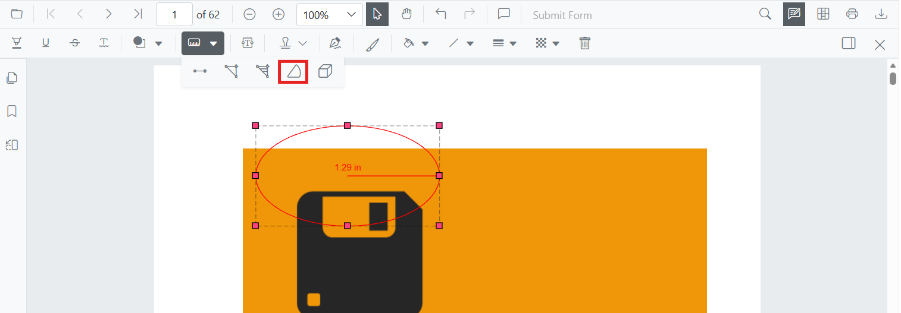
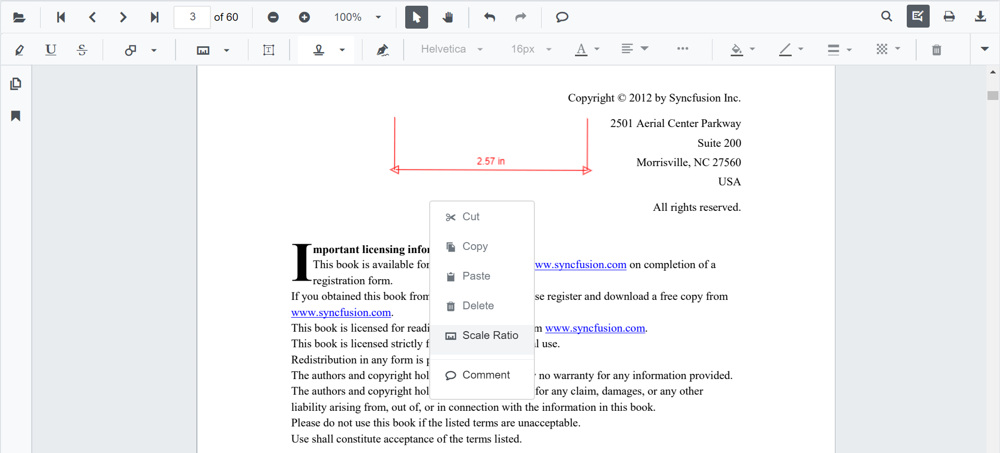
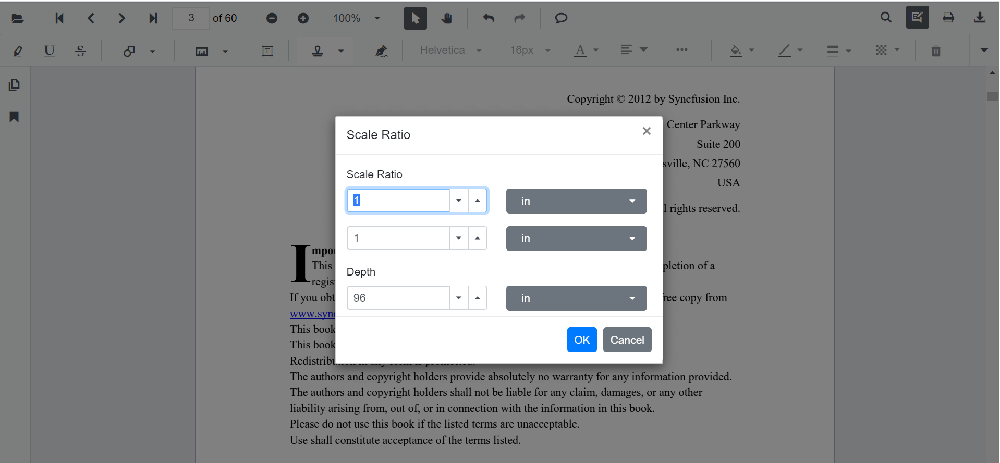

# Add Radius Annotations in Blazor SfPdfViewer Component
Radius measurement annotations allow users to draw circular regions and calculate the radius visually.



## Enable Radius Annotation

The `SfPdfViewer` component supports Radius measurement annotations by **default**. To enable the annotation toolbar and measurement functionality, simply add the `SfPdfViewer` component to your Blazor page:

```cshtml
@using Syncfusion.Blazor.SfPdfViewer

<SfPdfViewer2 DocumentPath="@DocumentPath"
              EnableAnnotationToolbar="true"
              Width="100%"
              Height="100%">
</SfPdfViewer2>

@code {
    private string DocumentPath { get; set; } = "wwwroot/Data/PDF_Succinctly.pdf";
}
```

## Add Radius Annotation

### Add Radius Annotation Using the Toolbar
1. Click the **Edit Annotation** button in the SfPdfViewer toolbar. A secondary toolbar appears below it.
2. Click the **Measurement Annotation** dropdown. A list of measurement annotation types appears.
3. Select **Radius** to enter Radius measurement mode.
4. Click on the page to place the **center point** of the circle, then drag to set the **radius**, and release the mouse to finalize the shape.


N> If **Pan** mode is active, selecting the Radius tool automatically switches the viewer into Radius drawing mode.

### Enable Radius Annotation Mode
Programmatically switch the viewer into Radius mode using [`SetAnnotationModeAsync`](https://help.syncfusion.com/cr/blazor/Syncfusion.Blazor.SfPdfViewer.PdfViewerBase.html#Syncfusion_Blazor_SfPdfViewer_PdfViewerBase_SetAnnotationModeAsync_Syncfusion_Blazor_SfPdfViewer_AnnotationType_).

```cshtml
@using Syncfusion.Blazor.SfPdfViewer
@using Syncfusion.Blazor.Buttons

<SfButton OnClick="EnableRadiusMode">Enable Radius Mode</SfButton>
<SfPdfViewer2 DocumentPath="@DocumentPath"
              @ref="viewer"
              Width="100%"
              Height="100%">
</SfPdfViewer2>

@code {
    private SfPdfViewer2 viewer;
    private string DocumentPath { get; set; } = "wwwroot/Data/PDF_Succinctly.pdf";

    private async Task EnableRadiusMode(MouseEventArgs args)
    {
        await viewer.SetAnnotationModeAsync(AnnotationType.Radius);
    }
}
```

#### Exit Radius Annotation Mode

Switch back to the default mode by calling [`SetAnnotationModeAsync`](https://help.syncfusion.com/cr/blazor/Syncfusion.Blazor.SfPdfViewer.PdfViewerBase.html#Syncfusion_Blazor_SfPdfViewer_PdfViewerBase_SetAnnotationModeAsync_Syncfusion_Blazor_SfPdfViewer_AnnotationType_) with annotation type `None`.

```cshtml
@using Syncfusion.Blazor.SfPdfViewer
@using Syncfusion.Blazor.Buttons

<SfButton OnClick="ExitRadiusMode">Exit Radius Mode</SfButton>
<SfPdfViewer2 DocumentPath="@DocumentPath"
              @ref="viewer"
              Width="100%"
              Height="100%">
</SfPdfViewer2>

@code {
    private SfPdfViewer2 viewer;
    private string DocumentPath { get; set; } = "wwwroot/Data/PDF_Succinctly.pdf";

    private async Task ExitRadiusMode(MouseEventArgs args)
    {
        await viewer.SetAnnotationModeAsync(AnnotationType.None);
    }
}
```

### Add Radius Annotation Programmatically
Use the [`AddAnnotationAsync`](https://help.syncfusion.com/cr/blazor/Syncfusion.Blazor.SfPdfViewer.PdfViewerBase.html#Syncfusion_Blazor_SfPdfViewer_PdfViewerBase_AddAnnotationAsync_Syncfusion_Blazor_SfPdfViewer_PdfAnnotation_) API to add a radius annotation.

```cshtml
@using Syncfusion.Blazor.SfPdfViewer
@using Syncfusion.Blazor.Buttons

<SfButton OnClick="AddRadius">Add Radius</SfButton>
<SfPdfViewer2 DocumentPath="@DocumentPath"
              @ref="viewer"
              Width="100%"
              Height="100%">
</SfPdfViewer2>

@code {
    private SfPdfViewer2 viewer;
    private string DocumentPath { get; set; } = "wwwroot/Data/PDF_Succinctly.pdf";

    private async Task AddRadius(MouseEventArgs args)
    {
        PdfAnnotation annotation = new PdfAnnotation
        {
            Type = AnnotationType.Radius,
            PageNumber = 1
        };
        annotation.Bound = new Bound
        {
            X = 200,
            Y = 630,
            Width = 90,
            Height = 90
        };
        await viewer.AddAnnotationAsync(annotation);
    }
}
```

## Customize Radius Annotation Appearance
Configure default properties — **fill color**, **stroke color**, **thickness**, **opacity**, and **measurement unit** — using the [`RadiusSettings`](https://help.syncfusion.com/cr/blazor/Syncfusion.Blazor.SfPdfViewer.PdfViewerBase.html#Syncfusion_Blazor_SfPdfViewer_PdfViewerBase_RadiusSettings) property.

> `RadiusSettings` is applied only at component initialization. To change defaults at runtime, update the bound object and re-render the viewer (for example, by toggling a render flag).

Available `PdfViewerRadiusSettings` members include `FillColor`, `StrokeColor`, `Thickness`, `Opacity`, `MeasurementUnit`, and `LeaderLineStyle`.

```cshtml
@using Syncfusion.Blazor.SfPdfViewer

<SfPdfViewer2 DocumentPath="@DocumentPath"
              @ref="viewer"
              Width="100%"
              Height="100%"
              RadiusSettings="@RadiusSettings">
</SfPdfViewer2>

@code {
    private SfPdfViewer2 viewer;
    private string DocumentPath { get; set; } = "wwwroot/Data/PDF_Succinctly.pdf";

    private PdfViewerRadiusSettings RadiusSettings = new PdfViewerRadiusSettings
    {
        FillColor = "yellow",
        StrokeColor = "orange",
        Opacity = 0.6,
        Thickness = 2
    };
}
```

## Manage Radius Annotation

### Move Radius Annotation
Drag inside the circle to reposition the entire annotation on the page.

### Reshape Radius Annotation
Drag the **edge handle** (the circumference) to adjust the radius size. The center point remains fixed.

### Edit Radius Annotation

#### Edit Radius Annotation (UI)
Select the Radius annotation first — the annotation toolbar appears below the main toolbar. Use it to change:

- **Fill Color**: pick a new color with the Edit Color tool.
  
- **Stroke Color**: change the line color with the Edit Stroke Color tool.
  
- **Thickness**: adjust the line width with the Edit Thickness tool.
  
- **Opacity**: change transparency with the Edit Opacity tool.
  
- **Line properties**: change the leader style (line only, with arrows, or full dimension lines) with the Edit Property tool.
  

#### Edit Radius Annotation Programmatically
Update properties and call [`EditAnnotationAsync`](https://help.syncfusion.com/cr/blazor/Syncfusion.Blazor.SfPdfViewer.PdfViewerBase.html#Syncfusion_Blazor_SfPdfViewer_PdfViewerBase_EditAnnotationAsync_Syncfusion_Blazor_SfPdfViewer_PdfAnnotation_).

```cshtml
@using Syncfusion.Blazor.SfPdfViewer
@using Syncfusion.Blazor.Buttons

<SfButton OnClick="EditRadiusProgrammatically">Edit Radius</SfButton>
<SfPdfViewer2 DocumentPath="@DocumentPath"
              @ref="viewer"
              Width="100%"
              Height="100%">
</SfPdfViewer2>

@code {
    private SfPdfViewer2 viewer;
    private string DocumentPath { get; set; } = "wwwroot/Data/PDF_Succinctly.pdf";

    private async Task EditRadiusProgrammatically(MouseEventArgs args)
    {
        List<PdfAnnotation> annotationCollection = await viewer.GetAnnotationsAsync();

        if (annotationCollection == null || annotationCollection.Count == 0)
        {
            return;
        }

        PdfAnnotation target = annotationCollection
            .FirstOrDefault(a => a.Type == AnnotationType.Radius);

        if (target == null)
        {
            return;
        }

        target.StrokeColor = "#0000FF";
        target.Thickness = 2;
        target.Opacity = 0.8;

        await viewer.EditAnnotationAsync(target);
    }
}
```

### Delete Radius Annotation
Delete a Radius annotation through the UI (right-click → **Delete**, click **Delete** on the annotation toolbar, or press the `Delete` key while the annotation is selected) or programmatically:

```cshtml
@code {
    private async Task DeleteFirstRadius()
    {
        List<PdfAnnotation> annotations = await viewer.GetAnnotationsAsync();
        PdfAnnotation target = annotations.FirstOrDefault(a => a.Type == AnnotationType.Radius);
        if (target != null)
        {
            await viewer.DeleteAnnotationAsync(target);
        }
    }
}
```

For additional deletion patterns, see [**Delete Annotation**](../delete-annotation).

## Set Properties While Adding an Individual Annotation
Pass per-annotation values directly when calling [`AddAnnotationAsync`](https://help.syncfusion.com/cr/blazor/Syncfusion.Blazor.SfPdfViewer.PdfViewerBase.html#Syncfusion_Blazor_SfPdfViewer_PdfViewerBase_AddAnnotationAsync_Syncfusion_Blazor_SfPdfViewer_PdfAnnotation_).

```cshtml
@using Syncfusion.Blazor.SfPdfViewer
@using Syncfusion.Blazor.Buttons

<SfButton OnClick="AddStyledRadius">Add Styled Radius</SfButton>
<SfPdfViewer2 DocumentPath="@DocumentPath"
              @ref="viewer"
              Width="100%"
              Height="100%">
</SfPdfViewer2>

@code {
    private SfPdfViewer2 viewer;
    private string DocumentPath { get; set; } = "wwwroot/Data/PDF_Succinctly.pdf";

    private async Task AddStyledRadius(MouseEventArgs args)
    {
        PdfAnnotation annotation = new PdfAnnotation
        {
            Type = AnnotationType.Radius,
            PageNumber = 1,
            FillColor = "orange",
            Opacity = 0.6,
            StrokeColor = "pink",
            Thickness = 2
        };
        annotation.Bound = new Bound
        {
            X = 200,
            Y = 630,
            Width = 90,
            Height = 90
        };
        await viewer.AddAnnotationAsync(annotation);
    }
}
```

## Scale Ratio and Units
The **Scale Ratio** controls how many page units equal one real-world unit. Open it from the **context menu** of any measurement annotation to recalibrate.



Supported `CalibrationUnit` values: `Inch`, `Millimeter`, `Centimeter` (`Cm`), `Point`, `Pica`, and `Feet`.



> `ScaleRatio` must be greater than `0`. The default value is `1`.

### Set Default Scale Ratio During Initialization
Configure scale defaults using [`MeasurementSettings`](https://help.syncfusion.com/cr/blazor/Syncfusion.Blazor.SfPdfViewer.PdfViewerMeasurementSettings.html#Syncfusion_Blazor_SfPdfViewer_PdfViewerMeasurementSettings_ScaleRatio).

```cshtml
@using Syncfusion.Blazor.SfPdfViewer

<SfPdfViewer2 @ref="@viewer"
              DocumentPath="@DocumentPath"
              MeasurementSettings="@MeasurementSettings"
              Height="100%"
              Width="100%">
</SfPdfViewer2>

@code {
    private SfPdfViewer2 viewer;
    private string DocumentPath { get; set; } = "wwwroot/Data/PDF_Succinctly.pdf";

    private PdfViewerMeasurementSettings MeasurementSettings = new PdfViewerMeasurementSettings
    {
        ScaleRatio = 2,
        ConversionUnit = CalibrationUnit.Cm
    };
}
```

## Handle Radius Annotation Events
Listen to annotation life-cycle events (`Added`, `Modified`, `Selected`, `Removed`) and use the `AnnotationEventArgs` payload — which includes the affected `PdfAnnotation`, the page number, and the action that triggered the event.

For the full list of events and their payloads, see [**Annotation Events**](../events).

## Export and Import
Radius measurements are exported and imported with the rest of the annotations in **JSON** or **XFDF** format. You can programmatically export and import these annotations using the [`ExportAnnotationAsync`](https://help.syncfusion.com/cr/blazor/Syncfusion.Blazor.SfPdfViewer.PdfViewerBase.html#Syncfusion_Blazor_SfPdfViewer_PdfViewerBase_ExportAnnotationAsync_Syncfusion_Blazor_SfPdfViewer_AnnotationDataFormat_) and [`ImportAnnotationAsync`](https://help.syncfusion.com/cr/blazor/Syncfusion.Blazor.SfPdfViewer.PdfViewerBase.html#Syncfusion_Blazor_SfPdfViewer_PdfViewerBase_ImportAnnotationAsync_System_IO_Stream_Syncfusion_Blazor_SfPdfViewer_AnnotationDataFormat_) methods.

For the full export/import workflow and additional formats, see [**Export and Import Annotations**](../import-export-annotation).

## See also

- [Annotation Events](../events)
- [Export and Import Annotations](../import-export-annotation)
- [Delete Annotations](../delete-annotation)
- [Measurement Annotations Overview](overview)
- [Add Perimeter Annotations](perimeter-annotation)
