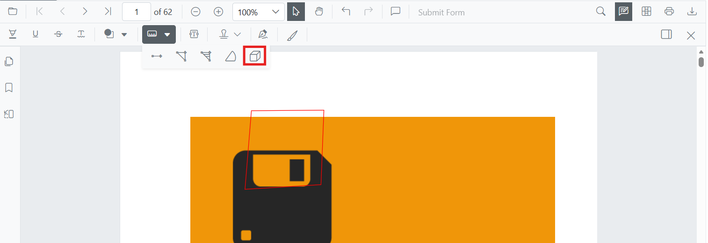

# Add Volume Measurement Annotations in Blazor SfPdfViewer Component
Volume measurement annotations allow users to draw cubic regions and calculate the volume visually.



## Enable Volume Measurement
To enable Volume annotations in the Blazor SfPdfViewer, configure the component with annotation support.

```cshtml

@using Syncfusion.Blazor.SfPdfViewer

<SfPdfViewer2 DocumentPath="@DocumentPath" 
              Width="100%" 
              Height="100%">
</SfPdfViewer2>

@code {
    private string DocumentPath { get; set; } = "wwwroot/Data/PDF_Succinctly.pdf";
}

```

## Add Volume Annotation

### Draw Volume Using the Toolbar

1. Open the **Annotation Toolbar**.
2. Select **Measurement → Volume**.
3. Click and drag on the page to draw the volume.


N> If Pan mode is active, selecting the Volume tool automatically switches interaction mode.

### Enable Volume Mode
Programmatically switch the viewer into Volume mode using `SetAnnotationModeAsync(AnnotationType.Volume)`.

```cshtml

@using Syncfusion.Blazor.SfPdfViewer
@using Syncfusion.Blazor.Buttons

<SfButton OnClick="EnableVolumeMode">Enable Volume Mode</SfButton>
<SfPdfViewer2 DocumentPath="@DocumentPath" 
              @ref="viewer"
              Width="100%" 
              Height="100%">
</SfPdfViewer2>

@code {
    SfPdfViewer2 viewer;
    private string DocumentPath { get; set; } = "wwwroot/Data/PDF_Succinctly.pdf";

    public async void EnableVolumeMode(MouseEventArgs args)
    {
        await viewer.SetAnnotationModeAsync(AnnotationType.Volume);
    }
}

```

#### Exit Volume Mode

```cshtml

@using Syncfusion.Blazor.SfPdfViewer
@using Syncfusion.Blazor.Buttons

<SfButton OnClick="ExitVolumeMode">Exit Volume Mode</SfButton>
<SfPdfViewer2 DocumentPath="@DocumentPath" 
              @ref="viewer"
              Width="100%" 
              Height="100%">
</SfPdfViewer2>

@code {
    SfPdfViewer2 viewer;
    private string DocumentPath { get; set; } = "wwwroot/Data/PDF_Succinctly.pdf";

    public async void ExitVolumeMode(MouseEventArgs args)
    {
        await viewer.SetAnnotationModeAsync(AnnotationType.None);
    }
}

```

### Add Volume Programmatically
Use the [`AddAnnotationAsync`](https://help.syncfusion.com/cr/blazor/Syncfusion.Blazor.SfPdfViewer.PdfViewerBase.html#Syncfusion_Blazor_SfPdfViewer_PdfViewerBase_AddAnnotationAsync_Syncfusion_Blazor_SfPdfViewer_PdfAnnotation_) API to add a volume annotation.

```cshtml

@using Syncfusion.Blazor.SfPdfViewer
@using Syncfusion.Blazor.Buttons

<SfButton OnClick="AddVolume">Add Volume</SfButton>
<SfPdfViewer2 DocumentPath="@DocumentPath" 
              @ref="viewer"
              Width="100%" 
              Height="100%">
</SfPdfViewer2>

@code {
    SfPdfViewer2 viewer;
    private string DocumentPath { get; set; } = "wwwroot/Data/PDF_Succinctly.pdf";

    public async void AddVolume(MouseEventArgs args)
    {
        PdfAnnotation annotation = new PdfAnnotation();
        annotation.Type = AnnotationType.Volume;
        annotation.PageNumber = 0;
        
        annotation.Bound = new Bound();
        annotation.Bound.X = 200;
        annotation.Bound.Y = 810;
        annotation.Bound.Width = 90;
        annotation.Bound.Height = 90;
        
        await viewer.AddAnnotationAsync(annotation);
    }
}

```

## Customize Volume Appearance
Configure default properties using the [`VolumeSettings`](https://help.syncfusion.com/cr/blazor/Syncfusion.Blazor.SfPdfViewer.PdfViewerBase.html#Syncfusion_Blazor_SfPdfViewer_PdfViewerBase_VolumeSettings) property (for example, default **fill color**, **stroke color**, **opacity**).

```cshtml

@using Syncfusion.Blazor.SfPdfViewer

<SfPdfViewer2 DocumentPath="@DocumentPath"
              @ref="viewer"
              Width="100%"
              Height="100%"
              VolumeSettings="@VolumeSettings">
</SfPdfViewer2>

@code {
    SfPdfViewer2 viewer;
    private string DocumentPath { get; set; } = "wwwroot/Data/PDF_Succinctly.pdf";

    PdfViewerVolumeSettings VolumeSettings = new PdfViewerVolumeSettings
    {
        FillColor = "yellow",
        StrokeColor = "orange",
        Opacity = 0.6
    };
}

```

## Manage Volume (Move, Resize, Delete)
- **Move**: Drag inside the cube to reposition it.
- **Reshape**: Drag any edge handle to adjust the volume dimensions.

### Edit Volume Annotation

#### Edit Volume (UI)

Use the annotation toolbar to modify:
- **Fill Color** - Edit the fill color using the Edit Color tool


- **Stroke Color** - Edit the stroke color using the Edit Stroke Color tool


- **Thickness** - Edit the border thickness using the Edit Thickness tool


- **Opacity** - Edit the opacity using the Edit Opacity tool


#### Edit Volume Programmatically
Update properties and call `EditAnnotationAsync()`.

```cshtml

@using Syncfusion.Blazor.SfPdfViewer
@using Syncfusion.Blazor.Buttons

<SfButton OnClick="EditVolumeProgrammatically">Edit Volume</SfButton>
<SfPdfViewer2 DocumentPath="@DocumentPath" 
              @ref="viewer"
              Width="100%" 
              Height="100%">
</SfPdfViewer2>

@code {
    SfPdfViewer2 viewer;
    private string DocumentPath { get; set; } = "wwwroot/Data/PDF_Succinctly.pdf";

    public async void EditVolumeProgrammatically(MouseEventArgs args)
    {
        List<PdfAnnotation> annotationCollection = await viewer.GetAnnotationsAsync();
        foreach (var ann in annotationCollection)
        {
            if (ann.Type == AnnotationType.Volume)
            {
                ann.StrokeColor = "#0000FF";
                ann.Thickness = 2;
                ann.Opacity = 0.8;
                await viewer.EditAnnotationAsync(ann);
                break;
            }
        }
    }
}

```

### Delete Volume Annotation

Delete Volume Annotation via UI (toolbar/context menu) or programmatically. For supported workflows and APIs, see [**Delete Annotation**](../delete-annotation).

## Set Default Properties During Initialization
Apply defaults for Volume using the [`VolumeSettings`](https://help.syncfusion.com/cr/blazor/Syncfusion.Blazor.SfPdfViewer.PdfViewerBase.html#Syncfusion_Blazor_SfPdfViewer_PdfViewerBase_VolumeSettings) property.

```cshtml

@using Syncfusion.Blazor.SfPdfViewer

<SfPdfViewer2 @ref="@viewer"
              DocumentPath="@DocumentPath"
              Height="100%" Width="100%"
              VolumeSettings="@VolumeSettings">
</SfPdfViewer2>

@code {
    SfPdfViewer2 viewer;
    private string DocumentPath { get; set; } = "wwwroot/Data/PDF_Succinctly.pdf";
    
    PdfViewerVolumeSettings VolumeSettings = new PdfViewerVolumeSettings
    {
        FillColor = "yellow",
        Opacity = 0.6,
        StrokeColor = "yellow"
    };
}

```

## Set Properties While Adding Individual Annotation
Pass per‑annotation values directly when calling [`AddAnnotationAsync`](https://help.syncfusion.com/cr/blazor/Syncfusion.Blazor.SfPdfViewer.PdfViewerBase.html#Syncfusion_Blazor_SfPdfViewer_PdfViewerBase_AddAnnotationAsync_Syncfusion_Blazor_SfPdfViewer_PdfAnnotation_).

```cshtml

@using Syncfusion.Blazor.SfPdfViewer
@using Syncfusion.Blazor.Buttons

<SfButton OnClick="AddStyledVolume">Add Styled Volume</SfButton>
<SfPdfViewer2 DocumentPath="@DocumentPath" 
              @ref="viewer"
              Width="100%" 
              Height="100%">
</SfPdfViewer2>

@code {
    SfPdfViewer2 viewer;
    private string DocumentPath { get; set; } = "wwwroot/Data/PDF_Succinctly.pdf";

    public async void AddStyledVolume(MouseEventArgs args)
    {
        PdfAnnotation annotation = new PdfAnnotation();
        annotation.Type = AnnotationType.Volume;
        annotation.PageNumber = 0;
        
        annotation.Bound = new Bound();
        annotation.Bound.X = 200;
        annotation.Bound.Y = 810;
        annotation.Bound.Width = 90;
        annotation.Bound.Height = 90;
        annotation.FillColor = "yellow";
        annotation.Opacity = 0.6;
        annotation.StrokeColor = "yellow";
        
        await viewer.AddAnnotationAsync(annotation);
    }
}

```

## Scale Ratio & Units
- Use **Scale Ratio** from the context menu.  
  
- Supported units: Inch, Millimeter, Centimeter, Point, Pica, Feet. 
  

### Set Default Scale Ratio During Initialization
Configure scale defaults using [`MeasurementSettings`](https://help.syncfusion.com/cr/blazor/Syncfusion.Blazor.SfPdfViewer.PdfViewerMeasurementSettings.html#Syncfusion_Blazor_SfPdfViewer_PdfViewerMeasurementSettings_ScaleRatio).

```cshtml

@using Syncfusion.Blazor.SfPdfViewer

<SfPdfViewer2 @ref="@viewer"
              DocumentPath="@DocumentPath"
              MeasurementSettings="@MeasurementSettings"
              Height="100%"
              Width="100%">
</SfPdfViewer2>

@code {
    SfPdfViewer2 viewer;
    private string DocumentPath { get; set; } = "wwwroot/Data/PDF_Succinctly.pdf";

    PdfViewerMeasurementSettings MeasurementSettings = new PdfViewerMeasurementSettings 
    { 
        ScaleRatio = 2, 
        ConversionUnit = CalibrationUnit.Cm 
    };
}

```

## Handle Volume Events
Listen to annotation life-cycle events (add/modify/select/remove). For the full list and parameters, see [**Annotation Events**](../events).

## Export and Import
Volume measurements can be exported or imported with other annotations. For workflows and supported formats, see [**Export and Import annotations**](../import-export-annotation).

## See Also

- [Annotation Events](../events)
- [Export and Import Annotations](../import-export-annotation)
- [Delete Annotations](../delete-annotation)
