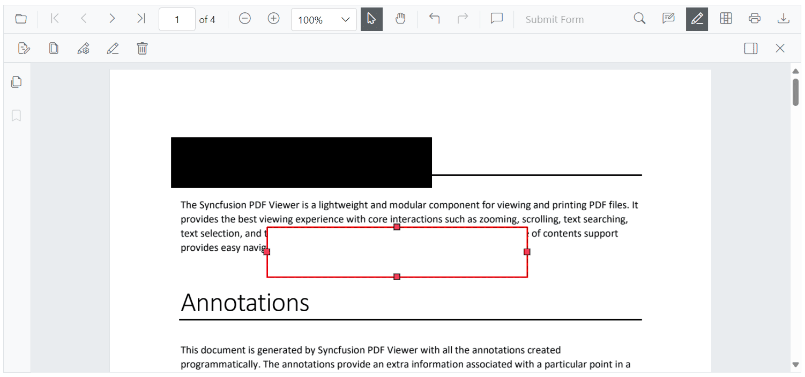
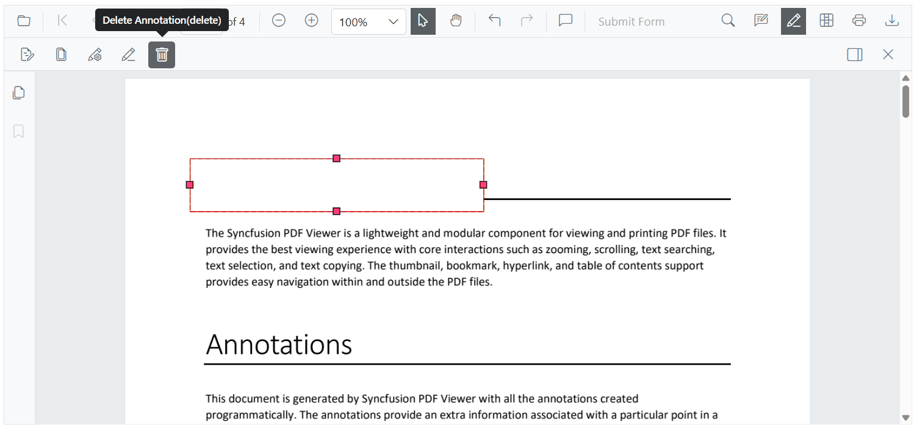
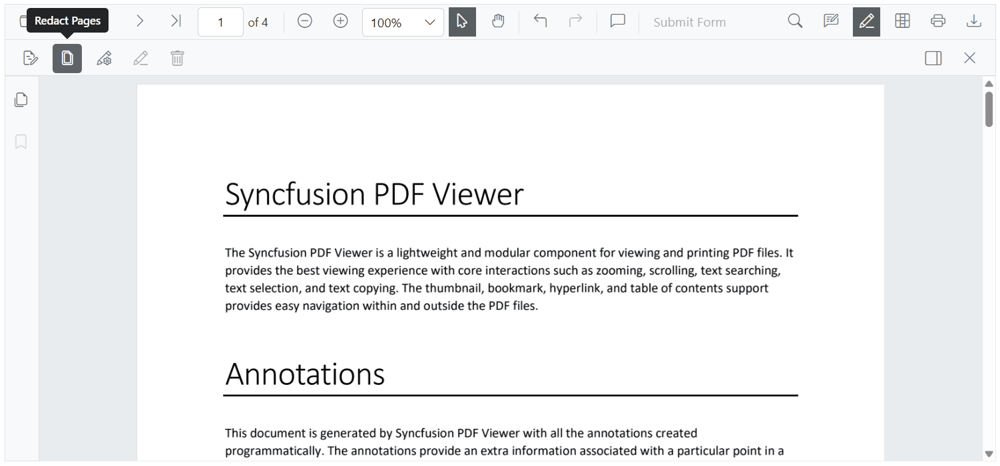
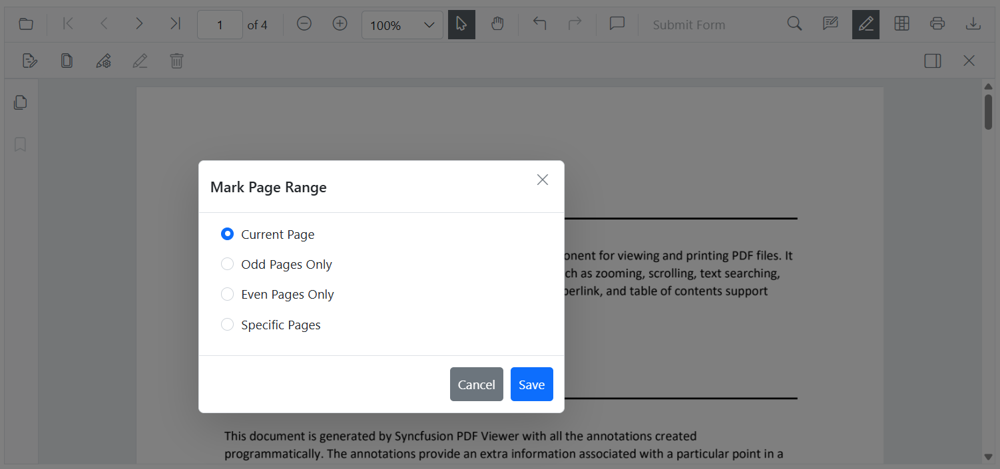
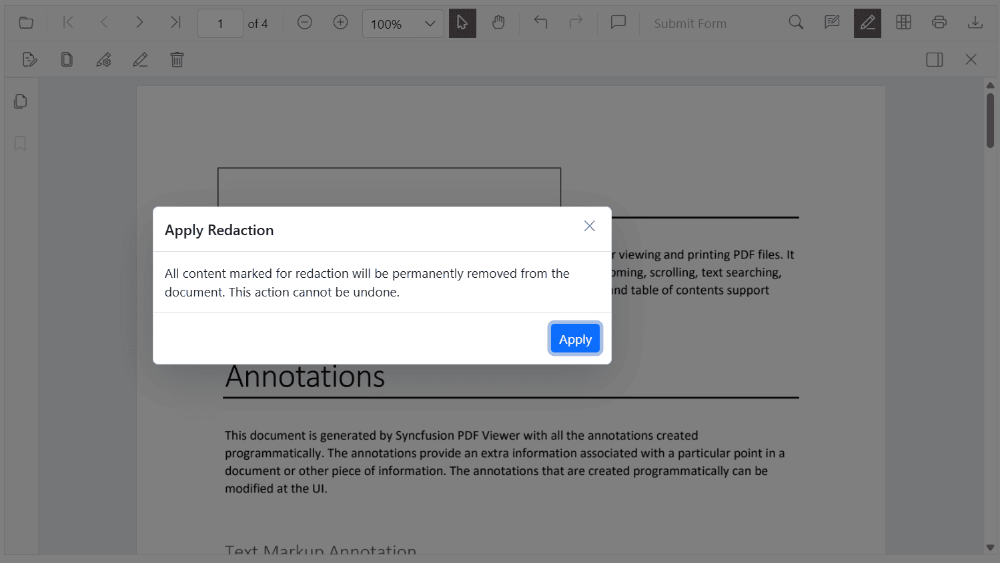
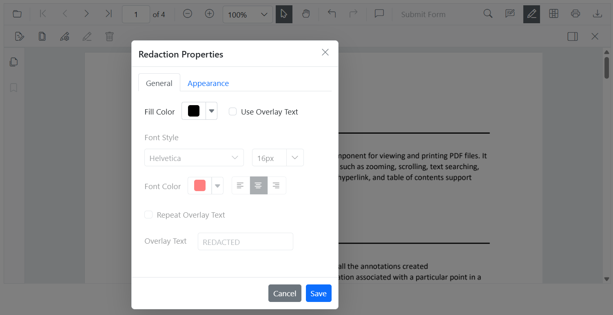

# Redaction annotations in Blazor SfPdfViewer Component

Redaction annotations conceal sensitive content in a PDF. The Syncfusion Blazor PDF Viewer supports interactive and programmatic redaction with appearance customization and final application.


## Adding a Redaction annotation to the PDF document

The redaction feature allows hiding sensitive information by adding redaction annotations to pages. Annotations can be added from the toolbar or programmatically.

### Adding a Redaction annotation using the Toolbar

Use the redaction tool on the toolbar to draw over content that should be redacted. After marking, an annotation can display overlay text (for example, “Confidential”) and can be styled using fill color and other properties.


#### Redaction annotations are fully interactive:

* **Movable**: Reposition an annotation within the same page.



* **Resizable**: Adjust the size to cover the required region.


N> The redaction tool is not shown on the toolbar by default. Customize the toolbar to include it. For instructions, see the [Redaction Toolbar customization](../toolbar/redaction-toolbar-customization).

### Adding a Redaction annotation using Programmatically

Use the [`AddAnnotationAsync`](https://help.syncfusion.com/cr/blazor/Syncfusion.Blazor.PdfViewer.SfPdfViewer2.html#Syncfusion_Blazor_PdfViewer_SfPdfViewer2_AddAnnotationAsync_Syncfusion_Blazor_PdfViewer_PdfAnnotation_) method to add a redaction annotation by creating a [`PdfAnnotation`](https://help.syncfusion.com/cr/blazor/Syncfusion.Blazor.PdfViewer.PdfAnnotation.html) instance. Configure redaction-specific settings with [`RedactionProperties`](https://help.syncfusion.com/cr/blazor/Syncfusion.Blazor.PdfViewer.RedactionProperties.html).

The example below creates a redaction annotation with custom appearance, redaction options, and position on the first page.

```cshtml
@page "/"

<SfButton OnClick="AddRedactionAnnotation">Add Redaction Annotation</SfButton>
<SfPdfViewer2 @ref="SfPdfViewer2" DocumentPath="@DocumentPath" Height="800px" Width="100%">
</SfPdfViewer2>

@code{

    private string DocumentPath { get; set; } = "wwwroot/data/Annotations.pdf";
    private SfPdfViewer2? SfPdfViewer2;

    // Adds a redaction annotation to the first page of the PDF Viewer
    private async void AddRedactionAnnotation()
    {
        // Create a redaction annotation with custom appearance and properties
        PdfAnnotation annotation = new PdfAnnotation()
        {
            Id = "redaction_Annotation",
            FontSize = 20,
            Bound = new Bound()
            {
                X = 200,
                Y = 80,
                Width = 150,
                Height = 75
            },
            PageNumber = 0,

            // Configure redaction-specific properties
            AnnotationProperties = new RedactionProperties()
            {
                MarkerFillColor = "#FF00FF",
                MarkerOpacity = 0.5,
                MarkerBorderColor = "#233A77",
                OverlayText = "Hello",
                IsRepeat = false
            },

            // Set the font and fill style
            FontColor = "#0000FF",
            FontFamily = "Courier",
            FillColor = "#EEEEEE",

            // Specify the annotation type
            Type = AnnotationType.Redaction
        };

        // Add the annotation to the PDF Viewer
        await SfPdfViewer2.AddAnnotationAsync(annotation);
    }
}
```

The following image illustrates the result.


The `RedactionProperties` configuration customizes the annotation’s appearance and behavior. Key options include `MarkerFillColor` (overlay color), `MarkerOpacity` (0.0–1.0), `MarkerBorderColor` (border color), `OverlayText` (text over the redacted area), and `IsRepeat` (repeat overlay text across the area).

## Updating the properties of the Redaction  Annotations

Redaction annotations can be updated after creation. Changes are possible interactively via the **property panel** or programmatically using the [`EditAnnotationAsync`](https://help.syncfusion.com/cr/blazor/Syncfusion.Blazor.PdfViewer.SfPdfViewer2.html#Syncfusion_Blazor_PdfViewer_SfPdfViewer2_EditAnnotationAsync_Syncfusion_Blazor_PdfViewer_PdfAnnotation_) API.

### Updating Redaction Annotations Using the Property Panel

When a redaction annotation is selected, the property panel allows updating font, overlay text, fill color, and more. Changes are applied immediately.

Open the property panel in either of the following ways:

* Click the **redaction panel** icon on the redaction toolbar.


* Open the **context menu** by right-clicking (or long-pressing on mobile) the redaction annotation and choose Properties.


### Updating Redaction Annotations Programmatically

To update an existing redaction annotation, retrieve the annotations with [`GetAnnotationsAsync`](https://help.syncfusion.com/cr/blazor/Syncfusion.Blazor.PdfViewer.SfPdfViewer2.html#Syncfusion_Blazor_PdfViewer_SfPdfViewer2_GetAnnotationsAsync), modify the necessary properties, and save the changes using [`EditAnnotationAsync`](https://help.syncfusion.com/cr/blazor/Syncfusion.Blazor.SfPdfViewer.PdfViewerBase.html#Syncfusion_Blazor_SfPdfViewer_PdfViewerBase_EditAnnotationAsync_Syncfusion_Blazor_SfPdfViewer_PdfAnnotation_).

The example below updates redaction-specific properties (such as overlay text, fill, border, and opacity) along with general appearance settings, and then applies the changes using [`EditAnnotationAsync`](https://help.syncfusion.com/cr/blazor/Syncfusion.Blazor.SfPdfViewer.PdfViewerBase.html#Syncfusion_Blazor_SfPdfViewer_PdfViewerBase_EditAnnotationAsync_Syncfusion_Blazor_SfPdfViewer_PdfAnnotation_) method..

```cshtml
@page "/"

<SfButton OnClick="EditRedaction">Edit Redaction</SfButton>

<SfPdfViewer2 @ref="SfPdfViewer2" DocumentPath="@DocumentPath" Height="800px" Width="100%">  
</SfPdfViewer2>

@code{
    private string DocumentPath { get; set; } = "wwwroot/data/Annotations.pdf";
    private SfPdfViewer2? SfPdfViewer2;
    // Updates the first redaction annotation's properties in the PDF Viewer
    private async void EditRedaction()
    {
        // Retrieve all annotations from the viewer
        List<PdfAnnotation> annotations = await SfPdfViewer2.GetAnnotationsAsync();

        // Get the first annotation to update
        PdfAnnotation annotation = annotations[0];

        // Check if the annotation is a redaction type and update redaction-specific properties
        if (annotation.AnnotationProperties is RedactionProperties redaction)
        {
            redaction.OverlayText = "Updated Text";
            redaction.MarkerFillColor = "#9bc7b8";
            redaction.MarkerBorderColor = "#888f8c";
            redaction.IsRepeat = true;
            redaction.MarkerOpacity = 0.2;
        }

        // Update general annotation properties
        annotation.FontSize = 15;
        annotation.FontColor = "Yellow";
        annotation.TextAlignment = TextAlignment.Left;

        // Apply the changes to the annotation in the viewer
        await SfPdfViewer2.EditAnnotationAsync(annotation);
    }
}
```
The following image shows the updated result.


## Deleting Redaction Annotations

Redaction annotations can be removed through the UI or programmatically.

### Deleting Redaction Annotations Using the UI

Delete redaction annotations using any of the following:

* **Right-click and select _Delete_** from the context menu.


* **Click the _Delete_ button** on the toolbar.



* **Press the `Delete` key** after selecting the annotation.

### Deleting Redaction Annotations Programmatically

Delete redaction annotations programmatically using the [`DeleteAnnotationAsync`](https://help.syncfusion.com/cr/blazor/Syncfusion.Blazor.SfPdfViewer.PdfViewerBase.html#Syncfusion_Blazor_SfPdfViewer_PdfViewerBase_DeleteAnnotationsAsync) method by passing the annotation ID or object reference.

For additional examples, see [Delete annotation programmatically](./text-markup-annotation#delete-annotation-programmatically).

## Configuring Default Properties for Redaction Annotations

Use [`PdfViewerRedactionSettings`](https://help.syncfusion.com/cr/blazor/Syncfusion.Blazor.PdfViewer.PdfViewerRedactionSettings.html) inside the viewer to set default redaction properties for newly created annotations, including fill color, overlay text, font style, and alignment.

These defaults apply to newly added annotations created from the toolbar unless overridden.

The following example shows how to set default properties for redaction annotations using [`PdfViewerRedactionSettings`](https://help.syncfusion.com/cr/blazor/Syncfusion.Blazor.PdfViewer.PdfViewerRedactionSettings.html).

```cshtml
@* 
    This component demonstrates how to configure default redaction annotation settings 
    in the Syncfusion Blazor PDF Viewer.
*@
<SfPdfViewer2 @ref="SfPdfViewer2" DocumentPath="@DocumentPath" Height="800px" Width="100%">
    <PdfViewerRedactionSettings OverlayText="Confidential" 
                                MarkerFillColor="#FF0000"
                                MarkerBorderColor="#000000"
                                IsRepeat="false"
                                FillColor="#F8F8F8" 
                                FontColor="#333333"
                                FontSize="14" 
                                FontFamily="Symbol" 
                                TextAlignment="TextAlignment.Right" />
        <PdfViewerToolbarSettings ToolbarItems="ToolbarItems" MobileToolbarItems="MobileToolbarItems"></PdfViewerToolbarSettings>
</SfPdfViewer2>
```

This uses the [`PdfViewerRedactionSettings`](https://help.syncfusion.com/cr/blazor/Syncfusion.Blazor.PdfViewer.PdfViewerRedactionSettings.html) class to define defaults.

## Add Page Redaction

The PDF Viewer can redact entire pages that contain sensitive information. Redaction is available through the UI or programmatically.



### Adding Redact Pages Using the UI

Use the Redact Pages option on the redaction toolbar. When selected, the Mark Page Range dialog provides these options:

* **Current Page** – Redacts the currently visible page.
* **Odd Pages Only** – Redacts all odd-numbered pages.
* **Even Pages Only** – Redacts all even-numbered pages.
* **Specific Pages** – Enter specific page numbers (for example, 1, 3–5, 7).

After choosing a range, select Save to add redaction marks to the selected pages.

The following image shows the dialog.



### Adding Redact Pages Using Programmatically

Mark entire pages for redaction using [`AddPageRedactionsAsync`](https://help.syncfusion.com/cr/blazor/Syncfusion.Blazor.PdfViewer.SfPdfViewer2.html#Syncfusion_Blazor_PdfViewer_SfPdfViewer2_AddPageRedactionsAsync_System_Collections_Generic_List_System_Int32__).

This is helpful when a whole page contains confidential content.

The example below adds redaction annotations to specific pages using 0-based page indexes (first and third pages).

```cshtml
@page "/"

<SfButton OnClick="RedactPages">Add Redact Pages</SfButton>

<SfPdfViewer2 @ref="SfPdfViewer2" DocumentPath="@DocumentPath" Height="800px" Width="100%">
</SfPdfViewer2>

@code{

    private string DocumentPath { get; set; } = "wwwroot/data/Annotations.pdf";

    private SfPdfViewer2? SfPdfViewer2;

    // Adds redaction annotations to entire pages using 0-based page indexes.
    // In this example, redaction is applied to the first (0) and third (2) pages.
    private async void RedactPages()
    {
        List<int> pagesToRedact = new() { 0, 2 }; // Page indexes start from 0
        await SfPdfViewer2.AddPageRedactionsAsync(pagesToRedact);
    }

}
```

Result preview:


## Applying Redaction to the Document

The viewer can permanently apply redaction annotations, removing the original content. Application can be done through the toolbar or programmatically.

### Applying Redaction Using the Redact Button

Use the redact button on the toolbar to permanently apply all redaction annotations in the document.

* The redact button is disabled when the document has no redaction annotations.
* It becomes enabled when redaction annotations exist.


A confirmation dialog appears before proceeding to ensure awareness that the action is permanent and cannot be undone.



### Applying Redaction Using Programmatically

Use the `RedactAsync` method to apply all redaction annotations programmatically.

```cshtml
@page "/"

<SfButton OnClick="ApplyRedaction">Apply Redaction</SfButton>

<SfPdfViewer2 @ref="SfPdfViewer2" DocumentPath="@DocumentPath" Height="800px" Width="100%">
</SfPdfViewer2>

@code{
    private string DocumentPath { get; set; } = "wwwroot/data/Annotations.pdf";
    private SfPdfViewer2? SfPdfViewer2;

    // Applies all redaction annotations permanently
    private async void ApplyRedaction()
    {
        await SfPdfViewer2.RedactAsync();
    }
}
```

The following image shows the programmatic apply operation.


N> Redaction is irreversible. After applying, original content cannot be recovered.

## Redaction Property Panel

When no annotation is selected, the property panel displays **default values** from [`PdfViewerRedactionSettings`](https://help.syncfusion.com/cr/blazor/Syncfusion.Blazor.PdfViewer.PdfViewerRedactionSettings.html). When a redaction is selected, it shows the selected annotation’s properties.

Use the panel to update overlay text, font settings, opacity, and related options.



## Comment Panel Support for Redaction Annotations

Redaction annotations support **comments** through the built-in **comment panel**. Add notes, track reviews, or record reasons for redaction.

Commenting is available through the UI and API. For details, see the [Comments documentation](./comments).

## Export and Import Support for the Redaction Annotations

The viewer supports exporting and importing redaction annotations to save and reload them for future use.

For details, see the [Export and import annotations documentation](./import-export-annotation).

## See also

* [Adding the shape annotation in PDF viewer](./shape-annotation)
* [Annotation Toolbar customization in PDF viewer](../toolbar/annotation-toolbar-customization)
* [Form designer in PDF viewer](../form-designer/overview)