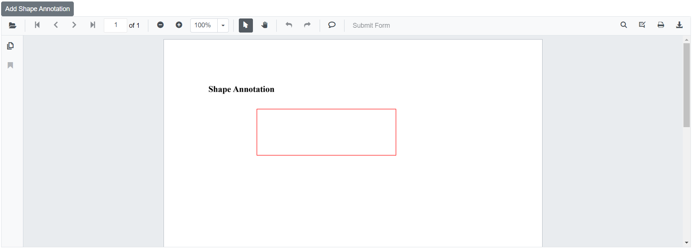
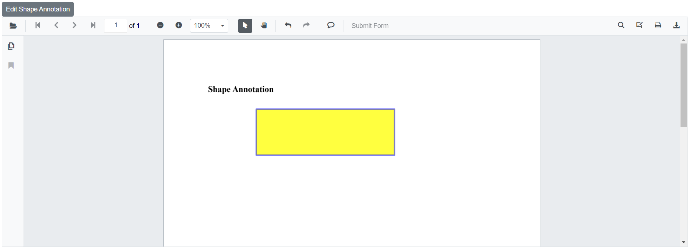

# Shape annotations in Blazor SfPdfViewer Component

The Blazor SfPdfViewer supports adding, editing, and deleting shape annotations. The available shape types are:

* Line
* Arrow
* Rectangle
* Circle
* Polygon


## Adding a shape annotation to the PDF document

Shape annotations can be added from the annotation toolbar.

* Select **Edit Annotation** in the viewer toolbar to open the annotation toolbar.
* Select **Shape Annotation** to open the shape list.
* Choose a shape type to enable the corresponding drawing mode.
* Draw the selected shape on the PDF page.

When the viewer is in pan mode and a shape drawing mode is activated, the control switches to text selection mode to enable drawing.


```cshtml

@using Syncfusion.Blazor.Buttons
@using Syncfusion.Blazor.SfPdfViewer

<SfButton OnClick="OnClick">Circle Annotation</SfButton>
<SfPdfViewer2 DocumentPath="@DocumentPath"
              @ref="viewer"
              Width="100%"
              Height="100%">
</SfPdfViewer2>

@code {
    SfPdfViewer2 viewer;
    public async void OnClick(MouseEventArgs args)
    {
        await viewer.SetAnnotationModeAsync(AnnotationType.Circle);
    }
    private string DocumentPath { get; set; } = "wwwroot/Data/PDF_Succinctly.pdf";
}

```

## Editing the properties of the shape annotation

The annotation toolbar provides tools to modify fill color, stroke color, thickness, and opacity for shape annotations.

### Editing fill color

Use the Edit Color tool to change the annotation’s fill color via the color palette.


### Editing stroke color

Use the Edit Stroke Color tool to change the border color via the color palette.


### Editing thickness

Use the Edit Thickness tool to adjust the border thickness with the range slider.


### Editing opacity

Use the Edit Opacity tool to modify transparency with the range slider.


### Editing the line properties

Properties for line-based shapes (Line and Arrow) can be adjusted in the Line Properties dialog. Open it by choosing Properties from the context menu after right-clicking a line or arrow annotation.


## Setting default properties during control initialization

Default properties for shape annotations can be configured during initialization using [LineSettings](https://help.syncfusion.com/cr/blazor/Syncfusion.Blazor.SfPdfViewer.PdfViewerBase.html#Syncfusion_Blazor_SfPdfViewer_PdfViewerBase_LineSettings), [ArrowSettings](https://help.syncfusion.com/cr/blazor/Syncfusion.Blazor.SfPdfViewer.PdfViewerBase.html#Syncfusion_Blazor_SfPdfViewer_PdfViewerBase_AreaSettings), [RectangleSettings](https://help.syncfusion.com/cr/blazor/Syncfusion.Blazor.SfPdfViewer.PdfViewerBase.html#Syncfusion_Blazor_SfPdfViewer_PdfViewerBase_RectangleSettings), [CircleSettings](https://help.syncfusion.com/cr/blazor/Syncfusion.Blazor.SfPdfViewer.PdfViewerBase.html#Syncfusion_Blazor_SfPdfViewer_PdfViewerBase_CircleSettings), and [PolygonSettings](https://help.syncfusion.com/cr/blazor/Syncfusion.Blazor.SfPdfViewer.PdfViewerBase.html#Syncfusion_Blazor_SfPdfViewer_PdfViewerBase_PolygonSettings). These apply when the corresponding shape is created from the toolbar or programmatically.

```cshtml

@using Syncfusion.Blazor.SfPdfViewer

<SfPdfViewer2 @ref="@viewer"
              DocumentPath="@DocumentPath"
              LineSettings="@LineSettings"
              ArrowSettings="@ArrowSettings"
              RectangleSettings="@RectangleSettings"
              CircleSettings="@CircleSettings"
              PolygonSettings="@PolygonSettings"
              Width="100%"
              Height="100%">
</SfPdfViewer2>

@code {
    SfPdfViewer2 viewer;
    private string DocumentPath { get; set; } = "wwwroot/Data/PDF_Succinctly.pdf";

    PdfViewerLineSettings LineSettings = new PdfViewerLineSettings
        {
            FillColor = "blue",
            Opacity = 0.6,
            StrokeColor = "green"
        };

     PdfViewerArrowSettings ArrowSettings = new PdfViewerArrowSettings
        {
            FillColor = "green",
            Opacity = 0.6,
            StrokeColor = "blue"
        };

    PdfViewerRectangleSettings RectangleSettings = new PdfViewerRectangleSettings
        {
            FillColor = "yellow",
            Opacity = 0.6,
            StrokeColor = "orange"
        };

    PdfViewerCircleSettings CircleSettings = new PdfViewerCircleSettings
        {
            FillColor = "orange",
            Opacity = 0.6,
            StrokeColor = "pink"
        };

    PdfViewerPolygonSettings PolygonSettings = new PdfViewerPolygonSettings
        {
            FillColor = "pink",
            Opacity = 0.6,
            StrokeColor = "yellow"
        };
}

```

## Customize annotation selector

The appearance of an annotation’s selector can be customized using [AnnotationSelectorSettings](https://help.syncfusion.com/cr/blazor/Syncfusion.Blazor.SfPdfViewer.PdfViewerAnnotationSelectorSettings.html) on the [PdfViewerRectangleSettings](https://help.syncfusion.com/cr/blazor/Syncfusion.Blazor.SfPdfViewer.PdfViewerRectangleSettings.html) class. The following example changes the resizer shape for rectangle annotations. Similar selector customization is available per-annotation settings class for the supported shapes.

```cshtml

@using Syncfusion.Blazor.SfPdfViewer

<SfPdfViewer2 @ref="viewer"
              DocumentPath="@DocumentPath"
              Height="100" Width="100%"
              RectangleSettings=@rectangleSettings>
</SfPdfViewer2>

@code {
    //Sets the PDF document path for initial loading.
    private string DocumentPath { get; set; } = "wwwroot/data/PDF_Succinctly.pdf";
    SfPdfViewer2 viewer;

    //Defines the settings of rectangle annotation.
    PdfViewerRectangleSettings rectangleSettings = new PdfViewerRectangleSettings
    {
        //Defines the annotation selector settings for the annotation.
        AnnotationSelectorSettings = new PdfViewerAnnotationSelectorSettings()
        {
            //Defines the shape of the resizer. By default it is square.
            ResizerShape = AnnotationResizerShape.Circle
        }
    };
}

```


[View sample in GitHub](https://github.com/SyncfusionExamples/blazor-pdf-viewer-examples/tree/master/Annotations/Selector/Customize%20Annotation%20%20Selector).

## Add shape annotation Programmatically

The Blazor SfPdfViewer supports programmatic creation of shape annotations Rectangle, Line, Arrow, Circle, and Polygon using [AddAnnotationAsync](https://help.syncfusion.com/cr/blazor/Syncfusion.Blazor.SfPdfViewer.PdfViewerBase.html#Syncfusion_Blazor_SfPdfViewer_PdfViewerBase_AddAnnotationAsync_Syncfusion_Blazor_SfPdfViewer_PdfAnnotation_). Ensure the document is loaded and the component reference is available before invoking API calls.

Below is an example demonstrating how to use this method to add a shape annotation to a PDF document:

```cshtml

@using Syncfusion.Blazor.Buttons
@using Syncfusion.Blazor.SfPdfViewer

<SfButton OnClick="@AddShapeAnnotationAsync">Add Shape Annotation</SfButton>
<SfPdfViewer2 Width="100%" Height="100%" DocumentPath="@DocumentPath" @ref="@Viewer" />

@code {
    SfPdfViewer2 Viewer;
    public string DocumentPath { get; set; } = "wwwroot/Data/Shape_Annotation.pdf";

    public async void AddShapeAnnotationAsync(MouseEventArgs args)
    {
        PdfAnnotation annotation = new PdfAnnotation();
        // Set the Shape annotation type like Rectangle, Line, Arrow, Circle, Polygon.
        annotation.Type = AnnotationType.Rectangle;
        // Set the page number starts from 0. So, if set 0 it represents the page 1.
        annotation.PageNumber = 0;

        // Bound of the rectangle annotation
        annotation.Bound = new Bound();
        annotation.Bound.X = 200;
        annotation.Bound.Y = 150;
        annotation.Bound.Width = 300;
        annotation.Bound.Height = 100;
        // Add rectangle annotation
        await Viewer.AddAnnotationAsync(annotation);
    }
}

```
This example adds a shape annotation to the first page (page index 0) of the PDF document.



[View sample in GitHub](https://github.com/SyncfusionExamples/blazor-pdf-viewer-examples/tree/master/Annotations/Programmatic%20Support/Shapes/Add).

## Add and Delete multiple annotations at once in a PDF Viewer

The PDF Viewer supports adding and deleting multiple annotations in a single operation. Create a collection of annotations and apply them with [AddAnnotationsAsync](https://help.syncfusion.com/cr/blazor/Syncfusion.Blazor.SfPdfViewer.PdfViewerBase.html#Syncfusion_Blazor_SfPdfViewer_PdfViewerBase_AddAnnotationsAsync_System_Collections_Generic_List_Syncfusion_Blazor_SfPdfViewer_PdfAnnotation__). Retrieve and remove all annotations efficiently using [DeleteAnnotationsAsync](https://help.syncfusion.com/cr/blazor/Syncfusion.Blazor.SfPdfViewer.PdfViewerBase.html#Syncfusion_Blazor_SfPdfViewer_PdfViewerBase_DeleteAnnotationsAsync_System_Collections_Generic_List_Syncfusion_Blazor_SfPdfViewer_PdfAnnotation__). For large collections, ensure UI responsiveness by performing operations asynchronously.

The following code demonstrates how to add multiple annotations at once to PDF Viewer.

```cshtml

<SfButton OnClick="AddAnnotations">AddAnnotations</SfButton>
<SfPdfViewer2 @ref="Viewer" 
              DocumentPath="https://cdn.syncfusion.com/content/pdf/pdf-succinctly.pdf"
              Height="100%"
              Width="100%">
</SfPdfViewer2>
 

@code {
    SfPdfViewer2 Viewer;
    
    public async void AddAnnotations() 
    {
        List < PdfAnnotation > annotations = new List < PdfAnnotation > ();

        PdfAnnotation annotation1 = new PdfAnnotation();
        annotation1.Type = AnnotationType.Line;
        annotation1.VertexPoints = new List <VertexPoint>() 
        {
            new VertexPoint() 
            {
                X = 200,
                Y = 230
            },
            new VertexPoint() 
            {
                X = 350,
                Y = 230
            }
        };
        annotation1.PageNumber = 0;
        annotations.Add(annotation1);

        PdfAnnotation annotation2 = new PdfAnnotation();
        annotation2.Type = AnnotationType.Circle;
        annotation2.Bound = new Bound() 
        {
            X = 200,
            Y = 300,
            Width = 90,
            Height = 90
        };
        annotation2.PageNumber = 0;
        annotations.Add(annotation2);

        // Add multiple annotations at once
        await Viewer.AddAnnotationsAsync(annotations);
    }
}
    
```

The following code demonstrates how to delete multiple annotations at once in PDF Viewer.

```cshtml

<SfButton OnClick="DeleteAnnotations">DeleteAnnotations</SfButton>
<SfPdfViewer2 @ref="Viewer" 
              DocumentPath="https://cdn.syncfusion.com/content/pdf/pdf-succinctly.pdf"
              Height="100%"
              Width="100%">
</SfPdfViewer2>

@code {
    SfPdfViewer2 Viewer;
    
    public async void DeleteAnnotations()
    {
        List<PdfAnnotation> annotationCollection = await Viewer.GetAnnotationsAsync();
        // Delete multiple annotations at once
        await Viewer.DeleteAnnotationsAsync(annotationCollection);
    }
}

```

[View sample in GitHub](https://github.com/SyncfusionExamples/blazor-pdf-viewer-examples/tree/master/Annotations/Add%20and%20Delete%20Annotations%20as%20collection).

## Edit shape annotation Programmatically

Shape annotations Rectangle, Line, Arrow, Circle, and Polygon can be edited programmatically using [EditAnnotationAsync](https://help.syncfusion.com/cr/blazor/Syncfusion.Blazor.SfPdfViewer.PdfViewerBase.html#Syncfusion_Blazor_SfPdfViewer_PdfViewerBase_EditAnnotationAsync_Syncfusion_Blazor_SfPdfViewer_PdfAnnotation_). Retrieve the target annotation from [GetAnnotationsAsync](https://help.syncfusion.com/cr/blazor/Syncfusion.Blazor.SfPdfViewer.PdfViewerBase.html#Syncfusion_Blazor_SfPdfViewer_PdfViewerBase_GetAnnotationsAsync) and update the desired properties before submitting the edit.

Below is an example demonstrating how to edit a shape annotation programmatically:

```cshtml

@using Syncfusion.Blazor.Buttons
@using Syncfusion.Blazor.SfPdfViewer

<SfButton OnClick="@EditShapeAnnotationAsync">Edit Shape Annotation</SfButton>
<SfPdfViewer2 Width="100%" Height="100%" DocumentPath="@DocumentPath" @ref="@Viewer" />

@code {
    SfPdfViewer2 Viewer;
    public string DocumentPath { get; set; } = "wwwroot/Data/Shape_Annotation.pdf";

    public async void EditShapeAnnotationAsync(MouseEventArgs args)
    {
        // Get annotation collection
        List<PdfAnnotation> annotationCollection = await Viewer.GetAnnotationsAsync();
        // Select the annotation want to edit
        PdfAnnotation annotation = annotationCollection[0];
        // Change the fill color of rectangle annotation
        annotation.FillColor = "#FFFF00";
        // Change the stroke color of rectangle annotation
        annotation.StrokeColor = "#0000FF";
        // Change the thickness of rectangle annotation
        annotation.Thickness = 3;
        // Change the Opacity (0 to 1) of rectangle annotation
        annotation.Opacity = 0.5;
        // Edit the rectangle shape annotation
        await Viewer.EditAnnotationAsync(annotation);
    }
}

```

This example updates an existing shape annotation in the viewer.



[View sample in GitHub](https://github.com/SyncfusionExamples/blazor-pdf-viewer-examples/tree/master/Annotations/Programmatic%20Support/Shapes/Edit).

## See also

* [How to delete the annotation programmatically](./text-markup-annotation#delete-annotation-programmatically)