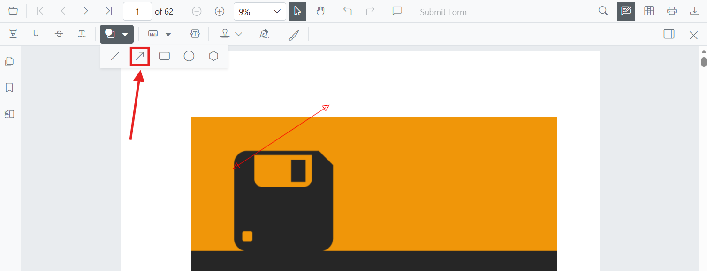

# Arrow Annotation (Shape) in Blazor SfPdfViewer Component
Arrow annotations let users point, direct attention, or indicate flow on PDFs—useful for callouts, direction markers, and connectors during reviews. You can add arrows from the toolbar, switch to arrow mode programmatically, customize appearance, edit/delete them in the UI, and export them with the document.



## Enable Arrow Annotation in the Viewer

To enable Arrow annotations in the Blazor SfPdfViewer, configure the component with annotation support.

```cshtml
@using Syncfusion.Blazor.SfPdfViewer

<SfPdfViewer2 DocumentPath="@DocumentPath" 
              Width="100%" 
              Height="100%">
</SfPdfViewer2>

@code {
    private string DocumentPath { get; set; } = "wwwroot/Data/PDF_Succinctly.pdf";
}
```

## Add Arrow Annotation

### Add Arrow Annotation Using the Toolbar
1. Click the **Edit Annotation** button in the SfPdfViewer toolbar. A secondary toolbar appears below it.
2. Click the **Shapes Annotation** dropdown. A list of shape annotation types appears.
3. Select **Arrow** to enter Arrow annotation mode.
4. Click and drag on the PDF page to draw the arrow.


N> When in Pan mode, selecting a shape tool automatically switches the viewer to selection mode for smooth interaction.

### Enable Arrow Annotation Mode
Switch the viewer into arrow mode using [`SetAnnotationModeAsync(AnnotationType.Arrow)`]((https://help.syncfusion.com/cr/blazor/Syncfusion.Blazor.SfPdfViewer.PdfViewerBase.html#Syncfusion_Blazor_SfPdfViewer_PdfViewerBase_SetAnnotationModeAsync_Syncfusion_Blazor_SfPdfViewer_AnnotationType_)).

```cshtml

@using Syncfusion.Blazor.SfPdfViewer
@using Syncfusion.Blazor.Buttons

<SfButton OnClick="EnableArrowMode">Enable Arrow Mode</SfButton>
<SfPdfViewer2 DocumentPath="@DocumentPath" 
              @ref="viewer"
              Width="100%" 
              Height="100%">
</SfPdfViewer2>

@code {
    private SfPdfViewer2 viewer;
    private string DocumentPath { get; set; } = "wwwroot/Data/PDF_Succinctly.pdf";

    private async void EnableArrowMode(MouseEventArgs args)
    {
        await viewer.SetAnnotationModeAsync(AnnotationType.Arrow);
    }
}

```

### Add Arrow Annotation Programmatically
Use the [`AddAnnotationAsync`](https://help.syncfusion.com/cr/blazor/Syncfusion.Blazor.SfPdfViewer.PdfViewerBase.html#Syncfusion_Blazor_SfPdfViewer_PdfViewerBase_AddAnnotationAsync_Syncfusion_Blazor_SfPdfViewer_PdfAnnotation_) API to draw an arrow at a specific location (defined by two **VertexPoints**). The arrowhead style can be configured with `LineHeadStart` and `LineHeadEnd`.

```cshtml

@using Syncfusion.Blazor.SfPdfViewer
@using Syncfusion.Blazor.Buttons

<SfButton OnClick="AddArrow">Add Arrow</SfButton>
<SfPdfViewer2 DocumentPath="@DocumentPath" 
              @ref="viewer"
              Width="100%" 
              Height="100%">
</SfPdfViewer2>

@code {
    private SfPdfViewer2 viewer;
    private string DocumentPath { get; set; } = "wwwroot/Data/PDF_Succinctly.pdf";

    private async void AddArrow(MouseEventArgs args)
    {
        PdfAnnotation annotation = new PdfAnnotation();
        annotation.Type = AnnotationType.Arrow;
        annotation.PageNumber = 0;
        
        List<VertexPoint> vertexPoints = new List<VertexPoint>();
        vertexPoints.Add(new VertexPoint() { X = 200, Y = 370 });
        vertexPoints.Add(new VertexPoint() { X = 350, Y = 370 });
        annotation.VertexPoints = vertexPoints;
        annotation.LineHeadStart = LineHeadStyle.None;
        annotation.LineHeadEnd = LineHeadStyle.Arrow;
        
        await viewer.AddAnnotationAsync(annotation);
    }
}

```

## Customize Arrow Annotation Appearance
Configure default arrow appearance (fill color, stroke color, thickness, opacity, and arrowheads) using the [`ArrowSettings`](https://help.syncfusion.com/cr/blazor/Syncfusion.Blazor.SfPdfViewer.PdfViewerBase.html#Syncfusion_Blazor_SfPdfViewer_PdfViewerBase_ArrowSettings) property.

```cshtml

@using Syncfusion.Blazor.SfPdfViewer

<SfPdfViewer2 DocumentPath="@DocumentPath"
              @ref="viewer"
              Width="100%"
              Height="100%"
              ArrowSettings="@ArrowSettings">
</SfPdfViewer2>

@code {
    private SfPdfViewer2 viewer;
    private string DocumentPath { get; set; } = "wwwroot/Data/PDF_Succinctly.pdf";

    PdfViewerArrowSettings ArrowSettings = new PdfViewerArrowSettings
    {
        FillColor = "#ffff00",
        StrokeColor = "#0066ff",
        Thickness = 2,
        Opacity = 0.9,
        LineHeadStart = LineHeadStyle.None,
        LineHeadEnd = LineHeadStyle.Arrow
    };
}

```

N> For **Line** and **Arrow** annotations, **Fill Color** is available only when an arrowhead style is applied at the **Start** or **End**. If both are `None`, lines do not render fill and the Fill option remains disabled.

## Manage Arrow Annotation (Edit, Move, Resize, Delete)
### Edit Arrow Annotation

#### Edit Arrow Annotation (UI)
- Select an Arrow to view resize handles.
- Drag endpoints to adjust length/angle.
- Edit stroke color, opacity, and thickness using the annotation toolbar.

Use the annotation toolbar:

- **Edit fill Color** tool


- **Edit Stroke Color** tool  


- **Edit Opacity** slider


- **Line Properties** 
Open the Line Properties dialog via **Right Click → Properties**.


#### Edit Arrow Annotation Programmatically

Modify an existing Arrow programmatically using `EditAnnotationAsync()`.

```cshtml

@using Syncfusion.Blazor.SfPdfViewer
@using Syncfusion.Blazor.Buttons

<SfButton OnClick="EditArrowProgrammatically">Edit Arrow</SfButton>
<SfPdfViewer2 DocumentPath="@DocumentPath" 
              @ref="viewer"
              Width="100%" 
              Height="100%">
</SfPdfViewer2>

@code {
    private SfPdfViewer2 viewer;
    private string DocumentPath { get; set; } = "wwwroot/Data/PDF_Succinctly.pdf";

    private async void EditArrowProgrammatically(MouseEventArgs args)
    {
        List<PdfAnnotation> annotationCollection = await viewer.GetAnnotationsAsync();
        foreach (var annot in annotationCollection)
        {
            if (annot.Type == AnnotationType.Arrow)
            {
                annot.StrokeColor = "#0000ff";
                annot.Thickness = 2;
                annot.FillColor = "#ffff00";
                await viewer.EditAnnotationAsync(annot);
                break;
            }
        }
    }
}

```

### Delete Arrow Annotation

The PDF Viewer supports deleting existing annotations through the UI and API.
See [**Delete Annotation**](../delete-annotation) for full behavior and workflows.

### Comments

Use the [**Comments panel**](../comments) to add, view, and reply to threaded discussions linked to arrow annotations. It provides a dedicated interface for collaboration and review within the PDF Viewer.

## Set Properties While Adding Individual Annotations

Set properties for individual arrow annotations by passing values directly during [`AddAnnotationAsync`](https://help.syncfusion.com/cr/blazor/Syncfusion.Blazor.SfPdfViewer.PdfViewerBase.html#Syncfusion_Blazor_SfPdfViewer_PdfViewerBase_AddAnnotationAsync_Syncfusion_Blazor_SfPdfViewer_PdfAnnotation_).

```cshtml

@using Syncfusion.Blazor.SfPdfViewer
@using Syncfusion.Blazor.Buttons

<SfButton OnClick="AddMultipleArrows">Add Multiple Arrows</SfButton>
<SfPdfViewer2 DocumentPath="@DocumentPath" 
              @ref="viewer"
              Width="100%" 
              Height="100%">
</SfPdfViewer2>

@code {
    private SfPdfViewer2 viewer;
    private string DocumentPath { get; set; } = "wwwroot/Data/PDF_Succinctly.pdf";

    private async void AddMultipleArrows(MouseEventArgs args)
    {
        // Arrow 1
        PdfAnnotation annotation1 = new PdfAnnotation();
        annotation1.Type = AnnotationType.Arrow;
        annotation1.PageNumber = 0;
        List<VertexPoint> vertexPoints1 = new List<VertexPoint>();
        vertexPoints1.Add(new VertexPoint() { X = 200, Y = 230 });
        vertexPoints1.Add(new VertexPoint() { X = 350, Y = 230 });
        annotation1.VertexPoints = vertexPoints1;
        annotation1.FillColor = "#ffff00";
        annotation1.StrokeColor = "#0066ff";
        annotation1.Thickness = 2;
        annotation1.Opacity = 0.9;
        annotation1.Author = "User 1";
        await viewer.AddAnnotationAsync(annotation1);

        // Arrow 2
        PdfAnnotation annotation2 = new PdfAnnotation();
        annotation2.Type = AnnotationType.Arrow;
        annotation2.PageNumber = 0;
        List<VertexPoint> vertexPoints2 = new List<VertexPoint>();
        vertexPoints2.Add(new VertexPoint() { X = 220, Y = 300 });
        vertexPoints2.Add(new VertexPoint() { X = 400, Y = 300 });
        annotation2.VertexPoints = vertexPoints2;
        annotation2.FillColor = "#ffef00";
        annotation2.StrokeColor = "#ff1010";
        annotation2.Thickness = 3;
        annotation2.Opacity = 0.9;
        annotation2.Author = "User 2";
        await viewer.AddAnnotationAsync(annotation2);
    }
}

```

## Disable Arrow Annotation

Disable arrow annotations (along with all other shape annotations: Line, Rectangle, Circle, Polygon) using the [`EnableShapeAnnotation`](https://help.syncfusion.com/cr/blazor/Syncfusion.Blazor.SfPdfViewer.PdfViewerBase.html#Syncfusion_Blazor_SfPdfViewer_PdfViewerBase_EnableShapeAnnotation) property.

```cshtml

@using Syncfusion.Blazor.SfPdfViewer

<SfPdfViewer2 DocumentPath="@DocumentPath"
              EnableShapeAnnotation="false"
              Width="100%"
              Height="100%">
</SfPdfViewer2>

@code {
    private string DocumentPath { get; set; } = "wwwroot/Data/PDF_Succinctly.pdf";
}

```

## Handle Arrow Annotation Events

The PDF viewer provides annotation life-cycle events that notify when Arrow annotations are added, modified, selected, or removed.
For the full list of available events and their descriptions, see [**Annotation Events**](../events)

## Export and Import
The PDF Viewer supports exporting and importing annotations. For details on supported formats and workflows, see [**Export and Import annotations**](../import-export-annotation).

## See also
- [Annotation Toolbar](../../toolbar-customization/annotation-toolbar)
- [Comments Panel](../comments)
- [Annotation Events](../events)
- [Export and Import annotations](../import-export-annotation)
- [Delete Annotations](../delete-annotation)
