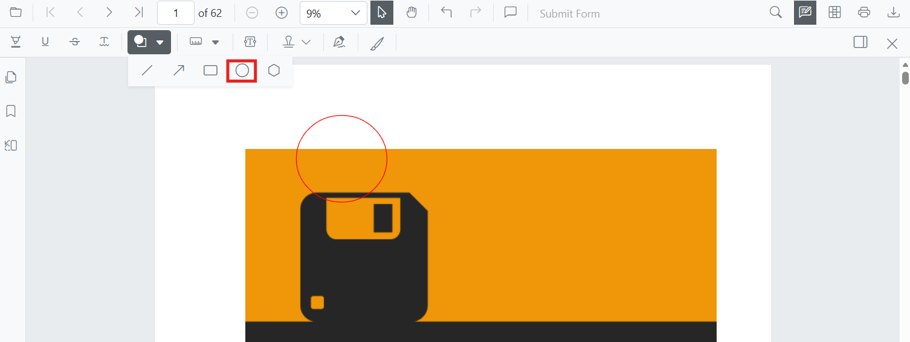

# Circle Annotation (Shape) in Blazor SfPdfViewer Component

Circle annotations let you highlight circular regions or draw emphasis bubbles on PDFs for reviews and markups. The Blazor SfPdfViewer supports adding circles from the toolbar, customizing their appearance, editing or deleting them in the UI, and exporting them with the document.



## Enable Circle Annotation in the Viewer

Circle annotations are available by default in the Blazor SfPdfViewer component with the annotation toolbar enabled.

```cshtml
@using Syncfusion.Blazor.SfPdfViewer

<SfPdfViewer2 DocumentPath="@DocumentPath" 
              Width="100%" 
              Height="100%">
</SfPdfViewer2>

@code {
    private string DocumentPath { get; set; } = "wwwroot/Data/PDF_Succinctly.pdf";
}
```

## Add Circle Annotation

### Add Circle Annotation Using the Toolbar

Circle annotations can be added from the annotation toolbar:

1. Select **Edit Annotation** in the viewer toolbar to open the annotation toolbar.
2. Select **Shape Annotation** to open the shape list.
3. Choose **Circle** to enable circle drawing mode.
4. Click and drag on the PDF page to draw the circle (ellipse).


N> When the viewer is in Pan mode and a shape drawing mode is activated, the viewer switches to Text Select mode.

### Enable Circle Annotation Mode

Switch the viewer into circle drawing mode using [`SetAnnotationModeAsync(AnnotationType.Circle)`](https://help.syncfusion.com/cr/blazor/Syncfusion.Blazor.SfPdfViewer.PdfViewerBase.html#Syncfusion_Blazor_SfPdfViewer_PdfViewerBase_SetAnnotationModeAsync_Syncfusion_Blazor_SfPdfViewer_AnnotationType_).

```cshtml
@using Syncfusion.Blazor.Buttons
@using Syncfusion.Blazor.SfPdfViewer

<SfButton OnClick="OnClick">Circle Annotation</SfButton>
<SfPdfViewer2 DocumentPath="@DocumentPath"
              @ref="viewer"
              Width="100%"
              Height="100%">
</SfPdfViewer2>

@code {
    private SfPdfViewer2 viewer;
    private async void OnClick(MouseEventArgs args)
    {
        await viewer.SetAnnotationModeAsync(AnnotationType.Circle);
    }
    private string DocumentPath { get; set; } = "wwwroot/Data/PDF_Succinctly.pdf";
}
```

### Add Circle Annotation Programmatically

Use the [AddAnnotationAsync](https://help.syncfusion.com/cr/blazor/Syncfusion.Blazor.SfPdfViewer.PdfViewerBase.html#Syncfusion_Blazor_SfPdfViewer_PdfViewerBase_AddAnnotationAsync_Syncfusion_Blazor_SfPdfViewer_PdfAnnotation_) method to add a circle annotation at a specific location. Ensure the document is loaded and the component reference is available before invoking this method.

```cshtml
@using Syncfusion.Blazor.Buttons
@using Syncfusion.Blazor.SfPdfViewer

<SfButton OnClick="@AddCircleAsync">Add Circle Annotation</SfButton>
<SfPdfViewer2 Width="100%" Height="100%" DocumentPath="@DocumentPath" @ref="@Viewer" />

@code {
    private SfPdfViewer2 viewer;
    private string DocumentPath { get; set; } = "wwwroot/Data/Shape_Annotation.pdf";

    private async void AddCircleAsync(MouseEventArgs args)
    {
        PdfAnnotation annotation = new PdfAnnotation();
        // Set the Circle annotation type
        annotation.Type = AnnotationType.Circle;
        // Page numbers start from 0. So, if set to 0 it represents page 1.
        annotation.PageNumber = 0;

        // Bound of the circle annotation. The bounding box width and height
        // define the rendered circle's diameter on the page.
        annotation.Bound = new Bound();
        annotation.Bound.X = 200;
        annotation.Bound.Y = 620;
        annotation.Bound.Width = 90;
        annotation.Bound.Height = 90;
        // Add circle annotation
        await Viewer.AddAnnotationAsync(annotation);

        // Note: The sample file Shape_Annotation.pdf referenced here is shipped
        // with Syncfusion's Blazor sample browser. Replace it with a PDF that
        // exists in your wwwroot/Data/ folder.
    }
}
```

## Customize Circle Annotation Appearance

Configure the default circle appearance (fill color, stroke color, thickness, and opacity) during component initialization using the [CircleSettings](https://help.syncfusion.com/cr/blazor/Syncfusion.Blazor.SfPdfViewer.PdfViewerBase.html#Syncfusion_Blazor_SfPdfViewer_PdfViewerBase_CircleSettings) property. These settings apply to circles created from the toolbar and programmatically.

```cshtml
@using Syncfusion.Blazor.SfPdfViewer

<SfPdfViewer2 @ref="@viewer"
              DocumentPath="@DocumentPath"
              CircleSettings="@CircleSettings"
              Width="100%"
              Height="100%">
</SfPdfViewer2>

@code {
    private SfPdfViewer2 viewer;
    private string DocumentPath { get; set; } = "wwwroot/Data/PDF_Succinctly.pdf";

    PdfViewerCircleSettings CircleSettings = new PdfViewerCircleSettings
    {
        FillColor = "orange",
        Opacity = 0.9,
        StrokeColor = "#ff6a00",
        Thickness = 2
    };
}
```

## Manage Circle Annotation (Edit, Move, Resize, Delete)

### Edit Circle Annotation

#### Edit Circle Annotation (UI)

- Select a circle to view resize handles.
- Drag any side/corner to resize; drag inside the shape to move it.
- Edit **fill**, **stroke**, **thickness**, and **opacity** using the annotation toolbar.

Use the following annotation toolbar tools to modify:
- **Edit Fill Color** tool  


- **Edit Stroke Color** tool


- **Edit Opacity** slider


- **Edit Thickness** slider


#### Edit Circle Annotation Programmatically

Modify an existing circle annotation programmatically using [EditAnnotationAsync](https://help.syncfusion.com/cr/blazor/Syncfusion.Blazor.SfPdfViewer.PdfViewerBase.html#Syncfusion_Blazor_SfPdfViewer_PdfViewerBase_EditAnnotationAsync_Syncfusion_Blazor_SfPdfViewer_PdfAnnotation_). Retrieve the target annotation from [GetAnnotationsAsync](https://help.syncfusion.com/cr/blazor/Syncfusion.Blazor.SfPdfViewer.PdfViewerBase.html#Syncfusion_Blazor_SfPdfViewer_PdfViewerBase_GetAnnotationsAsync) and update the desired properties before submitting the edit.

```cshtml
@using Syncfusion.Blazor.Buttons
@using Syncfusion.Blazor.SfPdfViewer

<SfButton OnClick="@EditCircleAsync">Edit Circle Annotation</SfButton>
<SfPdfViewer2 Width="100%" Height="100%" DocumentPath="@DocumentPath" @ref="@Viewer" />

@code {
    private SfPdfViewer2 viewer;
    private string DocumentPath { get; set; } = "wwwroot/Data/Shape_Annotation.pdf";

    private async void EditCircleAsync(MouseEventArgs args)
    {
        // Get annotation collection
        List<PdfAnnotation> annotationCollection = await Viewer.GetAnnotationsAsync();
        // Select the circle annotation to edit
        PdfAnnotation annotation = annotationCollection[0];
        // Change the fill color of circle annotation
        annotation.FillColor = "#FFFF00";
        // Change the stroke color of circle annotation
        annotation.StrokeColor = "#0000FF";
        // Change the thickness of circle annotation
        annotation.Thickness = 2;
        // Change the opacity (0 to 1) of circle annotation
        annotation.Opacity = 0.9;
        // Edit the circle annotation
        await Viewer.EditAnnotationAsync(annotation);
    }
}
```

### Delete Circle Annotation

The PDF Viewer supports deleting existing annotations through the UI and API.
See [**Delete Annotation**](../delete-annotation) for full behavior and workflows.

### Comments

Use the [**Comments panel**](../comments) to add, view, and reply to threaded discussions linked to circle annotations. It provides a dedicated interface for collaboration and review within the PDF Viewer.

## Set Properties While Adding Individual Annotations

Set properties for individual circle annotations by passing values directly during [AddAnnotationAsync](https://help.syncfusion.com/cr/blazor/Syncfusion.Blazor.SfPdfViewer.PdfViewerBase.html#Syncfusion_Blazor_SfPdfViewer_PdfViewerBase_AddAnnotationAsync_Syncfusion_Blazor_SfPdfViewer_PdfAnnotation_).

```cshtml
@using Syncfusion.Blazor.Buttons
@using Syncfusion.Blazor.SfPdfViewer

<SfButton OnClick="@AddMultipleCirclesAsync">Add Multiple Circles</SfButton>
<SfPdfViewer2 Width="100%" Height="100%" DocumentPath="@DocumentPath" @ref="@Viewer" />

@code {
    private SfPdfViewer2 viewer;
    private string DocumentPath { get; set; } = "wwwroot/Data/Shape_Annotation.pdf";

    private async void AddMultipleCirclesAsync(MouseEventArgs args)
    {
        // Circle 1
        PdfAnnotation annotation1 = new PdfAnnotation();
        annotation1.Type = AnnotationType.Circle;
        annotation1.PageNumber = 0;
        annotation1.Bound = new Bound() 
        {
            X = 200,
            Y = 620,
            Width = 100,
            Height = 100
        };
        annotation1.Opacity = 0.9;
        annotation1.StrokeColor = "#ff6a00";
        annotation1.FillColor = "#ffa500";
        annotation1.Author = "User 1";

        // Circle 2
        PdfAnnotation annotation2 = new PdfAnnotation();
        annotation2.Type = AnnotationType.Circle;
        annotation2.PageNumber = 0;
        annotation2.Bound = new Bound() 
        {
            X = 340,
            Y = 620,
            Width = 80,
            Height = 80
        };
        annotation2.Opacity = 0.85;
        annotation2.StrokeColor = "#ff1010";
        annotation2.FillColor = "#ffe600";
        annotation2.Author = "User 2";

        // Add both circles
        await Viewer.AddAnnotationAsync(annotation1);
        await Viewer.AddAnnotationAsync(annotation2);
    }
}
```

## Disable Circle Annotation

Disable circle annotations (along with all other shape annotations, such as Line, Arrow, Rectangle, and Polygon) using the [`EnableShapeAnnotation`](https://help.syncfusion.com/cr/blazor/Syncfusion.Blazor.SfPdfViewer.PdfViewerBase.html#Syncfusion_Blazor_SfPdfViewer_PdfViewerBase_EnableShapeAnnotation) property.

```cshtml
@using Syncfusion.Blazor.SfPdfViewer

<SfPdfViewer2 DocumentPath="@DocumentPath"
              EnableShapeAnnotation="false"
              Width="100%"
              Height="100%">
</SfPdfViewer2>

@code {
    private string DocumentPath { get; set; } = "wwwroot/Data/PDF_Succinctly.pdf";
}
```

## Handle Circle Annotation Events

The PDF viewer provides annotation life-cycle events that notify when Circle annotations are added, modified, selected, or removed.
For the full list of available events and their descriptions, see [**Annotation Events**](../events)

## Export and Import

The PDF Viewer supports exporting and importing annotations. For details on supported formats and workflows, see [**Export and Import annotations**](../import-export-annotation).

## See also

- [Annotation Toolbar](../../toolbar-customization/annotation-toolbar)
- [Comments Panel](../comments)
- [Annotation Events](../events)
- [Export and Import annotations](../import-export-annotation)
- [Delete Annotations](../delete-annotation)
