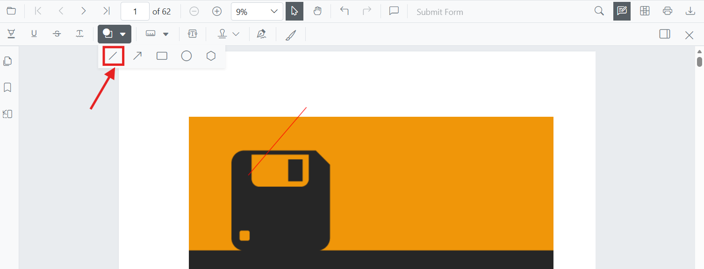
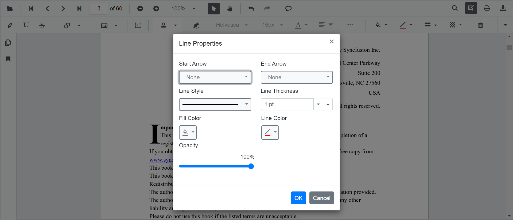

# Line Annotation (Shape) in Blazor SfPdfViewer Component

Line annotations let users draw straight connectors or callouts on PDFs for markup and review. They support customization of color, thickness, opacity, and arrowheads, and can be edited, resized, deleted, or exported along with the document.



## Enable Line Annotation in the Viewer

Line annotations are available by default in the Blazor SfPdfViewer component with the annotation toolbar enabled.

```cshtml
@using Syncfusion.Blazor.SfPdfViewer

<SfPdfViewer2 DocumentPath="@DocumentPath" 
              Width="100%" 
              Height="100%">
</SfPdfViewer2>

@code {
    private string DocumentPath { get; set; } = "wwwroot/Data/PDF_Succinctly.pdf";
}
```

## Add Line Annotation

### Add Line Annotation Using the Toolbar

Add Line annotations from the annotation toolbar:

1. Select **Edit Annotation** in the viewer toolbar to open the annotation toolbar.
2. Select **Shape Annotation** to open the shape list.
3. Choose **Line** to enable line drawing mode.
4. Click and drag on the PDF page to draw the line.


N> When the viewer is in Pan mode and a shape drawing mode is activated, the viewer switches to Text Select mode.

### Enable Line Annotation Mode

Switch the viewer into line drawing mode using [SetAnnotationModeAsync](https://help.syncfusion.com/cr/blazor/Syncfusion.Blazor.SfPdfViewer.PdfViewerBase.html#Syncfusion_Blazor_SfPdfViewer_PdfViewerBase_SetAnnotationModeAsync_Syncfusion_Blazor_SfPdfViewer_AnnotationType_).

```cshtml
@using Syncfusion.Blazor.Buttons
@using Syncfusion.Blazor.SfPdfViewer

<SfButton OnClick="OnClick">Line Annotation</SfButton>
<SfPdfViewer2 DocumentPath="@DocumentPath"
              @ref="viewer"
              Width="100%"
              Height="100%">
</SfPdfViewer2>

@code {
    private SfPdfViewer2 viewer;
    private async void OnClick(MouseEventArgs args)
    {
        await viewer.SetAnnotationModeAsync(AnnotationType.Line);
    }
    private string DocumentPath { get; set; } = "wwwroot/Data/PDF_Succinctly.pdf";
}
```

### Add Line Annotation Programmatically

Use the [AddAnnotationAsync](https://help.syncfusion.com/cr/blazor/Syncfusion.Blazor.SfPdfViewer.PdfViewerBase.html#Syncfusion_Blazor_SfPdfViewer_PdfViewerBase_AddAnnotationAsync_Syncfusion_Blazor_SfPdfViewer_PdfAnnotation_) method to add a line annotation at a specific location. Ensure the document is loaded and the component reference is available before invoking this method.

```cshtml
@using Syncfusion.Blazor.Buttons
@using Syncfusion.Blazor.SfPdfViewer

<SfButton OnClick="@AddLineAnnotationAsync">Add Line Annotation</SfButton>
<SfPdfViewer2 Width="100%" Height="100%" DocumentPath="@DocumentPath" @ref="@Viewer" />

@code {
    private SfPdfViewer2 viewer;
    private string DocumentPath { get; set; } = "wwwroot/Data/Line_Annotation.pdf";

    private async void AddLineAnnotationAsync(MouseEventArgs args)
    {
        PdfAnnotation annotation = new PdfAnnotation();
        // Set the annotation type as Line
        annotation.Type = AnnotationType.Line;
        // Page numbers start from 0. So, if set to 0 it represents page 1.
        annotation.PageNumber = 0;

        // Vertex points for the line annotation
        annotation.VertexPoints = new List<VertexPoint>()
        {
            new VertexPoint() { X = 200, Y = 230 },
            new VertexPoint() { X = 350, Y = 230 }
        };
        
        // Add line annotation
        await Viewer.AddAnnotationAsync(annotation);
    }
}
```

## Customize Line Annotation Appearance

Configure default line appearance (stroke color, thickness, opacity, and arrowheads) during control initialization using [LineSettings](https://help.syncfusion.com/cr/blazor/Syncfusion.Blazor.SfPdfViewer.PdfViewerBase.html#Syncfusion_Blazor_SfPdfViewer_PdfViewerBase_LineSettings). These settings apply when lines are created from the toolbar or programmatically.

```cshtml
@using Syncfusion.Blazor.SfPdfViewer

<SfPdfViewer2 @ref="@viewer"
              DocumentPath="@DocumentPath"
              LineSettings="@LineSettings"
              Width="100%"
              Height="100%">
</SfPdfViewer2>

@code {
    private SfPdfViewer2 viewer;
    private string DocumentPath { get; set; } = "wwwroot/Data/PDF_Succinctly.pdf";

    PdfViewerLineSettings LineSettings = new PdfViewerLineSettings
    {
        StrokeColor = "blue",
        Opacity = 0.6,
        Thickness = 2,
        LineHeadStart = LineHeadStyle.None,
        LineHeadEnd = LineHeadStyle.Arrow
    };
}
```

## Manage Line Annotation (Edit, Move, Resize, Delete)

### Edit Line Annotation

#### Edit Line Annotation (UI)

- Select a line to view resize handles.
- Drag endpoints to adjust length/angle.
- Edit **stroke**, **thickness**, and **opacity** using the annotation toolbar.

Use the following annotation toolbar tools to modify:
- **Edit Stroke Color** tool


- **Edit Opacity** slider


- **Edit Thickness** slider


- **Line Properties** dialog via **Right Click → Properties** to adjust line-specific properties (for example, leader length, leader offset, and arrowhead styles).


N> **Fill Color** is not available for Line annotations because lines do not render a fill.

#### Edit Line Annotation Programmatically

Modify an existing line annotation programmatically using [EditAnnotationAsync](https://help.syncfusion.com/cr/blazor/Syncfusion.Blazor.SfPdfViewer.PdfViewerBase.html#Syncfusion_Blazor_SfPdfViewer_PdfViewerBase_EditAnnotationAsync_Syncfusion_Blazor_SfPdfViewer_PdfAnnotation_). Retrieve the target annotation from [GetAnnotationsAsync](https://help.syncfusion.com/cr/blazor/Syncfusion.Blazor.SfPdfViewer.PdfViewerBase.html#Syncfusion_Blazor_SfPdfViewer_PdfViewerBase_GetAnnotationsAsync) and update the desired properties before submitting the edit.

```cshtml
@using Syncfusion.Blazor.Buttons
@using Syncfusion.Blazor.SfPdfViewer

<SfButton OnClick="@EditLineAnnotationAsync">Edit Line Annotation</SfButton>
<SfPdfViewer2 Width="100%" Height="100%" DocumentPath="@DocumentPath" @ref="@Viewer" />

@code {
    private SfPdfViewer2 viewer;
    private string DocumentPath { get; set; } = "wwwroot/Data/Line_Annotation.pdf";

    private async void EditLineAnnotationAsync(MouseEventArgs args)
    {
        // Get annotation collection
        List<PdfAnnotation> annotationCollection = await Viewer.GetAnnotationsAsync();
        // Select the line annotation to edit
        PdfAnnotation annotation = annotationCollection[0];
        // Change the stroke color of line annotation
        annotation.StrokeColor = "#FF0000";
        // Change the thickness of line annotation
        annotation.Thickness = 3;
        // Change the opacity (0 to 1) of line annotation
        annotation.Opacity = 0.5;
        // Edit the line annotation
        await Viewer.EditAnnotationAsync(annotation);
    }
}
```

### Delete Line Annotation

The PDF Viewer supports deleting existing annotations through the UI and API.
See [**Delete Annotation**](../delete-annotation) for full behavior and workflows.

### Comments

Use the [**Comments panel**](../comments) to add, view, and reply to threaded discussions linked to line annotations. It provides a dedicated interface for collaboration and review within the PDF Viewer.

## Set Properties While Adding Individual Annotations

Set properties for individual line annotations by passing values directly during [AddAnnotationAsync](https://help.syncfusion.com/cr/blazor/Syncfusion.Blazor.SfPdfViewer.PdfViewerBase.html#Syncfusion_Blazor_SfPdfViewer_PdfViewerBase_AddAnnotationAsync_Syncfusion_Blazor_SfPdfViewer_PdfAnnotation_).

```cshtml
@using Syncfusion.Blazor.Buttons
@using Syncfusion.Blazor.SfPdfViewer

<SfButton OnClick="@AddMultipleLinesAsync">Add Multiple Lines</SfButton>
<SfPdfViewer2 Width="100%" Height="100%" DocumentPath="@DocumentPath" @ref="@Viewer" />

@code {
    private SfPdfViewer2 viewer;
    private string DocumentPath { get; set; } = "wwwroot/Data/Line_Annotation.pdf";

    private async void AddMultipleLinesAsync(MouseEventArgs args)
    {
        // Line 1
        PdfAnnotation annotation1 = new PdfAnnotation();
        annotation1.Type = AnnotationType.Line;
        annotation1.PageNumber = 0;
        annotation1.VertexPoints = new List<VertexPoint>()
        {
            new VertexPoint() { X = 200, Y = 230 },
            new VertexPoint() { X = 350, Y = 230 }
        };
        annotation1.StrokeColor = "#0066FF";
        annotation1.Thickness = 2;
        annotation1.Opacity = 0.9;
        annotation1.Author = "User 1";

        // Line 2
        PdfAnnotation annotation2 = new PdfAnnotation();
        annotation2.Type = AnnotationType.Line;
        annotation2.PageNumber = 0;
        annotation2.VertexPoints = new List<VertexPoint>()
        {
            new VertexPoint() { X = 220, Y = 300 },
            new VertexPoint() { X = 400, Y = 300 }
        };
        annotation2.StrokeColor = "#FF1010";
        annotation2.Thickness = 3;
        annotation2.Opacity = 0.9;
        annotation2.Author = "User 2";

        // Add both lines
        await Viewer.AddAnnotationAsync(annotation1);
        await Viewer.AddAnnotationAsync(annotation2);
    }
}
```

## Disable Line Annotation

Disable line annotations (along with all other shape annotations, such as Rectangle, Arrow, Circle, and Polygon) using the [`EnableShapeAnnotation`](https://help.syncfusion.com/cr/blazor/Syncfusion.Blazor.SfPdfViewer.PdfViewerBase.html#Syncfusion_Blazor_SfPdfViewer_PdfViewerBase_EnableShapeAnnotation) property.

```cshtml
@using Syncfusion.Blazor.SfPdfViewer

<SfPdfViewer2 DocumentPath="@DocumentPath"
              EnableShapeAnnotation="false"
              Width="100%"
              Height="100%">
</SfPdfViewer2>

@code {
    private string DocumentPath { get; set; } = "wwwroot/Data/PDF_Succinctly.pdf";
}
```

## Handle Line Annotation Events

The PDF viewer provides annotation life-cycle events that notify when Line annotations are added, modified, selected, or removed.
For the full list of available events and their descriptions, see [**Annotation Events**](../events)

## Export and Import

The PDF Viewer supports exporting and importing annotations. For details on supported formats and workflows, see [**Export and Import annotations**](../import-export-annotation).

## See also

- [Annotation Toolbar](../../toolbar-customization/annotation-toolbar)
- [Comments Panel](../comments)
- [Annotation Events](../events)
- [Export and Import annotations](../import-export-annotation)
- [Delete Annotations](../delete-annotation)
