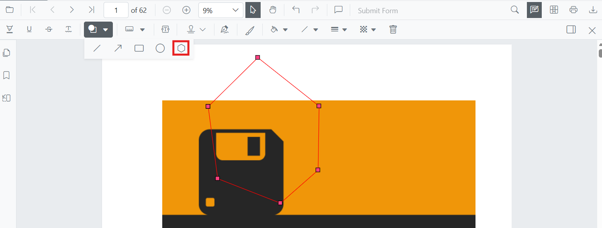
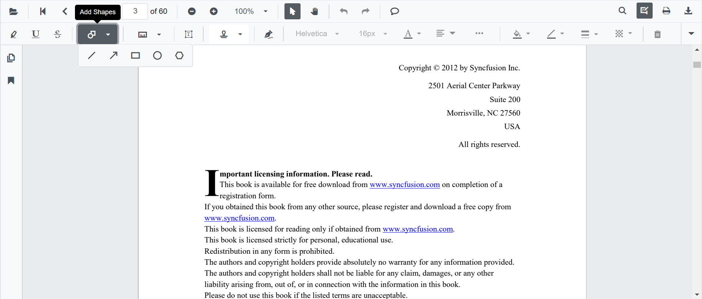
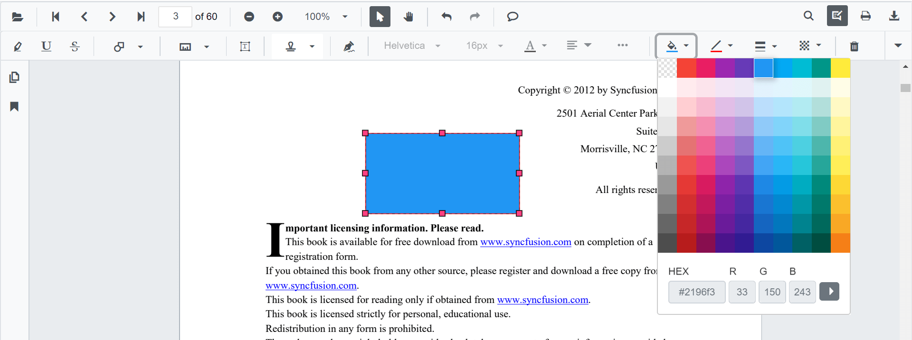
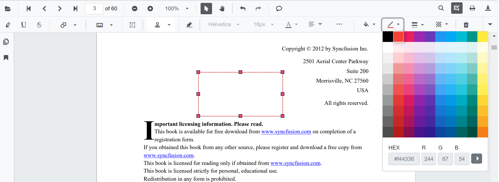
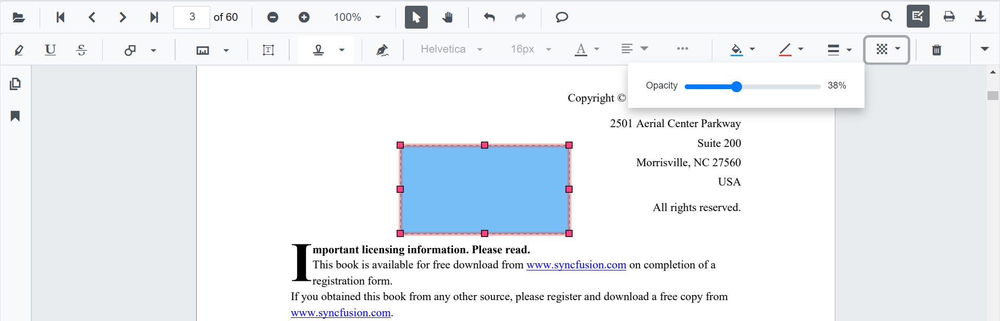
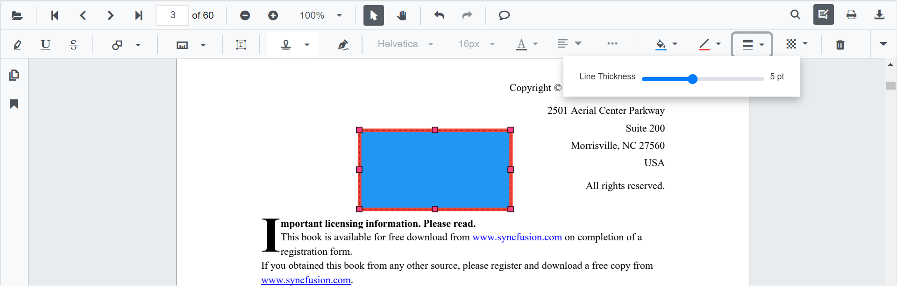

# Polygon Annotation (Shape) in Blazor SfPdfViewer Component

Polygon annotations let users outline irregular regions, draw custom shapes, or highlight non-rectangular areas on PDFs for review and markup. The Blazor SfPdfViewer supports adding and managing polygon annotations both from the UI and programmatically.



## Enable Polygon Annotation in the Viewer

Polygon annotations are available by default in the Blazor SfPdfViewer component with the annotation toolbar enabled. The following example shows the minimum component setup:

```cshtml
@using Syncfusion.Blazor.SfPdfViewer

<SfPdfViewer2 DocumentPath="@DocumentPath"
              Width="100%"
              Height="100%">
</SfPdfViewer2>

@code {
    private string DocumentPath { get; set; } = "wwwroot/Data/PDF_Succinctly.pdf";
}
```

N> Ensure the sample PDF is placed in the `wwwroot/Data/` folder of your Blazor app, and that `SfPdfViewer` is registered in `Program.cs`. Refer to the [Blazor getting started guide](https://help.syncfusion.com/document-processing/pdf/pdf-viewer/blazor/getting-started) for setup details.

## Add Polygon Annotation

### Add Polygon Annotation Using the Toolbar

Polygon annotations can be added from the annotation toolbar:

1. Select **Edit Annotation** in the viewer toolbar to open the annotation toolbar.
2. Select **Shape Annotation** to open the shape list.
3. Choose **Polygon** to enable polygon drawing mode.
4. Click multiple points on the PDF page to define the polygon vertices.
5. Double-click or press Enter to finalize the polygon.



N> When the viewer is in Pan mode and a shape drawing mode is activated, the viewer switches to Text Select mode.

### Enable Polygon Annotation Mode

Switch the viewer into polygon drawing mode using [SetAnnotationModeAsync](https://help.syncfusion.com/cr/blazor/Syncfusion.Blazor.SfPdfViewer.PdfViewerBase.html#Syncfusion_Blazor_SfPdfViewer_PdfViewerBase_SetAnnotationModeAsync_Syncfusion_Blazor_SfPdfViewer_AnnotationType_).

```cshtml
@using Syncfusion.Blazor.Buttons
@using Syncfusion.Blazor.SfPdfViewer

<SfButton OnClick="OnClick">Polygon Annotation</SfButton>
<SfPdfViewer2 DocumentPath="@DocumentPath"
              @ref="viewer"
              Width="100%"
              Height="100%">
</SfPdfViewer2>

@code {
    private SfPdfViewer2 viewer;
    private async void OnClick(MouseEventArgs args)
    {
        await viewer.SetAnnotationModeAsync(AnnotationType.Polygon);
    }
    private string DocumentPath { get; set; } = "wwwroot/Data/PDF_Succinctly.pdf";
}
```

### Add Polygon Annotation Programmatically

Use the [AddAnnotationAsync](https://help.syncfusion.com/cr/blazor/Syncfusion.Blazor.SfPdfViewer.PdfViewerBase.html#Syncfusion_Blazor_SfPdfViewer_PdfViewerBase_AddAnnotationAsync_Syncfusion_Blazor_SfPdfViewer_PdfAnnotation_) method to add a polygon annotation by specifying multiple vertex points. Ensure the document is loaded and the component reference is available before invoking this method.

```cshtml
@using Syncfusion.Blazor.Buttons
@using Syncfusion.Blazor.SfPdfViewer

<SfButton OnClick="@AddPolygonAsync">Add Polygon Annotation</SfButton>
<SfPdfViewer2 Width="100%" Height="100%" DocumentPath="@DocumentPath" @ref="@Viewer" />

@code {
    private SfPdfViewer2 viewer;
    private string DocumentPath { get; set; } = "wwwroot/Data/Shape_Annotation.pdf";

    private async void AddPolygonAsync(MouseEventArgs args)
    {
        PdfAnnotation annotation = new PdfAnnotation();
        // Set the Polygon annotation type
        annotation.Type = AnnotationType.Polygon;
        // Page numbers start from 0. So, if set to 0 it represents page 1.
        annotation.PageNumber = 0;

        // Define vertex points for the polygon.
        // The viewer automatically closes the polygon by connecting the last point to the first.
        annotation.VertexPoints = new List<VertexPoint>()
        {
            new VertexPoint() { X = 200, Y = 800 },
            new VertexPoint() { X = 242, Y = 771 },
            new VertexPoint() { X = 289, Y = 799 },
            new VertexPoint() { X = 278, Y = 842 },
            new VertexPoint() { X = 211, Y = 842 }
        };
        // Add polygon annotation
        await Viewer.AddAnnotationAsync(annotation);
    }
}
```

## Customize Polygon Annotation Appearance

Configure default polygon appearance (fill color, stroke color, thickness, opacity) during control initialization using [PolygonSettings](https://help.syncfusion.com/cr/blazor/Syncfusion.Blazor.SfPdfViewer.PdfViewerBase.html#Syncfusion_Blazor_SfPdfViewer_PdfViewerBase_PolygonSettings). These settings apply when polygons are created from the toolbar or programmatically.

```cshtml
@using Syncfusion.Blazor.SfPdfViewer

<SfPdfViewer2 @ref="@viewer"
              DocumentPath="@DocumentPath"
              PolygonSettings="@PolygonSettings"
              Width="100%"
              Height="100%">
</SfPdfViewer2>

@code {
    private SfPdfViewer2 viewer;
    private string DocumentPath { get; set; } = "wwwroot/Data/PDF_Succinctly.pdf";

    PdfViewerPolygonSettings PolygonSettings = new PdfViewerPolygonSettings
    {
        FillColor = "#ffa5d8",
        Opacity = 0.9,
        StrokeColor = "#ff6a00",
        Thickness = 2
    };
}
```

## Manage Polygon Annotation (Edit, Move, Resize, Delete)

### Edit Polygon Annotation

#### Edit Polygon Annotation (UI)

- Select a polygon to view resize handles.
- Drag any vertex to resize or reposition; drag inside the shape to move it.
- Edit **fill**, **stroke**, **thickness**, and **opacity** using the annotation toolbar.



Use the following annotation toolbar tools to modify:
- **Edit Fill Color** tool 


- **Edit Stroke Color** tool


- **Edit Opacity** slider


- **Edit Thickness** slider


#### Edit Polygon Annotation Programmatically

Modify an existing polygon annotation programmatically using [EditAnnotationAsync](https://help.syncfusion.com/cr/blazor/Syncfusion.Blazor.SfPdfViewer.PdfViewerBase.html#Syncfusion_Blazor_SfPdfViewer_PdfViewerBase_EditAnnotationAsync_Syncfusion_Blazor_SfPdfViewer_PdfAnnotation_). Retrieve the target annotation from [GetAnnotationsAsync](https://help.syncfusion.com/cr/blazor/Syncfusion.Blazor.SfPdfViewer.PdfViewerBase.html#Syncfusion_Blazor_SfPdfViewer_PdfViewerBase_GetAnnotationsAsync) and update the desired properties before submitting the edit.

```cshtml
@using Syncfusion.Blazor.Buttons
@using Syncfusion.Blazor.SfPdfViewer

<SfButton OnClick="@EditPolygonAsync">Edit Polygon Annotation</SfButton>
<SfPdfViewer2 Width="100%" Height="100%" DocumentPath="@DocumentPath" @ref="@Viewer" />

@code {
    private SfPdfViewer2 viewer;
    private string DocumentPath { get; set; } = "wwwroot/Data/Shape_Annotation.pdf";

    private async void EditPolygonAsync(MouseEventArgs args)
    {
        // Get annotation collection
        List<PdfAnnotation> annotationCollection = await Viewer.GetAnnotationsAsync();
        // Select the polygon annotation to edit
        PdfAnnotation annotation = annotationCollection[0];
        // Change the fill color of polygon annotation
        annotation.FillColor = "#FFFF00";
        // Change the stroke color of polygon annotation
        annotation.StrokeColor = "#0000FF";
        // Change the thickness of polygon annotation
        annotation.Thickness = 2;
        // Change the opacity (0 to 1) of polygon annotation
        annotation.Opacity = 0.9;
        // Edit the polygon annotation
        await Viewer.EditAnnotationAsync(annotation);
    }
}
```

### Delete Polygon Annotation

The PDF Viewer supports deleting existing annotations through the UI and API.
See [**Delete Annotation**](../delete-annotation) for full behavior and workflows.

### Comments

Use the [**Comments panel**](../comments) to add, view, and reply to threaded discussions linked to polygon annotations. It provides a dedicated interface for collaboration and review within the PDF Viewer.

## Add Multiple Polygon Annotations with Properties

Configure per-annotation appearance while adding polygons using [AddAnnotationAsync](https://help.syncfusion.com/cr/blazor/Syncfusion.Blazor.SfPdfViewer.PdfViewerBase.html#Syncfusion_Blazor_SfPdfViewer_PdfViewerBase_AddAnnotationAsync_Syncfusion_Blazor_SfPdfViewer_PdfAnnotation_).

```cshtml
@using Syncfusion.Blazor.Buttons
@using Syncfusion.Blazor.SfPdfViewer

<SfButton OnClick="@AddMultiplePolygonsAsync">Add Multiple Polygons</SfButton>
<SfPdfViewer2 Width="100%" Height="100%" DocumentPath="@DocumentPath" @ref="@Viewer" />

@code {
    private SfPdfViewer2 viewer;
    private string DocumentPath { get; set; } = "wwwroot/Data/Shape_Annotation.pdf";

    private async void AddMultiplePolygonsAsync(MouseEventArgs args)
    {
        // Polygon 1
        PdfAnnotation annotation1 = new PdfAnnotation();
        annotation1.Type = AnnotationType.Polygon;
        annotation1.PageNumber = 0;
        annotation1.VertexPoints = new List<VertexPoint>()
        {
            new VertexPoint() { X = 200, Y = 800 },
            new VertexPoint() { X = 242, Y = 771 },
            new VertexPoint() { X = 289, Y = 799 },
            new VertexPoint() { X = 278, Y = 842 },
            new VertexPoint() { X = 211, Y = 842 }
        };
        annotation1.Opacity = 0.9;
        annotation1.StrokeColor = "#ff6a00";
        annotation1.FillColor = "#ffa5d8";
        annotation1.Thickness = 2;
        annotation1.Author = "User 1";

        // Polygon 2
        PdfAnnotation annotation2 = new PdfAnnotation();
        annotation2.Type = AnnotationType.Polygon;
        annotation2.PageNumber = 0;
        annotation2.VertexPoints = new List<VertexPoint>()
        {
            new VertexPoint() { X = 360, Y = 800 },
            new VertexPoint() { X = 410, Y = 770 },
            new VertexPoint() { X = 450, Y = 810 },
            new VertexPoint() { X = 430, Y = 850 },
            new VertexPoint() { X = 380, Y = 850 }
        };
        annotation2.Opacity = 0.85;
        annotation2.StrokeColor = "#ff1010";
        annotation2.FillColor = "#ffe600";
        annotation2.Thickness = 3;
        annotation2.Author = "User 2";

        // Add both polygons
        await Viewer.AddAnnotationAsync(annotation1);
        await Viewer.AddAnnotationAsync(annotation2);
    }
}
```

## Disable Polygon Annotation

Disable polygon annotations (along with all other shape annotations, such as Line, Arrow, Rectangle, and Circle) using the [`EnableShapeAnnotation`](https://help.syncfusion.com/cr/blazor/Syncfusion.Blazor.SfPdfViewer.PdfViewerBase.html#Syncfusion_Blazor_SfPdfViewer_PdfViewerBase_EnableShapeAnnotation) property.

```cshtml
@using Syncfusion.Blazor.SfPdfViewer

<SfPdfViewer2 DocumentPath="@DocumentPath"
              EnableShapeAnnotation="false"
              Width="100%"
              Height="100%">
</SfPdfViewer2>

@code {
    private string DocumentPath { get; set; } = "wwwroot/Data/PDF_Succinctly.pdf";
}
```

## Handle Polygon Annotation Events

The PDF viewer provides annotation life-cycle events that notify when Polygon annotations are added, modified, selected, or removed.
For the full list of available events and their descriptions, see [**Annotation Events**](../events)

## Export and Import

The PDF Viewer supports exporting and importing annotations. For details on supported formats and workflows, see [**Export and Import annotations**](../import-export-annotation).

## See also

- [Annotation Toolbar](../../toolbar-customization/annotation-toolbar)
- [Comments Panel](../comments)
- [Annotation Events](../events)
- [Export and Import annotations](../import-export-annotation)
- [Delete Annotations](../delete-annotation)
