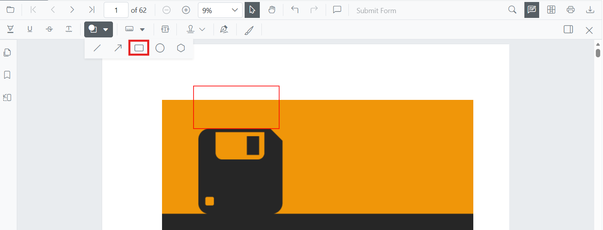

# Rectangle Annotation (Shape) in Blazor SfPdfViewer Component

Rectangle annotations let you highlight regions, group content, or draw callout boxes on PDFs for reviews and markups. The Blazor SfPdfViewer supports adding rectangles from the toolbar, customizing their appearance, editing or deleting them in the UI, and exporting them with the document.



## Enable Rectangle Annotation in the Viewer

Rectangle annotations are available by default in the Blazor SfPdfViewer component with the annotation toolbar enabled. The following example shows the minimum component setup:

```cshtml
@using Syncfusion.Blazor.SfPdfViewer

<SfPdfViewer2 DocumentPath="@DocumentPath"
              Width="100%"
              Height="100%">
</SfPdfViewer2>

@code {
    private string DocumentPath { get; set; } = "wwwroot/Data/PDF_Succinctly.pdf";
}
```

N> Ensure the sample PDF is placed in the `wwwroot/Data/` folder of your Blazor app, and that `SfPdfViewer` is registered in `Program.cs`. Refer to the [Blazor getting started guide](https://help.syncfusion.com/document-processing/pdf/pdf-viewer/blazor/getting-started) for setup details.

## Add Rectangle Annotation

### Add Rectangle Annotation Using the Toolbar

Rectangle annotations can be added from the annotation toolbar:

1. Select **Edit Annotation** in the viewer toolbar to open the annotation toolbar.
2. Select **Shape Annotation** to open the shape list.
3. Choose **Rectangle** to enable rectangle drawing mode.
4. Click and drag on the PDF page to draw the rectangle.


N> When the viewer is in Pan mode and a shape drawing mode is activated, the viewer switches to Text Select mode.

### Enable Rectangle Annotation Mode

Switch the viewer into rectangle drawing mode using [SetAnnotationModeAsync](https://help.syncfusion.com/cr/blazor/Syncfusion.Blazor.SfPdfViewer.PdfViewerBase.html#Syncfusion_Blazor_SfPdfViewer_PdfViewerBase_SetAnnotationModeAsync_Syncfusion_Blazor_SfPdfViewer_AnnotationType_).

```cshtml
@using Syncfusion.Blazor.Buttons
@using Syncfusion.Blazor.SfPdfViewer

<SfButton OnClick="OnClick">Rectangle Annotation</SfButton>
<SfPdfViewer2 DocumentPath="@DocumentPath"
              @ref="viewer"
              Width="100%"
              Height="100%">
</SfPdfViewer2>

@code {
    private SfPdfViewer2 viewer;
    private async void OnClick(MouseEventArgs args)
    {
        await viewer.SetAnnotationModeAsync(AnnotationType.Rectangle);
    }
    private string DocumentPath { get; set; } = "wwwroot/Data/PDF_Succinctly.pdf";
}
```

### Add Rectangle Annotation Programmatically

Use the [AddAnnotationAsync](https://help.syncfusion.com/cr/blazor/Syncfusion.Blazor.SfPdfViewer.PdfViewerBase.html#Syncfusion_Blazor_SfPdfViewer_PdfViewerBase_AddAnnotationAsync_Syncfusion_Blazor_SfPdfViewer_PdfAnnotation_) method to add a rectangle annotation at a specific location. Ensure the document is loaded and the component reference is available before invoking this method.

```cshtml
@using Syncfusion.Blazor.Buttons
@using Syncfusion.Blazor.SfPdfViewer

<SfButton OnClick="@AddRectangleAsync">Add Rectangle Annotation</SfButton>
<SfPdfViewer2 Width="100%" Height="100%" DocumentPath="@DocumentPath" @ref="@Viewer" />

@code {
    private SfPdfViewer2 viewer;
    private string DocumentPath { get; set; } = "wwwroot/Data/Shape_Annotation.pdf";

    private async void AddRectangleAsync(MouseEventArgs args)
    {
        PdfAnnotation annotation = new PdfAnnotation();
        // Set the Rectangle annotation type
        annotation.Type = AnnotationType.Rectangle;
        // Page numbers start from 0. So, if set to 0 it represents page 1.
        annotation.PageNumber = 0;

        // Bound of the rectangle annotation
        annotation.Bound = new Bound();
        annotation.Bound.X = 200;
        annotation.Bound.Y = 480;
        annotation.Bound.Width = 150;
        annotation.Bound.Height = 75;
        // Add rectangle annotation
        await Viewer.AddAnnotationAsync(annotation);
    }
}
```

## Customize Rectangle Annotation Appearance

Configure default rectangle appearance (fill color, stroke color, thickness, opacity) during control initialization using [RectangleSettings](https://help.syncfusion.com/cr/blazor/Syncfusion.Blazor.SfPdfViewer.PdfViewerBase.html#Syncfusion_Blazor_SfPdfViewer_PdfViewerBase_RectangleSettings). These settings apply when rectangles are created from the toolbar or programmatically.

```cshtml
@using Syncfusion.Blazor.SfPdfViewer

<SfPdfViewer2 @ref="@viewer"
              DocumentPath="@DocumentPath"
              RectangleSettings="@RectangleSettings"
              Width="100%"
              Height="100%">
</SfPdfViewer2>

@code {
    private SfPdfViewer2 viewer;
    private string DocumentPath { get; set; } = "wwwroot/Data/PDF_Succinctly.pdf";

    PdfViewerRectangleSettings RectangleSettings = new PdfViewerRectangleSettings
    {
        FillColor = "yellow",
        Opacity = 0.9,
        StrokeColor = "#ff6a00",
        Thickness = 2
    };
}
```

## Manage Rectangle Annotation (Edit, Move, Resize, Delete)

### Edit Rectangle Annotation

#### Edit Rectangle Annotation (UI)

- Select a rectangle to view resize handles.
- Drag any side/corner to resize; drag inside the shape to move it.
- Edit **fill**, **stroke**, **thickness**, and **opacity** using the annotation toolbar.

Use the following annotation toolbar tools to modify:
- **Edit Fill Color** tool  


- **Edit Stroke Color** tool


- **Edit Opacity** slider


- **Edit Thickness** slider


#### Edit Rectangle Annotation Programmatically

Modify an existing rectangle annotation programmatically using [EditAnnotationAsync](https://help.syncfusion.com/cr/blazor/Syncfusion.Blazor.SfPdfViewer.PdfViewerBase.html#Syncfusion_Blazor_SfPdfViewer_PdfViewerBase_EditAnnotationAsync_Syncfusion_Blazor_SfPdfViewer_PdfAnnotation_). Retrieve the target annotation from [GetAnnotationsAsync](https://help.syncfusion.com/cr/blazor/Syncfusion.Blazor.SfPdfViewer.PdfViewerBase.html#Syncfusion_Blazor_SfPdfViewer_PdfViewerBase_GetAnnotationsAsync) and update the desired properties before submitting the edit.

```cshtml
@using Syncfusion.Blazor.Buttons
@using Syncfusion.Blazor.SfPdfViewer

<SfButton OnClick="@EditRectangleAsync">Edit Rectangle Annotation</SfButton>
<SfPdfViewer2 Width="100%" Height="100%" DocumentPath="@DocumentPath" @ref="@Viewer" />

@code {
    private SfPdfViewer2 viewer;
    private string DocumentPath { get; set; } = "wwwroot/Data/Shape_Annotation.pdf";

    private async void EditRectangleAsync(MouseEventArgs args)
    {
        // Get annotation collection
        List<PdfAnnotation> annotationCollection = await Viewer.GetAnnotationsAsync();
        // Select the rectangle annotation to edit
        PdfAnnotation annotation = annotationCollection[0];
        // Change the fill color of rectangle annotation
        annotation.FillColor = "#FFFF00";
        // Change the stroke color of rectangle annotation
        annotation.StrokeColor = "#0000FF";
        // Change the thickness of rectangle annotation
        annotation.Thickness = 2;
        // Change the opacity (0 to 1) of rectangle annotation
        annotation.Opacity = 0.9;
        // Edit the rectangle annotation
        await Viewer.EditAnnotationAsync(annotation);
    }
}
```

### Delete Rectangle Annotation

The PDF Viewer supports deleting existing annotations through the UI and API.
See [**Delete Annotation**](../delete-annotation) for full behavior and workflows.

### Comments

Use the [**Comments panel**](../comments) to add, view, and reply to threaded discussions linked to rectangle annotations. It provides a dedicated interface for collaboration and review within the PDF Viewer.

## Add Multiple Rectangle Annotations with Properties

Set properties for individual rectangle annotations by passing values directly during [AddAnnotationAsync](https://help.syncfusion.com/cr/blazor/Syncfusion.Blazor.SfPdfViewer.PdfViewerBase.html#Syncfusion_Blazor_SfPdfViewer_PdfViewerBase_AddAnnotationAsync_Syncfusion_Blazor_SfPdfViewer_PdfAnnotation_).

```cshtml
@using Syncfusion.Blazor.Buttons
@using Syncfusion.Blazor.SfPdfViewer

<SfButton OnClick="@AddMultipleRectanglesAsync">Add Multiple Rectangles</SfButton>
<SfPdfViewer2 Width="100%" Height="100%" DocumentPath="@DocumentPath" @ref="@Viewer" />

@code {
    private SfPdfViewer2 viewer;
    private string DocumentPath { get; set; } = "wwwroot/Data/Shape_Annotation.pdf";

    private async void AddMultipleRectanglesAsync(MouseEventArgs args)
    {
        // Rectangle 1
        PdfAnnotation annotation1 = new PdfAnnotation();
        annotation1.Type = AnnotationType.Rectangle;
        annotation1.PageNumber = 0;
        annotation1.Bound = new Bound() 
        {
            X = 200,
            Y = 480,
            Width = 150,
            Height = 75
        };
        annotation1.Opacity = 0.9;
        annotation1.StrokeColor = "#ff6a00";
        annotation1.FillColor = "#ffff00";
        annotation1.Author = "User 1";

        // Rectangle 2
        PdfAnnotation annotation2 = new PdfAnnotation();
        annotation2.Type = AnnotationType.Rectangle;
        annotation2.PageNumber = 0;
        annotation2.Bound = new Bound() 
        {
            X = 380,
            Y = 480,
            Width = 120,
            Height = 60
        };
        annotation2.Opacity = 0.85;
        annotation2.StrokeColor = "#ff1010";
        annotation2.FillColor = "#ffe600";
        annotation2.Author = "User 2";

        // Add both rectangles
        await Viewer.AddAnnotationAsync(annotation1);
        await Viewer.AddAnnotationAsync(annotation2);
    }
}
```

## Disable Rectangle Annotation

Disable rectangle annotations (along with all other shape annotations, such as Line, Arrow, Circle, and Polygon) using the [`EnableShapeAnnotation`](https://help.syncfusion.com/cr/blazor/Syncfusion.Blazor.SfPdfViewer.PdfViewerBase.html#Syncfusion_Blazor_SfPdfViewer_PdfViewerBase_EnableShapeAnnotation) property.

```cshtml
@using Syncfusion.Blazor.SfPdfViewer

<SfPdfViewer2 DocumentPath="@DocumentPath"
              EnableShapeAnnotation="false"
              Width="100%"
              Height="100%">
</SfPdfViewer2>

@code {
    private string DocumentPath { get; set; } = "wwwroot/Data/PDF_Succinctly.pdf";
}
```

## Handle Rectangle Annotation Events

The PDF viewer provides annotation life-cycle events that notify when Rectangle annotations are added, modified, selected, or removed.
For the full list of available events and their descriptions, see [**Annotation Events**](../events)

## Export and Import
The PDF Viewer supports exporting and importing annotations. For details on supported formats and workflows, see [**Export and Import annotations**](../import-export-annotation).

## See also

- [Annotation Toolbar](../../toolbar-customization/annotation-toolbar)
- [Comments Panel](../comments)
- [Annotation Events](../events)
- [Export and Import annotations](../import-export-annotation)
- [Delete Annotations](../delete-annotation)