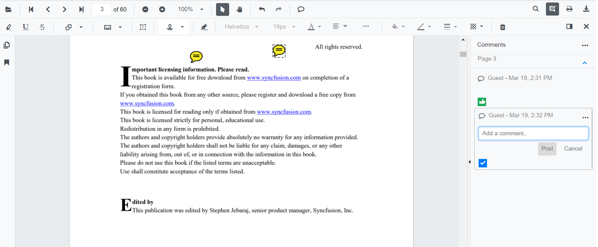
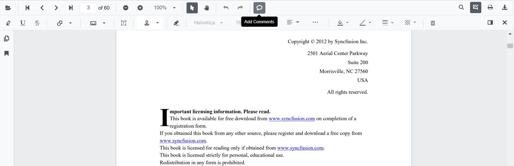
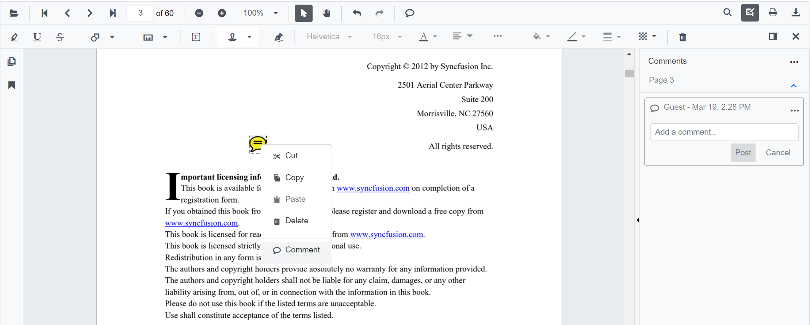
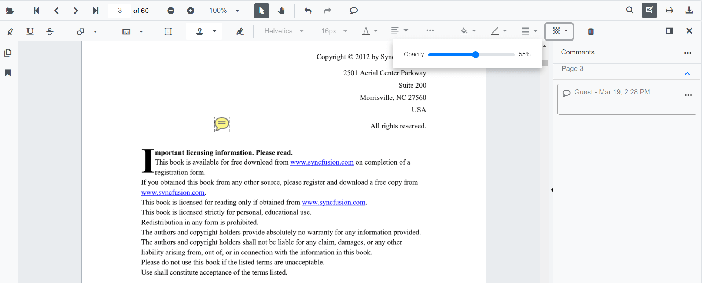
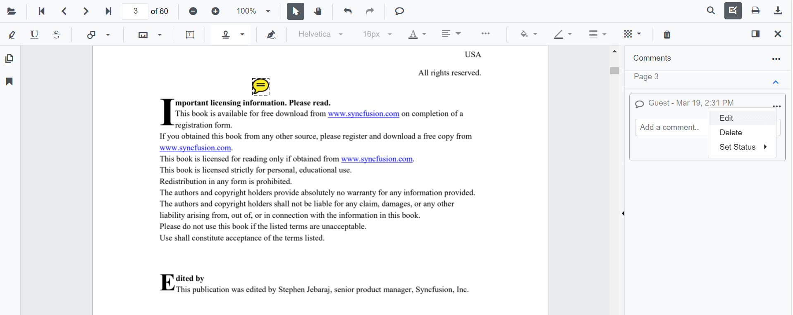
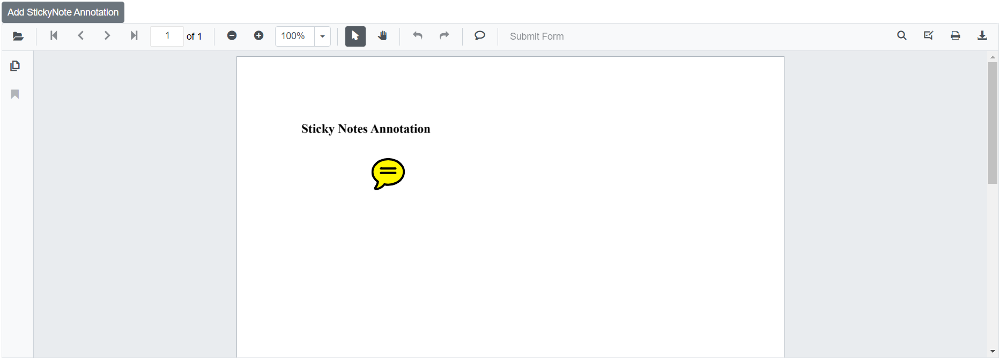
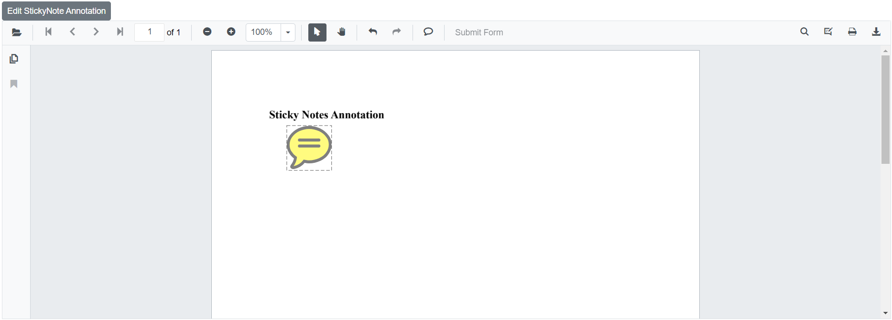

# Sticky notes annotations in Blazor SfPdfViewer Component

The SfPdfViewer component provides options to add, edit, and delete sticky notes annotations in a PDF document.



## Adding a sticky note annotation to the PDF document

Sticky notes annotations can be added using the annotation toolbar.

* Click the **Comments** button in the SfPdfViewer toolbar to open the annotation toolbar.
* Click the **Sticky Note** tool in the annotation toolbar to enable Sticky Note mode.
* Click the location on the page where the sticky note annotation should appear.
* The sticky note annotation is added at the clicked position.



## Adding a comment to a sticky note annotation

Annotation comments can be added using the comment panel.

* Select a sticky note annotation in the PDF document and right-click it.
* Select the **Comment** option from the context menu.
* Use the comment panel to add comments, replies, and status.



## Editing the properties of the sticky note annotation

### Editing opacity

Adjust the annotation opacity using the range slider in the Edit Opacity tool.



### Editing comments

The comment, comment reply, and comment status of the annotation can be edited using the comment panel.

- Click the **Comment Panel** button in the annotation toolbar to open the comment panel.


Use the menu in the comment panel to modify or delete comments, replies, and their status.



## Setting default properties during control initialization

Set default properties for sticky notes annotations before initializing the SfPdfViewer control using the [StickyNotesSettings](https://help.syncfusion.com/cr/blazor/Syncfusion.Blazor.SfPdfViewer.PdfViewerBase.html#Syncfusion_Blazor_SfPdfViewer_PdfViewerBase_StickyNotesSettings) parameter. The bound `PdfViewerStickyNotesSettings` instance is read when the component renders, so update it in `OnInitialized` or earlier for the values to take effect.

After changing the default opacity using the Edit Opacity tool, the values are updated to reflect the selected settings.

```cshtml

@using Syncfusion.Blazor.SfPdfViewer

<SfPdfViewer2 @ref="@viewer"
              DocumentPath="@DocumentPath"
              StickyNotesSettings="@StickyNotesSettings"
              Height="100%"
              Width="100%">
</SfPdfViewer2>

@code {
    private SfPdfViewer2 viewer;
    private string DocumentPath { get; set; } = "wwwroot/Data/PDF_Succinctly.pdf";

    PdfViewerStickyNotesSettings StickyNotesSettings = new PdfViewerStickyNotesSettings
        {
            Author = "Syncfusion"
        };
}

```

## Disabling sticky note annotations

The SfPdfViewer control provides an option to disable the sticky note annotations feature. When `EnableStickyNotesAnnotation` is set to `false`, the Sticky Note tool is removed from the annotation toolbar and existing sticky notes become read-only.

```cshtml

@using Syncfusion.Blazor.SfPdfViewer

<SfPdfViewer2 DocumentPath="@DocumentPath"
              Height="100%"
              Width="100%"
              EnableStickyNotesAnnotation="false">
</SfPdfViewer2>

@code{
    private string DocumentPath { get; set; } = "wwwroot/Data/PDF_Succinctly.pdf";
}

```

## Add sticky note annotation programmatically

The Blazor SfPdfViewer supports adding sticky notes annotations programmatically using the [AddAnnotationAsync](https://help.syncfusion.com/cr/blazor/Syncfusion.Blazor.SfPdfViewer.PdfViewerBase.html#Syncfusion_Blazor_SfPdfViewer_PdfViewerBase_AddAnnotationAsync_Syncfusion_Blazor_SfPdfViewer_PdfAnnotation_) method.

Below is an example demonstrating how to add a sticky note annotation to a PDF document:

```cshtml

@using Syncfusion.Blazor.Buttons
@using Syncfusion.Blazor.SfPdfViewer

<SfButton OnClick="@AddStickyNoteAnnotationAsync">Add Sticky Note Annotation</SfButton>
<SfPdfViewer2 Width="100%" Height="100%" DocumentPath="@DocumentPath" @ref="@Viewer" />

@code {
    private SfPdfViewer2 viewer;
    private string DocumentPath { get; set; } = "wwwroot/Data/Sticky_Notes_Annotation.pdf";

    private async Task AddStickyNoteAnnotationAsync(MouseEventArgs args)
    {
        PdfAnnotation annotation = new PdfAnnotation();
        // Set the annotation type to sticky note.
        annotation.Type = AnnotationType.StickyNotes;
        // Page numbers start from 0. So, if set to 0 it represents page 1.
        annotation.PageNumber = 0;

        // Bounds of the sticky note annotation.
        annotation.Bound = new Bound();
        annotation.Bound.X = 200;
        annotation.Bound.Y = 150;
        annotation.Bound.Width = 50;
        annotation.Bound.Height = 50;
        // Add the sticky note annotation to the loaded PDF document.
        await Viewer.AddAnnotationAsync(annotation);
    }
}

```

This code adds a sticky note annotation to the first page of the PDF document (PageNumber is zero-based).



[View sample on GitHub](https://github.com/SyncfusionExamples/blazor-pdf-viewer-examples/tree/master/Annotations/Programmatic%20Support/Sticky%20Notes/Add).

## Edit sticky note annotation programmatically

The Blazor SfPdfViewer supports editing sticky notes annotations programmatically using the [EditAnnotationAsync](https://help.syncfusion.com/cr/blazor/Syncfusion.Blazor.SfPdfViewer.PdfViewerBase.html#Syncfusion_Blazor_SfPdfViewer_PdfViewerBase_EditAnnotationAsync_Syncfusion_Blazor_SfPdfViewer_PdfAnnotation_) method.

Below is an example demonstrating how to edit a sticky note annotation programmatically:

```cshtml

@using Syncfusion.Blazor.Buttons
@using Syncfusion.Blazor.SfPdfViewer

<SfButton OnClick="@EditStickyNoteAnnotationAsync">Edit Sticky Note Annotation</SfButton>
<SfPdfViewer2 Width="100%" Height="100%" DocumentPath="@DocumentPath" @ref="@Viewer" />

@code {
    private SfPdfViewer2 viewer;
    private string DocumentPath { get; set; } = "wwwroot/Data/Sticky_Notes_Annotation.pdf";

    private async Task EditStickyNoteAnnotationAsync(MouseEventArgs args)
    {
        // Get the annotation collection for the loaded document.
        List<PdfAnnotation> annotationCollection = await Viewer.GetAnnotationsAsync();
        if (annotationCollection is null || annotationCollection.Count == 0)
        {
            return;
        }
        // Select the annotation to edit.
        PdfAnnotation annotation = annotationCollection[0];
        // Change the position of the sticky note annotation.
        annotation.Bound.X = 125;
        annotation.Bound.Y = 125;
        // Change the width and height of the sticky note annotation.
        annotation.Bound.Width = 75;
        annotation.Bound.Height = 75;
        // Change the Opacity (0 to 1) of the sticky note annotation.
        annotation.Opacity = 0.5;
        // Apply the changes to the sticky note annotation.
        await Viewer.EditAnnotationAsync(annotation);
    }
}

```

This code snippet edits a sticky note annotation programmatically within the SfPdfViewer control.



[View sample on GitHub](https://github.com/SyncfusionExamples/blazor-pdf-viewer-examples/tree/master/Annotations/Programmatic%20Support/Sticky%20Notes/Edit).

## See also

* [How to delete an annotation programmatically](./delete-annotation#delete-programmatically)
* [Comments overview](./comments)
* [Annotations overview](./overview)