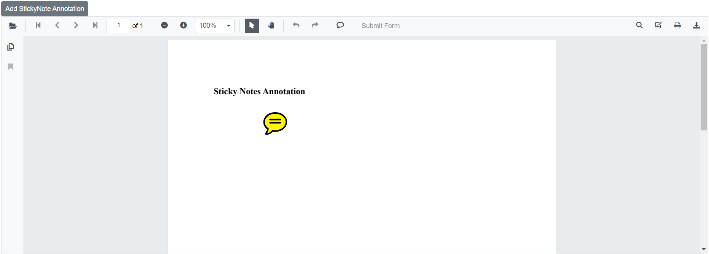
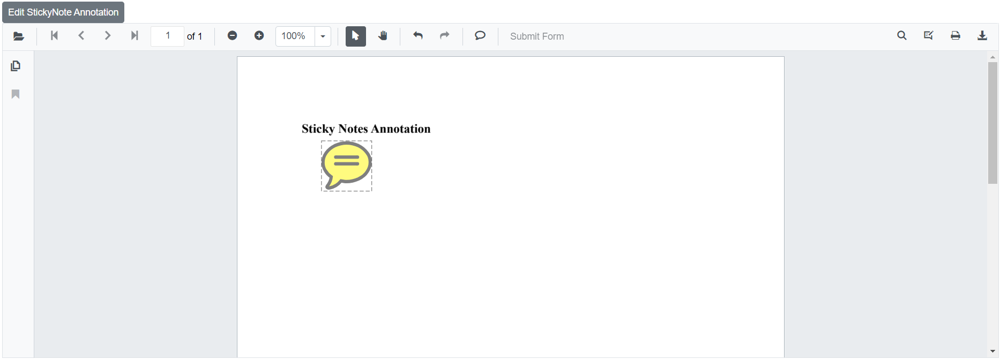

# Sticky notes annotations in Blazor SfPdfViewer Component

The SfPdfViewer control provides options to add, edit, and delete sticky notes annotations in a PDF document.


## Adding a sticky note annotation to the PDF document

Sticky notes annotations can be added using the annotation toolbar.

* Click the **Comments** button in the SfPdfViewer toolbar to open the annotation toolbar.
* Click the location on the page where the sticky note annotation should appear.
* The sticky note annotation is added at the clicked position.


Annotation comments can be added using the Comment panel.

* Select a sticky note annotation in the PDF document and right-click it.
* Select the Comment option from the context menu.
* Use the Comment panel to add Comments, Reply, and Status.


## Editing the properties of the sticky note annotation

### Editing opacity

Adjust the annotation opacity using the range slider in the Edit Opacity tool.


### Editing comments

The comment, comment reply, and comment status of the annotation can be edited using the Comment panel.

- Open the Comment panel using the Comment Panel button in the annotation toolbar.


Use the menu in the Comment panel to modify or delete comments, replies, and their status.


## Setting default properties during control initialization

Set default properties for sticky notes annotations before initializing the control using [StickyNotesSettings](https://help.syncfusion.com/cr/blazor/Syncfusion.Blazor.SfPdfViewer.PdfViewerBase.html#Syncfusion_Blazor_SfPdfViewer_PdfViewerBase_StickyNotesSettings).

After changing the default opacity using the Edit Opacity tool, the values are updated to the selected settings.

```cshtml

@using Syncfusion.Blazor.SfPdfViewer

<SfPdfViewer2 @ref="@viewer"
              DocumentPath="@DocumentPath"
              StickyNotesSettings="@StickyNotesSettings"
              Height="100%"
              Width="100%">
</SfPdfViewer2>

@code {
    SfPdfViewer2 viewer;
    private string DocumentPath { get; set; } = "wwwroot/Data/PDF_Succinctly.pdf";

    PdfViewerStickyNotesSettings StickyNotesSettings = new PdfViewerStickyNotesSettings
        {
            Author = "Syncfusion"
        };
}

```

## Disabling sticky note annotations

The SfPdfViewer2 control provides an option to disable the sticky note annotations feature.

```cshtml

@using Syncfusion.Blazor.SfPdfViewer

<SfPdfViewer2 DocumentPath="@DocumentPath"
              Height="100%"
              Width="100%"
              EnableStickyNotesAnnotation=false>
</SfPdfViewer2>

@code{
    private string DocumentPath { get; set; } = "wwwroot/Data/PDF_Succinctly.pdf";
}

```

## Add sticky note annotation programmatically

The Blazor SfPdfViewer supports adding sticky notes annotations programmatically using the [AddAnnotationAsync](https://help.syncfusion.com/cr/blazor/Syncfusion.Blazor.SfPdfViewer.PdfViewerBase.html#Syncfusion_Blazor_SfPdfViewer_PdfViewerBase_AddAnnotationAsync_Syncfusion_Blazor_SfPdfViewer_PdfAnnotation_) method.

Below is an example demonstrating how to add a sticky note annotation to a PDF document:

```cshtml

@using Syncfusion.Blazor.Navigations;
@using Syncfusion.Blazor.SfPdfViewer

<SfButton OnClick="@AddStickyNoteAnnotationAsync">Add StickyNote Annotation</SfButton>
<SfPdfViewer2 Width="100%" Height="100%" DocumentPath="@DocumentPath" @ref="@Viewer" />

@code {
    SfPdfViewer2 Viewer;
    public string DocumentPath { get; set; } = "wwwroot/Data/Sticky_Notes_Annotation.pdf";

    public async void AddStickyNoteAnnotationAsync(MouseEventArgs args)
    {
        PdfAnnotation annotation = new PdfAnnotation();
        // Set the annotation type sticky note
        annotation.Type = AnnotationType.StickyNotes;
        // Set the PageNumber starts from 0. So, if set 0 it represents the page 1.
        annotation.PageNumber = 0;

        // Bound of the sticky note annotation
        annotation.Bound = new Bound();
        annotation.Bound.X = 200;
        annotation.Bound.Y = 150;
        annotation.Bound.Width = 50;
        annotation.Bound.Height = 50;
        // Add sticky note annotation
        await Viewer.AddAnnotationAsync(annotation);
    }
}

```

This code adds a sticky note annotation to the first page of the PDF document (PageNumber is zero-based).



[View sample on GitHub](https://github.com/SyncfusionExamples/blazor-pdf-viewer-examples/tree/master/Annotations/Programmatic%20Support/Sticky%20Notes/Add).

## Edit sticky note annotation programmatically

The Blazor SfPdfViewer supports editing sticky notes annotations programmatically using the [EditAnnotationAsync](https://help.syncfusion.com/cr/blazor/Syncfusion.Blazor.SfPdfViewer.PdfViewerBase.html#Syncfusion_Blazor_SfPdfViewer_PdfViewerBase_EditAnnotationAsync_Syncfusion_Blazor_SfPdfViewer_PdfAnnotation_) method.

Below is an example demonstrating how to edit a sticky note annotation programmatically:

```cshtml

@using Syncfusion.Blazor.Buttons
@using Syncfusion.Blazor.SfPdfViewer

<SfButton OnClick="@EditStickyNoteAnnotationAsync">Edit StickyNote Annotation</SfButton>
<SfPdfViewer2 Width="100%" Height="100%" DocumentPath="@DocumentPath" @ref="@Viewer" />

@code {
    SfPdfViewer2 Viewer;
    public string DocumentPath { get; set; } = "wwwroot/Data/Sticky_Notes_Annotation.pdf";

    public async void EditStickyNoteAnnotationAsync(MouseEventArgs args)
    {
        // Get annotation collection
        List<PdfAnnotation> annotationCollection = await Viewer.GetAnnotationsAsync();
        // Select the annotation want to edit
        PdfAnnotation annotation = annotationCollection[0];
        // Change the position of the sticky note annotation
        annotation.Bound.X = 125;
        annotation.Bound.Y = 125;
        // Change the width and height of the sticky note annotation
        annotation.Bound.Width = 75;
        annotation.Bound.Height = 75;
        // Change the Opacity (0 to 1) of sticky note annotation
        annotation.Opacity = 0.5;
        // Edit the sticky note annotation
        await Viewer.EditAnnotationAsync(annotation);
    }
}

```

This code snippet edits a sticky note annotation programmatically within the SfPdfViewer control.



[View sample on GitHub](https://github.com/SyncfusionExamples/blazor-pdf-viewer-examples/tree/master/Annotations/Programmatic%20Support/Sticky%20Notes/Edit).

## See also

* [How to delete the annotation programmatically](./text-markup-annotation#delete-annotation-programmatically)